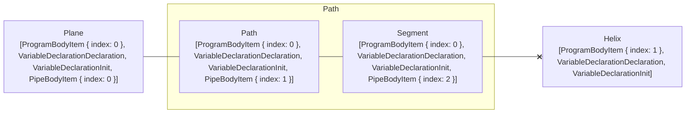

```mermaid
flowchart LR
  subgraph path2 [Path]
    2["Path<br>[ProgramBodyItem { index: 0 }, VariableDeclarationDeclaration, VariableDeclarationInit, PipeBodyItem { index: 1 }]"]
    3["Segment<br>[ProgramBodyItem { index: 0 }, VariableDeclarationDeclaration, VariableDeclarationInit, PipeBodyItem { index: 2 }]"]
  end
  1["Plane<br>[ProgramBodyItem { index: 0 }, VariableDeclarationDeclaration, VariableDeclarationInit, PipeBodyItem { index: 0 }]"]
  4["Helix<br>[ProgramBodyItem { index: 1 }, VariableDeclarationDeclaration, VariableDeclarationInit]"]
  1 --- 2
  2 --- 3
  3 <--x 4
```
