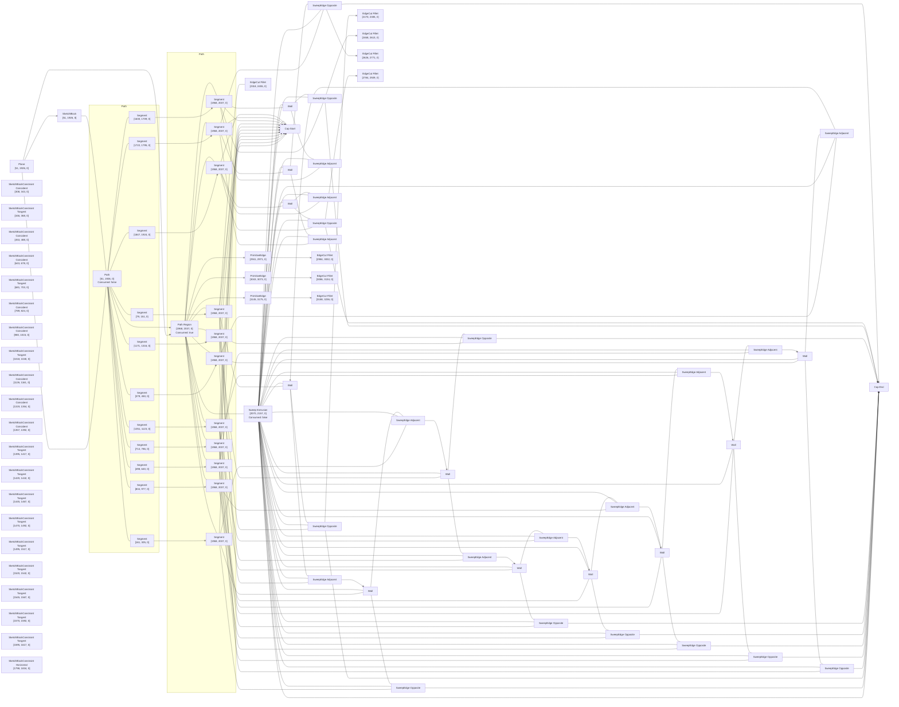

```mermaid
flowchart LR
  subgraph path2 [Path]
    2["Path<br>[51, 1926, 0]<br>Consumed: false"]
      %% [ProgramBodyItem { index: 0 }, VariableDeclarationDeclaration, VariableDeclarationInit]
    3["Segment<br>[79, 151, 0]"]
      %% [ProgramBodyItem { index: 0 }, VariableDeclarationDeclaration, VariableDeclarationInit, SketchBlockBody, SketchBlockBodyItem { index: 0 }, VariableDeclarationDeclaration, VariableDeclarationInit]
    4["Segment<br>[161, 305, 0]"]
      %% [ProgramBodyItem { index: 0 }, VariableDeclarationDeclaration, VariableDeclarationInit, SketchBlockBody, SketchBlockBodyItem { index: 1 }, VariableDeclarationDeclaration, VariableDeclarationInit]
    5["Segment<br>[379, 450, 0]"]
      %% [ProgramBodyItem { index: 0 }, VariableDeclarationDeclaration, VariableDeclarationInit, SketchBlockBody, SketchBlockBodyItem { index: 4 }, VariableDeclarationDeclaration, VariableDeclarationInit]
    6["Segment<br>[498, 640, 0]"]
      %% [ProgramBodyItem { index: 0 }, VariableDeclarationDeclaration, VariableDeclarationInit, SketchBlockBody, SketchBlockBodyItem { index: 6 }, VariableDeclarationDeclaration, VariableDeclarationInit]
    7["Segment<br>[714, 786, 0]"]
      %% [ProgramBodyItem { index: 0 }, VariableDeclarationDeclaration, VariableDeclarationInit, SketchBlockBody, SketchBlockBodyItem { index: 9 }, VariableDeclarationDeclaration, VariableDeclarationInit]
    8["Segment<br>[834, 977, 0]"]
      %% [ProgramBodyItem { index: 0 }, VariableDeclarationDeclaration, VariableDeclarationInit, SketchBlockBody, SketchBlockBodyItem { index: 11 }, VariableDeclarationDeclaration, VariableDeclarationInit]
    9["Segment<br>[1051, 1123, 0]"]
      %% [ProgramBodyItem { index: 0 }, VariableDeclarationDeclaration, VariableDeclarationInit, SketchBlockBody, SketchBlockBodyItem { index: 14 }, VariableDeclarationDeclaration, VariableDeclarationInit]
    10["Segment<br>[1171, 1316, 0]"]
      %% [ProgramBodyItem { index: 0 }, VariableDeclarationDeclaration, VariableDeclarationInit, SketchBlockBody, SketchBlockBodyItem { index: 16 }, VariableDeclarationDeclaration, VariableDeclarationInit]
    11["Segment<br>[1630, 1709, 0]"]
      %% [ProgramBodyItem { index: 0 }, VariableDeclarationDeclaration, VariableDeclarationInit, SketchBlockBody, SketchBlockBodyItem { index: 28 }, VariableDeclarationDeclaration, VariableDeclarationInit]
    12["Segment<br>[1722, 1795, 0]"]
      %% [ProgramBodyItem { index: 0 }, VariableDeclarationDeclaration, VariableDeclarationInit, SketchBlockBody, SketchBlockBodyItem { index: 29 }, VariableDeclarationDeclaration, VariableDeclarationInit]
    13["Segment<br>[1847, 1924, 0]"]
      %% [ProgramBodyItem { index: 0 }, VariableDeclarationDeclaration, VariableDeclarationInit, SketchBlockBody, SketchBlockBodyItem { index: 31 }, VariableDeclarationDeclaration, VariableDeclarationInit]
  end
  subgraph path14 [Path]
    14["Path Region<br>[1968, 2037, 0]<br>Consumed: true"]
      %% [ProgramBodyItem { index: 2 }, VariableDeclarationDeclaration, VariableDeclarationInit]
    15["Segment<br>[1968, 2037, 0]"]
      %% [ProgramBodyItem { index: 2 }, VariableDeclarationDeclaration, VariableDeclarationInit]
    16["Segment<br>[1968, 2037, 0]"]
      %% [ProgramBodyItem { index: 2 }, VariableDeclarationDeclaration, VariableDeclarationInit]
    17["Segment<br>[1968, 2037, 0]"]
      %% [ProgramBodyItem { index: 2 }, VariableDeclarationDeclaration, VariableDeclarationInit]
    18["Segment<br>[1968, 2037, 0]"]
      %% [ProgramBodyItem { index: 2 }, VariableDeclarationDeclaration, VariableDeclarationInit]
    19["Segment<br>[1968, 2037, 0]"]
      %% [ProgramBodyItem { index: 2 }, VariableDeclarationDeclaration, VariableDeclarationInit]
    20["Segment<br>[1968, 2037, 0]"]
      %% [ProgramBodyItem { index: 2 }, VariableDeclarationDeclaration, VariableDeclarationInit]
    21["Segment<br>[1968, 2037, 0]"]
      %% [ProgramBodyItem { index: 2 }, VariableDeclarationDeclaration, VariableDeclarationInit]
    22["Segment<br>[1968, 2037, 0]"]
      %% [ProgramBodyItem { index: 2 }, VariableDeclarationDeclaration, VariableDeclarationInit]
    23["Segment<br>[1968, 2037, 0]"]
      %% [ProgramBodyItem { index: 2 }, VariableDeclarationDeclaration, VariableDeclarationInit]
    24["Segment<br>[1968, 2037, 0]"]
      %% [ProgramBodyItem { index: 2 }, VariableDeclarationDeclaration, VariableDeclarationInit]
    25["Segment<br>[1968, 2037, 0]"]
      %% [ProgramBodyItem { index: 2 }, VariableDeclarationDeclaration, VariableDeclarationInit]
  end
  1["Plane<br>[51, 1926, 0]"]
    %% [ProgramBodyItem { index: 0 }, VariableDeclarationDeclaration, VariableDeclarationInit]
  26["Sweep Extrusion<br>[2070, 2157, 0]<br>Consumed: false"]
    %% [ProgramBodyItem { index: 4 }, VariableDeclarationDeclaration, VariableDeclarationInit]
  27[Wall]
    %% face_code_ref=Missing NodePath
  28[Wall]
    %% face_code_ref=Missing NodePath
  29[Wall]
    %% face_code_ref=Missing NodePath
  30[Wall]
    %% face_code_ref=Missing NodePath
  31[Wall]
    %% face_code_ref=Missing NodePath
  32[Wall]
    %% face_code_ref=Missing NodePath
  33[Wall]
    %% face_code_ref=Missing NodePath
  34[Wall]
    %% face_code_ref=Missing NodePath
  35[Wall]
    %% face_code_ref=Missing NodePath
  36[Wall]
    %% face_code_ref=Missing NodePath
  37[Wall]
    %% face_code_ref=Missing NodePath
  38["Cap Start"]
    %% face_code_ref=Missing NodePath
  39["Cap End"]
    %% face_code_ref=Missing NodePath
  40["SweepEdge Opposite"]
  41["SweepEdge Adjacent"]
  42["SweepEdge Opposite"]
  43["SweepEdge Adjacent"]
  44["SweepEdge Opposite"]
  45["SweepEdge Adjacent"]
  46["SweepEdge Opposite"]
  47["SweepEdge Adjacent"]
  48["SweepEdge Opposite"]
  49["SweepEdge Adjacent"]
  50["SweepEdge Opposite"]
  51["SweepEdge Adjacent"]
  52["SweepEdge Opposite"]
  53["SweepEdge Adjacent"]
  54["SweepEdge Opposite"]
  55["SweepEdge Adjacent"]
  56["SweepEdge Opposite"]
  57["SweepEdge Adjacent"]
  58["SweepEdge Opposite"]
  59["SweepEdge Adjacent"]
  60["SweepEdge Opposite"]
  61["SweepEdge Adjacent"]
  62["EdgeCut Fillet<br>[2170, 2305, 0]"]
    %% [ProgramBodyItem { index: 5 }, VariableDeclarationDeclaration, VariableDeclarationInit]
  63["EdgeCut Fillet<br>[2318, 2455, 0]"]
    %% [ProgramBodyItem { index: 6 }, VariableDeclarationDeclaration, VariableDeclarationInit]
  64["EdgeCut Fillet<br>[2468, 2613, 0]"]
    %% [ProgramBodyItem { index: 7 }, VariableDeclarationDeclaration, VariableDeclarationInit]
  65["EdgeCut Fillet<br>[2626, 2771, 0]"]
    %% [ProgramBodyItem { index: 8 }, VariableDeclarationDeclaration, VariableDeclarationInit]
  66["EdgeCut Fillet<br>[2784, 2929, 0]"]
    %% [ProgramBodyItem { index: 9 }, VariableDeclarationDeclaration, VariableDeclarationInit]
  67["PrimitiveEdge<br>[2941, 2971, 0]"]
    %% [ProgramBodyItem { index: 10 }, VariableDeclarationDeclaration, VariableDeclarationInit]
  68["EdgeCut Fillet<br>[2984, 3032, 0]"]
    %% [ProgramBodyItem { index: 11 }, VariableDeclarationDeclaration, VariableDeclarationInit]
  69["PrimitiveEdge<br>[3043, 3073, 0]"]
    %% [ProgramBodyItem { index: 12 }, VariableDeclarationDeclaration, VariableDeclarationInit]
  70["EdgeCut Fillet<br>[3086, 3134, 0]"]
    %% [ProgramBodyItem { index: 13 }, VariableDeclarationDeclaration, VariableDeclarationInit]
  71["PrimitiveEdge<br>[3145, 3175, 0]"]
    %% [ProgramBodyItem { index: 14 }, VariableDeclarationDeclaration, VariableDeclarationInit]
  72["EdgeCut Fillet<br>[3188, 3236, 0]"]
    %% [ProgramBodyItem { index: 15 }, VariableDeclarationDeclaration, VariableDeclarationInit, PipeBodyItem { index: 0 }]
  73["SketchBlock<br>[51, 1926, 0]"]
    %% [ProgramBodyItem { index: 0 }, VariableDeclarationDeclaration, VariableDeclarationInit]
  74["SketchBlockConstraint Coincident<br>[308, 343, 0]"]
    %% [ProgramBodyItem { index: 0 }, VariableDeclarationDeclaration, VariableDeclarationInit, SketchBlockBody, SketchBlockBodyItem { index: 2 }, ExpressionStatementExpr]
  75["SketchBlockConstraint Tangent<br>[346, 368, 0]"]
    %% [ProgramBodyItem { index: 0 }, VariableDeclarationDeclaration, VariableDeclarationInit, SketchBlockBody, SketchBlockBodyItem { index: 3 }, ExpressionStatementExpr]
  76["SketchBlockConstraint Coincident<br>[453, 488, 0]"]
    %% [ProgramBodyItem { index: 0 }, VariableDeclarationDeclaration, VariableDeclarationInit, SketchBlockBody, SketchBlockBodyItem { index: 5 }, ExpressionStatementExpr]
  77["SketchBlockConstraint Coincident<br>[643, 678, 0]"]
    %% [ProgramBodyItem { index: 0 }, VariableDeclarationDeclaration, VariableDeclarationInit, SketchBlockBody, SketchBlockBodyItem { index: 7 }, ExpressionStatementExpr]
  78["SketchBlockConstraint Tangent<br>[681, 703, 0]"]
    %% [ProgramBodyItem { index: 0 }, VariableDeclarationDeclaration, VariableDeclarationInit, SketchBlockBody, SketchBlockBodyItem { index: 8 }, ExpressionStatementExpr]
  79["SketchBlockConstraint Coincident<br>[789, 824, 0]"]
    %% [ProgramBodyItem { index: 0 }, VariableDeclarationDeclaration, VariableDeclarationInit, SketchBlockBody, SketchBlockBodyItem { index: 10 }, ExpressionStatementExpr]
  80["SketchBlockConstraint Coincident<br>[980, 1015, 0]"]
    %% [ProgramBodyItem { index: 0 }, VariableDeclarationDeclaration, VariableDeclarationInit, SketchBlockBody, SketchBlockBodyItem { index: 12 }, ExpressionStatementExpr]
  81["SketchBlockConstraint Tangent<br>[1018, 1040, 0]"]
    %% [ProgramBodyItem { index: 0 }, VariableDeclarationDeclaration, VariableDeclarationInit, SketchBlockBody, SketchBlockBodyItem { index: 13 }, ExpressionStatementExpr]
  82["SketchBlockConstraint Coincident<br>[1126, 1161, 0]"]
    %% [ProgramBodyItem { index: 0 }, VariableDeclarationDeclaration, VariableDeclarationInit, SketchBlockBody, SketchBlockBodyItem { index: 15 }, ExpressionStatementExpr]
  83["SketchBlockConstraint Coincident<br>[1319, 1354, 0]"]
    %% [ProgramBodyItem { index: 0 }, VariableDeclarationDeclaration, VariableDeclarationInit, SketchBlockBody, SketchBlockBodyItem { index: 17 }, ExpressionStatementExpr]
  84["SketchBlockConstraint Coincident<br>[1357, 1392, 0]"]
    %% [ProgramBodyItem { index: 0 }, VariableDeclarationDeclaration, VariableDeclarationInit, SketchBlockBody, SketchBlockBodyItem { index: 18 }, ExpressionStatementExpr]
  85["SketchBlockConstraint Tangent<br>[1395, 1417, 0]"]
    %% [ProgramBodyItem { index: 0 }, VariableDeclarationDeclaration, VariableDeclarationInit, SketchBlockBody, SketchBlockBodyItem { index: 19 }, ExpressionStatementExpr]
  86["SketchBlockConstraint Tangent<br>[1420, 1442, 0]"]
    %% [ProgramBodyItem { index: 0 }, VariableDeclarationDeclaration, VariableDeclarationInit, SketchBlockBody, SketchBlockBodyItem { index: 20 }, ExpressionStatementExpr]
  87["SketchBlockConstraint Tangent<br>[1445, 1467, 0]"]
    %% [ProgramBodyItem { index: 0 }, VariableDeclarationDeclaration, VariableDeclarationInit, SketchBlockBody, SketchBlockBodyItem { index: 21 }, ExpressionStatementExpr]
  88["SketchBlockConstraint Tangent<br>[1470, 1492, 0]"]
    %% [ProgramBodyItem { index: 0 }, VariableDeclarationDeclaration, VariableDeclarationInit, SketchBlockBody, SketchBlockBodyItem { index: 22 }, ExpressionStatementExpr]
  89["SketchBlockConstraint Tangent<br>[1495, 1517, 0]"]
    %% [ProgramBodyItem { index: 0 }, VariableDeclarationDeclaration, VariableDeclarationInit, SketchBlockBody, SketchBlockBodyItem { index: 23 }, ExpressionStatementExpr]
  90["SketchBlockConstraint Tangent<br>[1520, 1542, 0]"]
    %% [ProgramBodyItem { index: 0 }, VariableDeclarationDeclaration, VariableDeclarationInit, SketchBlockBody, SketchBlockBodyItem { index: 24 }, ExpressionStatementExpr]
  91["SketchBlockConstraint Tangent<br>[1545, 1567, 0]"]
    %% [ProgramBodyItem { index: 0 }, VariableDeclarationDeclaration, VariableDeclarationInit, SketchBlockBody, SketchBlockBodyItem { index: 25 }, ExpressionStatementExpr]
  92["SketchBlockConstraint Tangent<br>[1570, 1592, 0]"]
    %% [ProgramBodyItem { index: 0 }, VariableDeclarationDeclaration, VariableDeclarationInit, SketchBlockBody, SketchBlockBodyItem { index: 26 }, ExpressionStatementExpr]
  93["SketchBlockConstraint Tangent<br>[1595, 1617, 0]"]
    %% [ProgramBodyItem { index: 0 }, VariableDeclarationDeclaration, VariableDeclarationInit, SketchBlockBody, SketchBlockBodyItem { index: 27 }, ExpressionStatementExpr]
  94["SketchBlockConstraint Horizontal<br>[1798, 1834, 0]"]
    %% [ProgramBodyItem { index: 0 }, VariableDeclarationDeclaration, VariableDeclarationInit, SketchBlockBody, SketchBlockBodyItem { index: 30 }, ExpressionStatementExpr]
  1 --- 2
  1 <--x 14
  1 <--x 73
  2 --- 3
  2 --- 4
  2 --- 5
  2 --- 6
  2 --- 7
  2 --- 8
  2 --- 9
  2 --- 10
  2 --- 11
  2 --- 12
  2 --- 13
  2 <--x 14
  73 --- 2
  3 <--x 15
  4 <--x 16
  5 <--x 17
  6 <--x 18
  7 <--x 19
  8 <--x 20
  9 <--x 21
  10 <--x 22
  11 <--x 23
  12 <--x 24
  13 <--x 25
  14 --- 15
  14 --- 16
  14 --- 17
  14 --- 18
  14 --- 19
  14 --- 20
  14 --- 21
  14 --- 22
  14 --- 23
  14 --- 24
  14 --- 25
  14 ---- 26
  14 <--x 67
  14 <--x 69
  14 <--x 71
  15 --- 28
  15 x--> 38
  15 --- 42
  15 --- 43
  15 --- 63
  16 --- 27
  16 x--> 38
  16 --- 40
  16 --- 41
  17 --- 29
  17 x--> 38
  17 --- 44
  17 --- 45
  18 --- 30
  18 x--> 38
  18 --- 46
  18 --- 47
  19 --- 31
  19 x--> 38
  19 --- 48
  19 --- 49
  20 --- 32
  20 x--> 38
  20 --- 50
  20 --- 51
  21 --- 33
  21 x--> 38
  21 --- 52
  21 --- 53
  22 --- 34
  22 x--> 38
  22 --- 54
  22 --- 55
  23 --- 35
  23 x--> 38
  23 --- 56
  23 --- 57
  24 --- 37
  24 x--> 38
  24 --- 60
  24 --- 61
  25 --- 36
  25 x--> 38
  25 --- 58
  25 --- 59
  26 --- 27
  26 --- 28
  26 --- 29
  26 --- 30
  26 --- 31
  26 --- 32
  26 --- 33
  26 --- 34
  26 --- 35
  26 --- 36
  26 --- 37
  26 --- 38
  26 --- 39
  26 --- 40
  26 --- 41
  26 --- 42
  26 --- 43
  26 --- 44
  26 --- 45
  26 --- 46
  26 --- 47
  26 --- 48
  26 --- 49
  26 --- 50
  26 --- 51
  26 --- 52
  26 --- 53
  26 --- 54
  26 --- 55
  26 --- 56
  26 --- 57
  26 --- 58
  26 --- 59
  26 --- 60
  26 --- 61
  27 --- 40
  27 --- 41
  43 <--x 27
  28 --- 42
  28 --- 43
  45 <--x 28
  29 --- 44
  29 --- 45
  47 <--x 29
  30 --- 46
  30 --- 47
  49 <--x 30
  31 --- 48
  31 --- 49
  51 <--x 31
  32 --- 50
  32 --- 51
  53 <--x 32
  33 --- 52
  33 --- 53
  55 <--x 33
  41 <--x 34
  34 --- 54
  34 --- 55
  35 --- 56
  35 --- 57
  36 --- 58
  36 --- 59
  37 --- 60
  37 --- 61
  40 <--x 39
  42 <--x 39
  44 <--x 39
  46 <--x 39
  48 <--x 39
  50 <--x 39
  52 <--x 39
  54 <--x 39
  56 <--x 39
  58 <--x 39
  60 <--x 39
  42 <--x 62
  56 <--x 64
  58 <--x 66
  60 <--x 65
  67 <--x 68
  69 <--x 70
  71 <--x 72
```
