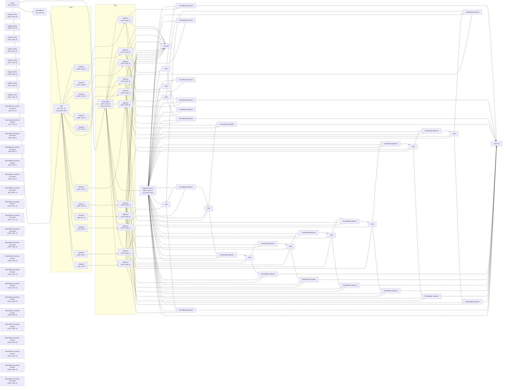

```mermaid
flowchart LR
  subgraph path2 [Path]
    2["Path<br>[62, 1937, 0]<br>Consumed: false"]
      %% [ProgramBodyItem { index: 1 }, VariableDeclarationDeclaration, VariableDeclarationInit]
    3["Segment<br>[90, 162, 0]"]
      %% [ProgramBodyItem { index: 1 }, VariableDeclarationDeclaration, VariableDeclarationInit, SketchBlockBody, SketchBlockBodyItem { index: 0 }, VariableDeclarationDeclaration, VariableDeclarationInit]
    4["Segment<br>[172, 316, 0]"]
      %% [ProgramBodyItem { index: 1 }, VariableDeclarationDeclaration, VariableDeclarationInit, SketchBlockBody, SketchBlockBodyItem { index: 1 }, VariableDeclarationDeclaration, VariableDeclarationInit]
    5["Segment<br>[390, 461, 0]"]
      %% [ProgramBodyItem { index: 1 }, VariableDeclarationDeclaration, VariableDeclarationInit, SketchBlockBody, SketchBlockBodyItem { index: 4 }, VariableDeclarationDeclaration, VariableDeclarationInit]
    6["Segment<br>[509, 651, 0]"]
      %% [ProgramBodyItem { index: 1 }, VariableDeclarationDeclaration, VariableDeclarationInit, SketchBlockBody, SketchBlockBodyItem { index: 6 }, VariableDeclarationDeclaration, VariableDeclarationInit]
    7["Segment<br>[725, 797, 0]"]
      %% [ProgramBodyItem { index: 1 }, VariableDeclarationDeclaration, VariableDeclarationInit, SketchBlockBody, SketchBlockBodyItem { index: 9 }, VariableDeclarationDeclaration, VariableDeclarationInit]
    8["Segment<br>[845, 988, 0]"]
      %% [ProgramBodyItem { index: 1 }, VariableDeclarationDeclaration, VariableDeclarationInit, SketchBlockBody, SketchBlockBodyItem { index: 11 }, VariableDeclarationDeclaration, VariableDeclarationInit]
    9["Segment<br>[1062, 1134, 0]"]
      %% [ProgramBodyItem { index: 1 }, VariableDeclarationDeclaration, VariableDeclarationInit, SketchBlockBody, SketchBlockBodyItem { index: 14 }, VariableDeclarationDeclaration, VariableDeclarationInit]
    10["Segment<br>[1182, 1327, 0]"]
      %% [ProgramBodyItem { index: 1 }, VariableDeclarationDeclaration, VariableDeclarationInit, SketchBlockBody, SketchBlockBodyItem { index: 16 }, VariableDeclarationDeclaration, VariableDeclarationInit]
    11["Segment<br>[1641, 1720, 0]"]
      %% [ProgramBodyItem { index: 1 }, VariableDeclarationDeclaration, VariableDeclarationInit, SketchBlockBody, SketchBlockBodyItem { index: 28 }, VariableDeclarationDeclaration, VariableDeclarationInit]
    12["Segment<br>[1733, 1806, 0]"]
      %% [ProgramBodyItem { index: 1 }, VariableDeclarationDeclaration, VariableDeclarationInit, SketchBlockBody, SketchBlockBodyItem { index: 29 }, VariableDeclarationDeclaration, VariableDeclarationInit]
    13["Segment<br>[1858, 1935, 0]"]
      %% [ProgramBodyItem { index: 1 }, VariableDeclarationDeclaration, VariableDeclarationInit, SketchBlockBody, SketchBlockBodyItem { index: 31 }, VariableDeclarationDeclaration, VariableDeclarationInit]
  end
  subgraph path14 [Path]
    14["Path Region<br>[1979, 2048, 0]<br>Consumed: true"]
      %% [ProgramBodyItem { index: 3 }, VariableDeclarationDeclaration, VariableDeclarationInit]
    15["Segment<br>[1979, 2048, 0]"]
      %% [ProgramBodyItem { index: 3 }, VariableDeclarationDeclaration, VariableDeclarationInit]
    16["Segment<br>[1979, 2048, 0]"]
      %% [ProgramBodyItem { index: 3 }, VariableDeclarationDeclaration, VariableDeclarationInit]
    17["Segment<br>[1979, 2048, 0]"]
      %% [ProgramBodyItem { index: 3 }, VariableDeclarationDeclaration, VariableDeclarationInit]
    18["Segment<br>[1979, 2048, 0]"]
      %% [ProgramBodyItem { index: 3 }, VariableDeclarationDeclaration, VariableDeclarationInit]
    19["Segment<br>[1979, 2048, 0]"]
      %% [ProgramBodyItem { index: 3 }, VariableDeclarationDeclaration, VariableDeclarationInit]
    20["Segment<br>[1979, 2048, 0]"]
      %% [ProgramBodyItem { index: 3 }, VariableDeclarationDeclaration, VariableDeclarationInit]
    21["Segment<br>[1979, 2048, 0]"]
      %% [ProgramBodyItem { index: 3 }, VariableDeclarationDeclaration, VariableDeclarationInit]
    22["Segment<br>[1979, 2048, 0]"]
      %% [ProgramBodyItem { index: 3 }, VariableDeclarationDeclaration, VariableDeclarationInit]
    23["Segment<br>[1979, 2048, 0]"]
      %% [ProgramBodyItem { index: 3 }, VariableDeclarationDeclaration, VariableDeclarationInit]
    24["Segment<br>[1979, 2048, 0]"]
      %% [ProgramBodyItem { index: 3 }, VariableDeclarationDeclaration, VariableDeclarationInit]
    25["Segment<br>[1979, 2048, 0]"]
      %% [ProgramBodyItem { index: 3 }, VariableDeclarationDeclaration, VariableDeclarationInit]
  end
  1["Plane<br>[62, 1937, 0]"]
    %% [ProgramBodyItem { index: 1 }, VariableDeclarationDeclaration, VariableDeclarationInit]
  26["Sweep Extrusion<br>[2081, 2168, 0]<br>Consumed: false"]
    %% [ProgramBodyItem { index: 5 }, VariableDeclarationDeclaration, VariableDeclarationInit]
  27[Wall]
    %% face_code_ref=Missing NodePath
  28[Wall]
    %% face_code_ref=Missing NodePath
  29[Wall]
    %% face_code_ref=Missing NodePath
  30[Wall]
    %% face_code_ref=Missing NodePath
  31[Wall]
    %% face_code_ref=Missing NodePath
  32[Wall]
    %% face_code_ref=Missing NodePath
  33[Wall]
    %% face_code_ref=Missing NodePath
  34[Wall]
    %% face_code_ref=Missing NodePath
  35[Wall]
    %% face_code_ref=Missing NodePath
  36[Wall]
    %% face_code_ref=Missing NodePath
  37[Wall]
    %% face_code_ref=Missing NodePath
  38["Cap Start"]
    %% face_code_ref=Missing NodePath
  39["Cap End"]
    %% face_code_ref=Missing NodePath
  40["SweepEdge Opposite"]
  41["SweepEdge Adjacent"]
  42["SweepEdge Opposite"]
  43["SweepEdge Adjacent"]
  44["SweepEdge Opposite"]
  45["SweepEdge Adjacent"]
  46["SweepEdge Opposite"]
  47["SweepEdge Adjacent"]
  48["SweepEdge Opposite"]
  49["SweepEdge Adjacent"]
  50["SweepEdge Opposite"]
  51["SweepEdge Adjacent"]
  52["SweepEdge Opposite"]
  53["SweepEdge Adjacent"]
  54["SweepEdge Opposite"]
  55["SweepEdge Adjacent"]
  56["SweepEdge Opposite"]
  57["SweepEdge Adjacent"]
  58["SweepEdge Opposite"]
  59["SweepEdge Adjacent"]
  60["SweepEdge Opposite"]
  61["SweepEdge Adjacent"]
  62["EdgeCut Fillet<br>[2182, 2343, 0]"]
    %% [ProgramBodyItem { index: 6 }, VariableDeclarationDeclaration, VariableDeclarationInit]
  63["EdgeCut Fillet<br>[2356, 2518, 0]"]
    %% [ProgramBodyItem { index: 7 }, VariableDeclarationDeclaration, VariableDeclarationInit]
  64["EdgeCut Fillet<br>[2531, 3240, 0]"]
    %% [ProgramBodyItem { index: 8 }, VariableDeclarationDeclaration, VariableDeclarationInit]
  65["EdgeCut Fillet<br>[2531, 3240, 0]"]
    %% [ProgramBodyItem { index: 8 }, VariableDeclarationDeclaration, VariableDeclarationInit]
  66["EdgeCut Fillet<br>[2531, 3240, 0]"]
    %% [ProgramBodyItem { index: 8 }, VariableDeclarationDeclaration, VariableDeclarationInit]
  67["EdgeCut Fillet<br>[2531, 3240, 0]"]
    %% [ProgramBodyItem { index: 8 }, VariableDeclarationDeclaration, VariableDeclarationInit]
  68["EdgeCut Fillet<br>[2531, 3240, 0]"]
    %% [ProgramBodyItem { index: 8 }, VariableDeclarationDeclaration, VariableDeclarationInit]
  69["EdgeCut Fillet<br>[2531, 3240, 0]"]
    %% [ProgramBodyItem { index: 8 }, VariableDeclarationDeclaration, VariableDeclarationInit]
  70["SketchBlock<br>[62, 1937, 0]"]
    %% [ProgramBodyItem { index: 1 }, VariableDeclarationDeclaration, VariableDeclarationInit]
  71["SketchBlockConstraint Coincident<br>[319, 354, 0]"]
    %% [ProgramBodyItem { index: 1 }, VariableDeclarationDeclaration, VariableDeclarationInit, SketchBlockBody, SketchBlockBodyItem { index: 2 }, ExpressionStatementExpr]
  72["SketchBlockConstraint Tangent<br>[357, 379, 0]"]
    %% [ProgramBodyItem { index: 1 }, VariableDeclarationDeclaration, VariableDeclarationInit, SketchBlockBody, SketchBlockBodyItem { index: 3 }, ExpressionStatementExpr]
  73["SketchBlockConstraint Coincident<br>[464, 499, 0]"]
    %% [ProgramBodyItem { index: 1 }, VariableDeclarationDeclaration, VariableDeclarationInit, SketchBlockBody, SketchBlockBodyItem { index: 5 }, ExpressionStatementExpr]
  74["SketchBlockConstraint Coincident<br>[654, 689, 0]"]
    %% [ProgramBodyItem { index: 1 }, VariableDeclarationDeclaration, VariableDeclarationInit, SketchBlockBody, SketchBlockBodyItem { index: 7 }, ExpressionStatementExpr]
  75["SketchBlockConstraint Tangent<br>[692, 714, 0]"]
    %% [ProgramBodyItem { index: 1 }, VariableDeclarationDeclaration, VariableDeclarationInit, SketchBlockBody, SketchBlockBodyItem { index: 8 }, ExpressionStatementExpr]
  76["SketchBlockConstraint Coincident<br>[800, 835, 0]"]
    %% [ProgramBodyItem { index: 1 }, VariableDeclarationDeclaration, VariableDeclarationInit, SketchBlockBody, SketchBlockBodyItem { index: 10 }, ExpressionStatementExpr]
  77["SketchBlockConstraint Coincident<br>[991, 1026, 0]"]
    %% [ProgramBodyItem { index: 1 }, VariableDeclarationDeclaration, VariableDeclarationInit, SketchBlockBody, SketchBlockBodyItem { index: 12 }, ExpressionStatementExpr]
  78["SketchBlockConstraint Tangent<br>[1029, 1051, 0]"]
    %% [ProgramBodyItem { index: 1 }, VariableDeclarationDeclaration, VariableDeclarationInit, SketchBlockBody, SketchBlockBodyItem { index: 13 }, ExpressionStatementExpr]
  79["SketchBlockConstraint Coincident<br>[1137, 1172, 0]"]
    %% [ProgramBodyItem { index: 1 }, VariableDeclarationDeclaration, VariableDeclarationInit, SketchBlockBody, SketchBlockBodyItem { index: 15 }, ExpressionStatementExpr]
  80["SketchBlockConstraint Coincident<br>[1330, 1365, 0]"]
    %% [ProgramBodyItem { index: 1 }, VariableDeclarationDeclaration, VariableDeclarationInit, SketchBlockBody, SketchBlockBodyItem { index: 17 }, ExpressionStatementExpr]
  81["SketchBlockConstraint Coincident<br>[1368, 1403, 0]"]
    %% [ProgramBodyItem { index: 1 }, VariableDeclarationDeclaration, VariableDeclarationInit, SketchBlockBody, SketchBlockBodyItem { index: 18 }, ExpressionStatementExpr]
  82["SketchBlockConstraint Tangent<br>[1406, 1428, 0]"]
    %% [ProgramBodyItem { index: 1 }, VariableDeclarationDeclaration, VariableDeclarationInit, SketchBlockBody, SketchBlockBodyItem { index: 19 }, ExpressionStatementExpr]
  83["SketchBlockConstraint Tangent<br>[1431, 1453, 0]"]
    %% [ProgramBodyItem { index: 1 }, VariableDeclarationDeclaration, VariableDeclarationInit, SketchBlockBody, SketchBlockBodyItem { index: 20 }, ExpressionStatementExpr]
  84["SketchBlockConstraint Tangent<br>[1456, 1478, 0]"]
    %% [ProgramBodyItem { index: 1 }, VariableDeclarationDeclaration, VariableDeclarationInit, SketchBlockBody, SketchBlockBodyItem { index: 21 }, ExpressionStatementExpr]
  85["SketchBlockConstraint Tangent<br>[1481, 1503, 0]"]
    %% [ProgramBodyItem { index: 1 }, VariableDeclarationDeclaration, VariableDeclarationInit, SketchBlockBody, SketchBlockBodyItem { index: 22 }, ExpressionStatementExpr]
  86["SketchBlockConstraint Tangent<br>[1506, 1528, 0]"]
    %% [ProgramBodyItem { index: 1 }, VariableDeclarationDeclaration, VariableDeclarationInit, SketchBlockBody, SketchBlockBodyItem { index: 23 }, ExpressionStatementExpr]
  87["SketchBlockConstraint Tangent<br>[1531, 1553, 0]"]
    %% [ProgramBodyItem { index: 1 }, VariableDeclarationDeclaration, VariableDeclarationInit, SketchBlockBody, SketchBlockBodyItem { index: 24 }, ExpressionStatementExpr]
  88["SketchBlockConstraint Tangent<br>[1556, 1578, 0]"]
    %% [ProgramBodyItem { index: 1 }, VariableDeclarationDeclaration, VariableDeclarationInit, SketchBlockBody, SketchBlockBodyItem { index: 25 }, ExpressionStatementExpr]
  89["SketchBlockConstraint Tangent<br>[1581, 1603, 0]"]
    %% [ProgramBodyItem { index: 1 }, VariableDeclarationDeclaration, VariableDeclarationInit, SketchBlockBody, SketchBlockBodyItem { index: 26 }, ExpressionStatementExpr]
  90["SketchBlockConstraint Tangent<br>[1606, 1628, 0]"]
    %% [ProgramBodyItem { index: 1 }, VariableDeclarationDeclaration, VariableDeclarationInit, SketchBlockBody, SketchBlockBodyItem { index: 27 }, ExpressionStatementExpr]
  91["SketchBlockConstraint Horizontal<br>[1809, 1845, 0]"]
    %% [ProgramBodyItem { index: 1 }, VariableDeclarationDeclaration, VariableDeclarationInit, SketchBlockBody, SketchBlockBodyItem { index: 30 }, ExpressionStatementExpr]
  1 --- 2
  1 <--x 14
  1 <--x 70
  2 --- 3
  2 --- 4
  2 --- 5
  2 --- 6
  2 --- 7
  2 --- 8
  2 --- 9
  2 --- 10
  2 --- 11
  2 --- 12
  2 --- 13
  2 <--x 14
  70 --- 2
  3 <--x 15
  4 <--x 16
  5 <--x 17
  6 <--x 18
  7 <--x 19
  8 <--x 20
  9 <--x 21
  10 <--x 22
  11 <--x 23
  12 <--x 24
  13 <--x 25
  14 --- 15
  14 --- 16
  14 --- 17
  14 --- 18
  14 --- 19
  14 --- 20
  14 --- 21
  14 --- 22
  14 --- 23
  14 --- 24
  14 --- 25
  14 ---- 26
  15 --- 27
  15 x--> 38
  15 --- 40
  15 --- 41
  16 --- 28
  16 x--> 38
  16 --- 42
  16 --- 43
  17 --- 29
  17 x--> 38
  17 --- 44
  17 --- 45
  18 --- 30
  18 x--> 38
  18 --- 46
  18 --- 47
  19 --- 31
  19 x--> 38
  19 --- 48
  19 --- 49
  20 --- 32
  20 x--> 38
  20 --- 50
  20 --- 51
  21 --- 33
  21 x--> 38
  21 --- 52
  21 --- 53
  22 --- 34
  22 x--> 38
  22 --- 54
  22 --- 55
  23 --- 35
  23 x--> 38
  23 --- 56
  23 --- 57
  24 --- 36
  24 x--> 38
  24 --- 58
  24 --- 59
  25 --- 37
  25 x--> 38
  25 --- 60
  25 --- 61
  26 --- 27
  26 --- 28
  26 --- 29
  26 --- 30
  26 --- 31
  26 --- 32
  26 --- 33
  26 --- 34
  26 --- 35
  26 --- 36
  26 --- 37
  26 --- 38
  26 --- 39
  26 --- 40
  26 --- 41
  26 --- 42
  26 --- 43
  26 --- 44
  26 --- 45
  26 --- 46
  26 --- 47
  26 --- 48
  26 --- 49
  26 --- 50
  26 --- 51
  26 --- 52
  26 --- 53
  26 --- 54
  26 --- 55
  26 --- 56
  26 --- 57
  26 --- 58
  26 --- 59
  26 --- 60
  26 --- 61
  27 --- 40
  27 --- 41
  43 <--x 27
  28 --- 42
  28 --- 43
  45 <--x 28
  29 --- 44
  29 --- 45
  47 <--x 29
  30 --- 46
  30 --- 47
  49 <--x 30
  31 --- 48
  31 --- 49
  51 <--x 31
  32 --- 50
  32 --- 51
  53 <--x 32
  33 --- 52
  33 --- 53
  55 <--x 33
  41 <--x 34
  34 --- 54
  34 --- 55
  35 --- 56
  35 --- 57
  36 --- 58
  36 --- 59
  37 --- 60
  37 --- 61
  40 <--x 39
  42 <--x 39
  44 <--x 39
  46 <--x 39
  48 <--x 39
  50 <--x 39
  52 <--x 39
  54 <--x 39
  56 <--x 39
  58 <--x 39
  60 <--x 39
```
