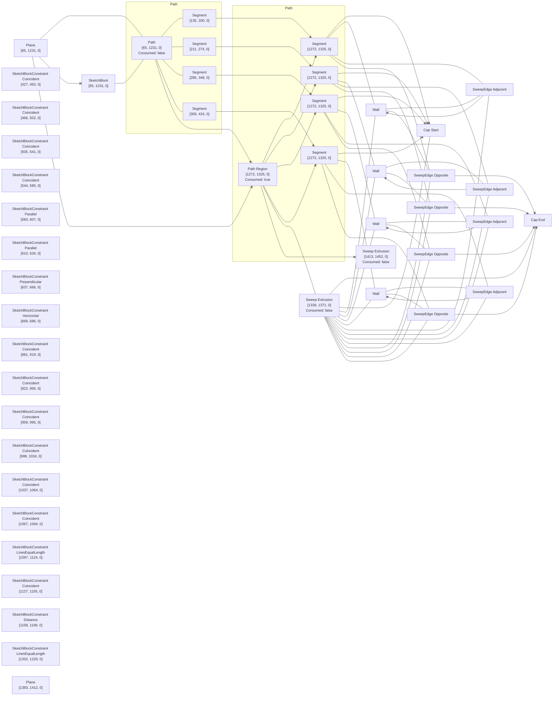

```mermaid
flowchart LR
  subgraph path7 [Path]
    7["Path<br>[65, 1231, 0]<br>Consumed: false"]
      %% [ProgramBodyItem { index: 0 }, VariableDeclarationDeclaration, VariableDeclarationInit]
    10["Segment<br>[135, 200, 0]"]
      %% [ProgramBodyItem { index: 0 }, VariableDeclarationDeclaration, VariableDeclarationInit, SketchBlockBody, SketchBlockBodyItem { index: 1 }, VariableDeclarationDeclaration, VariableDeclarationInit]
    11["Segment<br>[211, 274, 0]"]
      %% [ProgramBodyItem { index: 0 }, VariableDeclarationDeclaration, VariableDeclarationInit, SketchBlockBody, SketchBlockBodyItem { index: 2 }, VariableDeclarationDeclaration, VariableDeclarationInit]
    12["Segment<br>[285, 348, 0]"]
      %% [ProgramBodyItem { index: 0 }, VariableDeclarationDeclaration, VariableDeclarationInit, SketchBlockBody, SketchBlockBodyItem { index: 3 }, VariableDeclarationDeclaration, VariableDeclarationInit]
    13["Segment<br>[359, 424, 0]"]
      %% [ProgramBodyItem { index: 0 }, VariableDeclarationDeclaration, VariableDeclarationInit, SketchBlockBody, SketchBlockBodyItem { index: 4 }, VariableDeclarationDeclaration, VariableDeclarationInit]
  end
  subgraph path32 [Path]
    32["Path Region<br>[1272, 1325, 0]<br>Consumed: true"]
      %% [ProgramBodyItem { index: 2 }, VariableDeclarationDeclaration, VariableDeclarationInit]
    33["Segment<br>[1272, 1325, 0]"]
      %% [ProgramBodyItem { index: 2 }, VariableDeclarationDeclaration, VariableDeclarationInit]
    34["Segment<br>[1272, 1325, 0]"]
      %% [ProgramBodyItem { index: 2 }, VariableDeclarationDeclaration, VariableDeclarationInit]
    35["Segment<br>[1272, 1325, 0]"]
      %% [ProgramBodyItem { index: 2 }, VariableDeclarationDeclaration, VariableDeclarationInit]
    36["Segment<br>[1272, 1325, 0]"]
      %% [ProgramBodyItem { index: 2 }, VariableDeclarationDeclaration, VariableDeclarationInit]
  end
  1["Cap End"]
    %% face_code_ref=Missing NodePath
  2["Cap Start"]
    %% face_code_ref=Missing NodePath
  3[Wall]
    %% face_code_ref=Missing NodePath
  4[Wall]
    %% face_code_ref=Missing NodePath
  5[Wall]
    %% face_code_ref=Missing NodePath
  6[Wall]
    %% face_code_ref=Missing NodePath
  8["Plane<br>[65, 1231, 0]"]
    %% [ProgramBodyItem { index: 0 }, VariableDeclarationDeclaration, VariableDeclarationInit]
  9["SketchBlock<br>[65, 1231, 0]"]
    %% [ProgramBodyItem { index: 0 }, VariableDeclarationDeclaration, VariableDeclarationInit]
  14["SketchBlockConstraint Coincident<br>[427, 463, 0]"]
    %% [ProgramBodyItem { index: 0 }, VariableDeclarationDeclaration, VariableDeclarationInit, SketchBlockBody, SketchBlockBodyItem { index: 5 }, ExpressionStatementExpr]
  15["SketchBlockConstraint Coincident<br>[466, 502, 0]"]
    %% [ProgramBodyItem { index: 0 }, VariableDeclarationDeclaration, VariableDeclarationInit, SketchBlockBody, SketchBlockBodyItem { index: 6 }, ExpressionStatementExpr]
  16["SketchBlockConstraint Coincident<br>[505, 541, 0]"]
    %% [ProgramBodyItem { index: 0 }, VariableDeclarationDeclaration, VariableDeclarationInit, SketchBlockBody, SketchBlockBodyItem { index: 7 }, ExpressionStatementExpr]
  17["SketchBlockConstraint Coincident<br>[544, 580, 0]"]
    %% [ProgramBodyItem { index: 0 }, VariableDeclarationDeclaration, VariableDeclarationInit, SketchBlockBody, SketchBlockBodyItem { index: 8 }, ExpressionStatementExpr]
  18["SketchBlockConstraint Parallel<br>[583, 607, 0]"]
    %% [ProgramBodyItem { index: 0 }, VariableDeclarationDeclaration, VariableDeclarationInit, SketchBlockBody, SketchBlockBodyItem { index: 9 }, ExpressionStatementExpr]
  19["SketchBlockConstraint Parallel<br>[610, 634, 0]"]
    %% [ProgramBodyItem { index: 0 }, VariableDeclarationDeclaration, VariableDeclarationInit, SketchBlockBody, SketchBlockBodyItem { index: 10 }, ExpressionStatementExpr]
  20["SketchBlockConstraint Perpendicular<br>[637, 666, 0]"]
    %% [ProgramBodyItem { index: 0 }, VariableDeclarationDeclaration, VariableDeclarationInit, SketchBlockBody, SketchBlockBodyItem { index: 11 }, ExpressionStatementExpr]
  21["SketchBlockConstraint Horizontal<br>[669, 686, 0]"]
    %% [ProgramBodyItem { index: 0 }, VariableDeclarationDeclaration, VariableDeclarationInit, SketchBlockBody, SketchBlockBodyItem { index: 12 }, ExpressionStatementExpr]
  22["SketchBlockConstraint Coincident<br>[881, 919, 0]"]
    %% [ProgramBodyItem { index: 0 }, VariableDeclarationDeclaration, VariableDeclarationInit, SketchBlockBody, SketchBlockBodyItem { index: 15 }, ExpressionStatementExpr]
  23["SketchBlockConstraint Coincident<br>[922, 956, 0]"]
    %% [ProgramBodyItem { index: 0 }, VariableDeclarationDeclaration, VariableDeclarationInit, SketchBlockBody, SketchBlockBodyItem { index: 16 }, ExpressionStatementExpr]
  24["SketchBlockConstraint Coincident<br>[959, 995, 0]"]
    %% [ProgramBodyItem { index: 0 }, VariableDeclarationDeclaration, VariableDeclarationInit, SketchBlockBody, SketchBlockBodyItem { index: 17 }, ExpressionStatementExpr]
  25["SketchBlockConstraint Coincident<br>[998, 1034, 0]"]
    %% [ProgramBodyItem { index: 0 }, VariableDeclarationDeclaration, VariableDeclarationInit, SketchBlockBody, SketchBlockBodyItem { index: 18 }, ExpressionStatementExpr]
  26["SketchBlockConstraint Coincident<br>[1037, 1064, 0]"]
    %% [ProgramBodyItem { index: 0 }, VariableDeclarationDeclaration, VariableDeclarationInit, SketchBlockBody, SketchBlockBodyItem { index: 19 }, ExpressionStatementExpr]
  27["SketchBlockConstraint Coincident<br>[1067, 1094, 0]"]
    %% [ProgramBodyItem { index: 0 }, VariableDeclarationDeclaration, VariableDeclarationInit, SketchBlockBody, SketchBlockBodyItem { index: 20 }, ExpressionStatementExpr]
  28["SketchBlockConstraint LinesEqualLength<br>[1097, 1124, 0]"]
    %% [ProgramBodyItem { index: 0 }, VariableDeclarationDeclaration, VariableDeclarationInit, SketchBlockBody, SketchBlockBodyItem { index: 21 }, ExpressionStatementExpr]
  29["SketchBlockConstraint Coincident<br>[1127, 1155, 0]"]
    %% [ProgramBodyItem { index: 0 }, VariableDeclarationDeclaration, VariableDeclarationInit, SketchBlockBody, SketchBlockBodyItem { index: 22 }, ExpressionStatementExpr]
  30["SketchBlockConstraint Distance<br>[1158, 1199, 0]"]
    %% [ProgramBodyItem { index: 0 }, VariableDeclarationDeclaration, VariableDeclarationInit, SketchBlockBody, SketchBlockBodyItem { index: 23 }, ExpressionStatementExpr]
  31["SketchBlockConstraint LinesEqualLength<br>[1202, 1229, 0]"]
    %% [ProgramBodyItem { index: 0 }, VariableDeclarationDeclaration, VariableDeclarationInit, SketchBlockBody, SketchBlockBodyItem { index: 24 }, ExpressionStatementExpr]
  37["Sweep Extrusion<br>[1339, 1371, 0]<br>Consumed: false"]
    %% [ProgramBodyItem { index: 3 }, VariableDeclarationDeclaration, VariableDeclarationInit]
  38["Plane<br>[1383, 1412, 0]"]
    %% [ProgramBodyItem { index: 4 }, VariableDeclarationDeclaration, VariableDeclarationInit]
  39["Sweep Extrusion<br>[1413, 1452, 0]<br>Consumed: false"]
    %% [ProgramBodyItem { index: 5 }, ExpressionStatementExpr]
  40["SweepEdge Adjacent"]
  41["SweepEdge Adjacent"]
  42["SweepEdge Adjacent"]
  43["SweepEdge Adjacent"]
  44["SweepEdge Opposite"]
  45["SweepEdge Opposite"]
  46["SweepEdge Opposite"]
  47["SweepEdge Opposite"]
  37 --- 1
  44 <--x 1
  45 <--x 1
  46 <--x 1
  47 <--x 1
  33 <--x 2
  34 <--x 2
  35 <--x 2
  36 <--x 2
  37 --- 2
  33 --- 3
  37 --- 3
  3 --- 40
  40 <--x 3
  3 --- 44
  34 --- 4
  37 --- 4
  4 --- 41
  41 <--x 4
  4 --- 45
  35 --- 5
  37 --- 5
  5 --- 42
  42 <--x 5
  5 --- 46
  36 --- 6
  37 --- 6
  6 --- 43
  43 <--x 6
  6 --- 47
  8 --- 7
  9 --- 7
  7 --- 10
  7 --- 11
  7 --- 12
  7 --- 13
  7 <--x 32
  8 <--x 9
  8 <--x 32
  10 <--x 33
  11 <--x 34
  12 <--x 35
  13 <--x 36
  32 <--x 33
  32 <--x 34
  32 <--x 35
  32 <--x 36
  32 ---- 37
  32 <---x 39
  33 --- 40
  33 --- 44
  34 --- 41
  34 --- 45
  35 --- 42
  35 --- 46
  36 --- 43
  36 --- 47
  37 --- 40
  37 --- 41
  37 --- 42
  37 --- 43
  37 --- 44
  37 --- 45
  37 --- 46
  37 --- 47
```
