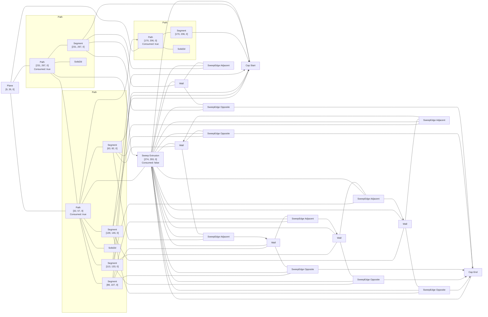

```mermaid
flowchart LR
  subgraph path2 [Path]
    2["Path<br>[32, 57, 0]<br>Consumed: true"]
      %% [ProgramBodyItem { index: 0 }, VariableDeclarationDeclaration, VariableDeclarationInit, PipeBodyItem { index: 1 }]
    3["Segment<br>[63, 82, 0]"]
      %% [ProgramBodyItem { index: 0 }, VariableDeclarationDeclaration, VariableDeclarationInit, PipeBodyItem { index: 2 }]
    4["Segment<br>[88, 107, 0]"]
      %% [ProgramBodyItem { index: 0 }, VariableDeclarationDeclaration, VariableDeclarationInit, PipeBodyItem { index: 3 }]
    5["Segment<br>[113, 133, 0]"]
      %% [ProgramBodyItem { index: 0 }, VariableDeclarationDeclaration, VariableDeclarationInit, PipeBodyItem { index: 4 }]
    6["Segment<br>[139, 146, 0]"]
      %% [ProgramBodyItem { index: 0 }, VariableDeclarationDeclaration, VariableDeclarationInit, PipeBodyItem { index: 5 }]
    7[Solid2d]
  end
  subgraph path8 [Path]
    8["Path<br>[170, 206, 0]<br>Consumed: true"]
      %% [ProgramBodyItem { index: 0 }, VariableDeclarationDeclaration, VariableDeclarationInit, PipeBodyItem { index: 6 }, CallKwArg { index: 0 }]
    9["Segment<br>[170, 206, 0]"]
      %% [ProgramBodyItem { index: 0 }, VariableDeclarationDeclaration, VariableDeclarationInit, PipeBodyItem { index: 6 }, CallKwArg { index: 0 }]
    10[Solid2d]
  end
  subgraph path11 [Path]
    11["Path<br>[231, 267, 0]<br>Consumed: true"]
      %% [ProgramBodyItem { index: 0 }, VariableDeclarationDeclaration, VariableDeclarationInit, PipeBodyItem { index: 7 }, CallKwArg { index: 0 }]
    12["Segment<br>[231, 267, 0]"]
      %% [ProgramBodyItem { index: 0 }, VariableDeclarationDeclaration, VariableDeclarationInit, PipeBodyItem { index: 7 }, CallKwArg { index: 0 }]
    13[Solid2d]
  end
  1["Plane<br>[9, 26, 0]"]
    %% [ProgramBodyItem { index: 0 }, VariableDeclarationDeclaration, VariableDeclarationInit, PipeBodyItem { index: 0 }]
  14["Sweep Extrusion<br>[274, 293, 0]<br>Consumed: false"]
    %% [ProgramBodyItem { index: 0 }, VariableDeclarationDeclaration, VariableDeclarationInit, PipeBodyItem { index: 8 }]
  15[Wall]
    %% face_code_ref=Missing NodePath
  16[Wall]
    %% face_code_ref=Missing NodePath
  17[Wall]
    %% face_code_ref=Missing NodePath
  18[Wall]
    %% face_code_ref=Missing NodePath
  19[Wall]
    %% face_code_ref=Missing NodePath
  20["Cap Start"]
    %% face_code_ref=Missing NodePath
  21["Cap End"]
    %% face_code_ref=Missing NodePath
  22["SweepEdge Opposite"]
  23["SweepEdge Adjacent"]
  24["SweepEdge Opposite"]
  25["SweepEdge Adjacent"]
  26["SweepEdge Opposite"]
  27["SweepEdge Adjacent"]
  28["SweepEdge Opposite"]
  29["SweepEdge Adjacent"]
  30["SweepEdge Opposite"]
  31["SweepEdge Adjacent"]
  1 --- 2
  1 --- 8
  1 --- 11
  2 --- 3
  2 --- 4
  2 --- 5
  2 --- 6
  2 --- 7
  2 <--x 8
  11 --- 2
  2 ---- 14
  3 --- 18
  3 x--> 20
  3 --- 28
  3 --- 29
  4 --- 17
  4 x--> 20
  4 --- 26
  4 --- 27
  5 --- 16
  5 x--> 20
  5 --- 24
  5 --- 25
  6 --- 15
  6 x--> 20
  6 --- 22
  6 --- 23
  8 --- 9
  8 --- 10
  9 x--> 20
  11 --- 12
  11 --- 13
  11 x---> 14
  12 --- 19
  12 x--> 20
  12 --- 30
  12 --- 31
  14 --- 15
  14 --- 16
  14 --- 17
  14 --- 18
  14 --- 19
  14 --- 20
  14 --- 21
  14 --- 22
  14 --- 23
  14 --- 24
  14 --- 25
  14 --- 26
  14 --- 27
  14 --- 28
  14 --- 29
  14 --- 30
  14 --- 31
  15 --- 22
  15 --- 23
  25 <--x 15
  16 --- 24
  16 --- 25
  27 <--x 16
  17 --- 26
  17 --- 27
  29 <--x 17
  23 <--x 18
  18 --- 28
  18 --- 29
  19 --- 30
  19 --- 31
  22 <--x 21
  24 <--x 21
  26 <--x 21
  28 <--x 21
  30 <--x 21
```
