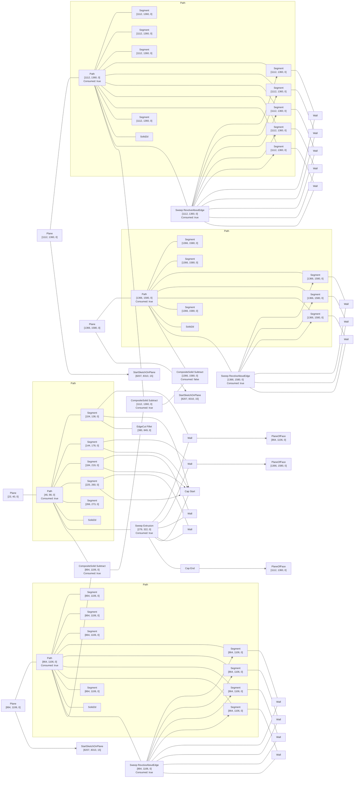

```mermaid
flowchart LR
  subgraph path2 [Path]
    2["Path<br>[46, 98, 0]<br>Consumed: true"]
      %% [ProgramBodyItem { index: 1 }, VariableDeclarationDeclaration, VariableDeclarationInit, PipeBodyItem { index: 1 }]
    3["Segment<br>[104, 138, 0]"]
      %% [ProgramBodyItem { index: 1 }, VariableDeclarationDeclaration, VariableDeclarationInit, PipeBodyItem { index: 2 }]
    4["Segment<br>[144, 178, 0]"]
      %% [ProgramBodyItem { index: 1 }, VariableDeclarationDeclaration, VariableDeclarationInit, PipeBodyItem { index: 3 }]
    5["Segment<br>[184, 219, 0]"]
      %% [ProgramBodyItem { index: 1 }, VariableDeclarationDeclaration, VariableDeclarationInit, PipeBodyItem { index: 4 }]
    6["Segment<br>[225, 260, 0]"]
      %% [ProgramBodyItem { index: 1 }, VariableDeclarationDeclaration, VariableDeclarationInit, PipeBodyItem { index: 5 }]
    7["Segment<br>[266, 273, 0]"]
      %% [ProgramBodyItem { index: 1 }, VariableDeclarationDeclaration, VariableDeclarationInit, PipeBodyItem { index: 6 }]
    8[Solid2d]
  end
  subgraph path19 [Path]
    19["Path<br>[864, 1106, 0]<br>Consumed: true"]
      %% [ProgramBodyItem { index: 2 }, ExpressionStatementExpr, PipeBodyItem { index: 1 }]
    20["Segment<br>[864, 1106, 0]"]
      %% [ProgramBodyItem { index: 2 }, ExpressionStatementExpr, PipeBodyItem { index: 1 }]
    21["Segment<br>[864, 1106, 0]"]
      %% [ProgramBodyItem { index: 2 }, ExpressionStatementExpr, PipeBodyItem { index: 1 }]
    22["Segment<br>[864, 1106, 0]"]
      %% [ProgramBodyItem { index: 2 }, ExpressionStatementExpr, PipeBodyItem { index: 1 }]
    23["Segment<br>[864, 1106, 0]"]
      %% [ProgramBodyItem { index: 2 }, ExpressionStatementExpr, PipeBodyItem { index: 1 }]
    24["Segment<br>[864, 1106, 0]"]
      %% [ProgramBodyItem { index: 2 }, ExpressionStatementExpr, PipeBodyItem { index: 1 }]
    25["Segment<br>[864, 1106, 0]"]
      %% [ProgramBodyItem { index: 2 }, ExpressionStatementExpr, PipeBodyItem { index: 1 }]
    26["Segment<br>[864, 1106, 0]"]
      %% [ProgramBodyItem { index: 2 }, ExpressionStatementExpr, PipeBodyItem { index: 1 }]
    27["Segment<br>[864, 1106, 0]"]
      %% [ProgramBodyItem { index: 2 }, ExpressionStatementExpr, PipeBodyItem { index: 1 }]
    28[Solid2d]
  end
  subgraph path37 [Path]
    37["Path<br>[1112, 1360, 0]<br>Consumed: true"]
      %% [ProgramBodyItem { index: 2 }, ExpressionStatementExpr, PipeBodyItem { index: 2 }]
    38["Segment<br>[1112, 1360, 0]"]
      %% [ProgramBodyItem { index: 2 }, ExpressionStatementExpr, PipeBodyItem { index: 2 }]
    39["Segment<br>[1112, 1360, 0]"]
      %% [ProgramBodyItem { index: 2 }, ExpressionStatementExpr, PipeBodyItem { index: 2 }]
    40["Segment<br>[1112, 1360, 0]"]
      %% [ProgramBodyItem { index: 2 }, ExpressionStatementExpr, PipeBodyItem { index: 2 }]
    41["Segment<br>[1112, 1360, 0]"]
      %% [ProgramBodyItem { index: 2 }, ExpressionStatementExpr, PipeBodyItem { index: 2 }]
    42["Segment<br>[1112, 1360, 0]"]
      %% [ProgramBodyItem { index: 2 }, ExpressionStatementExpr, PipeBodyItem { index: 2 }]
    43["Segment<br>[1112, 1360, 0]"]
      %% [ProgramBodyItem { index: 2 }, ExpressionStatementExpr, PipeBodyItem { index: 2 }]
    44["Segment<br>[1112, 1360, 0]"]
      %% [ProgramBodyItem { index: 2 }, ExpressionStatementExpr, PipeBodyItem { index: 2 }]
    45["Segment<br>[1112, 1360, 0]"]
      %% [ProgramBodyItem { index: 2 }, ExpressionStatementExpr, PipeBodyItem { index: 2 }]
    46["Segment<br>[1112, 1360, 0]"]
      %% [ProgramBodyItem { index: 2 }, ExpressionStatementExpr, PipeBodyItem { index: 2 }]
    47[Solid2d]
  end
  subgraph path57 [Path]
    57["Path<br>[1366, 1580, 0]<br>Consumed: true"]
      %% [ProgramBodyItem { index: 2 }, ExpressionStatementExpr, PipeBodyItem { index: 3 }]
    58["Segment<br>[1366, 1580, 0]"]
      %% [ProgramBodyItem { index: 2 }, ExpressionStatementExpr, PipeBodyItem { index: 3 }]
    59["Segment<br>[1366, 1580, 0]"]
      %% [ProgramBodyItem { index: 2 }, ExpressionStatementExpr, PipeBodyItem { index: 3 }]
    60["Segment<br>[1366, 1580, 0]"]
      %% [ProgramBodyItem { index: 2 }, ExpressionStatementExpr, PipeBodyItem { index: 3 }]
    61["Segment<br>[1366, 1580, 0]"]
      %% [ProgramBodyItem { index: 2 }, ExpressionStatementExpr, PipeBodyItem { index: 3 }]
    62["Segment<br>[1366, 1580, 0]"]
      %% [ProgramBodyItem { index: 2 }, ExpressionStatementExpr, PipeBodyItem { index: 3 }]
    63["Segment<br>[1366, 1580, 0]"]
      %% [ProgramBodyItem { index: 2 }, ExpressionStatementExpr, PipeBodyItem { index: 3 }]
    64[Solid2d]
  end
  1["Plane<br>[23, 40, 0]"]
    %% [ProgramBodyItem { index: 1 }, VariableDeclarationDeclaration, VariableDeclarationInit, PipeBodyItem { index: 0 }]
  9["Sweep Extrusion<br>[279, 322, 0]<br>Consumed: true"]
    %% [ProgramBodyItem { index: 1 }, VariableDeclarationDeclaration, VariableDeclarationInit, PipeBodyItem { index: 7 }]
  10[Wall]
    %% face_code_ref=Missing NodePath
  11[Wall]
    %% face_code_ref=Missing NodePath
  12[Wall]
    %% face_code_ref=Missing NodePath
  13[Wall]
    %% face_code_ref=Missing NodePath
  14["Cap Start"]
    %% face_code_ref=Missing NodePath
  15["Cap End"]
    %% face_code_ref=Missing NodePath
  16["EdgeCut Fillet<br>[380, 849, 0]"]
    %% [ProgramBodyItem { index: 1 }, VariableDeclarationDeclaration, VariableDeclarationInit, PipeBodyItem { index: 9 }]
  17["PlaneOfFace<br>[864, 1106, 0]"]
    %% [ProgramBodyItem { index: 2 }, ExpressionStatementExpr, PipeBodyItem { index: 1 }]
  18["Plane<br>[864, 1106, 0]"]
    %% [ProgramBodyItem { index: 2 }, ExpressionStatementExpr, PipeBodyItem { index: 1 }]
  29["Sweep RevolveAboutEdge<br>[864, 1106, 0]<br>Consumed: true"]
    %% [ProgramBodyItem { index: 2 }, ExpressionStatementExpr, PipeBodyItem { index: 1 }]
  30[Wall]
    %% face_code_ref=Missing NodePath
  31[Wall]
    %% face_code_ref=Missing NodePath
  32[Wall]
    %% face_code_ref=Missing NodePath
  33[Wall]
    %% face_code_ref=Missing NodePath
  34["CompositeSolid Subtract<br>[864, 1106, 0]<br>Consumed: true"]
    %% [ProgramBodyItem { index: 2 }, ExpressionStatementExpr, PipeBodyItem { index: 1 }]
  35["PlaneOfFace<br>[1112, 1360, 0]"]
    %% [ProgramBodyItem { index: 2 }, ExpressionStatementExpr, PipeBodyItem { index: 2 }]
  36["Plane<br>[1112, 1360, 0]"]
    %% [ProgramBodyItem { index: 2 }, ExpressionStatementExpr, PipeBodyItem { index: 2 }]
  48["Sweep RevolveAboutEdge<br>[1112, 1360, 0]<br>Consumed: true"]
    %% [ProgramBodyItem { index: 2 }, ExpressionStatementExpr, PipeBodyItem { index: 2 }]
  49[Wall]
    %% face_code_ref=Missing NodePath
  50[Wall]
    %% face_code_ref=Missing NodePath
  51[Wall]
    %% face_code_ref=Missing NodePath
  52[Wall]
    %% face_code_ref=Missing NodePath
  53[Wall]
    %% face_code_ref=Missing NodePath
  54["CompositeSolid Subtract<br>[1112, 1360, 0]<br>Consumed: true"]
    %% [ProgramBodyItem { index: 2 }, ExpressionStatementExpr, PipeBodyItem { index: 2 }]
  55["PlaneOfFace<br>[1366, 1580, 0]"]
    %% [ProgramBodyItem { index: 2 }, ExpressionStatementExpr, PipeBodyItem { index: 3 }]
  56["Plane<br>[1366, 1580, 0]"]
    %% [ProgramBodyItem { index: 2 }, ExpressionStatementExpr, PipeBodyItem { index: 3 }]
  65["Sweep RevolveAboutEdge<br>[1366, 1580, 0]<br>Consumed: true"]
    %% [ProgramBodyItem { index: 2 }, ExpressionStatementExpr, PipeBodyItem { index: 3 }]
  66[Wall]
    %% face_code_ref=Missing NodePath
  67[Wall]
    %% face_code_ref=Missing NodePath
  68[Wall]
    %% face_code_ref=Missing NodePath
  69["CompositeSolid Subtract<br>[1366, 1580, 0]<br>Consumed: false"]
    %% [ProgramBodyItem { index: 2 }, ExpressionStatementExpr, PipeBodyItem { index: 3 }]
  70["StartSketchOnPlane<br>[8207, 8310, 15]"]
    %% [ProgramBodyItem { index: 13 }, VariableDeclarationDeclaration, VariableDeclarationInit, FunctionExpressionBody, FunctionExpressionBodyItem { index: 0 }, VariableDeclarationDeclaration, VariableDeclarationInit]
  71["StartSketchOnPlane<br>[8207, 8310, 15]"]
    %% [ProgramBodyItem { index: 13 }, VariableDeclarationDeclaration, VariableDeclarationInit, FunctionExpressionBody, FunctionExpressionBodyItem { index: 0 }, VariableDeclarationDeclaration, VariableDeclarationInit]
  72["StartSketchOnPlane<br>[8207, 8310, 15]"]
    %% [ProgramBodyItem { index: 13 }, VariableDeclarationDeclaration, VariableDeclarationInit, FunctionExpressionBody, FunctionExpressionBodyItem { index: 0 }, VariableDeclarationDeclaration, VariableDeclarationInit]
  1 --- 2
  2 --- 3
  2 --- 4
  2 --- 5
  2 --- 6
  2 --- 7
  2 --- 8
  2 ---- 9
  2 --- 34
  3 --- 10
  3 x--> 14
  3 --- 16
  4 --- 11
  4 x--> 14
  5 --- 12
  5 x--> 14
  6 --- 13
  6 x--> 14
  9 --- 10
  9 --- 11
  9 --- 12
  9 --- 13
  9 --- 14
  9 --- 15
  10 <--x 17
  11 <--x 55
  15 <--x 35
  18 --- 19
  18 <--x 70
  19 --- 20
  19 --- 21
  19 --- 22
  19 --- 23
  19 --- 24
  19 --- 25
  19 --- 26
  19 --- 27
  19 --- 28
  19 ---- 29
  19 --- 34
  29 <--x 23
  23 --- 30
  29 <--x 24
  24 --- 31
  29 <--x 25
  25 --- 32
  29 <--x 26
  26 --- 33
  29 --- 30
  29 --- 31
  29 --- 32
  29 --- 33
  34 --- 54
  36 --- 37
  36 <--x 71
  37 --- 38
  37 --- 39
  37 --- 40
  37 --- 41
  37 --- 42
  37 --- 43
  37 --- 44
  37 --- 45
  37 --- 46
  37 --- 47
  37 ---- 48
  37 --- 54
  48 <--x 41
  41 --- 49
  48 <--x 42
  42 --- 50
  48 <--x 43
  43 --- 51
  48 <--x 44
  44 --- 52
  48 <--x 45
  45 --- 53
  48 --- 49
  48 --- 50
  48 --- 51
  48 --- 52
  48 --- 53
  54 --- 69
  56 --- 57
  56 <--x 72
  57 --- 58
  57 --- 59
  57 --- 60
  57 --- 61
  57 --- 62
  57 --- 63
  57 --- 64
  57 ---- 65
  57 --- 69
  65 <--x 60
  60 --- 66
  65 <--x 61
  61 --- 67
  65 <--x 62
  62 --- 68
  65 --- 66
  65 --- 67
  65 --- 68
```
