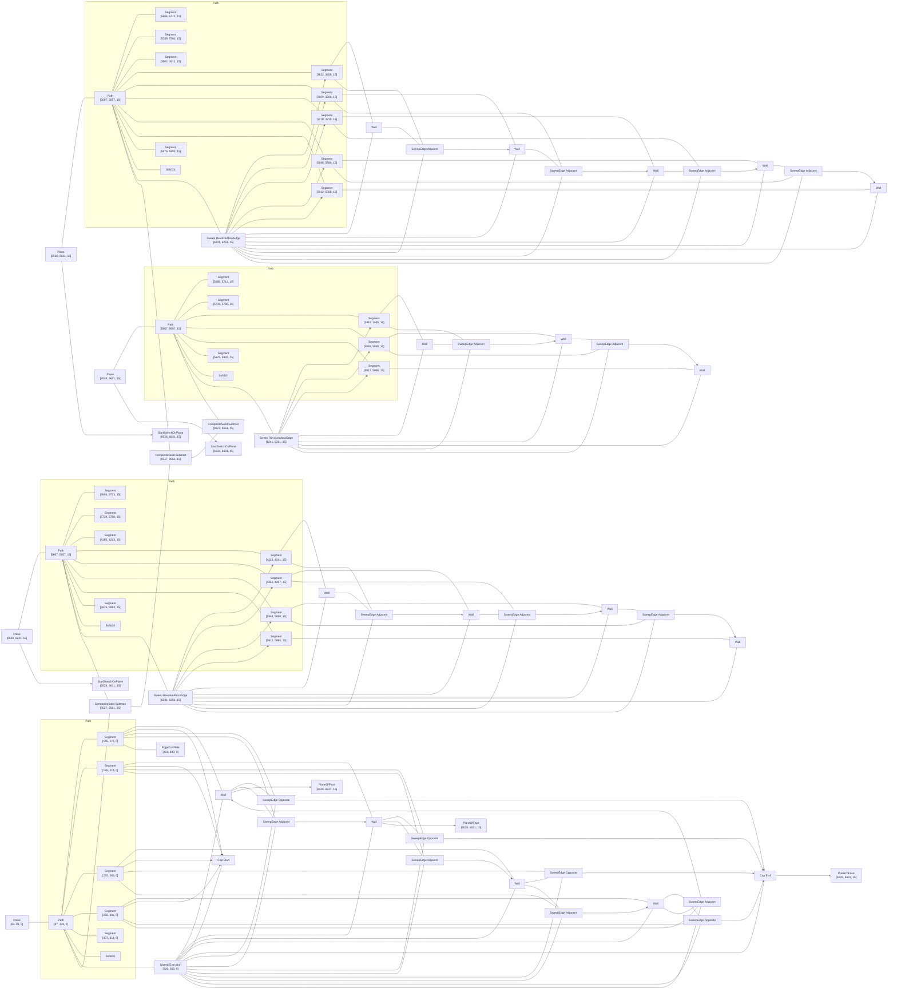

```mermaid
flowchart LR
  subgraph path2 [Path]
    2["Path<br>[87, 139, 0]"]
      %% [ProgramBodyItem { index: 1 }, VariableDeclarationDeclaration, VariableDeclarationInit, PipeBodyItem { index: 1 }]
    3["Segment<br>[145, 179, 0]"]
      %% [ProgramBodyItem { index: 1 }, VariableDeclarationDeclaration, VariableDeclarationInit, PipeBodyItem { index: 2 }]
    4["Segment<br>[185, 219, 0]"]
      %% [ProgramBodyItem { index: 1 }, VariableDeclarationDeclaration, VariableDeclarationInit, PipeBodyItem { index: 3 }]
    5["Segment<br>[225, 260, 0]"]
      %% [ProgramBodyItem { index: 1 }, VariableDeclarationDeclaration, VariableDeclarationInit, PipeBodyItem { index: 4 }]
    6["Segment<br>[266, 301, 0]"]
      %% [ProgramBodyItem { index: 1 }, VariableDeclarationDeclaration, VariableDeclarationInit, PipeBodyItem { index: 5 }]
    7["Segment<br>[307, 314, 0]"]
      %% [ProgramBodyItem { index: 1 }, VariableDeclarationDeclaration, VariableDeclarationInit, PipeBodyItem { index: 6 }]
    8[Solid2d]
  end
  subgraph path27 [Path]
    27["Path<br>[5607, 5657, 15]"]
    28["Segment<br>[5686, 5713, 15]"]
    29["Segment<br>[5739, 5780, 15]"]
    30["Segment<br>[4195, 4213, 15]"]
    31["Segment<br>[4223, 4241, 15]"]
    32["Segment<br>[4251, 4297, 15]"]
    33["Segment<br>[5848, 5880, 15]"]
    34["Segment<br>[5912, 5968, 15]"]
    35["Segment<br>[5976, 5983, 15]"]
    36[Solid2d]
  end
  subgraph path48 [Path]
    48["Path<br>[5607, 5657, 15]"]
    49["Segment<br>[5686, 5713, 15]"]
    50["Segment<br>[5739, 5780, 15]"]
    51["Segment<br>[3582, 3612, 15]"]
    52["Segment<br>[3622, 3659, 15]"]
    53["Segment<br>[3669, 3700, 15]"]
    54["Segment<br>[3710, 3730, 15]"]
    55["Segment<br>[5848, 5880, 15]"]
    56["Segment<br>[5912, 5968, 15]"]
    57["Segment<br>[5976, 5983, 15]"]
    58[Solid2d]
  end
  subgraph path72 [Path]
    72["Path<br>[5607, 5657, 15]"]
    73["Segment<br>[5686, 5713, 15]"]
    74["Segment<br>[5739, 5780, 15]"]
    75["Segment<br>[3416, 3445, 15]"]
    76["Segment<br>[5848, 5880, 15]"]
    77["Segment<br>[5912, 5968, 15]"]
    78["Segment<br>[5976, 5983, 15]"]
    79[Solid2d]
  end
  1["Plane<br>[64, 81, 0]"]
    %% [ProgramBodyItem { index: 1 }, VariableDeclarationDeclaration, VariableDeclarationInit, PipeBodyItem { index: 0 }]
  9["Sweep Extrusion<br>[320, 363, 0]"]
    %% [ProgramBodyItem { index: 1 }, VariableDeclarationDeclaration, VariableDeclarationInit, PipeBodyItem { index: 7 }]
  10[Wall]
    %% face_code_ref=Missing NodePath
  11[Wall]
    %% face_code_ref=Missing NodePath
  12[Wall]
    %% face_code_ref=Missing NodePath
  13[Wall]
    %% face_code_ref=Missing NodePath
  14["Cap Start"]
    %% face_code_ref=Missing NodePath
  15["Cap End"]
    %% face_code_ref=Missing NodePath
  16["SweepEdge Opposite"]
  17["SweepEdge Adjacent"]
  18["SweepEdge Opposite"]
  19["SweepEdge Adjacent"]
  20["SweepEdge Opposite"]
  21["SweepEdge Adjacent"]
  22["SweepEdge Opposite"]
  23["SweepEdge Adjacent"]
  24["EdgeCut Fillet<br>[421, 890, 0]"]
    %% [ProgramBodyItem { index: 1 }, VariableDeclarationDeclaration, VariableDeclarationInit, PipeBodyItem { index: 9 }]
  25["PlaneOfFace<br>[6528, 6631, 15]"]
  26["Plane<br>[6528, 6631, 15]"]
  37["Sweep RevolveAboutEdge<br>[6241, 6261, 15]"]
  38[Wall]
    %% face_code_ref=Missing NodePath
  39[Wall]
    %% face_code_ref=Missing NodePath
  40[Wall]
    %% face_code_ref=Missing NodePath
  41[Wall]
    %% face_code_ref=Missing NodePath
  42["SweepEdge Adjacent"]
  43["SweepEdge Adjacent"]
  44["SweepEdge Adjacent"]
  45["CompositeSolid Subtract<br>[9527, 9561, 15]"]
  46["PlaneOfFace<br>[6528, 6631, 15]"]
  47["Plane<br>[6528, 6631, 15]"]
  59["Sweep RevolveAboutEdge<br>[6241, 6261, 15]"]
  60[Wall]
    %% face_code_ref=Missing NodePath
  61[Wall]
    %% face_code_ref=Missing NodePath
  62[Wall]
    %% face_code_ref=Missing NodePath
  63[Wall]
    %% face_code_ref=Missing NodePath
  64[Wall]
    %% face_code_ref=Missing NodePath
  65["SweepEdge Adjacent"]
  66["SweepEdge Adjacent"]
  67["SweepEdge Adjacent"]
  68["SweepEdge Adjacent"]
  69["CompositeSolid Subtract<br>[9527, 9561, 15]"]
  70["PlaneOfFace<br>[6528, 6631, 15]"]
  71["Plane<br>[6528, 6631, 15]"]
  80["Sweep RevolveAboutEdge<br>[6241, 6261, 15]"]
  81[Wall]
    %% face_code_ref=Missing NodePath
  82[Wall]
    %% face_code_ref=Missing NodePath
  83[Wall]
    %% face_code_ref=Missing NodePath
  84["SweepEdge Adjacent"]
  85["SweepEdge Adjacent"]
  86["CompositeSolid Subtract<br>[9527, 9561, 15]"]
  87["StartSketchOnPlane<br>[6528, 6631, 15]"]
  88["StartSketchOnPlane<br>[6528, 6631, 15]"]
  89["StartSketchOnPlane<br>[6528, 6631, 15]"]
  1 --- 2
  2 --- 3
  2 --- 4
  2 --- 5
  2 --- 6
  2 --- 7
  2 --- 8
  2 ---- 9
  2 --- 45
  3 --- 10
  3 x--> 14
  3 --- 16
  3 --- 17
  3 --- 24
  4 --- 11
  4 x--> 14
  4 --- 18
  4 --- 19
  5 --- 12
  5 x--> 14
  5 --- 20
  5 --- 21
  6 --- 13
  6 x--> 14
  6 --- 22
  6 --- 23
  9 --- 10
  9 --- 11
  9 --- 12
  9 --- 13
  9 --- 14
  9 --- 15
  9 --- 16
  9 --- 17
  9 --- 18
  9 --- 19
  9 --- 20
  9 --- 21
  9 --- 22
  9 --- 23
  10 --- 16
  10 --- 17
  23 <--x 10
  10 <--x 25
  17 <--x 11
  11 --- 18
  11 --- 19
  11 <--x 70
  19 <--x 12
  12 --- 20
  12 --- 21
  21 <--x 13
  13 --- 22
  13 --- 23
  16 <--x 15
  18 <--x 15
  20 <--x 15
  22 <--x 15
  15 <--x 46
  26 --- 27
  26 <--x 87
  27 --- 28
  27 --- 29
  27 --- 30
  27 --- 31
  27 --- 32
  27 --- 33
  27 --- 34
  27 --- 35
  27 --- 36
  27 ---- 37
  27 --- 45
  37 <--x 31
  31 --- 38
  31 --- 42
  37 <--x 32
  32 --- 39
  32 --- 43
  37 <--x 33
  33 --- 40
  33 --- 44
  37 <--x 34
  34 --- 41
  37 --- 38
  37 --- 39
  37 --- 40
  37 --- 41
  37 --- 42
  37 --- 43
  37 --- 44
  38 --- 42
  42 <--x 39
  39 --- 43
  43 <--x 40
  40 --- 44
  44 <--x 41
  45 --- 69
  47 --- 48
  47 <--x 88
  48 --- 49
  48 --- 50
  48 --- 51
  48 --- 52
  48 --- 53
  48 --- 54
  48 --- 55
  48 --- 56
  48 --- 57
  48 --- 58
  48 ---- 59
  48 --- 69
  59 <--x 52
  52 --- 60
  52 --- 65
  59 <--x 53
  53 --- 61
  53 --- 66
  59 <--x 54
  54 --- 62
  54 --- 67
  59 <--x 55
  55 --- 63
  55 --- 68
  59 <--x 56
  56 --- 64
  59 --- 60
  59 --- 61
  59 --- 62
  59 --- 63
  59 --- 64
  59 --- 65
  59 --- 66
  59 --- 67
  59 --- 68
  60 --- 65
  65 <--x 61
  61 --- 66
  66 <--x 62
  62 --- 67
  67 <--x 63
  63 --- 68
  68 <--x 64
  69 --- 86
  71 --- 72
  71 <--x 89
  72 --- 73
  72 --- 74
  72 --- 75
  72 --- 76
  72 --- 77
  72 --- 78
  72 --- 79
  72 ---- 80
  72 --- 86
  80 <--x 75
  75 --- 81
  75 --- 84
  80 <--x 76
  76 --- 82
  76 --- 85
  80 <--x 77
  77 --- 83
  80 --- 81
  80 --- 82
  80 --- 83
  80 --- 84
  80 --- 85
  81 --- 84
  84 <--x 82
  82 --- 85
  85 <--x 83
```
