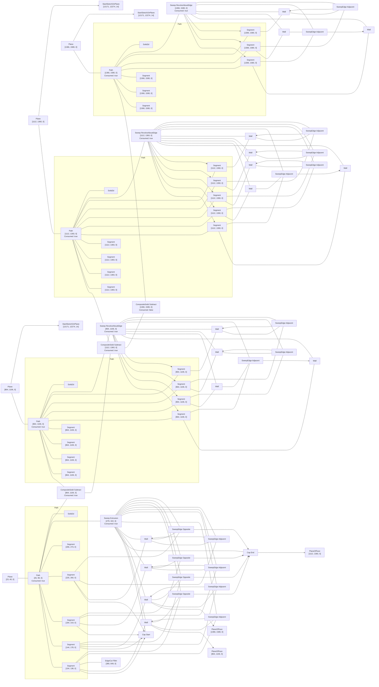

```mermaid
flowchart LR
  subgraph path20 [Path]
    20["Path<br>[46, 98, 0]<br>Consumed: true"]
      %% [ProgramBodyItem { index: 1 }, VariableDeclarationDeclaration, VariableDeclarationInit, PipeBodyItem { index: 1 }]
    21["Segment<br>[104, 138, 0]"]
      %% [ProgramBodyItem { index: 1 }, VariableDeclarationDeclaration, VariableDeclarationInit, PipeBodyItem { index: 2 }]
    22["Segment<br>[144, 178, 0]"]
      %% [ProgramBodyItem { index: 1 }, VariableDeclarationDeclaration, VariableDeclarationInit, PipeBodyItem { index: 3 }]
    23["Segment<br>[184, 219, 0]"]
      %% [ProgramBodyItem { index: 1 }, VariableDeclarationDeclaration, VariableDeclarationInit, PipeBodyItem { index: 4 }]
    24["Segment<br>[225, 260, 0]"]
      %% [ProgramBodyItem { index: 1 }, VariableDeclarationDeclaration, VariableDeclarationInit, PipeBodyItem { index: 5 }]
    25["Segment<br>[266, 273, 0]"]
      %% [ProgramBodyItem { index: 1 }, VariableDeclarationDeclaration, VariableDeclarationInit, PipeBodyItem { index: 6 }]
    71[Solid2d]
  end
  subgraph path29 [Path]
    29["Path<br>[864, 1106, 0]<br>Consumed: true"]
      %% [ProgramBodyItem { index: 2 }, ExpressionStatementExpr, PipeBodyItem { index: 1 }]
    32["Segment<br>[864, 1106, 0]"]
      %% [ProgramBodyItem { index: 2 }, ExpressionStatementExpr, PipeBodyItem { index: 1 }]
    33["Segment<br>[864, 1106, 0]"]
      %% [ProgramBodyItem { index: 2 }, ExpressionStatementExpr, PipeBodyItem { index: 1 }]
    34["Segment<br>[864, 1106, 0]"]
      %% [ProgramBodyItem { index: 2 }, ExpressionStatementExpr, PipeBodyItem { index: 1 }]
    35["Segment<br>[864, 1106, 0]"]
      %% [ProgramBodyItem { index: 2 }, ExpressionStatementExpr, PipeBodyItem { index: 1 }]
    36["Segment<br>[864, 1106, 0]"]
      %% [ProgramBodyItem { index: 2 }, ExpressionStatementExpr, PipeBodyItem { index: 1 }]
    37["Segment<br>[864, 1106, 0]"]
      %% [ProgramBodyItem { index: 2 }, ExpressionStatementExpr, PipeBodyItem { index: 1 }]
    38["Segment<br>[864, 1106, 0]"]
      %% [ProgramBodyItem { index: 2 }, ExpressionStatementExpr, PipeBodyItem { index: 1 }]
    39["Segment<br>[864, 1106, 0]"]
      %% [ProgramBodyItem { index: 2 }, ExpressionStatementExpr, PipeBodyItem { index: 1 }]
    72[Solid2d]
  end
  subgraph path42 [Path]
    42["Path<br>[1112, 1360, 0]<br>Consumed: true"]
      %% [ProgramBodyItem { index: 2 }, ExpressionStatementExpr, PipeBodyItem { index: 2 }]
    45["Segment<br>[1112, 1360, 0]"]
      %% [ProgramBodyItem { index: 2 }, ExpressionStatementExpr, PipeBodyItem { index: 2 }]
    46["Segment<br>[1112, 1360, 0]"]
      %% [ProgramBodyItem { index: 2 }, ExpressionStatementExpr, PipeBodyItem { index: 2 }]
    47["Segment<br>[1112, 1360, 0]"]
      %% [ProgramBodyItem { index: 2 }, ExpressionStatementExpr, PipeBodyItem { index: 2 }]
    48["Segment<br>[1112, 1360, 0]"]
      %% [ProgramBodyItem { index: 2 }, ExpressionStatementExpr, PipeBodyItem { index: 2 }]
    49["Segment<br>[1112, 1360, 0]"]
      %% [ProgramBodyItem { index: 2 }, ExpressionStatementExpr, PipeBodyItem { index: 2 }]
    50["Segment<br>[1112, 1360, 0]"]
      %% [ProgramBodyItem { index: 2 }, ExpressionStatementExpr, PipeBodyItem { index: 2 }]
    51["Segment<br>[1112, 1360, 0]"]
      %% [ProgramBodyItem { index: 2 }, ExpressionStatementExpr, PipeBodyItem { index: 2 }]
    52["Segment<br>[1112, 1360, 0]"]
      %% [ProgramBodyItem { index: 2 }, ExpressionStatementExpr, PipeBodyItem { index: 2 }]
    53["Segment<br>[1112, 1360, 0]"]
      %% [ProgramBodyItem { index: 2 }, ExpressionStatementExpr, PipeBodyItem { index: 2 }]
    69[Solid2d]
  end
  subgraph path56 [Path]
    56["Path<br>[1366, 1580, 0]<br>Consumed: true"]
      %% [ProgramBodyItem { index: 2 }, ExpressionStatementExpr, PipeBodyItem { index: 3 }]
    59["Segment<br>[1366, 1580, 0]"]
      %% [ProgramBodyItem { index: 2 }, ExpressionStatementExpr, PipeBodyItem { index: 3 }]
    60["Segment<br>[1366, 1580, 0]"]
      %% [ProgramBodyItem { index: 2 }, ExpressionStatementExpr, PipeBodyItem { index: 3 }]
    61["Segment<br>[1366, 1580, 0]"]
      %% [ProgramBodyItem { index: 2 }, ExpressionStatementExpr, PipeBodyItem { index: 3 }]
    62["Segment<br>[1366, 1580, 0]"]
      %% [ProgramBodyItem { index: 2 }, ExpressionStatementExpr, PipeBodyItem { index: 3 }]
    63["Segment<br>[1366, 1580, 0]"]
      %% [ProgramBodyItem { index: 2 }, ExpressionStatementExpr, PipeBodyItem { index: 3 }]
    64["Segment<br>[1366, 1580, 0]"]
      %% [ProgramBodyItem { index: 2 }, ExpressionStatementExpr, PipeBodyItem { index: 3 }]
    70[Solid2d]
  end
  1["Cap End"]
    %% face_code_ref=Missing NodePath
  2["Cap Start"]
    %% face_code_ref=Missing NodePath
  3[Wall]
    %% face_code_ref=Missing NodePath
  4[Wall]
    %% face_code_ref=Missing NodePath
  5[Wall]
    %% face_code_ref=Missing NodePath
  6[Wall]
    %% face_code_ref=Missing NodePath
  7[Wall]
    %% face_code_ref=Missing NodePath
  8[Wall]
    %% face_code_ref=Missing NodePath
  9[Wall]
    %% face_code_ref=Missing NodePath
  10[Wall]
    %% face_code_ref=Missing NodePath
  11[Wall]
    %% face_code_ref=Missing NodePath
  12[Wall]
    %% face_code_ref=Missing NodePath
  13[Wall]
    %% face_code_ref=Missing NodePath
  14[Wall]
    %% face_code_ref=Missing NodePath
  15[Wall]
    %% face_code_ref=Missing NodePath
  16[Wall]
    %% face_code_ref=Missing NodePath
  17[Wall]
    %% face_code_ref=Missing NodePath
  18[Wall]
    %% face_code_ref=Missing NodePath
  19["Plane<br>[23, 40, 0]"]
    %% [ProgramBodyItem { index: 1 }, VariableDeclarationDeclaration, VariableDeclarationInit, PipeBodyItem { index: 0 }]
  26["Sweep Extrusion<br>[279, 322, 0]<br>Consumed: true"]
    %% [ProgramBodyItem { index: 1 }, VariableDeclarationDeclaration, VariableDeclarationInit, PipeBodyItem { index: 7 }]
  27["EdgeCut Fillet<br>[380, 849, 0]"]
    %% [ProgramBodyItem { index: 1 }, VariableDeclarationDeclaration, VariableDeclarationInit, PipeBodyItem { index: 9 }]
  28["CompositeSolid Subtract<br>[864, 1106, 0]<br>Consumed: true"]
    %% [ProgramBodyItem { index: 2 }, ExpressionStatementExpr, PipeBodyItem { index: 1 }]
  30["Plane<br>[864, 1106, 0]"]
    %% [ProgramBodyItem { index: 2 }, ExpressionStatementExpr, PipeBodyItem { index: 1 }]
  31["PlaneOfFace<br>[864, 1106, 0]"]
    %% [ProgramBodyItem { index: 2 }, ExpressionStatementExpr, PipeBodyItem { index: 1 }]
  40["Sweep RevolveAboutEdge<br>[864, 1106, 0]<br>Consumed: true"]
    %% [ProgramBodyItem { index: 2 }, ExpressionStatementExpr, PipeBodyItem { index: 1 }]
  41["CompositeSolid Subtract<br>[1112, 1360, 0]<br>Consumed: true"]
    %% [ProgramBodyItem { index: 2 }, ExpressionStatementExpr, PipeBodyItem { index: 2 }]
  43["Plane<br>[1112, 1360, 0]"]
    %% [ProgramBodyItem { index: 2 }, ExpressionStatementExpr, PipeBodyItem { index: 2 }]
  44["PlaneOfFace<br>[1112, 1360, 0]"]
    %% [ProgramBodyItem { index: 2 }, ExpressionStatementExpr, PipeBodyItem { index: 2 }]
  54["Sweep RevolveAboutEdge<br>[1112, 1360, 0]<br>Consumed: true"]
    %% [ProgramBodyItem { index: 2 }, ExpressionStatementExpr, PipeBodyItem { index: 2 }]
  55["CompositeSolid Subtract<br>[1366, 1580, 0]<br>Consumed: false"]
    %% [ProgramBodyItem { index: 2 }, ExpressionStatementExpr, PipeBodyItem { index: 3 }]
  57["Plane<br>[1366, 1580, 0]"]
    %% [ProgramBodyItem { index: 2 }, ExpressionStatementExpr, PipeBodyItem { index: 3 }]
  58["PlaneOfFace<br>[1366, 1580, 0]"]
    %% [ProgramBodyItem { index: 2 }, ExpressionStatementExpr, PipeBodyItem { index: 3 }]
  65["Sweep RevolveAboutEdge<br>[1366, 1580, 0]<br>Consumed: true"]
    %% [ProgramBodyItem { index: 2 }, ExpressionStatementExpr, PipeBodyItem { index: 3 }]
  66["StartSketchOnPlane<br>[12171, 12274, 14]"]
    %% [ProgramBodyItem { index: 13 }, VariableDeclarationDeclaration, VariableDeclarationInit, FunctionExpressionBody, FunctionExpressionBodyItem { index: 0 }, VariableDeclarationDeclaration, VariableDeclarationInit]
  67["StartSketchOnPlane<br>[12171, 12274, 14]"]
    %% [ProgramBodyItem { index: 13 }, VariableDeclarationDeclaration, VariableDeclarationInit, FunctionExpressionBody, FunctionExpressionBodyItem { index: 0 }, VariableDeclarationDeclaration, VariableDeclarationInit]
  68["StartSketchOnPlane<br>[12171, 12274, 14]"]
    %% [ProgramBodyItem { index: 13 }, VariableDeclarationDeclaration, VariableDeclarationInit, FunctionExpressionBody, FunctionExpressionBodyItem { index: 0 }, VariableDeclarationDeclaration, VariableDeclarationInit]
  73["SweepEdge Adjacent"]
  74["SweepEdge Adjacent"]
  75["SweepEdge Adjacent"]
  76["SweepEdge Adjacent"]
  77["SweepEdge Adjacent"]
  78["SweepEdge Adjacent"]
  79["SweepEdge Adjacent"]
  80["SweepEdge Adjacent"]
  81["SweepEdge Adjacent"]
  82["SweepEdge Adjacent"]
  83["SweepEdge Adjacent"]
  84["SweepEdge Adjacent"]
  85["SweepEdge Adjacent"]
  86["SweepEdge Opposite"]
  87["SweepEdge Opposite"]
  88["SweepEdge Opposite"]
  89["SweepEdge Opposite"]
  26 --- 1
  1 <--x 44
  86 <--x 1
  87 <--x 1
  88 <--x 1
  89 <--x 1
  21 <--x 2
  22 <--x 2
  23 <--x 2
  24 <--x 2
  26 --- 2
  21 --- 3
  26 --- 3
  3 <--x 31
  3 --- 73
  73 <--x 3
  3 --- 86
  49 --- 4
  54 --- 4
  74 <--x 4
  50 --- 5
  54 --- 5
  5 --- 74
  51 --- 6
  54 --- 6
  6 --- 75
  75 <--x 6
  52 --- 7
  54 --- 7
  7 --- 76
  76 <--x 7
  53 --- 8
  54 --- 8
  8 --- 77
  77 <--x 8
  62 --- 9
  65 --- 9
  78 <--x 9
  63 --- 10
  65 --- 10
  10 --- 78
  64 --- 11
  65 --- 11
  11 --- 79
  79 <--x 11
  22 --- 12
  26 --- 12
  12 <--x 58
  12 --- 80
  80 <--x 12
  12 --- 87
  23 --- 13
  26 --- 13
  13 --- 81
  81 <--x 13
  13 --- 88
  24 --- 14
  26 --- 14
  14 --- 82
  82 <--x 14
  14 --- 89
  36 --- 15
  40 --- 15
  83 <--x 15
  37 --- 16
  40 --- 16
  16 --- 83
  38 --- 17
  40 --- 17
  17 --- 84
  84 <--x 17
  39 --- 18
  40 --- 18
  18 --- 85
  85 <--x 18
  19 --- 20
  20 --- 21
  20 --- 22
  20 --- 23
  20 --- 24
  20 --- 25
  20 ---- 26
  20 --- 28
  20 --- 71
  21 --- 27
  21 --- 73
  21 --- 86
  22 --- 80
  22 --- 87
  23 --- 81
  23 --- 88
  24 --- 82
  24 --- 89
  26 --- 73
  26 --- 80
  26 --- 81
  26 --- 82
  26 --- 86
  26 --- 87
  26 --- 88
  26 --- 89
  29 --- 28
  28 --- 41
  30 --- 29
  29 --- 32
  29 --- 33
  29 --- 34
  29 --- 35
  29 --- 36
  29 --- 37
  29 --- 38
  29 --- 39
  29 ---- 40
  29 --- 72
  30 <--x 68
  40 <--x 36
  36 --- 83
  40 <--x 37
  37 --- 84
  40 <--x 38
  38 --- 85
  40 <--x 39
  40 --- 83
  40 --- 84
  40 --- 85
  42 --- 41
  41 --- 55
  43 --- 42
  42 --- 45
  42 --- 46
  42 --- 47
  42 --- 48
  42 --- 49
  42 --- 50
  42 --- 51
  42 --- 52
  42 --- 53
  42 ---- 54
  42 --- 69
  43 <--x 66
  54 <--x 49
  49 --- 74
  54 <--x 50
  50 --- 75
  54 <--x 51
  51 --- 76
  54 <--x 52
  52 --- 77
  54 <--x 53
  54 --- 74
  54 --- 75
  54 --- 76
  54 --- 77
  56 --- 55
  57 --- 56
  56 --- 59
  56 --- 60
  56 --- 61
  56 --- 62
  56 --- 63
  56 --- 64
  56 ---- 65
  56 --- 70
  57 <--x 67
  65 <--x 62
  62 --- 78
  65 <--x 63
  63 --- 79
  65 <--x 64
  65 --- 78
  65 --- 79
```
