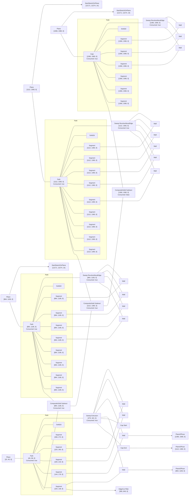

```mermaid
flowchart LR
  subgraph path7 [Path]
    7["Path<br>[1112, 1360, 0]<br>Consumed: true"]
      %% [ProgramBodyItem { index: 2 }, ExpressionStatementExpr, PipeBodyItem { index: 2 }]
    19["Segment<br>[1112, 1360, 0]"]
      %% [ProgramBodyItem { index: 2 }, ExpressionStatementExpr, PipeBodyItem { index: 2 }]
    20["Segment<br>[1112, 1360, 0]"]
      %% [ProgramBodyItem { index: 2 }, ExpressionStatementExpr, PipeBodyItem { index: 2 }]
    21["Segment<br>[1112, 1360, 0]"]
      %% [ProgramBodyItem { index: 2 }, ExpressionStatementExpr, PipeBodyItem { index: 2 }]
    22["Segment<br>[1112, 1360, 0]"]
      %% [ProgramBodyItem { index: 2 }, ExpressionStatementExpr, PipeBodyItem { index: 2 }]
    23["Segment<br>[1112, 1360, 0]"]
      %% [ProgramBodyItem { index: 2 }, ExpressionStatementExpr, PipeBodyItem { index: 2 }]
    24["Segment<br>[1112, 1360, 0]"]
      %% [ProgramBodyItem { index: 2 }, ExpressionStatementExpr, PipeBodyItem { index: 2 }]
    25["Segment<br>[1112, 1360, 0]"]
      %% [ProgramBodyItem { index: 2 }, ExpressionStatementExpr, PipeBodyItem { index: 2 }]
    26["Segment<br>[1112, 1360, 0]"]
      %% [ProgramBodyItem { index: 2 }, ExpressionStatementExpr, PipeBodyItem { index: 2 }]
    27["Segment<br>[1112, 1360, 0]"]
      %% [ProgramBodyItem { index: 2 }, ExpressionStatementExpr, PipeBodyItem { index: 2 }]
    46[Solid2d]
  end
  subgraph path8 [Path]
    8["Path<br>[1366, 1580, 0]<br>Consumed: true"]
      %% [ProgramBodyItem { index: 2 }, ExpressionStatementExpr, PipeBodyItem { index: 3 }]
    28["Segment<br>[1366, 1580, 0]"]
      %% [ProgramBodyItem { index: 2 }, ExpressionStatementExpr, PipeBodyItem { index: 3 }]
    29["Segment<br>[1366, 1580, 0]"]
      %% [ProgramBodyItem { index: 2 }, ExpressionStatementExpr, PipeBodyItem { index: 3 }]
    30["Segment<br>[1366, 1580, 0]"]
      %% [ProgramBodyItem { index: 2 }, ExpressionStatementExpr, PipeBodyItem { index: 3 }]
    31["Segment<br>[1366, 1580, 0]"]
      %% [ProgramBodyItem { index: 2 }, ExpressionStatementExpr, PipeBodyItem { index: 3 }]
    32["Segment<br>[1366, 1580, 0]"]
      %% [ProgramBodyItem { index: 2 }, ExpressionStatementExpr, PipeBodyItem { index: 3 }]
    33["Segment<br>[1366, 1580, 0]"]
      %% [ProgramBodyItem { index: 2 }, ExpressionStatementExpr, PipeBodyItem { index: 3 }]
    47[Solid2d]
  end
  subgraph path9 [Path]
    9["Path<br>[46, 98, 0]<br>Consumed: true"]
      %% [ProgramBodyItem { index: 1 }, VariableDeclarationDeclaration, VariableDeclarationInit, PipeBodyItem { index: 1 }]
    18["Segment<br>[104, 138, 0]"]
      %% [ProgramBodyItem { index: 1 }, VariableDeclarationDeclaration, VariableDeclarationInit, PipeBodyItem { index: 2 }]
    34["Segment<br>[144, 178, 0]"]
      %% [ProgramBodyItem { index: 1 }, VariableDeclarationDeclaration, VariableDeclarationInit, PipeBodyItem { index: 3 }]
    35["Segment<br>[184, 219, 0]"]
      %% [ProgramBodyItem { index: 1 }, VariableDeclarationDeclaration, VariableDeclarationInit, PipeBodyItem { index: 4 }]
    36["Segment<br>[225, 260, 0]"]
      %% [ProgramBodyItem { index: 1 }, VariableDeclarationDeclaration, VariableDeclarationInit, PipeBodyItem { index: 5 }]
    37["Segment<br>[266, 273, 0]"]
      %% [ProgramBodyItem { index: 1 }, VariableDeclarationDeclaration, VariableDeclarationInit, PipeBodyItem { index: 6 }]
    48[Solid2d]
  end
  subgraph path10 [Path]
    10["Path<br>[864, 1106, 0]<br>Consumed: true"]
      %% [ProgramBodyItem { index: 2 }, ExpressionStatementExpr, PipeBodyItem { index: 1 }]
    38["Segment<br>[864, 1106, 0]"]
      %% [ProgramBodyItem { index: 2 }, ExpressionStatementExpr, PipeBodyItem { index: 1 }]
    39["Segment<br>[864, 1106, 0]"]
      %% [ProgramBodyItem { index: 2 }, ExpressionStatementExpr, PipeBodyItem { index: 1 }]
    40["Segment<br>[864, 1106, 0]"]
      %% [ProgramBodyItem { index: 2 }, ExpressionStatementExpr, PipeBodyItem { index: 1 }]
    41["Segment<br>[864, 1106, 0]"]
      %% [ProgramBodyItem { index: 2 }, ExpressionStatementExpr, PipeBodyItem { index: 1 }]
    42["Segment<br>[864, 1106, 0]"]
      %% [ProgramBodyItem { index: 2 }, ExpressionStatementExpr, PipeBodyItem { index: 1 }]
    43["Segment<br>[864, 1106, 0]"]
      %% [ProgramBodyItem { index: 2 }, ExpressionStatementExpr, PipeBodyItem { index: 1 }]
    44["Segment<br>[864, 1106, 0]"]
      %% [ProgramBodyItem { index: 2 }, ExpressionStatementExpr, PipeBodyItem { index: 1 }]
    45["Segment<br>[864, 1106, 0]"]
      %% [ProgramBodyItem { index: 2 }, ExpressionStatementExpr, PipeBodyItem { index: 1 }]
    49[Solid2d]
  end
  1["Cap End"]
    %% face_code_ref=Missing NodePath
  2["Cap Start"]
    %% face_code_ref=Missing NodePath
  3["CompositeSolid Subtract<br>[1112, 1360, 0]<br>Consumed: true"]
    %% [ProgramBodyItem { index: 2 }, ExpressionStatementExpr, PipeBodyItem { index: 2 }]
  4["CompositeSolid Subtract<br>[1366, 1580, 0]<br>Consumed: false"]
    %% [ProgramBodyItem { index: 2 }, ExpressionStatementExpr, PipeBodyItem { index: 3 }]
  5["CompositeSolid Subtract<br>[864, 1106, 0]<br>Consumed: true"]
    %% [ProgramBodyItem { index: 2 }, ExpressionStatementExpr, PipeBodyItem { index: 1 }]
  6["EdgeCut Fillet<br>[380, 849, 0]"]
    %% [ProgramBodyItem { index: 1 }, VariableDeclarationDeclaration, VariableDeclarationInit, PipeBodyItem { index: 9 }]
  11["Plane<br>[1112, 1360, 0]"]
    %% [ProgramBodyItem { index: 2 }, ExpressionStatementExpr, PipeBodyItem { index: 2 }]
  12["Plane<br>[1366, 1580, 0]"]
    %% [ProgramBodyItem { index: 2 }, ExpressionStatementExpr, PipeBodyItem { index: 3 }]
  13["Plane<br>[23, 40, 0]"]
    %% [ProgramBodyItem { index: 1 }, VariableDeclarationDeclaration, VariableDeclarationInit, PipeBodyItem { index: 0 }]
  14["Plane<br>[864, 1106, 0]"]
    %% [ProgramBodyItem { index: 2 }, ExpressionStatementExpr, PipeBodyItem { index: 1 }]
  15["PlaneOfFace<br>[1112, 1360, 0]"]
    %% [ProgramBodyItem { index: 2 }, ExpressionStatementExpr, PipeBodyItem { index: 2 }]
  16["PlaneOfFace<br>[1366, 1580, 0]"]
    %% [ProgramBodyItem { index: 2 }, ExpressionStatementExpr, PipeBodyItem { index: 3 }]
  17["PlaneOfFace<br>[864, 1106, 0]"]
    %% [ProgramBodyItem { index: 2 }, ExpressionStatementExpr, PipeBodyItem { index: 1 }]
  50["StartSketchOnPlane<br>[12171, 12274, 14]"]
    %% [ProgramBodyItem { index: 13 }, VariableDeclarationDeclaration, VariableDeclarationInit, FunctionExpressionBody, FunctionExpressionBodyItem { index: 0 }, VariableDeclarationDeclaration, VariableDeclarationInit]
  51["StartSketchOnPlane<br>[12171, 12274, 14]"]
    %% [ProgramBodyItem { index: 13 }, VariableDeclarationDeclaration, VariableDeclarationInit, FunctionExpressionBody, FunctionExpressionBodyItem { index: 0 }, VariableDeclarationDeclaration, VariableDeclarationInit]
  52["StartSketchOnPlane<br>[12171, 12274, 14]"]
    %% [ProgramBodyItem { index: 13 }, VariableDeclarationDeclaration, VariableDeclarationInit, FunctionExpressionBody, FunctionExpressionBodyItem { index: 0 }, VariableDeclarationDeclaration, VariableDeclarationInit]
  53["Sweep Extrusion<br>[279, 322, 0]<br>Consumed: true"]
    %% [ProgramBodyItem { index: 1 }, VariableDeclarationDeclaration, VariableDeclarationInit, PipeBodyItem { index: 7 }]
  54["Sweep RevolveAboutEdge<br>[1112, 1360, 0]<br>Consumed: true"]
    %% [ProgramBodyItem { index: 2 }, ExpressionStatementExpr, PipeBodyItem { index: 2 }]
  55["Sweep RevolveAboutEdge<br>[1366, 1580, 0]<br>Consumed: true"]
    %% [ProgramBodyItem { index: 2 }, ExpressionStatementExpr, PipeBodyItem { index: 3 }]
  56["Sweep RevolveAboutEdge<br>[864, 1106, 0]<br>Consumed: true"]
    %% [ProgramBodyItem { index: 2 }, ExpressionStatementExpr, PipeBodyItem { index: 1 }]
  57[Wall]
    %% face_code_ref=Missing NodePath
  58[Wall]
    %% face_code_ref=Missing NodePath
  59[Wall]
    %% face_code_ref=Missing NodePath
  60[Wall]
    %% face_code_ref=Missing NodePath
  61[Wall]
    %% face_code_ref=Missing NodePath
  62[Wall]
    %% face_code_ref=Missing NodePath
  63[Wall]
    %% face_code_ref=Missing NodePath
  64[Wall]
    %% face_code_ref=Missing NodePath
  65[Wall]
    %% face_code_ref=Missing NodePath
  66[Wall]
    %% face_code_ref=Missing NodePath
  67[Wall]
    %% face_code_ref=Missing NodePath
  68[Wall]
    %% face_code_ref=Missing NodePath
  69[Wall]
    %% face_code_ref=Missing NodePath
  70[Wall]
    %% face_code_ref=Missing NodePath
  71[Wall]
    %% face_code_ref=Missing NodePath
  72[Wall]
    %% face_code_ref=Missing NodePath
  1 <--x 15
  53 --- 1
  53 --- 2
  3 --- 4
  5 --- 3
  7 --- 3
  8 --- 4
  9 --- 5
  10 --- 5
  18 <--x 6
  11 --- 7
  7 --- 19
  7 --- 20
  7 --- 21
  7 --- 22
  7 --- 23
  7 --- 24
  7 --- 25
  7 --- 26
  7 --- 27
  7 --- 46
  7 ---- 54
  12 --- 8
  8 --- 28
  8 --- 29
  8 --- 30
  8 --- 31
  8 --- 32
  8 --- 33
  8 --- 47
  8 ---- 55
  13 --- 9
  9 --- 18
  9 --- 34
  9 --- 35
  9 --- 36
  9 --- 37
  9 --- 48
  9 ---- 53
  14 --- 10
  10 --- 38
  10 --- 39
  10 --- 40
  10 --- 41
  10 --- 42
  10 --- 43
  10 --- 44
  10 --- 45
  10 --- 49
  10 ---- 56
  11 <--x 50
  12 <--x 51
  14 <--x 52
  66 x--> 16
  57 x--> 17
  18 --- 57
  23 --- 58
  24 --- 59
  25 --- 60
  26 --- 61
  27 --- 62
  31 --- 63
  32 --- 64
  33 --- 65
  34 --- 66
  35 --- 67
  36 --- 68
  42 --- 69
  43 --- 70
  44 --- 71
  45 --- 72
  53 --- 57
  53 --- 66
  53 --- 67
  53 --- 68
  54 --- 58
  54 --- 59
  54 --- 60
  54 --- 61
  54 --- 62
  55 --- 63
  55 --- 64
  55 --- 65
  56 --- 69
  56 --- 70
  56 --- 71
  56 --- 72
```
