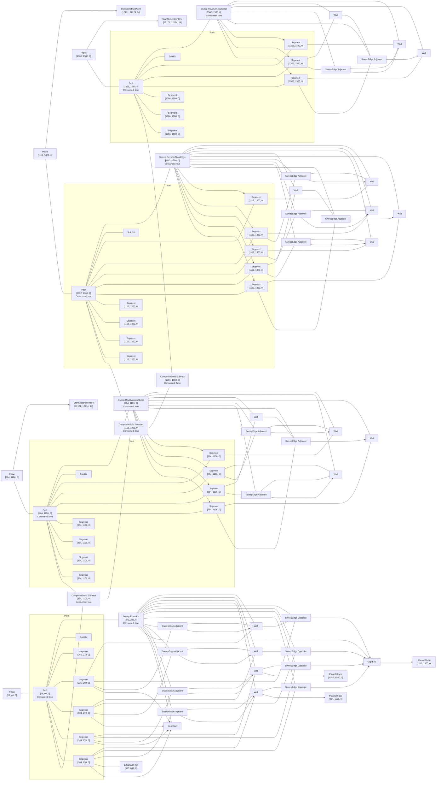

```mermaid
flowchart LR
  subgraph path7 [Path]
    7["Path<br>[1112, 1360, 0]<br>Consumed: true"]
      %% [ProgramBodyItem { index: 2 }, ExpressionStatementExpr, PipeBodyItem { index: 2 }]
    19["Segment<br>[1112, 1360, 0]"]
      %% [ProgramBodyItem { index: 2 }, ExpressionStatementExpr, PipeBodyItem { index: 2 }]
    20["Segment<br>[1112, 1360, 0]"]
      %% [ProgramBodyItem { index: 2 }, ExpressionStatementExpr, PipeBodyItem { index: 2 }]
    21["Segment<br>[1112, 1360, 0]"]
      %% [ProgramBodyItem { index: 2 }, ExpressionStatementExpr, PipeBodyItem { index: 2 }]
    22["Segment<br>[1112, 1360, 0]"]
      %% [ProgramBodyItem { index: 2 }, ExpressionStatementExpr, PipeBodyItem { index: 2 }]
    23["Segment<br>[1112, 1360, 0]"]
      %% [ProgramBodyItem { index: 2 }, ExpressionStatementExpr, PipeBodyItem { index: 2 }]
    24["Segment<br>[1112, 1360, 0]"]
      %% [ProgramBodyItem { index: 2 }, ExpressionStatementExpr, PipeBodyItem { index: 2 }]
    25["Segment<br>[1112, 1360, 0]"]
      %% [ProgramBodyItem { index: 2 }, ExpressionStatementExpr, PipeBodyItem { index: 2 }]
    26["Segment<br>[1112, 1360, 0]"]
      %% [ProgramBodyItem { index: 2 }, ExpressionStatementExpr, PipeBodyItem { index: 2 }]
    27["Segment<br>[1112, 1360, 0]"]
      %% [ProgramBodyItem { index: 2 }, ExpressionStatementExpr, PipeBodyItem { index: 2 }]
    46[Solid2d]
  end
  subgraph path8 [Path]
    8["Path<br>[1366, 1580, 0]<br>Consumed: true"]
      %% [ProgramBodyItem { index: 2 }, ExpressionStatementExpr, PipeBodyItem { index: 3 }]
    28["Segment<br>[1366, 1580, 0]"]
      %% [ProgramBodyItem { index: 2 }, ExpressionStatementExpr, PipeBodyItem { index: 3 }]
    29["Segment<br>[1366, 1580, 0]"]
      %% [ProgramBodyItem { index: 2 }, ExpressionStatementExpr, PipeBodyItem { index: 3 }]
    30["Segment<br>[1366, 1580, 0]"]
      %% [ProgramBodyItem { index: 2 }, ExpressionStatementExpr, PipeBodyItem { index: 3 }]
    31["Segment<br>[1366, 1580, 0]"]
      %% [ProgramBodyItem { index: 2 }, ExpressionStatementExpr, PipeBodyItem { index: 3 }]
    32["Segment<br>[1366, 1580, 0]"]
      %% [ProgramBodyItem { index: 2 }, ExpressionStatementExpr, PipeBodyItem { index: 3 }]
    33["Segment<br>[1366, 1580, 0]"]
      %% [ProgramBodyItem { index: 2 }, ExpressionStatementExpr, PipeBodyItem { index: 3 }]
    47[Solid2d]
  end
  subgraph path9 [Path]
    9["Path<br>[46, 98, 0]<br>Consumed: true"]
      %% [ProgramBodyItem { index: 1 }, VariableDeclarationDeclaration, VariableDeclarationInit, PipeBodyItem { index: 1 }]
    18["Segment<br>[104, 138, 0]"]
      %% [ProgramBodyItem { index: 1 }, VariableDeclarationDeclaration, VariableDeclarationInit, PipeBodyItem { index: 2 }]
    34["Segment<br>[144, 178, 0]"]
      %% [ProgramBodyItem { index: 1 }, VariableDeclarationDeclaration, VariableDeclarationInit, PipeBodyItem { index: 3 }]
    35["Segment<br>[184, 219, 0]"]
      %% [ProgramBodyItem { index: 1 }, VariableDeclarationDeclaration, VariableDeclarationInit, PipeBodyItem { index: 4 }]
    36["Segment<br>[225, 260, 0]"]
      %% [ProgramBodyItem { index: 1 }, VariableDeclarationDeclaration, VariableDeclarationInit, PipeBodyItem { index: 5 }]
    37["Segment<br>[266, 273, 0]"]
      %% [ProgramBodyItem { index: 1 }, VariableDeclarationDeclaration, VariableDeclarationInit, PipeBodyItem { index: 6 }]
    48[Solid2d]
  end
  subgraph path10 [Path]
    10["Path<br>[864, 1106, 0]<br>Consumed: true"]
      %% [ProgramBodyItem { index: 2 }, ExpressionStatementExpr, PipeBodyItem { index: 1 }]
    38["Segment<br>[864, 1106, 0]"]
      %% [ProgramBodyItem { index: 2 }, ExpressionStatementExpr, PipeBodyItem { index: 1 }]
    39["Segment<br>[864, 1106, 0]"]
      %% [ProgramBodyItem { index: 2 }, ExpressionStatementExpr, PipeBodyItem { index: 1 }]
    40["Segment<br>[864, 1106, 0]"]
      %% [ProgramBodyItem { index: 2 }, ExpressionStatementExpr, PipeBodyItem { index: 1 }]
    41["Segment<br>[864, 1106, 0]"]
      %% [ProgramBodyItem { index: 2 }, ExpressionStatementExpr, PipeBodyItem { index: 1 }]
    42["Segment<br>[864, 1106, 0]"]
      %% [ProgramBodyItem { index: 2 }, ExpressionStatementExpr, PipeBodyItem { index: 1 }]
    43["Segment<br>[864, 1106, 0]"]
      %% [ProgramBodyItem { index: 2 }, ExpressionStatementExpr, PipeBodyItem { index: 1 }]
    44["Segment<br>[864, 1106, 0]"]
      %% [ProgramBodyItem { index: 2 }, ExpressionStatementExpr, PipeBodyItem { index: 1 }]
    45["Segment<br>[864, 1106, 0]"]
      %% [ProgramBodyItem { index: 2 }, ExpressionStatementExpr, PipeBodyItem { index: 1 }]
    49[Solid2d]
  end
  1["Cap End"]
    %% face_code_ref=Missing NodePath
  2["Cap Start"]
    %% face_code_ref=Missing NodePath
  3["CompositeSolid Subtract<br>[1112, 1360, 0]<br>Consumed: true"]
    %% [ProgramBodyItem { index: 2 }, ExpressionStatementExpr, PipeBodyItem { index: 2 }]
  4["CompositeSolid Subtract<br>[1366, 1580, 0]<br>Consumed: false"]
    %% [ProgramBodyItem { index: 2 }, ExpressionStatementExpr, PipeBodyItem { index: 3 }]
  5["CompositeSolid Subtract<br>[864, 1106, 0]<br>Consumed: true"]
    %% [ProgramBodyItem { index: 2 }, ExpressionStatementExpr, PipeBodyItem { index: 1 }]
  6["EdgeCut Fillet<br>[380, 849, 0]"]
    %% [ProgramBodyItem { index: 1 }, VariableDeclarationDeclaration, VariableDeclarationInit, PipeBodyItem { index: 9 }]
  11["Plane<br>[1112, 1360, 0]"]
    %% [ProgramBodyItem { index: 2 }, ExpressionStatementExpr, PipeBodyItem { index: 2 }]
  12["Plane<br>[1366, 1580, 0]"]
    %% [ProgramBodyItem { index: 2 }, ExpressionStatementExpr, PipeBodyItem { index: 3 }]
  13["Plane<br>[23, 40, 0]"]
    %% [ProgramBodyItem { index: 1 }, VariableDeclarationDeclaration, VariableDeclarationInit, PipeBodyItem { index: 0 }]
  14["Plane<br>[864, 1106, 0]"]
    %% [ProgramBodyItem { index: 2 }, ExpressionStatementExpr, PipeBodyItem { index: 1 }]
  15["PlaneOfFace<br>[1112, 1360, 0]"]
    %% [ProgramBodyItem { index: 2 }, ExpressionStatementExpr, PipeBodyItem { index: 2 }]
  16["PlaneOfFace<br>[1366, 1580, 0]"]
    %% [ProgramBodyItem { index: 2 }, ExpressionStatementExpr, PipeBodyItem { index: 3 }]
  17["PlaneOfFace<br>[864, 1106, 0]"]
    %% [ProgramBodyItem { index: 2 }, ExpressionStatementExpr, PipeBodyItem { index: 1 }]
  50["StartSketchOnPlane<br>[12171, 12274, 14]"]
    %% [ProgramBodyItem { index: 13 }, VariableDeclarationDeclaration, VariableDeclarationInit, FunctionExpressionBody, FunctionExpressionBodyItem { index: 0 }, VariableDeclarationDeclaration, VariableDeclarationInit]
  51["StartSketchOnPlane<br>[12171, 12274, 14]"]
    %% [ProgramBodyItem { index: 13 }, VariableDeclarationDeclaration, VariableDeclarationInit, FunctionExpressionBody, FunctionExpressionBodyItem { index: 0 }, VariableDeclarationDeclaration, VariableDeclarationInit]
  52["StartSketchOnPlane<br>[12171, 12274, 14]"]
    %% [ProgramBodyItem { index: 13 }, VariableDeclarationDeclaration, VariableDeclarationInit, FunctionExpressionBody, FunctionExpressionBodyItem { index: 0 }, VariableDeclarationDeclaration, VariableDeclarationInit]
  53["Sweep Extrusion<br>[279, 322, 0]<br>Consumed: true"]
    %% [ProgramBodyItem { index: 1 }, VariableDeclarationDeclaration, VariableDeclarationInit, PipeBodyItem { index: 7 }]
  54["Sweep RevolveAboutEdge<br>[1112, 1360, 0]<br>Consumed: true"]
    %% [ProgramBodyItem { index: 2 }, ExpressionStatementExpr, PipeBodyItem { index: 2 }]
  55["Sweep RevolveAboutEdge<br>[1366, 1580, 0]<br>Consumed: true"]
    %% [ProgramBodyItem { index: 2 }, ExpressionStatementExpr, PipeBodyItem { index: 3 }]
  56["Sweep RevolveAboutEdge<br>[864, 1106, 0]<br>Consumed: true"]
    %% [ProgramBodyItem { index: 2 }, ExpressionStatementExpr, PipeBodyItem { index: 1 }]
  57["SweepEdge Adjacent"]
  58["SweepEdge Adjacent"]
  59["SweepEdge Adjacent"]
  60["SweepEdge Adjacent"]
  61["SweepEdge Adjacent"]
  62["SweepEdge Adjacent"]
  63["SweepEdge Adjacent"]
  64["SweepEdge Adjacent"]
  65["SweepEdge Adjacent"]
  66["SweepEdge Adjacent"]
  67["SweepEdge Adjacent"]
  68["SweepEdge Adjacent"]
  69["SweepEdge Adjacent"]
  70["SweepEdge Opposite"]
  71["SweepEdge Opposite"]
  72["SweepEdge Opposite"]
  73["SweepEdge Opposite"]
  74[Wall]
    %% face_code_ref=Missing NodePath
  75[Wall]
    %% face_code_ref=Missing NodePath
  76[Wall]
    %% face_code_ref=Missing NodePath
  77[Wall]
    %% face_code_ref=Missing NodePath
  78[Wall]
    %% face_code_ref=Missing NodePath
  79[Wall]
    %% face_code_ref=Missing NodePath
  80[Wall]
    %% face_code_ref=Missing NodePath
  81[Wall]
    %% face_code_ref=Missing NodePath
  82[Wall]
    %% face_code_ref=Missing NodePath
  83[Wall]
    %% face_code_ref=Missing NodePath
  84[Wall]
    %% face_code_ref=Missing NodePath
  85[Wall]
    %% face_code_ref=Missing NodePath
  86[Wall]
    %% face_code_ref=Missing NodePath
  87[Wall]
    %% face_code_ref=Missing NodePath
  88[Wall]
    %% face_code_ref=Missing NodePath
  89[Wall]
    %% face_code_ref=Missing NodePath
  1 <--x 15
  53 --- 1
  70 <--x 1
  71 <--x 1
  72 <--x 1
  73 <--x 1
  18 <--x 2
  34 <--x 2
  35 <--x 2
  36 <--x 2
  53 --- 2
  3 --- 4
  5 --- 3
  7 --- 3
  8 --- 4
  9 --- 5
  10 --- 5
  18 --- 6
  11 --- 7
  7 --- 19
  7 --- 20
  7 --- 21
  7 --- 22
  7 --- 23
  7 --- 24
  7 --- 25
  7 --- 26
  7 --- 27
  7 --- 46
  7 ---- 54
  12 --- 8
  8 --- 28
  8 --- 29
  8 --- 30
  8 --- 31
  8 --- 32
  8 --- 33
  8 --- 47
  8 ---- 55
  13 --- 9
  9 --- 18
  9 --- 34
  9 --- 35
  9 --- 36
  9 --- 37
  9 --- 48
  9 ---- 53
  14 --- 10
  10 --- 38
  10 --- 39
  10 --- 40
  10 --- 41
  10 --- 42
  10 --- 43
  10 --- 44
  10 --- 45
  10 --- 49
  10 ---- 56
  11 <--x 50
  12 <--x 51
  14 <--x 52
  83 x--> 16
  74 x--> 17
  18 --- 57
  18 --- 70
  18 --- 74
  54 <--x 23
  23 --- 58
  23 --- 75
  54 <--x 24
  24 --- 59
  24 --- 76
  54 <--x 25
  25 --- 60
  25 --- 77
  54 <--x 26
  26 --- 61
  26 --- 78
  54 <--x 27
  27 --- 79
  55 <--x 31
  31 --- 62
  31 --- 80
  55 <--x 32
  32 --- 63
  32 --- 81
  55 <--x 33
  33 --- 82
  34 --- 64
  34 --- 71
  34 --- 83
  35 --- 65
  35 --- 72
  35 --- 84
  36 --- 66
  36 --- 73
  36 --- 85
  56 <--x 42
  42 --- 67
  42 --- 86
  56 <--x 43
  43 --- 68
  43 --- 87
  56 <--x 44
  44 --- 69
  44 --- 88
  56 <--x 45
  45 --- 89
  53 --- 57
  53 --- 64
  53 --- 65
  53 --- 66
  53 --- 70
  53 --- 71
  53 --- 72
  53 --- 73
  53 --- 74
  53 --- 83
  53 --- 84
  53 --- 85
  54 --- 58
  54 --- 59
  54 --- 60
  54 --- 61
  54 --- 75
  54 --- 76
  54 --- 77
  54 --- 78
  54 --- 79
  55 --- 62
  55 --- 63
  55 --- 80
  55 --- 81
  55 --- 82
  56 --- 67
  56 --- 68
  56 --- 69
  56 --- 86
  56 --- 87
  56 --- 88
  56 --- 89
  74 --- 57
  57 x--> 74
  58 x--> 75
  76 --- 58
  77 --- 59
  59 x--> 77
  78 --- 60
  60 x--> 78
  61 x--> 79
  79 --- 61
  62 x--> 80
  81 --- 62
  63 x--> 82
  82 --- 63
  83 --- 64
  64 x--> 83
  84 --- 65
  65 x--> 84
  66 x--> 85
  85 --- 66
  67 x--> 86
  87 --- 67
  88 --- 68
  68 x--> 88
  69 x--> 89
  89 --- 69
  74 --- 70
  83 --- 71
  84 --- 72
  85 --- 73
```
