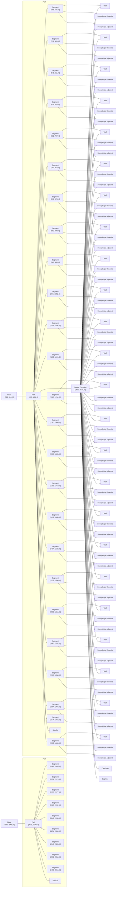

```mermaid
flowchart LR
  subgraph path2 [Path]
    2["Path<br>[422, 459, 0]"]
    3["Segment<br>[465, 505, 0]"]
    4["Segment<br>[511, 569, 0]"]
    5["Segment<br>[575, 611, 0]"]
    6["Segment<br>[617, 676, 0]"]
    7["Segment<br>[682, 747, 0]"]
    8["Segment<br>[753, 812, 0]"]
    9["Segment<br>[818, 876, 0]"]
    10["Segment<br>[882, 940, 0]"]
    11["Segment<br>[946, 988, 0]"]
    12["Segment<br>[994, 1052, 0]"]
    13["Segment<br>[1058, 1094, 0]"]
    14["Segment<br>[1100, 1159, 0]"]
    15["Segment<br>[1165, 1234, 0]"]
    16["Segment<br>[1240, 1300, 0]"]
    17["Segment<br>[1306, 1345, 0]"]
    18["Segment<br>[1351, 1410, 0]"]
    19["Segment<br>[1416, 1458, 0]"]
    20["Segment<br>[1464, 1523, 0]"]
    21["Segment<br>[1529, 1590, 0]"]
    22["Segment<br>[1596, 1656, 0]"]
    23["Segment<br>[1662, 1792, 0]"]
    24["Segment<br>[1798, 1858, 0]"]
    25["Segment<br>[1864, 1903, 0]"]
    26["Segment<br>[1909, 1968, 0]"]
    27["Segment<br>[1974, 1982, 0]"]
    28[Solid2d]
  end
  subgraph path30 [Path]
    30["Path<br>[2015, 2040, 0]"]
    31["Segment<br>[2046, 2065, 0]"]
    32["Segment<br>[2071, 2129, 0]"]
    33["Segment<br>[2135, 2177, 0]"]
    34["Segment<br>[2183, 2242, 0]"]
    35["Segment<br>[2248, 2268, 0]"]
    36["Segment<br>[2274, 2334, 0]"]
    37["Segment<br>[2340, 2385, 0]"]
    38["Segment<br>[2391, 2450, 0]"]
    39["Segment<br>[2456, 2464, 0]"]
    40[Solid2d]
  end
  1["Plane<br>[399, 416, 0]"]
  29["Plane<br>[1992, 2009, 0]"]
  41["Sweep Extrusion<br>[2510, 2531, 0]"]
  42[Wall]
  43[Wall]
  44[Wall]
  45[Wall]
  46[Wall]
  47[Wall]
  48[Wall]
  49[Wall]
  50[Wall]
  51[Wall]
  52[Wall]
  53[Wall]
  54[Wall]
  55[Wall]
  56[Wall]
  57[Wall]
  58[Wall]
  59[Wall]
  60[Wall]
  61[Wall]
  62[Wall]
  63[Wall]
  64[Wall]
  65[Wall]
  66["Cap Start"]
  67["Cap End"]
  68["SweepEdge Opposite"]
  69["SweepEdge Adjacent"]
  70["SweepEdge Opposite"]
  71["SweepEdge Adjacent"]
  72["SweepEdge Opposite"]
  73["SweepEdge Adjacent"]
  74["SweepEdge Opposite"]
  75["SweepEdge Adjacent"]
  76["SweepEdge Opposite"]
  77["SweepEdge Adjacent"]
  78["SweepEdge Opposite"]
  79["SweepEdge Adjacent"]
  80["SweepEdge Opposite"]
  81["SweepEdge Adjacent"]
  82["SweepEdge Opposite"]
  83["SweepEdge Adjacent"]
  84["SweepEdge Opposite"]
  85["SweepEdge Adjacent"]
  86["SweepEdge Opposite"]
  87["SweepEdge Adjacent"]
  88["SweepEdge Opposite"]
  89["SweepEdge Adjacent"]
  90["SweepEdge Opposite"]
  91["SweepEdge Adjacent"]
  92["SweepEdge Opposite"]
  93["SweepEdge Adjacent"]
  94["SweepEdge Opposite"]
  95["SweepEdge Adjacent"]
  96["SweepEdge Opposite"]
  97["SweepEdge Adjacent"]
  98["SweepEdge Opposite"]
  99["SweepEdge Adjacent"]
  100["SweepEdge Opposite"]
  101["SweepEdge Adjacent"]
  102["SweepEdge Opposite"]
  103["SweepEdge Adjacent"]
  104["SweepEdge Opposite"]
  105["SweepEdge Adjacent"]
  106["SweepEdge Opposite"]
  107["SweepEdge Adjacent"]
  108["SweepEdge Opposite"]
  109["SweepEdge Adjacent"]
  110["SweepEdge Opposite"]
  111["SweepEdge Adjacent"]
  112["SweepEdge Opposite"]
  113["SweepEdge Adjacent"]
  114["SweepEdge Opposite"]
  115["SweepEdge Adjacent"]
  1 --- 2
  2 --- 3
  2 --- 4
  2 --- 5
  2 --- 6
  2 --- 7
  2 --- 8
  2 --- 9
  2 --- 10
  2 --- 11
  2 --- 12
  2 --- 13
  2 --- 14
  2 --- 15
  2 --- 16
  2 --- 17
  2 --- 18
  2 --- 19
  2 --- 20
  2 --- 21
  2 --- 22
  2 --- 23
  2 --- 24
  2 --- 25
  2 --- 26
  2 --- 27
  2 ---- 41
  2 --- 28
  3 --- 42
  3 --- 68
  3 --- 69
  4 --- 43
  4 --- 70
  4 --- 71
  5 --- 44
  5 --- 72
  5 --- 73
  6 --- 45
  6 --- 74
  6 --- 75
  7 --- 46
  7 --- 76
  7 --- 77
  8 --- 47
  8 --- 78
  8 --- 79
  9 --- 48
  9 --- 80
  9 --- 81
  10 --- 49
  10 --- 82
  10 --- 83
  11 --- 50
  11 --- 84
  11 --- 85
  12 --- 51
  12 --- 86
  12 --- 87
  13 --- 52
  13 --- 88
  13 --- 89
  14 --- 53
  14 --- 90
  14 --- 91
  15 --- 54
  15 --- 92
  15 --- 93
  16 --- 55
  16 --- 94
  16 --- 95
  17 --- 56
  17 --- 96
  17 --- 97
  18 --- 57
  18 --- 98
  18 --- 99
  19 --- 58
  19 --- 100
  19 --- 101
  20 --- 59
  20 --- 102
  20 --- 103
  21 --- 60
  21 --- 104
  21 --- 105
  22 --- 61
  22 --- 106
  22 --- 107
  23 --- 62
  23 --- 108
  23 --- 109
  24 --- 63
  24 --- 110
  24 --- 111
  25 --- 64
  25 --- 112
  25 --- 113
  26 --- 65
  26 --- 114
  26 --- 115
  29 --- 30
  30 --- 31
  30 --- 32
  30 --- 33
  30 --- 34
  30 --- 35
  30 --- 36
  30 --- 37
  30 --- 38
  30 --- 39
  30 --- 40
  41 --- 42
  41 --- 43
  41 --- 44
  41 --- 45
  41 --- 46
  41 --- 47
  41 --- 48
  41 --- 49
  41 --- 50
  41 --- 51
  41 --- 52
  41 --- 53
  41 --- 54
  41 --- 55
  41 --- 56
  41 --- 57
  41 --- 58
  41 --- 59
  41 --- 60
  41 --- 61
  41 --- 62
  41 --- 63
  41 --- 64
  41 --- 65
  41 --- 66
  41 --- 67
  41 --- 68
  41 --- 69
  41 --- 70
  41 --- 71
  41 --- 72
  41 --- 73
  41 --- 74
  41 --- 75
  41 --- 76
  41 --- 77
  41 --- 78
  41 --- 79
  41 --- 80
  41 --- 81
  41 --- 82
  41 --- 83
  41 --- 84
  41 --- 85
  41 --- 86
  41 --- 87
  41 --- 88
  41 --- 89
  41 --- 90
  41 --- 91
  41 --- 92
  41 --- 93
  41 --- 94
  41 --- 95
  41 --- 96
  41 --- 97
  41 --- 98
  41 --- 99
  41 --- 100
  41 --- 101
  41 --- 102
  41 --- 103
  41 --- 104
  41 --- 105
  41 --- 106
  41 --- 107
  41 --- 108
  41 --- 109
  41 --- 110
  41 --- 111
  41 --- 112
  41 --- 113
  41 --- 114
  41 --- 115
```
