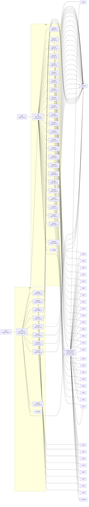

```mermaid
flowchart LR
  subgraph path2 [Path]
    2["Path<br>[422, 459, 0]<br>Consumed: true"]
      %% [ProgramBodyItem { index: 5 }, VariableDeclarationDeclaration, VariableDeclarationInit, PipeBodyItem { index: 1 }]
    3["Segment<br>[465, 505, 0]"]
      %% [ProgramBodyItem { index: 5 }, VariableDeclarationDeclaration, VariableDeclarationInit, PipeBodyItem { index: 2 }]
    4["Segment<br>[511, 562, 0]"]
      %% [ProgramBodyItem { index: 5 }, VariableDeclarationDeclaration, VariableDeclarationInit, PipeBodyItem { index: 3 }]
    5["Segment<br>[568, 604, 0]"]
      %% [ProgramBodyItem { index: 5 }, VariableDeclarationDeclaration, VariableDeclarationInit, PipeBodyItem { index: 4 }]
    6["Segment<br>[610, 662, 0]"]
      %% [ProgramBodyItem { index: 5 }, VariableDeclarationDeclaration, VariableDeclarationInit, PipeBodyItem { index: 5 }]
    7["Segment<br>[668, 733, 0]"]
      %% [ProgramBodyItem { index: 5 }, VariableDeclarationDeclaration, VariableDeclarationInit, PipeBodyItem { index: 6 }]
    8["Segment<br>[739, 791, 0]"]
      %% [ProgramBodyItem { index: 5 }, VariableDeclarationDeclaration, VariableDeclarationInit, PipeBodyItem { index: 7 }]
    9["Segment<br>[797, 855, 0]"]
      %% [ProgramBodyItem { index: 5 }, VariableDeclarationDeclaration, VariableDeclarationInit, PipeBodyItem { index: 8 }]
    10["Segment<br>[861, 912, 0]"]
      %% [ProgramBodyItem { index: 5 }, VariableDeclarationDeclaration, VariableDeclarationInit, PipeBodyItem { index: 9 }]
    11["Segment<br>[918, 960, 0]"]
      %% [ProgramBodyItem { index: 5 }, VariableDeclarationDeclaration, VariableDeclarationInit, PipeBodyItem { index: 10 }]
    12["Segment<br>[966, 1017, 0]"]
      %% [ProgramBodyItem { index: 5 }, VariableDeclarationDeclaration, VariableDeclarationInit, PipeBodyItem { index: 11 }]
    13["Segment<br>[1023, 1059, 0]"]
      %% [ProgramBodyItem { index: 5 }, VariableDeclarationDeclaration, VariableDeclarationInit, PipeBodyItem { index: 12 }]
    14["Segment<br>[1065, 1117, 0]"]
      %% [ProgramBodyItem { index: 5 }, VariableDeclarationDeclaration, VariableDeclarationInit, PipeBodyItem { index: 13 }]
    15["Segment<br>[1123, 1192, 0]"]
      %% [ProgramBodyItem { index: 5 }, VariableDeclarationDeclaration, VariableDeclarationInit, PipeBodyItem { index: 14 }]
    16["Segment<br>[1198, 1251, 0]"]
      %% [ProgramBodyItem { index: 5 }, VariableDeclarationDeclaration, VariableDeclarationInit, PipeBodyItem { index: 15 }]
    17["Segment<br>[1257, 1296, 0]"]
      %% [ProgramBodyItem { index: 5 }, VariableDeclarationDeclaration, VariableDeclarationInit, PipeBodyItem { index: 16 }]
    18["Segment<br>[1302, 1354, 0]"]
      %% [ProgramBodyItem { index: 5 }, VariableDeclarationDeclaration, VariableDeclarationInit, PipeBodyItem { index: 17 }]
    19["Segment<br>[1360, 1402, 0]"]
      %% [ProgramBodyItem { index: 5 }, VariableDeclarationDeclaration, VariableDeclarationInit, PipeBodyItem { index: 18 }]
    20["Segment<br>[1408, 1460, 0]"]
      %% [ProgramBodyItem { index: 5 }, VariableDeclarationDeclaration, VariableDeclarationInit, PipeBodyItem { index: 19 }]
    21["Segment<br>[1466, 1527, 0]"]
      %% [ProgramBodyItem { index: 5 }, VariableDeclarationDeclaration, VariableDeclarationInit, PipeBodyItem { index: 20 }]
    22["Segment<br>[1533, 1586, 0]"]
      %% [ProgramBodyItem { index: 5 }, VariableDeclarationDeclaration, VariableDeclarationInit, PipeBodyItem { index: 21 }]
    23["Segment<br>[1592, 1722, 0]"]
      %% [ProgramBodyItem { index: 5 }, VariableDeclarationDeclaration, VariableDeclarationInit, PipeBodyItem { index: 22 }]
    24["Segment<br>[1728, 1781, 0]"]
      %% [ProgramBodyItem { index: 5 }, VariableDeclarationDeclaration, VariableDeclarationInit, PipeBodyItem { index: 23 }]
    25["Segment<br>[1787, 1826, 0]"]
      %% [ProgramBodyItem { index: 5 }, VariableDeclarationDeclaration, VariableDeclarationInit, PipeBodyItem { index: 24 }]
    26["Segment<br>[1832, 1884, 0]"]
      %% [ProgramBodyItem { index: 5 }, VariableDeclarationDeclaration, VariableDeclarationInit, PipeBodyItem { index: 25 }]
    27["Segment<br>[1890, 1898, 0]"]
      %% [ProgramBodyItem { index: 5 }, VariableDeclarationDeclaration, VariableDeclarationInit, PipeBodyItem { index: 26 }]
    28[Solid2d]
  end
  subgraph path30 [Path]
    30["Path<br>[1931, 1956, 0]<br>Consumed: true"]
      %% [ProgramBodyItem { index: 6 }, VariableDeclarationDeclaration, VariableDeclarationInit, PipeBodyItem { index: 1 }]
    31["Segment<br>[1962, 1981, 0]"]
      %% [ProgramBodyItem { index: 6 }, VariableDeclarationDeclaration, VariableDeclarationInit, PipeBodyItem { index: 2 }]
    32["Segment<br>[1987, 2038, 0]"]
      %% [ProgramBodyItem { index: 6 }, VariableDeclarationDeclaration, VariableDeclarationInit, PipeBodyItem { index: 3 }]
    33["Segment<br>[2044, 2086, 0]"]
      %% [ProgramBodyItem { index: 6 }, VariableDeclarationDeclaration, VariableDeclarationInit, PipeBodyItem { index: 4 }]
    34["Segment<br>[2092, 2144, 0]"]
      %% [ProgramBodyItem { index: 6 }, VariableDeclarationDeclaration, VariableDeclarationInit, PipeBodyItem { index: 5 }]
    35["Segment<br>[2150, 2170, 0]"]
      %% [ProgramBodyItem { index: 6 }, VariableDeclarationDeclaration, VariableDeclarationInit, PipeBodyItem { index: 6 }]
    36["Segment<br>[2176, 2229, 0]"]
      %% [ProgramBodyItem { index: 6 }, VariableDeclarationDeclaration, VariableDeclarationInit, PipeBodyItem { index: 7 }]
    37["Segment<br>[2235, 2280, 0]"]
      %% [ProgramBodyItem { index: 6 }, VariableDeclarationDeclaration, VariableDeclarationInit, PipeBodyItem { index: 8 }]
    38["Segment<br>[2286, 2338, 0]"]
      %% [ProgramBodyItem { index: 6 }, VariableDeclarationDeclaration, VariableDeclarationInit, PipeBodyItem { index: 9 }]
    39["Segment<br>[2344, 2352, 0]"]
      %% [ProgramBodyItem { index: 6 }, VariableDeclarationDeclaration, VariableDeclarationInit, PipeBodyItem { index: 10 }]
    40[Solid2d]
  end
  1["Plane<br>[399, 416, 0]"]
    %% [ProgramBodyItem { index: 5 }, VariableDeclarationDeclaration, VariableDeclarationInit, PipeBodyItem { index: 0 }]
  29["Plane<br>[1908, 1925, 0]"]
    %% [ProgramBodyItem { index: 6 }, VariableDeclarationDeclaration, VariableDeclarationInit, PipeBodyItem { index: 0 }]
  41["Sweep Extrusion<br>[2408, 2429, 0]<br>Consumed: false"]
    %% [ProgramBodyItem { index: 7 }, VariableDeclarationDeclaration, VariableDeclarationInit, PipeBodyItem { index: 2 }]
  42[Wall]
    %% face_code_ref=Missing NodePath
  43[Wall]
    %% face_code_ref=Missing NodePath
  44[Wall]
    %% face_code_ref=Missing NodePath
  45[Wall]
    %% face_code_ref=Missing NodePath
  46[Wall]
    %% face_code_ref=Missing NodePath
  47[Wall]
    %% face_code_ref=Missing NodePath
  48[Wall]
    %% face_code_ref=Missing NodePath
  49[Wall]
    %% face_code_ref=Missing NodePath
  50[Wall]
    %% face_code_ref=Missing NodePath
  51[Wall]
    %% face_code_ref=Missing NodePath
  52[Wall]
    %% face_code_ref=Missing NodePath
  53[Wall]
    %% face_code_ref=Missing NodePath
  54[Wall]
    %% face_code_ref=Missing NodePath
  55[Wall]
    %% face_code_ref=Missing NodePath
  56[Wall]
    %% face_code_ref=Missing NodePath
  57[Wall]
    %% face_code_ref=Missing NodePath
  58[Wall]
    %% face_code_ref=Missing NodePath
  59[Wall]
    %% face_code_ref=Missing NodePath
  60[Wall]
    %% face_code_ref=Missing NodePath
  61[Wall]
    %% face_code_ref=Missing NodePath
  62[Wall]
    %% face_code_ref=Missing NodePath
  63[Wall]
    %% face_code_ref=Missing NodePath
  64[Wall]
    %% face_code_ref=Missing NodePath
  65[Wall]
    %% face_code_ref=Missing NodePath
  66[Wall]
    %% face_code_ref=Missing NodePath
  67[Wall]
    %% face_code_ref=Missing NodePath
  68[Wall]
    %% face_code_ref=Missing NodePath
  69[Wall]
    %% face_code_ref=Missing NodePath
  70[Wall]
    %% face_code_ref=Missing NodePath
  71[Wall]
    %% face_code_ref=Missing NodePath
  72[Wall]
    %% face_code_ref=Missing NodePath
  73[Wall]
    %% face_code_ref=Missing NodePath
  74["Cap Start"]
    %% face_code_ref=Missing NodePath
  75["Cap End"]
    %% face_code_ref=Missing NodePath
  1 --- 2
  2 --- 3
  2 --- 4
  2 --- 5
  2 --- 6
  2 --- 7
  2 --- 8
  2 --- 9
  2 --- 10
  2 --- 11
  2 --- 12
  2 --- 13
  2 --- 14
  2 --- 15
  2 --- 16
  2 --- 17
  2 --- 18
  2 --- 19
  2 --- 20
  2 --- 21
  2 --- 22
  2 --- 23
  2 --- 24
  2 --- 25
  2 --- 26
  2 --- 27
  2 --- 28
  30 --- 2
  2 ---- 41
  3 --- 42
  3 x--> 74
  4 --- 43
  4 x--> 74
  5 --- 44
  5 x--> 74
  6 --- 45
  6 x--> 74
  7 --- 46
  7 x--> 74
  8 --- 47
  8 x--> 74
  9 --- 48
  9 x--> 74
  10 --- 49
  10 x--> 74
  11 --- 50
  11 x--> 74
  12 --- 51
  12 x--> 74
  13 --- 52
  13 x--> 74
  14 --- 53
  14 x--> 74
  15 --- 54
  15 x--> 74
  16 --- 55
  16 x--> 74
  17 --- 56
  17 x--> 74
  18 --- 57
  18 x--> 74
  19 --- 58
  19 x--> 74
  20 --- 59
  20 x--> 74
  21 --- 60
  21 x--> 74
  22 --- 61
  22 x--> 74
  23 --- 62
  23 x--> 74
  24 --- 63
  24 x--> 74
  25 --- 64
  25 x--> 74
  26 --- 65
  26 x--> 74
  29 --- 30
  30 --- 31
  30 --- 32
  30 --- 33
  30 --- 34
  30 --- 35
  30 --- 36
  30 --- 37
  30 --- 38
  30 --- 39
  30 --- 40
  30 x---> 41
  31 --- 73
  31 x--> 74
  32 --- 72
  32 x--> 74
  33 --- 71
  33 x--> 74
  34 --- 70
  34 x--> 74
  35 --- 69
  35 x--> 74
  36 --- 68
  36 x--> 74
  37 --- 67
  37 x--> 74
  38 --- 66
  38 x--> 74
  41 --- 42
  41 --- 43
  41 --- 44
  41 --- 45
  41 --- 46
  41 --- 47
  41 --- 48
  41 --- 49
  41 --- 50
  41 --- 51
  41 --- 52
  41 --- 53
  41 --- 54
  41 --- 55
  41 --- 56
  41 --- 57
  41 --- 58
  41 --- 59
  41 --- 60
  41 --- 61
  41 --- 62
  41 --- 63
  41 --- 64
  41 --- 65
  41 --- 66
  41 --- 67
  41 --- 68
  41 --- 69
  41 --- 70
  41 --- 71
  41 --- 72
  41 --- 73
  41 --- 74
  41 --- 75
```
