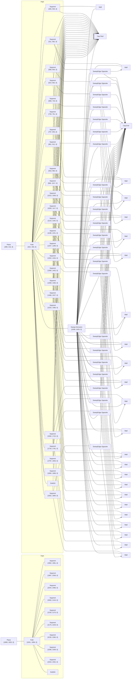

```mermaid
flowchart LR
  subgraph path2 [Path]
    2["Path<br>[422, 459, 0]"]
    3["Segment<br>[465, 505, 0]"]
    4["Segment<br>[511, 562, 0]"]
    5["Segment<br>[568, 604, 0]"]
    6["Segment<br>[610, 662, 0]"]
    7["Segment<br>[668, 733, 0]"]
    8["Segment<br>[739, 791, 0]"]
    9["Segment<br>[797, 855, 0]"]
    10["Segment<br>[861, 912, 0]"]
    11["Segment<br>[918, 960, 0]"]
    12["Segment<br>[966, 1017, 0]"]
    13["Segment<br>[1023, 1059, 0]"]
    14["Segment<br>[1065, 1117, 0]"]
    15["Segment<br>[1123, 1192, 0]"]
    16["Segment<br>[1198, 1251, 0]"]
    17["Segment<br>[1257, 1296, 0]"]
    18["Segment<br>[1302, 1354, 0]"]
    19["Segment<br>[1360, 1402, 0]"]
    20["Segment<br>[1408, 1460, 0]"]
    21["Segment<br>[1466, 1527, 0]"]
    22["Segment<br>[1533, 1586, 0]"]
    23["Segment<br>[1592, 1722, 0]"]
    24["Segment<br>[1728, 1781, 0]"]
    25["Segment<br>[1787, 1826, 0]"]
    26["Segment<br>[1832, 1884, 0]"]
    27["Segment<br>[1890, 1898, 0]"]
    28[Solid2d]
  end
  subgraph path30 [Path]
    30["Path<br>[1931, 1956, 0]"]
    31["Segment<br>[1962, 1981, 0]"]
    32["Segment<br>[1987, 2038, 0]"]
    33["Segment<br>[2044, 2086, 0]"]
    34["Segment<br>[2092, 2144, 0]"]
    35["Segment<br>[2150, 2170, 0]"]
    36["Segment<br>[2176, 2229, 0]"]
    37["Segment<br>[2235, 2280, 0]"]
    38["Segment<br>[2286, 2338, 0]"]
    39["Segment<br>[2344, 2352, 0]"]
    40[Solid2d]
  end
  1["Plane<br>[399, 416, 0]"]
  29["Plane<br>[1908, 1925, 0]"]
  41["Sweep Extrusion<br>[2408, 2429, 0]"]
  42[Wall]
  43[Wall]
  44[Wall]
  45[Wall]
  46[Wall]
  47[Wall]
  48[Wall]
  49[Wall]
  50[Wall]
  51[Wall]
  52[Wall]
  53[Wall]
  54[Wall]
  55[Wall]
  56[Wall]
  57[Wall]
  58[Wall]
  59[Wall]
  60[Wall]
  61[Wall]
  62[Wall]
  63[Wall]
  64[Wall]
  65[Wall]
  66["Cap Start"]
  67["Cap End"]
  68["SweepEdge Opposite"]
  69["SweepEdge Opposite"]
  70["SweepEdge Opposite"]
  71["SweepEdge Opposite"]
  72["SweepEdge Opposite"]
  73["SweepEdge Opposite"]
  74["SweepEdge Opposite"]
  75["SweepEdge Opposite"]
  76["SweepEdge Opposite"]
  77["SweepEdge Opposite"]
  78["SweepEdge Opposite"]
  79["SweepEdge Opposite"]
  80["SweepEdge Opposite"]
  81["SweepEdge Opposite"]
  82["SweepEdge Opposite"]
  83["SweepEdge Opposite"]
  84["SweepEdge Opposite"]
  85["SweepEdge Opposite"]
  86["SweepEdge Opposite"]
  87["SweepEdge Opposite"]
  88["SweepEdge Opposite"]
  89["SweepEdge Opposite"]
  90["SweepEdge Opposite"]
  1 --- 2
  2 --- 3
  2 --- 4
  2 --- 5
  2 --- 6
  2 --- 7
  2 --- 8
  2 --- 9
  2 --- 10
  2 --- 11
  2 --- 12
  2 --- 13
  2 --- 14
  2 --- 15
  2 --- 16
  2 --- 17
  2 --- 18
  2 --- 19
  2 --- 20
  2 --- 21
  2 --- 22
  2 --- 23
  2 --- 24
  2 --- 25
  2 --- 26
  2 --- 27
  2 ---- 41
  2 --- 28
  3 --- 42
  3 x--> 66
  4 --- 43
  4 --- 68
  4 x--> 66
  5 --- 44
  5 --- 69
  5 x--> 66
  6 --- 45
  6 --- 70
  6 x--> 66
  7 --- 46
  7 --- 71
  7 x--> 66
  8 --- 47
  8 --- 72
  8 x--> 66
  9 --- 48
  9 --- 73
  9 x--> 66
  10 --- 49
  10 --- 74
  10 x--> 66
  11 --- 50
  11 --- 75
  11 x--> 66
  12 --- 51
  12 --- 76
  12 x--> 66
  13 --- 52
  13 --- 77
  13 x--> 66
  14 --- 53
  14 --- 78
  14 x--> 66
  15 --- 54
  15 --- 79
  15 x--> 66
  16 --- 55
  16 --- 80
  16 x--> 66
  17 --- 56
  17 --- 81
  17 x--> 66
  18 --- 57
  18 --- 82
  18 x--> 66
  19 --- 58
  19 --- 83
  19 x--> 66
  20 --- 59
  20 --- 84
  20 x--> 66
  21 --- 60
  21 --- 85
  21 x--> 66
  22 --- 61
  22 --- 86
  22 x--> 66
  23 --- 62
  23 --- 87
  23 x--> 66
  24 --- 63
  24 --- 88
  24 x--> 66
  25 --- 64
  25 --- 89
  25 x--> 66
  26 --- 65
  26 --- 90
  26 x--> 66
  29 --- 30
  30 --- 31
  30 --- 32
  30 --- 33
  30 --- 34
  30 --- 35
  30 --- 36
  30 --- 37
  30 --- 38
  30 --- 39
  30 --- 40
  41 --- 42
  41 --- 43
  41 --- 44
  41 --- 45
  41 --- 46
  41 --- 47
  41 --- 48
  41 --- 49
  41 --- 50
  41 --- 51
  41 --- 52
  41 --- 53
  41 --- 54
  41 --- 55
  41 --- 56
  41 --- 57
  41 --- 58
  41 --- 59
  41 --- 60
  41 --- 61
  41 --- 62
  41 --- 63
  41 --- 64
  41 --- 65
  41 --- 66
  41 --- 67
  41 --- 68
  41 --- 69
  41 --- 70
  41 --- 71
  41 --- 72
  41 --- 73
  41 --- 74
  41 --- 75
  41 --- 76
  41 --- 77
  41 --- 78
  41 --- 79
  41 --- 80
  41 --- 81
  41 --- 82
  41 --- 83
  41 --- 84
  41 --- 85
  41 --- 86
  41 --- 87
  41 --- 88
  41 --- 89
  41 --- 90
  68 <--x 43
  68 <--x 67
  69 <--x 44
  69 <--x 67
  70 <--x 45
  70 <--x 67
  71 <--x 46
  71 <--x 67
  72 <--x 47
  72 <--x 67
  73 <--x 48
  73 <--x 67
  74 <--x 49
  74 <--x 67
  75 <--x 50
  75 <--x 67
  76 <--x 51
  76 <--x 67
  77 <--x 52
  77 <--x 67
  78 <--x 53
  78 <--x 67
  79 <--x 54
  79 <--x 67
  80 <--x 55
  80 <--x 67
  81 <--x 56
  81 <--x 67
  82 <--x 57
  82 <--x 67
  83 <--x 58
  83 <--x 67
  84 <--x 59
  84 <--x 67
  85 <--x 60
  85 <--x 67
  86 <--x 61
  86 <--x 67
  87 <--x 62
  87 <--x 67
  88 <--x 63
  88 <--x 67
  89 <--x 64
  89 <--x 67
  90 <--x 65
  90 <--x 67
```
