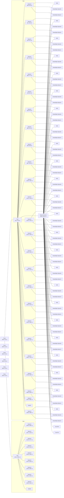

```mermaid
flowchart LR
  subgraph path7 [Path]
    7["Path<br>[422, 459, 0]"]
    8["Segment<br>[465, 505, 0]"]
    9["Segment<br>[511, 569, 0]"]
    10["Segment<br>[575, 611, 0]"]
    11["Segment<br>[617, 676, 0]"]
    12["Segment<br>[682, 747, 0]"]
    13["Segment<br>[753, 812, 0]"]
    14["Segment<br>[818, 876, 0]"]
    15["Segment<br>[882, 940, 0]"]
    16["Segment<br>[946, 988, 0]"]
    17["Segment<br>[994, 1052, 0]"]
    18["Segment<br>[1058, 1094, 0]"]
    19["Segment<br>[1100, 1159, 0]"]
    20["Segment<br>[1165, 1234, 0]"]
    21["Segment<br>[1240, 1300, 0]"]
    22["Segment<br>[1306, 1345, 0]"]
    23["Segment<br>[1351, 1410, 0]"]
    24["Segment<br>[1416, 1458, 0]"]
    25["Segment<br>[1464, 1523, 0]"]
    26["Segment<br>[1529, 1590, 0]"]
    27["Segment<br>[1596, 1656, 0]"]
    28["Segment<br>[1662, 1792, 0]"]
    29["Segment<br>[1798, 1858, 0]"]
    30["Segment<br>[1864, 1903, 0]"]
    31["Segment<br>[1909, 1968, 0]"]
    32["Segment<br>[1974, 1982, 0]"]
    33[Solid2d]
  end
  subgraph path34 [Path]
    34["Path<br>[2015, 2040, 0]"]
    35["Segment<br>[2046, 2065, 0]"]
    36["Segment<br>[2071, 2129, 0]"]
    37["Segment<br>[2135, 2177, 0]"]
    38["Segment<br>[2183, 2242, 0]"]
    39["Segment<br>[2248, 2268, 0]"]
    40["Segment<br>[2274, 2334, 0]"]
    41["Segment<br>[2340, 2385, 0]"]
    42["Segment<br>[2391, 2450, 0]"]
    43["Segment<br>[2456, 2464, 0]"]
    44[Solid2d]
  end
  1["Plane<br>[399, 416, 0]"]
  2["Plane<br>[399, 416, 0]"]
  3["Plane<br>[399, 416, 0]"]
  4["Plane<br>[399, 416, 0]"]
  5["Plane<br>[399, 416, 0]"]
  6["Plane<br>[399, 416, 0]"]
  45["Sweep Extrusion<br>[2510, 2531, 0]"]
  46[Wall]
  47[Wall]
  48[Wall]
  49[Wall]
  50[Wall]
  51[Wall]
  52[Wall]
  53[Wall]
  54[Wall]
  55[Wall]
  56[Wall]
  57[Wall]
  58[Wall]
  59[Wall]
  60[Wall]
  61[Wall]
  62[Wall]
  63[Wall]
  64[Wall]
  65[Wall]
  66[Wall]
  67[Wall]
  68[Wall]
  69[Wall]
  70["Cap Start"]
  71["Cap End"]
  72["SweepEdge Opposite"]
  73["SweepEdge Adjacent"]
  74["SweepEdge Opposite"]
  75["SweepEdge Adjacent"]
  76["SweepEdge Opposite"]
  77["SweepEdge Adjacent"]
  78["SweepEdge Opposite"]
  79["SweepEdge Adjacent"]
  80["SweepEdge Opposite"]
  81["SweepEdge Adjacent"]
  82["SweepEdge Opposite"]
  83["SweepEdge Adjacent"]
  84["SweepEdge Opposite"]
  85["SweepEdge Adjacent"]
  86["SweepEdge Opposite"]
  87["SweepEdge Adjacent"]
  88["SweepEdge Opposite"]
  89["SweepEdge Adjacent"]
  90["SweepEdge Opposite"]
  91["SweepEdge Adjacent"]
  92["SweepEdge Opposite"]
  93["SweepEdge Adjacent"]
  94["SweepEdge Opposite"]
  95["SweepEdge Adjacent"]
  96["SweepEdge Opposite"]
  97["SweepEdge Adjacent"]
  98["SweepEdge Opposite"]
  99["SweepEdge Adjacent"]
  100["SweepEdge Opposite"]
  101["SweepEdge Adjacent"]
  102["SweepEdge Opposite"]
  103["SweepEdge Adjacent"]
  104["SweepEdge Opposite"]
  105["SweepEdge Adjacent"]
  106["SweepEdge Opposite"]
  107["SweepEdge Adjacent"]
  108["SweepEdge Opposite"]
  109["SweepEdge Adjacent"]
  110["SweepEdge Opposite"]
  111["SweepEdge Adjacent"]
  112["SweepEdge Opposite"]
  113["SweepEdge Adjacent"]
  114["SweepEdge Opposite"]
  115["SweepEdge Adjacent"]
  116["SweepEdge Opposite"]
  117["SweepEdge Adjacent"]
  118["SweepEdge Opposite"]
  119["SweepEdge Adjacent"]
  1 --- 7
  1 --- 34
  7 --- 8
  7 --- 9
  7 --- 10
  7 --- 11
  7 --- 12
  7 --- 13
  7 --- 14
  7 --- 15
  7 --- 16
  7 --- 17
  7 --- 18
  7 --- 19
  7 --- 20
  7 --- 21
  7 --- 22
  7 --- 23
  7 --- 24
  7 --- 25
  7 --- 26
  7 --- 27
  7 --- 28
  7 --- 29
  7 --- 30
  7 --- 31
  7 --- 32
  7 ---- 45
  7 --- 33
  8 --- 46
  8 --- 72
  8 --- 73
  9 --- 47
  9 --- 74
  9 --- 75
  10 --- 48
  10 --- 76
  10 --- 77
  11 --- 49
  11 --- 78
  11 --- 79
  12 --- 50
  12 --- 80
  12 --- 81
  13 --- 51
  13 --- 82
  13 --- 83
  14 --- 52
  14 --- 84
  14 --- 85
  15 --- 53
  15 --- 86
  15 --- 87
  16 --- 54
  16 --- 88
  16 --- 89
  17 --- 55
  17 --- 90
  17 --- 91
  18 --- 56
  18 --- 92
  18 --- 93
  19 --- 57
  19 --- 94
  19 --- 95
  20 --- 58
  20 --- 96
  20 --- 97
  21 --- 59
  21 --- 98
  21 --- 99
  22 --- 60
  22 --- 100
  22 --- 101
  23 --- 61
  23 --- 102
  23 --- 103
  24 --- 62
  24 --- 104
  24 --- 105
  25 --- 63
  25 --- 106
  25 --- 107
  26 --- 64
  26 --- 108
  26 --- 109
  27 --- 65
  27 --- 110
  27 --- 111
  28 --- 66
  28 --- 112
  28 --- 113
  29 --- 67
  29 --- 114
  29 --- 115
  30 --- 68
  30 --- 116
  30 --- 117
  31 --- 69
  31 --- 118
  31 --- 119
  34 --- 35
  34 --- 36
  34 --- 37
  34 --- 38
  34 --- 39
  34 --- 40
  34 --- 41
  34 --- 42
  34 --- 43
  34 --- 44
  45 --- 46
  45 --- 47
  45 --- 48
  45 --- 49
  45 --- 50
  45 --- 51
  45 --- 52
  45 --- 53
  45 --- 54
  45 --- 55
  45 --- 56
  45 --- 57
  45 --- 58
  45 --- 59
  45 --- 60
  45 --- 61
  45 --- 62
  45 --- 63
  45 --- 64
  45 --- 65
  45 --- 66
  45 --- 67
  45 --- 68
  45 --- 69
  45 --- 70
  45 --- 71
  45 --- 72
  45 --- 73
  45 --- 74
  45 --- 75
  45 --- 76
  45 --- 77
  45 --- 78
  45 --- 79
  45 --- 80
  45 --- 81
  45 --- 82
  45 --- 83
  45 --- 84
  45 --- 85
  45 --- 86
  45 --- 87
  45 --- 88
  45 --- 89
  45 --- 90
  45 --- 91
  45 --- 92
  45 --- 93
  45 --- 94
  45 --- 95
  45 --- 96
  45 --- 97
  45 --- 98
  45 --- 99
  45 --- 100
  45 --- 101
  45 --- 102
  45 --- 103
  45 --- 104
  45 --- 105
  45 --- 106
  45 --- 107
  45 --- 108
  45 --- 109
  45 --- 110
  45 --- 111
  45 --- 112
  45 --- 113
  45 --- 114
  45 --- 115
  45 --- 116
  45 --- 117
  45 --- 118
  45 --- 119
```
