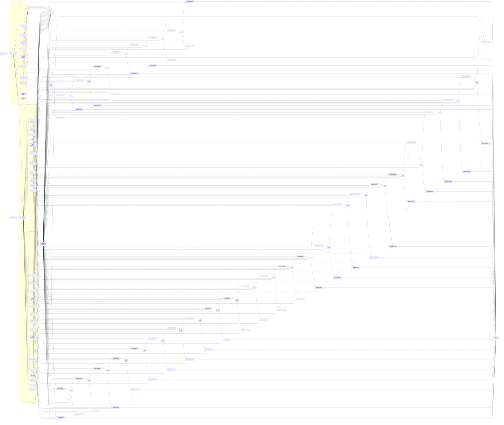

```mermaid
flowchart LR
  subgraph path2 [Path]
    2["Path<br>[422, 459, 0]"]
      %% [ProgramBodyItem { index: 5 }, VariableDeclarationDeclaration, VariableDeclarationInit, PipeBodyItem { index: 1 }]
    3["Segment<br>[465, 505, 0]"]
      %% [ProgramBodyItem { index: 5 }, VariableDeclarationDeclaration, VariableDeclarationInit, PipeBodyItem { index: 2 }]
    4["Segment<br>[511, 562, 0]"]
      %% [ProgramBodyItem { index: 5 }, VariableDeclarationDeclaration, VariableDeclarationInit, PipeBodyItem { index: 3 }]
    5["Segment<br>[568, 604, 0]"]
      %% [ProgramBodyItem { index: 5 }, VariableDeclarationDeclaration, VariableDeclarationInit, PipeBodyItem { index: 4 }]
    6["Segment<br>[610, 662, 0]"]
      %% [ProgramBodyItem { index: 5 }, VariableDeclarationDeclaration, VariableDeclarationInit, PipeBodyItem { index: 5 }]
    7["Segment<br>[668, 733, 0]"]
      %% [ProgramBodyItem { index: 5 }, VariableDeclarationDeclaration, VariableDeclarationInit, PipeBodyItem { index: 6 }]
    8["Segment<br>[739, 791, 0]"]
      %% [ProgramBodyItem { index: 5 }, VariableDeclarationDeclaration, VariableDeclarationInit, PipeBodyItem { index: 7 }]
    9["Segment<br>[797, 855, 0]"]
      %% [ProgramBodyItem { index: 5 }, VariableDeclarationDeclaration, VariableDeclarationInit, PipeBodyItem { index: 8 }]
    10["Segment<br>[861, 912, 0]"]
      %% [ProgramBodyItem { index: 5 }, VariableDeclarationDeclaration, VariableDeclarationInit, PipeBodyItem { index: 9 }]
    11["Segment<br>[918, 960, 0]"]
      %% [ProgramBodyItem { index: 5 }, VariableDeclarationDeclaration, VariableDeclarationInit, PipeBodyItem { index: 10 }]
    12["Segment<br>[966, 1017, 0]"]
      %% [ProgramBodyItem { index: 5 }, VariableDeclarationDeclaration, VariableDeclarationInit, PipeBodyItem { index: 11 }]
    13["Segment<br>[1023, 1059, 0]"]
      %% [ProgramBodyItem { index: 5 }, VariableDeclarationDeclaration, VariableDeclarationInit, PipeBodyItem { index: 12 }]
    14["Segment<br>[1065, 1117, 0]"]
      %% [ProgramBodyItem { index: 5 }, VariableDeclarationDeclaration, VariableDeclarationInit, PipeBodyItem { index: 13 }]
    15["Segment<br>[1123, 1192, 0]"]
      %% [ProgramBodyItem { index: 5 }, VariableDeclarationDeclaration, VariableDeclarationInit, PipeBodyItem { index: 14 }]
    16["Segment<br>[1198, 1251, 0]"]
      %% [ProgramBodyItem { index: 5 }, VariableDeclarationDeclaration, VariableDeclarationInit, PipeBodyItem { index: 15 }]
    17["Segment<br>[1257, 1296, 0]"]
      %% [ProgramBodyItem { index: 5 }, VariableDeclarationDeclaration, VariableDeclarationInit, PipeBodyItem { index: 16 }]
    18["Segment<br>[1302, 1354, 0]"]
      %% [ProgramBodyItem { index: 5 }, VariableDeclarationDeclaration, VariableDeclarationInit, PipeBodyItem { index: 17 }]
    19["Segment<br>[1360, 1402, 0]"]
      %% [ProgramBodyItem { index: 5 }, VariableDeclarationDeclaration, VariableDeclarationInit, PipeBodyItem { index: 18 }]
    20["Segment<br>[1408, 1460, 0]"]
      %% [ProgramBodyItem { index: 5 }, VariableDeclarationDeclaration, VariableDeclarationInit, PipeBodyItem { index: 19 }]
    21["Segment<br>[1466, 1527, 0]"]
      %% [ProgramBodyItem { index: 5 }, VariableDeclarationDeclaration, VariableDeclarationInit, PipeBodyItem { index: 20 }]
    22["Segment<br>[1533, 1586, 0]"]
      %% [ProgramBodyItem { index: 5 }, VariableDeclarationDeclaration, VariableDeclarationInit, PipeBodyItem { index: 21 }]
    23["Segment<br>[1592, 1722, 0]"]
      %% [ProgramBodyItem { index: 5 }, VariableDeclarationDeclaration, VariableDeclarationInit, PipeBodyItem { index: 22 }]
    24["Segment<br>[1728, 1781, 0]"]
      %% [ProgramBodyItem { index: 5 }, VariableDeclarationDeclaration, VariableDeclarationInit, PipeBodyItem { index: 23 }]
    25["Segment<br>[1787, 1826, 0]"]
      %% [ProgramBodyItem { index: 5 }, VariableDeclarationDeclaration, VariableDeclarationInit, PipeBodyItem { index: 24 }]
    26["Segment<br>[1832, 1884, 0]"]
      %% [ProgramBodyItem { index: 5 }, VariableDeclarationDeclaration, VariableDeclarationInit, PipeBodyItem { index: 25 }]
    27["Segment<br>[1890, 1898, 0]"]
      %% [ProgramBodyItem { index: 5 }, VariableDeclarationDeclaration, VariableDeclarationInit, PipeBodyItem { index: 26 }]
    28[Solid2d]
  end
  subgraph path30 [Path]
    30["Path<br>[1931, 1956, 0]"]
      %% [ProgramBodyItem { index: 6 }, VariableDeclarationDeclaration, VariableDeclarationInit, PipeBodyItem { index: 1 }]
    31["Segment<br>[1962, 1981, 0]"]
      %% [ProgramBodyItem { index: 6 }, VariableDeclarationDeclaration, VariableDeclarationInit, PipeBodyItem { index: 2 }]
    32["Segment<br>[1987, 2038, 0]"]
      %% [ProgramBodyItem { index: 6 }, VariableDeclarationDeclaration, VariableDeclarationInit, PipeBodyItem { index: 3 }]
    33["Segment<br>[2044, 2086, 0]"]
      %% [ProgramBodyItem { index: 6 }, VariableDeclarationDeclaration, VariableDeclarationInit, PipeBodyItem { index: 4 }]
    34["Segment<br>[2092, 2144, 0]"]
      %% [ProgramBodyItem { index: 6 }, VariableDeclarationDeclaration, VariableDeclarationInit, PipeBodyItem { index: 5 }]
    35["Segment<br>[2150, 2170, 0]"]
      %% [ProgramBodyItem { index: 6 }, VariableDeclarationDeclaration, VariableDeclarationInit, PipeBodyItem { index: 6 }]
    36["Segment<br>[2176, 2229, 0]"]
      %% [ProgramBodyItem { index: 6 }, VariableDeclarationDeclaration, VariableDeclarationInit, PipeBodyItem { index: 7 }]
    37["Segment<br>[2235, 2280, 0]"]
      %% [ProgramBodyItem { index: 6 }, VariableDeclarationDeclaration, VariableDeclarationInit, PipeBodyItem { index: 8 }]
    38["Segment<br>[2286, 2338, 0]"]
      %% [ProgramBodyItem { index: 6 }, VariableDeclarationDeclaration, VariableDeclarationInit, PipeBodyItem { index: 9 }]
    39["Segment<br>[2344, 2352, 0]"]
      %% [ProgramBodyItem { index: 6 }, VariableDeclarationDeclaration, VariableDeclarationInit, PipeBodyItem { index: 10 }]
    40[Solid2d]
  end
  1["Plane<br>[399, 416, 0]"]
    %% [ProgramBodyItem { index: 5 }, VariableDeclarationDeclaration, VariableDeclarationInit, PipeBodyItem { index: 0 }]
  29["Plane<br>[1908, 1925, 0]"]
    %% [ProgramBodyItem { index: 6 }, VariableDeclarationDeclaration, VariableDeclarationInit, PipeBodyItem { index: 0 }]
  41["Sweep Extrusion<br>[2408, 2429, 0]"]
    %% [ProgramBodyItem { index: 7 }, VariableDeclarationDeclaration, VariableDeclarationInit, PipeBodyItem { index: 2 }]
  42[Wall]
    %% face_code_ref=Missing NodePath
  43[Wall]
    %% face_code_ref=Missing NodePath
  44[Wall]
    %% face_code_ref=Missing NodePath
  45[Wall]
    %% face_code_ref=Missing NodePath
  46[Wall]
    %% face_code_ref=Missing NodePath
  47[Wall]
    %% face_code_ref=Missing NodePath
  48[Wall]
    %% face_code_ref=Missing NodePath
  49[Wall]
    %% face_code_ref=Missing NodePath
  50[Wall]
    %% face_code_ref=Missing NodePath
  51[Wall]
    %% face_code_ref=Missing NodePath
  52[Wall]
    %% face_code_ref=Missing NodePath
  53[Wall]
    %% face_code_ref=Missing NodePath
  54[Wall]
    %% face_code_ref=Missing NodePath
  55[Wall]
    %% face_code_ref=Missing NodePath
  56[Wall]
    %% face_code_ref=Missing NodePath
  57[Wall]
    %% face_code_ref=Missing NodePath
  58[Wall]
    %% face_code_ref=Missing NodePath
  59[Wall]
    %% face_code_ref=Missing NodePath
  60[Wall]
    %% face_code_ref=Missing NodePath
  61[Wall]
    %% face_code_ref=Missing NodePath
  62[Wall]
    %% face_code_ref=Missing NodePath
  63[Wall]
    %% face_code_ref=Missing NodePath
  64[Wall]
    %% face_code_ref=Missing NodePath
  65[Wall]
    %% face_code_ref=Missing NodePath
  66[Wall]
    %% face_code_ref=Missing NodePath
  67[Wall]
    %% face_code_ref=Missing NodePath
  68[Wall]
    %% face_code_ref=Missing NodePath
  69[Wall]
    %% face_code_ref=Missing NodePath
  70[Wall]
    %% face_code_ref=Missing NodePath
  71[Wall]
    %% face_code_ref=Missing NodePath
  72[Wall]
    %% face_code_ref=Missing NodePath
  73[Wall]
    %% face_code_ref=Missing NodePath
  74["Cap Start"]
    %% face_code_ref=Missing NodePath
  75["Cap End"]
    %% face_code_ref=Missing NodePath
  76["SweepEdge Opposite"]
  77["SweepEdge Adjacent"]
  78["SweepEdge Opposite"]
  79["SweepEdge Adjacent"]
  80["SweepEdge Opposite"]
  81["SweepEdge Adjacent"]
  82["SweepEdge Opposite"]
  83["SweepEdge Adjacent"]
  84["SweepEdge Opposite"]
  85["SweepEdge Adjacent"]
  86["SweepEdge Opposite"]
  87["SweepEdge Adjacent"]
  88["SweepEdge Opposite"]
  89["SweepEdge Adjacent"]
  90["SweepEdge Opposite"]
  91["SweepEdge Adjacent"]
  92["SweepEdge Opposite"]
  93["SweepEdge Adjacent"]
  94["SweepEdge Opposite"]
  95["SweepEdge Adjacent"]
  96["SweepEdge Opposite"]
  97["SweepEdge Adjacent"]
  98["SweepEdge Opposite"]
  99["SweepEdge Adjacent"]
  100["SweepEdge Opposite"]
  101["SweepEdge Adjacent"]
  102["SweepEdge Opposite"]
  103["SweepEdge Adjacent"]
  104["SweepEdge Opposite"]
  105["SweepEdge Adjacent"]
  106["SweepEdge Opposite"]
  107["SweepEdge Adjacent"]
  108["SweepEdge Opposite"]
  109["SweepEdge Adjacent"]
  110["SweepEdge Opposite"]
  111["SweepEdge Adjacent"]
  112["SweepEdge Opposite"]
  113["SweepEdge Adjacent"]
  114["SweepEdge Opposite"]
  115["SweepEdge Adjacent"]
  116["SweepEdge Opposite"]
  117["SweepEdge Adjacent"]
  118["SweepEdge Opposite"]
  119["SweepEdge Adjacent"]
  120["SweepEdge Opposite"]
  121["SweepEdge Adjacent"]
  122["SweepEdge Opposite"]
  123["SweepEdge Adjacent"]
  124["SweepEdge Opposite"]
  125["SweepEdge Adjacent"]
  126["SweepEdge Opposite"]
  127["SweepEdge Adjacent"]
  128["SweepEdge Opposite"]
  129["SweepEdge Adjacent"]
  130["SweepEdge Opposite"]
  131["SweepEdge Adjacent"]
  132["SweepEdge Opposite"]
  133["SweepEdge Adjacent"]
  134["SweepEdge Opposite"]
  135["SweepEdge Adjacent"]
  136["SweepEdge Opposite"]
  137["SweepEdge Adjacent"]
  138["SweepEdge Opposite"]
  139["SweepEdge Adjacent"]
  1 --- 2
  2 --- 3
  2 --- 4
  2 --- 5
  2 --- 6
  2 --- 7
  2 --- 8
  2 --- 9
  2 --- 10
  2 --- 11
  2 --- 12
  2 --- 13
  2 --- 14
  2 --- 15
  2 --- 16
  2 --- 17
  2 --- 18
  2 --- 19
  2 --- 20
  2 --- 21
  2 --- 22
  2 --- 23
  2 --- 24
  2 --- 25
  2 --- 26
  2 --- 27
  2 --- 28
  30 --- 2
  2 ---- 41
  3 --- 42
  3 x--> 74
  3 --- 76
  3 --- 77
  4 --- 43
  4 x--> 74
  4 --- 78
  4 --- 79
  5 --- 44
  5 x--> 74
  5 --- 80
  5 --- 81
  6 --- 45
  6 x--> 74
  6 --- 82
  6 --- 83
  7 --- 46
  7 x--> 74
  7 --- 84
  7 --- 85
  8 --- 47
  8 x--> 74
  8 --- 86
  8 --- 87
  9 --- 48
  9 x--> 74
  9 --- 88
  9 --- 89
  10 --- 49
  10 x--> 74
  10 --- 90
  10 --- 91
  11 --- 50
  11 x--> 74
  11 --- 92
  11 --- 93
  12 --- 51
  12 x--> 74
  12 --- 94
  12 --- 95
  13 --- 52
  13 x--> 74
  13 --- 96
  13 --- 97
  14 --- 53
  14 x--> 74
  14 --- 98
  14 --- 99
  15 --- 54
  15 x--> 74
  15 --- 100
  15 --- 101
  16 --- 55
  16 x--> 74
  16 --- 102
  16 --- 103
  17 --- 56
  17 x--> 74
  17 --- 104
  17 --- 105
  18 --- 57
  18 x--> 74
  18 --- 106
  18 --- 107
  19 --- 58
  19 x--> 74
  19 --- 108
  19 --- 109
  20 --- 59
  20 x--> 74
  20 --- 110
  20 --- 111
  21 --- 60
  21 x--> 74
  21 --- 112
  21 --- 113
  22 --- 61
  22 x--> 74
  22 --- 114
  22 --- 115
  23 --- 62
  23 x--> 74
  23 --- 116
  23 --- 117
  24 --- 63
  24 x--> 74
  24 --- 118
  24 --- 119
  25 --- 64
  25 x--> 74
  25 --- 120
  25 --- 121
  26 --- 65
  26 x--> 74
  26 --- 122
  26 --- 123
  29 --- 30
  30 --- 31
  30 --- 32
  30 --- 33
  30 --- 34
  30 --- 35
  30 --- 36
  30 --- 37
  30 --- 38
  30 --- 39
  30 --- 40
  30 x---> 41
  31 --- 73
  31 x--> 74
  31 --- 138
  31 --- 139
  32 --- 72
  32 x--> 74
  32 --- 136
  32 --- 137
  33 --- 71
  33 x--> 74
  33 --- 134
  33 --- 135
  34 --- 70
  34 x--> 74
  34 --- 132
  34 --- 133
  35 --- 69
  35 x--> 74
  35 --- 130
  35 --- 131
  36 --- 68
  36 x--> 74
  36 --- 128
  36 --- 129
  37 --- 67
  37 x--> 74
  37 --- 126
  37 --- 127
  38 --- 66
  38 x--> 74
  38 --- 124
  38 --- 125
  41 --- 42
  41 --- 43
  41 --- 44
  41 --- 45
  41 --- 46
  41 --- 47
  41 --- 48
  41 --- 49
  41 --- 50
  41 --- 51
  41 --- 52
  41 --- 53
  41 --- 54
  41 --- 55
  41 --- 56
  41 --- 57
  41 --- 58
  41 --- 59
  41 --- 60
  41 --- 61
  41 --- 62
  41 --- 63
  41 --- 64
  41 --- 65
  41 --- 66
  41 --- 67
  41 --- 68
  41 --- 69
  41 --- 70
  41 --- 71
  41 --- 72
  41 --- 73
  41 --- 74
  41 --- 75
  41 --- 76
  41 --- 77
  41 --- 78
  41 --- 79
  41 --- 80
  41 --- 81
  41 --- 82
  41 --- 83
  41 --- 84
  41 --- 85
  41 --- 86
  41 --- 87
  41 --- 88
  41 --- 89
  41 --- 90
  41 --- 91
  41 --- 92
  41 --- 93
  41 --- 94
  41 --- 95
  41 --- 96
  41 --- 97
  41 --- 98
  41 --- 99
  41 --- 100
  41 --- 101
  41 --- 102
  41 --- 103
  41 --- 104
  41 --- 105
  41 --- 106
  41 --- 107
  41 --- 108
  41 --- 109
  41 --- 110
  41 --- 111
  41 --- 112
  41 --- 113
  41 --- 114
  41 --- 115
  41 --- 116
  41 --- 117
  41 --- 118
  41 --- 119
  41 --- 120
  41 --- 121
  41 --- 122
  41 --- 123
  41 --- 124
  41 --- 125
  41 --- 126
  41 --- 127
  41 --- 128
  41 --- 129
  41 --- 130
  41 --- 131
  41 --- 132
  41 --- 133
  41 --- 134
  41 --- 135
  41 --- 136
  41 --- 137
  41 --- 138
  41 --- 139
  42 --- 76
  42 --- 77
  123 <--x 42
  77 <--x 43
  43 --- 78
  43 --- 79
  79 <--x 44
  44 --- 80
  44 --- 81
  81 <--x 45
  45 --- 82
  45 --- 83
  83 <--x 46
  46 --- 84
  46 --- 85
  85 <--x 47
  47 --- 86
  47 --- 87
  87 <--x 48
  48 --- 88
  48 --- 89
  89 <--x 49
  49 --- 90
  49 --- 91
  91 <--x 50
  50 --- 92
  50 --- 93
  93 <--x 51
  51 --- 94
  51 --- 95
  95 <--x 52
  52 --- 96
  52 --- 97
  97 <--x 53
  53 --- 98
  53 --- 99
  99 <--x 54
  54 --- 100
  54 --- 101
  101 <--x 55
  55 --- 102
  55 --- 103
  103 <--x 56
  56 --- 104
  56 --- 105
  105 <--x 57
  57 --- 106
  57 --- 107
  107 <--x 58
  58 --- 108
  58 --- 109
  109 <--x 59
  59 --- 110
  59 --- 111
  111 <--x 60
  60 --- 112
  60 --- 113
  113 <--x 61
  61 --- 114
  61 --- 115
  115 <--x 62
  62 --- 116
  62 --- 117
  117 <--x 63
  63 --- 118
  63 --- 119
  119 <--x 64
  64 --- 120
  64 --- 121
  121 <--x 65
  65 --- 122
  65 --- 123
  66 --- 124
  66 --- 125
  139 <--x 66
  125 <--x 67
  67 --- 126
  67 --- 127
  127 <--x 68
  68 --- 128
  68 --- 129
  129 <--x 69
  69 --- 130
  69 --- 131
  131 <--x 70
  70 --- 132
  70 --- 133
  133 <--x 71
  71 --- 134
  71 --- 135
  135 <--x 72
  72 --- 136
  72 --- 137
  137 <--x 73
  73 --- 138
  73 --- 139
  76 <--x 75
  78 <--x 75
  80 <--x 75
  82 <--x 75
  84 <--x 75
  86 <--x 75
  88 <--x 75
  90 <--x 75
  92 <--x 75
  94 <--x 75
  96 <--x 75
  98 <--x 75
  100 <--x 75
  102 <--x 75
  104 <--x 75
  106 <--x 75
  108 <--x 75
  110 <--x 75
  112 <--x 75
  114 <--x 75
  116 <--x 75
  118 <--x 75
  120 <--x 75
  122 <--x 75
  124 <--x 75
  126 <--x 75
  128 <--x 75
  130 <--x 75
  132 <--x 75
  134 <--x 75
  136 <--x 75
  138 <--x 75
```
