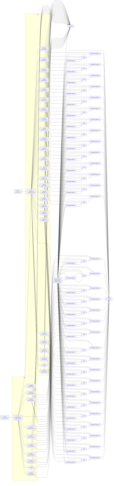

```mermaid
flowchart LR
  subgraph path4 [Path]
    4["Path<br>[422, 459, 0]<br>Consumed: true"]
      %% [ProgramBodyItem { index: 5 }, VariableDeclarationDeclaration, VariableDeclarationInit, PipeBodyItem { index: 1 }]
    31["Segment<br>[465, 505, 0]"]
      %% [ProgramBodyItem { index: 5 }, VariableDeclarationDeclaration, VariableDeclarationInit, PipeBodyItem { index: 2 }]
    32["Segment<br>[511, 562, 0]"]
      %% [ProgramBodyItem { index: 5 }, VariableDeclarationDeclaration, VariableDeclarationInit, PipeBodyItem { index: 3 }]
    33["Segment<br>[568, 604, 0]"]
      %% [ProgramBodyItem { index: 5 }, VariableDeclarationDeclaration, VariableDeclarationInit, PipeBodyItem { index: 4 }]
    34["Segment<br>[610, 662, 0]"]
      %% [ProgramBodyItem { index: 5 }, VariableDeclarationDeclaration, VariableDeclarationInit, PipeBodyItem { index: 5 }]
    35["Segment<br>[668, 733, 0]"]
      %% [ProgramBodyItem { index: 5 }, VariableDeclarationDeclaration, VariableDeclarationInit, PipeBodyItem { index: 6 }]
    36["Segment<br>[739, 791, 0]"]
      %% [ProgramBodyItem { index: 5 }, VariableDeclarationDeclaration, VariableDeclarationInit, PipeBodyItem { index: 7 }]
    37["Segment<br>[797, 855, 0]"]
      %% [ProgramBodyItem { index: 5 }, VariableDeclarationDeclaration, VariableDeclarationInit, PipeBodyItem { index: 8 }]
    38["Segment<br>[861, 912, 0]"]
      %% [ProgramBodyItem { index: 5 }, VariableDeclarationDeclaration, VariableDeclarationInit, PipeBodyItem { index: 9 }]
    39["Segment<br>[918, 960, 0]"]
      %% [ProgramBodyItem { index: 5 }, VariableDeclarationDeclaration, VariableDeclarationInit, PipeBodyItem { index: 10 }]
    40["Segment<br>[966, 1017, 0]"]
      %% [ProgramBodyItem { index: 5 }, VariableDeclarationDeclaration, VariableDeclarationInit, PipeBodyItem { index: 11 }]
    7["Segment<br>[1023, 1059, 0]"]
      %% [ProgramBodyItem { index: 5 }, VariableDeclarationDeclaration, VariableDeclarationInit, PipeBodyItem { index: 12 }]
    8["Segment<br>[1065, 1117, 0]"]
      %% [ProgramBodyItem { index: 5 }, VariableDeclarationDeclaration, VariableDeclarationInit, PipeBodyItem { index: 13 }]
    9["Segment<br>[1123, 1192, 0]"]
      %% [ProgramBodyItem { index: 5 }, VariableDeclarationDeclaration, VariableDeclarationInit, PipeBodyItem { index: 14 }]
    10["Segment<br>[1198, 1251, 0]"]
      %% [ProgramBodyItem { index: 5 }, VariableDeclarationDeclaration, VariableDeclarationInit, PipeBodyItem { index: 15 }]
    11["Segment<br>[1257, 1296, 0]"]
      %% [ProgramBodyItem { index: 5 }, VariableDeclarationDeclaration, VariableDeclarationInit, PipeBodyItem { index: 16 }]
    12["Segment<br>[1302, 1354, 0]"]
      %% [ProgramBodyItem { index: 5 }, VariableDeclarationDeclaration, VariableDeclarationInit, PipeBodyItem { index: 17 }]
    13["Segment<br>[1360, 1402, 0]"]
      %% [ProgramBodyItem { index: 5 }, VariableDeclarationDeclaration, VariableDeclarationInit, PipeBodyItem { index: 18 }]
    14["Segment<br>[1408, 1460, 0]"]
      %% [ProgramBodyItem { index: 5 }, VariableDeclarationDeclaration, VariableDeclarationInit, PipeBodyItem { index: 19 }]
    15["Segment<br>[1466, 1527, 0]"]
      %% [ProgramBodyItem { index: 5 }, VariableDeclarationDeclaration, VariableDeclarationInit, PipeBodyItem { index: 20 }]
    16["Segment<br>[1533, 1586, 0]"]
      %% [ProgramBodyItem { index: 5 }, VariableDeclarationDeclaration, VariableDeclarationInit, PipeBodyItem { index: 21 }]
    17["Segment<br>[1592, 1722, 0]"]
      %% [ProgramBodyItem { index: 5 }, VariableDeclarationDeclaration, VariableDeclarationInit, PipeBodyItem { index: 22 }]
    18["Segment<br>[1728, 1781, 0]"]
      %% [ProgramBodyItem { index: 5 }, VariableDeclarationDeclaration, VariableDeclarationInit, PipeBodyItem { index: 23 }]
    19["Segment<br>[1787, 1826, 0]"]
      %% [ProgramBodyItem { index: 5 }, VariableDeclarationDeclaration, VariableDeclarationInit, PipeBodyItem { index: 24 }]
    20["Segment<br>[1832, 1884, 0]"]
      %% [ProgramBodyItem { index: 5 }, VariableDeclarationDeclaration, VariableDeclarationInit, PipeBodyItem { index: 25 }]
    21["Segment<br>[1890, 1898, 0]"]
      %% [ProgramBodyItem { index: 5 }, VariableDeclarationDeclaration, VariableDeclarationInit, PipeBodyItem { index: 26 }]
    42[Solid2d]
  end
  subgraph path3 [Path]
    3["Path<br>[1931, 1956, 0]<br>Consumed: true"]
      %% [ProgramBodyItem { index: 6 }, VariableDeclarationDeclaration, VariableDeclarationInit, PipeBodyItem { index: 1 }]
    22["Segment<br>[1962, 1981, 0]"]
      %% [ProgramBodyItem { index: 6 }, VariableDeclarationDeclaration, VariableDeclarationInit, PipeBodyItem { index: 2 }]
    23["Segment<br>[1987, 2038, 0]"]
      %% [ProgramBodyItem { index: 6 }, VariableDeclarationDeclaration, VariableDeclarationInit, PipeBodyItem { index: 3 }]
    24["Segment<br>[2044, 2086, 0]"]
      %% [ProgramBodyItem { index: 6 }, VariableDeclarationDeclaration, VariableDeclarationInit, PipeBodyItem { index: 4 }]
    25["Segment<br>[2092, 2144, 0]"]
      %% [ProgramBodyItem { index: 6 }, VariableDeclarationDeclaration, VariableDeclarationInit, PipeBodyItem { index: 5 }]
    26["Segment<br>[2150, 2170, 0]"]
      %% [ProgramBodyItem { index: 6 }, VariableDeclarationDeclaration, VariableDeclarationInit, PipeBodyItem { index: 6 }]
    27["Segment<br>[2176, 2229, 0]"]
      %% [ProgramBodyItem { index: 6 }, VariableDeclarationDeclaration, VariableDeclarationInit, PipeBodyItem { index: 7 }]
    28["Segment<br>[2235, 2280, 0]"]
      %% [ProgramBodyItem { index: 6 }, VariableDeclarationDeclaration, VariableDeclarationInit, PipeBodyItem { index: 8 }]
    29["Segment<br>[2286, 2338, 0]"]
      %% [ProgramBodyItem { index: 6 }, VariableDeclarationDeclaration, VariableDeclarationInit, PipeBodyItem { index: 9 }]
    30["Segment<br>[2344, 2352, 0]"]
      %% [ProgramBodyItem { index: 6 }, VariableDeclarationDeclaration, VariableDeclarationInit, PipeBodyItem { index: 10 }]
    41[Solid2d]
  end
  6["Plane<br>[399, 416, 0]"]
    %% [ProgramBodyItem { index: 5 }, VariableDeclarationDeclaration, VariableDeclarationInit, PipeBodyItem { index: 0 }]
  5["Plane<br>[1908, 1925, 0]"]
    %% [ProgramBodyItem { index: 6 }, VariableDeclarationDeclaration, VariableDeclarationInit, PipeBodyItem { index: 0 }]
  43["Sweep Extrusion<br>[2408, 2429, 0]<br>Consumed: false"]
    %% [ProgramBodyItem { index: 7 }, VariableDeclarationDeclaration, VariableDeclarationInit, PipeBodyItem { index: 2 }]
  130[Wall]
    %% face_code_ref=Missing NodePath
  131[Wall]
    %% face_code_ref=Missing NodePath
  132[Wall]
    %% face_code_ref=Missing NodePath
  133[Wall]
    %% face_code_ref=Missing NodePath
  134[Wall]
    %% face_code_ref=Missing NodePath
  135[Wall]
    %% face_code_ref=Missing NodePath
  136[Wall]
    %% face_code_ref=Missing NodePath
  137[Wall]
    %% face_code_ref=Missing NodePath
  138[Wall]
    %% face_code_ref=Missing NodePath
  139[Wall]
    %% face_code_ref=Missing NodePath
  108[Wall]
    %% face_code_ref=Missing NodePath
  109[Wall]
    %% face_code_ref=Missing NodePath
  110[Wall]
    %% face_code_ref=Missing NodePath
  111[Wall]
    %% face_code_ref=Missing NodePath
  112[Wall]
    %% face_code_ref=Missing NodePath
  113[Wall]
    %% face_code_ref=Missing NodePath
  114[Wall]
    %% face_code_ref=Missing NodePath
  115[Wall]
    %% face_code_ref=Missing NodePath
  116[Wall]
    %% face_code_ref=Missing NodePath
  117[Wall]
    %% face_code_ref=Missing NodePath
  118[Wall]
    %% face_code_ref=Missing NodePath
  119[Wall]
    %% face_code_ref=Missing NodePath
  120[Wall]
    %% face_code_ref=Missing NodePath
  121[Wall]
    %% face_code_ref=Missing NodePath
  129[Wall]
    %% face_code_ref=Missing NodePath
  128[Wall]
    %% face_code_ref=Missing NodePath
  127[Wall]
    %% face_code_ref=Missing NodePath
  126[Wall]
    %% face_code_ref=Missing NodePath
  125[Wall]
    %% face_code_ref=Missing NodePath
  124[Wall]
    %% face_code_ref=Missing NodePath
  123[Wall]
    %% face_code_ref=Missing NodePath
  122[Wall]
    %% face_code_ref=Missing NodePath
  2["Cap Start"]
    %% face_code_ref=Missing NodePath
  1["Cap End"]
    %% face_code_ref=Missing NodePath
  98["SweepEdge Opposite"]
  66["SweepEdge Adjacent"]
  99["SweepEdge Opposite"]
  67["SweepEdge Adjacent"]
  100["SweepEdge Opposite"]
  68["SweepEdge Adjacent"]
  101["SweepEdge Opposite"]
  69["SweepEdge Adjacent"]
  102["SweepEdge Opposite"]
  70["SweepEdge Adjacent"]
  103["SweepEdge Opposite"]
  71["SweepEdge Adjacent"]
  104["SweepEdge Opposite"]
  72["SweepEdge Adjacent"]
  105["SweepEdge Opposite"]
  73["SweepEdge Adjacent"]
  106["SweepEdge Opposite"]
  74["SweepEdge Adjacent"]
  107["SweepEdge Opposite"]
  75["SweepEdge Adjacent"]
  76["SweepEdge Opposite"]
  44["SweepEdge Adjacent"]
  77["SweepEdge Opposite"]
  45["SweepEdge Adjacent"]
  78["SweepEdge Opposite"]
  46["SweepEdge Adjacent"]
  79["SweepEdge Opposite"]
  47["SweepEdge Adjacent"]
  80["SweepEdge Opposite"]
  48["SweepEdge Adjacent"]
  81["SweepEdge Opposite"]
  49["SweepEdge Adjacent"]
  82["SweepEdge Opposite"]
  50["SweepEdge Adjacent"]
  83["SweepEdge Opposite"]
  51["SweepEdge Adjacent"]
  84["SweepEdge Opposite"]
  52["SweepEdge Adjacent"]
  85["SweepEdge Opposite"]
  53["SweepEdge Adjacent"]
  86["SweepEdge Opposite"]
  54["SweepEdge Adjacent"]
  87["SweepEdge Opposite"]
  55["SweepEdge Adjacent"]
  88["SweepEdge Opposite"]
  56["SweepEdge Adjacent"]
  89["SweepEdge Opposite"]
  57["SweepEdge Adjacent"]
  97["SweepEdge Opposite"]
  65["SweepEdge Adjacent"]
  96["SweepEdge Opposite"]
  64["SweepEdge Adjacent"]
  95["SweepEdge Opposite"]
  63["SweepEdge Adjacent"]
  94["SweepEdge Opposite"]
  62["SweepEdge Adjacent"]
  93["SweepEdge Opposite"]
  61["SweepEdge Adjacent"]
  92["SweepEdge Opposite"]
  60["SweepEdge Adjacent"]
  91["SweepEdge Opposite"]
  59["SweepEdge Adjacent"]
  90["SweepEdge Opposite"]
  58["SweepEdge Adjacent"]
  43 --- 1
  76 <--x 1
  77 <--x 1
  78 <--x 1
  79 <--x 1
  80 <--x 1
  81 <--x 1
  82 <--x 1
  83 <--x 1
  84 <--x 1
  85 <--x 1
  86 <--x 1
  87 <--x 1
  88 <--x 1
  89 <--x 1
  90 <--x 1
  91 <--x 1
  92 <--x 1
  93 <--x 1
  94 <--x 1
  95 <--x 1
  96 <--x 1
  97 <--x 1
  98 <--x 1
  99 <--x 1
  100 <--x 1
  101 <--x 1
  102 <--x 1
  103 <--x 1
  104 <--x 1
  105 <--x 1
  106 <--x 1
  107 <--x 1
  7 <--x 2
  8 <--x 2
  9 <--x 2
  10 <--x 2
  11 <--x 2
  12 <--x 2
  13 <--x 2
  14 <--x 2
  15 <--x 2
  16 <--x 2
  17 <--x 2
  18 <--x 2
  19 <--x 2
  20 <--x 2
  22 <--x 2
  23 <--x 2
  24 <--x 2
  25 <--x 2
  26 <--x 2
  27 <--x 2
  28 <--x 2
  29 <--x 2
  31 <--x 2
  32 <--x 2
  33 <--x 2
  34 <--x 2
  35 <--x 2
  36 <--x 2
  37 <--x 2
  38 <--x 2
  39 <--x 2
  40 <--x 2
  43 --- 2
  3 --- 4
  5 --- 3
  3 --- 22
  3 --- 23
  3 --- 24
  3 --- 25
  3 --- 26
  3 --- 27
  3 --- 28
  3 --- 29
  3 --- 30
  3 --- 41
  3 x---> 43
  6 --- 4
  4 --- 7
  4 --- 8
  4 --- 9
  4 --- 10
  4 --- 11
  4 --- 12
  4 --- 13
  4 --- 14
  4 --- 15
  4 --- 16
  4 --- 17
  4 --- 18
  4 --- 19
  4 --- 20
  4 --- 21
  4 --- 31
  4 --- 32
  4 --- 33
  4 --- 34
  4 --- 35
  4 --- 36
  4 --- 37
  4 --- 38
  4 --- 39
  4 --- 40
  4 --- 42
  4 ---- 43
  7 --- 44
  7 --- 76
  7 --- 108
  8 --- 45
  8 --- 77
  8 --- 109
  9 --- 46
  9 --- 78
  9 --- 110
  10 --- 47
  10 --- 79
  10 --- 111
  11 --- 48
  11 --- 80
  11 --- 112
  12 --- 49
  12 --- 81
  12 --- 113
  13 --- 50
  13 --- 82
  13 --- 114
  14 --- 51
  14 --- 83
  14 --- 115
  15 --- 52
  15 --- 84
  15 --- 116
  16 --- 53
  16 --- 85
  16 --- 117
  17 --- 54
  17 --- 86
  17 --- 118
  18 --- 55
  18 --- 87
  18 --- 119
  19 --- 56
  19 --- 88
  19 --- 120
  20 --- 57
  20 --- 89
  20 --- 121
  22 --- 58
  22 --- 90
  22 --- 122
  23 --- 59
  23 --- 91
  23 --- 123
  24 --- 60
  24 --- 92
  24 --- 124
  25 --- 61
  25 --- 93
  25 --- 125
  26 --- 62
  26 --- 94
  26 --- 126
  27 --- 63
  27 --- 95
  27 --- 127
  28 --- 64
  28 --- 96
  28 --- 128
  29 --- 65
  29 --- 97
  29 --- 129
  31 --- 66
  31 --- 98
  31 --- 130
  32 --- 67
  32 --- 99
  32 --- 131
  33 --- 68
  33 --- 100
  33 --- 132
  34 --- 69
  34 --- 101
  34 --- 133
  35 --- 70
  35 --- 102
  35 --- 134
  36 --- 71
  36 --- 103
  36 --- 135
  37 --- 72
  37 --- 104
  37 --- 136
  38 --- 73
  38 --- 105
  38 --- 137
  39 --- 74
  39 --- 106
  39 --- 138
  40 --- 75
  40 --- 107
  40 --- 139
  43 --- 44
  43 --- 45
  43 --- 46
  43 --- 47
  43 --- 48
  43 --- 49
  43 --- 50
  43 --- 51
  43 --- 52
  43 --- 53
  43 --- 54
  43 --- 55
  43 --- 56
  43 --- 57
  43 --- 58
  43 --- 59
  43 --- 60
  43 --- 61
  43 --- 62
  43 --- 63
  43 --- 64
  43 --- 65
  43 --- 66
  43 --- 67
  43 --- 68
  43 --- 69
  43 --- 70
  43 --- 71
  43 --- 72
  43 --- 73
  43 --- 74
  43 --- 75
  43 --- 76
  43 --- 77
  43 --- 78
  43 --- 79
  43 --- 80
  43 --- 81
  43 --- 82
  43 --- 83
  43 --- 84
  43 --- 85
  43 --- 86
  43 --- 87
  43 --- 88
  43 --- 89
  43 --- 90
  43 --- 91
  43 --- 92
  43 --- 93
  43 --- 94
  43 --- 95
  43 --- 96
  43 --- 97
  43 --- 98
  43 --- 99
  43 --- 100
  43 --- 101
  43 --- 102
  43 --- 103
  43 --- 104
  43 --- 105
  43 --- 106
  43 --- 107
  43 --- 108
  43 --- 109
  43 --- 110
  43 --- 111
  43 --- 112
  43 --- 113
  43 --- 114
  43 --- 115
  43 --- 116
  43 --- 117
  43 --- 118
  43 --- 119
  43 --- 120
  43 --- 121
  43 --- 122
  43 --- 123
  43 --- 124
  43 --- 125
  43 --- 126
  43 --- 127
  43 --- 128
  43 --- 129
  43 --- 130
  43 --- 131
  43 --- 132
  43 --- 133
  43 --- 134
  43 --- 135
  43 --- 136
  43 --- 137
  43 --- 138
  43 --- 139
  108 --- 44
  44 x--> 108
  109 --- 45
  45 x--> 109
  110 --- 46
  46 x--> 110
  111 --- 47
  47 x--> 111
  112 --- 48
  48 x--> 112
  113 --- 49
  49 x--> 113
  114 --- 50
  50 x--> 114
  115 --- 51
  51 x--> 115
  116 --- 52
  52 x--> 116
  117 --- 53
  53 x--> 117
  118 --- 54
  54 x--> 118
  119 --- 55
  55 x--> 119
  120 --- 56
  56 x--> 120
  121 --- 57
  57 x--> 121
  122 --- 58
  58 x--> 122
  123 --- 59
  59 x--> 123
  124 --- 60
  60 x--> 124
  125 --- 61
  61 x--> 125
  126 --- 62
  62 x--> 126
  127 --- 63
  63 x--> 127
  128 --- 64
  64 x--> 128
  129 --- 65
  65 x--> 129
  130 --- 66
  66 x--> 130
  131 --- 67
  67 x--> 131
  132 --- 68
  68 x--> 132
  133 --- 69
  69 x--> 133
  134 --- 70
  70 x--> 134
  135 --- 71
  71 x--> 135
  136 --- 72
  72 x--> 136
  137 --- 73
  73 x--> 137
  138 --- 74
  74 x--> 138
  139 --- 75
  75 x--> 139
  108 --- 76
  109 --- 77
  110 --- 78
  111 --- 79
  112 --- 80
  113 --- 81
  114 --- 82
  115 --- 83
  116 --- 84
  117 --- 85
  118 --- 86
  119 --- 87
  120 --- 88
  121 --- 89
  122 --- 90
  123 --- 91
  124 --- 92
  125 --- 93
  126 --- 94
  127 --- 95
  128 --- 96
  129 --- 97
  130 --- 98
  131 --- 99
  132 --- 100
  133 --- 101
  134 --- 102
  135 --- 103
  136 --- 104
  137 --- 105
  138 --- 106
  139 --- 107
```
