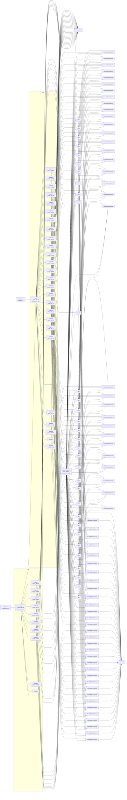

```mermaid
flowchart LR
  subgraph path36 [Path]
    36["Path<br>[422, 459, 0]<br>Consumed: true"]
      %% [ProgramBodyItem { index: 5 }, VariableDeclarationDeclaration, VariableDeclarationInit, PipeBodyItem { index: 1 }]
    37["Segment<br>[465, 505, 0]"]
      %% [ProgramBodyItem { index: 5 }, VariableDeclarationDeclaration, VariableDeclarationInit, PipeBodyItem { index: 2 }]
    38["Segment<br>[511, 562, 0]"]
      %% [ProgramBodyItem { index: 5 }, VariableDeclarationDeclaration, VariableDeclarationInit, PipeBodyItem { index: 3 }]
    39["Segment<br>[568, 604, 0]"]
      %% [ProgramBodyItem { index: 5 }, VariableDeclarationDeclaration, VariableDeclarationInit, PipeBodyItem { index: 4 }]
    40["Segment<br>[610, 662, 0]"]
      %% [ProgramBodyItem { index: 5 }, VariableDeclarationDeclaration, VariableDeclarationInit, PipeBodyItem { index: 5 }]
    41["Segment<br>[668, 733, 0]"]
      %% [ProgramBodyItem { index: 5 }, VariableDeclarationDeclaration, VariableDeclarationInit, PipeBodyItem { index: 6 }]
    42["Segment<br>[739, 791, 0]"]
      %% [ProgramBodyItem { index: 5 }, VariableDeclarationDeclaration, VariableDeclarationInit, PipeBodyItem { index: 7 }]
    43["Segment<br>[797, 855, 0]"]
      %% [ProgramBodyItem { index: 5 }, VariableDeclarationDeclaration, VariableDeclarationInit, PipeBodyItem { index: 8 }]
    44["Segment<br>[861, 912, 0]"]
      %% [ProgramBodyItem { index: 5 }, VariableDeclarationDeclaration, VariableDeclarationInit, PipeBodyItem { index: 9 }]
    45["Segment<br>[918, 960, 0]"]
      %% [ProgramBodyItem { index: 5 }, VariableDeclarationDeclaration, VariableDeclarationInit, PipeBodyItem { index: 10 }]
    46["Segment<br>[966, 1017, 0]"]
      %% [ProgramBodyItem { index: 5 }, VariableDeclarationDeclaration, VariableDeclarationInit, PipeBodyItem { index: 11 }]
    47["Segment<br>[1023, 1059, 0]"]
      %% [ProgramBodyItem { index: 5 }, VariableDeclarationDeclaration, VariableDeclarationInit, PipeBodyItem { index: 12 }]
    48["Segment<br>[1065, 1117, 0]"]
      %% [ProgramBodyItem { index: 5 }, VariableDeclarationDeclaration, VariableDeclarationInit, PipeBodyItem { index: 13 }]
    49["Segment<br>[1123, 1192, 0]"]
      %% [ProgramBodyItem { index: 5 }, VariableDeclarationDeclaration, VariableDeclarationInit, PipeBodyItem { index: 14 }]
    50["Segment<br>[1198, 1251, 0]"]
      %% [ProgramBodyItem { index: 5 }, VariableDeclarationDeclaration, VariableDeclarationInit, PipeBodyItem { index: 15 }]
    51["Segment<br>[1257, 1296, 0]"]
      %% [ProgramBodyItem { index: 5 }, VariableDeclarationDeclaration, VariableDeclarationInit, PipeBodyItem { index: 16 }]
    52["Segment<br>[1302, 1354, 0]"]
      %% [ProgramBodyItem { index: 5 }, VariableDeclarationDeclaration, VariableDeclarationInit, PipeBodyItem { index: 17 }]
    53["Segment<br>[1360, 1402, 0]"]
      %% [ProgramBodyItem { index: 5 }, VariableDeclarationDeclaration, VariableDeclarationInit, PipeBodyItem { index: 18 }]
    54["Segment<br>[1408, 1460, 0]"]
      %% [ProgramBodyItem { index: 5 }, VariableDeclarationDeclaration, VariableDeclarationInit, PipeBodyItem { index: 19 }]
    55["Segment<br>[1466, 1527, 0]"]
      %% [ProgramBodyItem { index: 5 }, VariableDeclarationDeclaration, VariableDeclarationInit, PipeBodyItem { index: 20 }]
    56["Segment<br>[1533, 1586, 0]"]
      %% [ProgramBodyItem { index: 5 }, VariableDeclarationDeclaration, VariableDeclarationInit, PipeBodyItem { index: 21 }]
    57["Segment<br>[1592, 1722, 0]"]
      %% [ProgramBodyItem { index: 5 }, VariableDeclarationDeclaration, VariableDeclarationInit, PipeBodyItem { index: 22 }]
    58["Segment<br>[1728, 1781, 0]"]
      %% [ProgramBodyItem { index: 5 }, VariableDeclarationDeclaration, VariableDeclarationInit, PipeBodyItem { index: 23 }]
    59["Segment<br>[1787, 1826, 0]"]
      %% [ProgramBodyItem { index: 5 }, VariableDeclarationDeclaration, VariableDeclarationInit, PipeBodyItem { index: 24 }]
    60["Segment<br>[1832, 1884, 0]"]
      %% [ProgramBodyItem { index: 5 }, VariableDeclarationDeclaration, VariableDeclarationInit, PipeBodyItem { index: 25 }]
    61["Segment<br>[1890, 1898, 0]"]
      %% [ProgramBodyItem { index: 5 }, VariableDeclarationDeclaration, VariableDeclarationInit, PipeBodyItem { index: 26 }]
    75[Solid2d]
  end
  subgraph path63 [Path]
    63["Path<br>[1931, 1956, 0]<br>Consumed: true"]
      %% [ProgramBodyItem { index: 6 }, VariableDeclarationDeclaration, VariableDeclarationInit, PipeBodyItem { index: 1 }]
    64["Segment<br>[1962, 1981, 0]"]
      %% [ProgramBodyItem { index: 6 }, VariableDeclarationDeclaration, VariableDeclarationInit, PipeBodyItem { index: 2 }]
    65["Segment<br>[1987, 2038, 0]"]
      %% [ProgramBodyItem { index: 6 }, VariableDeclarationDeclaration, VariableDeclarationInit, PipeBodyItem { index: 3 }]
    66["Segment<br>[2044, 2086, 0]"]
      %% [ProgramBodyItem { index: 6 }, VariableDeclarationDeclaration, VariableDeclarationInit, PipeBodyItem { index: 4 }]
    67["Segment<br>[2092, 2144, 0]"]
      %% [ProgramBodyItem { index: 6 }, VariableDeclarationDeclaration, VariableDeclarationInit, PipeBodyItem { index: 5 }]
    68["Segment<br>[2150, 2170, 0]"]
      %% [ProgramBodyItem { index: 6 }, VariableDeclarationDeclaration, VariableDeclarationInit, PipeBodyItem { index: 6 }]
    69["Segment<br>[2176, 2229, 0]"]
      %% [ProgramBodyItem { index: 6 }, VariableDeclarationDeclaration, VariableDeclarationInit, PipeBodyItem { index: 7 }]
    70["Segment<br>[2235, 2280, 0]"]
      %% [ProgramBodyItem { index: 6 }, VariableDeclarationDeclaration, VariableDeclarationInit, PipeBodyItem { index: 8 }]
    71["Segment<br>[2286, 2338, 0]"]
      %% [ProgramBodyItem { index: 6 }, VariableDeclarationDeclaration, VariableDeclarationInit, PipeBodyItem { index: 9 }]
    72["Segment<br>[2344, 2352, 0]"]
      %% [ProgramBodyItem { index: 6 }, VariableDeclarationDeclaration, VariableDeclarationInit, PipeBodyItem { index: 10 }]
    74[Solid2d]
  end
  1["Cap End"]
    %% face_code_ref=Missing NodePath
  2["Cap Start"]
    %% face_code_ref=Missing NodePath
  3[Wall]
    %% face_code_ref=Missing NodePath
  4[Wall]
    %% face_code_ref=Missing NodePath
  5[Wall]
    %% face_code_ref=Missing NodePath
  6[Wall]
    %% face_code_ref=Missing NodePath
  7[Wall]
    %% face_code_ref=Missing NodePath
  8[Wall]
    %% face_code_ref=Missing NodePath
  9[Wall]
    %% face_code_ref=Missing NodePath
  10[Wall]
    %% face_code_ref=Missing NodePath
  11[Wall]
    %% face_code_ref=Missing NodePath
  12[Wall]
    %% face_code_ref=Missing NodePath
  13[Wall]
    %% face_code_ref=Missing NodePath
  14[Wall]
    %% face_code_ref=Missing NodePath
  15[Wall]
    %% face_code_ref=Missing NodePath
  16[Wall]
    %% face_code_ref=Missing NodePath
  17[Wall]
    %% face_code_ref=Missing NodePath
  18[Wall]
    %% face_code_ref=Missing NodePath
  19[Wall]
    %% face_code_ref=Missing NodePath
  20[Wall]
    %% face_code_ref=Missing NodePath
  21[Wall]
    %% face_code_ref=Missing NodePath
  22[Wall]
    %% face_code_ref=Missing NodePath
  23[Wall]
    %% face_code_ref=Missing NodePath
  24[Wall]
    %% face_code_ref=Missing NodePath
  25[Wall]
    %% face_code_ref=Missing NodePath
  26[Wall]
    %% face_code_ref=Missing NodePath
  27[Wall]
    %% face_code_ref=Missing NodePath
  28[Wall]
    %% face_code_ref=Missing NodePath
  29[Wall]
    %% face_code_ref=Missing NodePath
  30[Wall]
    %% face_code_ref=Missing NodePath
  31[Wall]
    %% face_code_ref=Missing NodePath
  32[Wall]
    %% face_code_ref=Missing NodePath
  33[Wall]
    %% face_code_ref=Missing NodePath
  34[Wall]
    %% face_code_ref=Missing NodePath
  35["Plane<br>[399, 416, 0]"]
    %% [ProgramBodyItem { index: 5 }, VariableDeclarationDeclaration, VariableDeclarationInit, PipeBodyItem { index: 0 }]
  62["Plane<br>[1908, 1925, 0]"]
    %% [ProgramBodyItem { index: 6 }, VariableDeclarationDeclaration, VariableDeclarationInit, PipeBodyItem { index: 0 }]
  73["Sweep Extrusion<br>[2408, 2429, 0]<br>Consumed: false"]
    %% [ProgramBodyItem { index: 7 }, VariableDeclarationDeclaration, VariableDeclarationInit, PipeBodyItem { index: 2 }]
  76["SweepEdge Adjacent"]
  77["SweepEdge Adjacent"]
  78["SweepEdge Adjacent"]
  79["SweepEdge Adjacent"]
  80["SweepEdge Adjacent"]
  81["SweepEdge Adjacent"]
  82["SweepEdge Adjacent"]
  83["SweepEdge Adjacent"]
  84["SweepEdge Adjacent"]
  85["SweepEdge Adjacent"]
  86["SweepEdge Adjacent"]
  87["SweepEdge Adjacent"]
  88["SweepEdge Adjacent"]
  89["SweepEdge Adjacent"]
  90["SweepEdge Adjacent"]
  91["SweepEdge Adjacent"]
  92["SweepEdge Adjacent"]
  93["SweepEdge Adjacent"]
  94["SweepEdge Adjacent"]
  95["SweepEdge Adjacent"]
  96["SweepEdge Adjacent"]
  97["SweepEdge Adjacent"]
  98["SweepEdge Adjacent"]
  99["SweepEdge Adjacent"]
  100["SweepEdge Adjacent"]
  101["SweepEdge Adjacent"]
  102["SweepEdge Adjacent"]
  103["SweepEdge Adjacent"]
  104["SweepEdge Adjacent"]
  105["SweepEdge Adjacent"]
  106["SweepEdge Adjacent"]
  107["SweepEdge Adjacent"]
  108["SweepEdge Opposite"]
  109["SweepEdge Opposite"]
  110["SweepEdge Opposite"]
  111["SweepEdge Opposite"]
  112["SweepEdge Opposite"]
  113["SweepEdge Opposite"]
  114["SweepEdge Opposite"]
  115["SweepEdge Opposite"]
  116["SweepEdge Opposite"]
  117["SweepEdge Opposite"]
  118["SweepEdge Opposite"]
  119["SweepEdge Opposite"]
  120["SweepEdge Opposite"]
  121["SweepEdge Opposite"]
  122["SweepEdge Opposite"]
  123["SweepEdge Opposite"]
  124["SweepEdge Opposite"]
  125["SweepEdge Opposite"]
  126["SweepEdge Opposite"]
  127["SweepEdge Opposite"]
  128["SweepEdge Opposite"]
  129["SweepEdge Opposite"]
  130["SweepEdge Opposite"]
  131["SweepEdge Opposite"]
  132["SweepEdge Opposite"]
  133["SweepEdge Opposite"]
  134["SweepEdge Opposite"]
  135["SweepEdge Opposite"]
  136["SweepEdge Opposite"]
  137["SweepEdge Opposite"]
  138["SweepEdge Opposite"]
  139["SweepEdge Opposite"]
  73 --- 1
  108 <--x 1
  109 <--x 1
  110 <--x 1
  111 <--x 1
  112 <--x 1
  113 <--x 1
  114 <--x 1
  115 <--x 1
  116 <--x 1
  117 <--x 1
  118 <--x 1
  119 <--x 1
  120 <--x 1
  121 <--x 1
  122 <--x 1
  123 <--x 1
  124 <--x 1
  125 <--x 1
  126 <--x 1
  127 <--x 1
  128 <--x 1
  129 <--x 1
  130 <--x 1
  131 <--x 1
  132 <--x 1
  133 <--x 1
  134 <--x 1
  135 <--x 1
  136 <--x 1
  137 <--x 1
  138 <--x 1
  139 <--x 1
  37 <--x 2
  38 <--x 2
  39 <--x 2
  40 <--x 2
  41 <--x 2
  42 <--x 2
  43 <--x 2
  44 <--x 2
  45 <--x 2
  46 <--x 2
  47 <--x 2
  48 <--x 2
  49 <--x 2
  50 <--x 2
  51 <--x 2
  52 <--x 2
  53 <--x 2
  54 <--x 2
  55 <--x 2
  56 <--x 2
  57 <--x 2
  58 <--x 2
  59 <--x 2
  60 <--x 2
  64 <--x 2
  65 <--x 2
  66 <--x 2
  67 <--x 2
  68 <--x 2
  69 <--x 2
  70 <--x 2
  71 <--x 2
  73 --- 2
  47 --- 3
  73 --- 3
  3 --- 76
  76 <--x 3
  3 --- 108
  48 --- 4
  73 --- 4
  4 --- 77
  77 <--x 4
  4 --- 109
  49 --- 5
  73 --- 5
  5 --- 78
  78 <--x 5
  5 --- 110
  50 --- 6
  73 --- 6
  6 --- 79
  79 <--x 6
  6 --- 111
  51 --- 7
  73 --- 7
  7 --- 80
  80 <--x 7
  7 --- 112
  52 --- 8
  73 --- 8
  8 --- 81
  81 <--x 8
  8 --- 113
  53 --- 9
  73 --- 9
  9 --- 82
  82 <--x 9
  9 --- 114
  54 --- 10
  73 --- 10
  10 --- 83
  83 <--x 10
  10 --- 115
  55 --- 11
  73 --- 11
  11 --- 84
  84 <--x 11
  11 --- 116
  56 --- 12
  73 --- 12
  12 --- 85
  85 <--x 12
  12 --- 117
  57 --- 13
  73 --- 13
  13 --- 86
  86 <--x 13
  13 --- 118
  58 --- 14
  73 --- 14
  14 --- 87
  87 <--x 14
  14 --- 119
  59 --- 15
  73 --- 15
  15 --- 88
  88 <--x 15
  15 --- 120
  60 --- 16
  73 --- 16
  16 --- 89
  89 <--x 16
  16 --- 121
  64 --- 17
  73 --- 17
  17 --- 90
  90 <--x 17
  17 --- 122
  65 --- 18
  73 --- 18
  18 --- 91
  91 <--x 18
  18 --- 123
  66 --- 19
  73 --- 19
  19 --- 92
  92 <--x 19
  19 --- 124
  67 --- 20
  73 --- 20
  20 --- 93
  93 <--x 20
  20 --- 125
  68 --- 21
  73 --- 21
  21 --- 94
  94 <--x 21
  21 --- 126
  69 --- 22
  73 --- 22
  22 --- 95
  95 <--x 22
  22 --- 127
  70 --- 23
  73 --- 23
  23 --- 96
  96 <--x 23
  23 --- 128
  71 --- 24
  73 --- 24
  24 --- 97
  97 <--x 24
  24 --- 129
  37 --- 25
  73 --- 25
  25 --- 98
  98 <--x 25
  25 --- 130
  38 --- 26
  73 --- 26
  26 --- 99
  99 <--x 26
  26 --- 131
  39 --- 27
  73 --- 27
  27 --- 100
  100 <--x 27
  27 --- 132
  40 --- 28
  73 --- 28
  28 --- 101
  101 <--x 28
  28 --- 133
  41 --- 29
  73 --- 29
  29 --- 102
  102 <--x 29
  29 --- 134
  42 --- 30
  73 --- 30
  30 --- 103
  103 <--x 30
  30 --- 135
  43 --- 31
  73 --- 31
  31 --- 104
  104 <--x 31
  31 --- 136
  44 --- 32
  73 --- 32
  32 --- 105
  105 <--x 32
  32 --- 137
  45 --- 33
  73 --- 33
  33 --- 106
  106 <--x 33
  33 --- 138
  46 --- 34
  73 --- 34
  34 --- 107
  107 <--x 34
  34 --- 139
  35 --- 36
  36 --- 37
  36 --- 38
  36 --- 39
  36 --- 40
  36 --- 41
  36 --- 42
  36 --- 43
  36 --- 44
  36 --- 45
  36 --- 46
  36 --- 47
  36 --- 48
  36 --- 49
  36 --- 50
  36 --- 51
  36 --- 52
  36 --- 53
  36 --- 54
  36 --- 55
  36 --- 56
  36 --- 57
  36 --- 58
  36 --- 59
  36 --- 60
  36 --- 61
  63 --- 36
  36 ---- 73
  36 --- 75
  37 --- 98
  37 --- 130
  38 --- 99
  38 --- 131
  39 --- 100
  39 --- 132
  40 --- 101
  40 --- 133
  41 --- 102
  41 --- 134
  42 --- 103
  42 --- 135
  43 --- 104
  43 --- 136
  44 --- 105
  44 --- 137
  45 --- 106
  45 --- 138
  46 --- 107
  46 --- 139
  47 --- 76
  47 --- 108
  48 --- 77
  48 --- 109
  49 --- 78
  49 --- 110
  50 --- 79
  50 --- 111
  51 --- 80
  51 --- 112
  52 --- 81
  52 --- 113
  53 --- 82
  53 --- 114
  54 --- 83
  54 --- 115
  55 --- 84
  55 --- 116
  56 --- 85
  56 --- 117
  57 --- 86
  57 --- 118
  58 --- 87
  58 --- 119
  59 --- 88
  59 --- 120
  60 --- 89
  60 --- 121
  62 --- 63
  63 --- 64
  63 --- 65
  63 --- 66
  63 --- 67
  63 --- 68
  63 --- 69
  63 --- 70
  63 --- 71
  63 --- 72
  63 x---> 73
  63 --- 74
  64 --- 90
  64 --- 122
  65 --- 91
  65 --- 123
  66 --- 92
  66 --- 124
  67 --- 93
  67 --- 125
  68 --- 94
  68 --- 126
  69 --- 95
  69 --- 127
  70 --- 96
  70 --- 128
  71 --- 97
  71 --- 129
  73 --- 76
  73 --- 77
  73 --- 78
  73 --- 79
  73 --- 80
  73 --- 81
  73 --- 82
  73 --- 83
  73 --- 84
  73 --- 85
  73 --- 86
  73 --- 87
  73 --- 88
  73 --- 89
  73 --- 90
  73 --- 91
  73 --- 92
  73 --- 93
  73 --- 94
  73 --- 95
  73 --- 96
  73 --- 97
  73 --- 98
  73 --- 99
  73 --- 100
  73 --- 101
  73 --- 102
  73 --- 103
  73 --- 104
  73 --- 105
  73 --- 106
  73 --- 107
  73 --- 108
  73 --- 109
  73 --- 110
  73 --- 111
  73 --- 112
  73 --- 113
  73 --- 114
  73 --- 115
  73 --- 116
  73 --- 117
  73 --- 118
  73 --- 119
  73 --- 120
  73 --- 121
  73 --- 122
  73 --- 123
  73 --- 124
  73 --- 125
  73 --- 126
  73 --- 127
  73 --- 128
  73 --- 129
  73 --- 130
  73 --- 131
  73 --- 132
  73 --- 133
  73 --- 134
  73 --- 135
  73 --- 136
  73 --- 137
  73 --- 138
  73 --- 139
```
