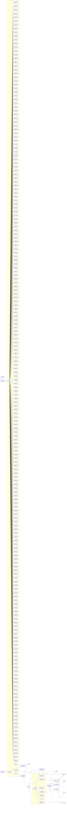

```mermaid
flowchart LR
  subgraph path3 [Path]
    3["Path<br>[1061, 1111, 0]"]
    4["Segment<br>[1061, 1111, 0]"]
    5[Solid2d]
  end
  subgraph path11 [Path]
    11["Path<br>[1588, 1625, 0]"]
    12["Segment<br>[1276, 1314, 0]"]
    13["Segment<br>[1276, 1314, 0]"]
    14["Segment<br>[1276, 1314, 0]"]
    15["Segment<br>[1276, 1314, 0]"]
    16["Segment<br>[1276, 1314, 0]"]
    17["Segment<br>[1276, 1314, 0]"]
    18["Segment<br>[1276, 1314, 0]"]
    19["Segment<br>[1276, 1314, 0]"]
    20["Segment<br>[1276, 1314, 0]"]
    21["Segment<br>[1276, 1314, 0]"]
    22["Segment<br>[1276, 1314, 0]"]
    23["Segment<br>[1276, 1314, 0]"]
    24["Segment<br>[1276, 1314, 0]"]
    25["Segment<br>[1276, 1314, 0]"]
    26["Segment<br>[1276, 1314, 0]"]
    27["Segment<br>[1276, 1314, 0]"]
    28["Segment<br>[1276, 1314, 0]"]
    29["Segment<br>[1276, 1314, 0]"]
    30["Segment<br>[1276, 1314, 0]"]
    31["Segment<br>[1276, 1314, 0]"]
    32["Segment<br>[1276, 1314, 0]"]
    33["Segment<br>[1276, 1314, 0]"]
    34["Segment<br>[1276, 1314, 0]"]
    35["Segment<br>[1276, 1314, 0]"]
    36["Segment<br>[1276, 1314, 0]"]
    37["Segment<br>[1276, 1314, 0]"]
    38["Segment<br>[1276, 1314, 0]"]
    39["Segment<br>[1276, 1314, 0]"]
    40["Segment<br>[1276, 1314, 0]"]
    41["Segment<br>[1276, 1314, 0]"]
    42["Segment<br>[1276, 1314, 0]"]
    43["Segment<br>[1276, 1314, 0]"]
    44["Segment<br>[1276, 1314, 0]"]
    45["Segment<br>[1276, 1314, 0]"]
    46["Segment<br>[1276, 1314, 0]"]
    47["Segment<br>[1276, 1314, 0]"]
    48["Segment<br>[1276, 1314, 0]"]
    49["Segment<br>[1276, 1314, 0]"]
    50["Segment<br>[1276, 1314, 0]"]
    51["Segment<br>[1276, 1314, 0]"]
    52["Segment<br>[1276, 1314, 0]"]
    53["Segment<br>[1276, 1314, 0]"]
    54["Segment<br>[1276, 1314, 0]"]
    55["Segment<br>[1276, 1314, 0]"]
    56["Segment<br>[1276, 1314, 0]"]
    57["Segment<br>[1276, 1314, 0]"]
    58["Segment<br>[1276, 1314, 0]"]
    59["Segment<br>[1276, 1314, 0]"]
    60["Segment<br>[1276, 1314, 0]"]
    61["Segment<br>[1276, 1314, 0]"]
    62["Segment<br>[1276, 1314, 0]"]
    63["Segment<br>[1276, 1314, 0]"]
    64["Segment<br>[1276, 1314, 0]"]
    65["Segment<br>[1276, 1314, 0]"]
    66["Segment<br>[1276, 1314, 0]"]
    67["Segment<br>[1276, 1314, 0]"]
    68["Segment<br>[1276, 1314, 0]"]
    69["Segment<br>[1276, 1314, 0]"]
    70["Segment<br>[1276, 1314, 0]"]
    71["Segment<br>[1276, 1314, 0]"]
    72["Segment<br>[1276, 1314, 0]"]
    73["Segment<br>[1276, 1314, 0]"]
    74["Segment<br>[1276, 1314, 0]"]
    75["Segment<br>[1276, 1314, 0]"]
    76["Segment<br>[1276, 1314, 0]"]
    77["Segment<br>[1276, 1314, 0]"]
    78["Segment<br>[1276, 1314, 0]"]
    79["Segment<br>[1276, 1314, 0]"]
    80["Segment<br>[1276, 1314, 0]"]
    81["Segment<br>[1276, 1314, 0]"]
    82["Segment<br>[1276, 1314, 0]"]
    83["Segment<br>[1276, 1314, 0]"]
    84["Segment<br>[1276, 1314, 0]"]
    85["Segment<br>[1276, 1314, 0]"]
    86["Segment<br>[1276, 1314, 0]"]
    87["Segment<br>[1276, 1314, 0]"]
    88["Segment<br>[1276, 1314, 0]"]
    89["Segment<br>[1276, 1314, 0]"]
    90["Segment<br>[1276, 1314, 0]"]
    91["Segment<br>[1276, 1314, 0]"]
    92["Segment<br>[1276, 1314, 0]"]
    93["Segment<br>[1276, 1314, 0]"]
    94["Segment<br>[1276, 1314, 0]"]
    95["Segment<br>[1276, 1314, 0]"]
    96["Segment<br>[1276, 1314, 0]"]
    97["Segment<br>[1276, 1314, 0]"]
    98["Segment<br>[1276, 1314, 0]"]
    99["Segment<br>[1276, 1314, 0]"]
    100["Segment<br>[1276, 1314, 0]"]
    101["Segment<br>[1276, 1314, 0]"]
    102["Segment<br>[1276, 1314, 0]"]
    103["Segment<br>[1276, 1314, 0]"]
    104["Segment<br>[1276, 1314, 0]"]
    105["Segment<br>[1276, 1314, 0]"]
    106["Segment<br>[1276, 1314, 0]"]
    107["Segment<br>[1276, 1314, 0]"]
    108["Segment<br>[1276, 1314, 0]"]
    109["Segment<br>[1276, 1314, 0]"]
    110["Segment<br>[1276, 1314, 0]"]
    111["Segment<br>[1276, 1314, 0]"]
    112["Segment<br>[1276, 1314, 0]"]
    113["Segment<br>[1677, 1775, 0]"]
    114["Segment<br>[1504, 1534, 0]"]
    115["Segment<br>[1504, 1534, 0]"]
    116["Segment<br>[1504, 1534, 0]"]
    117["Segment<br>[1504, 1534, 0]"]
    118["Segment<br>[1504, 1534, 0]"]
    119["Segment<br>[1504, 1534, 0]"]
    120["Segment<br>[1504, 1534, 0]"]
    121["Segment<br>[1504, 1534, 0]"]
    122["Segment<br>[1504, 1534, 0]"]
    123["Segment<br>[1504, 1534, 0]"]
    124["Segment<br>[1504, 1534, 0]"]
    125["Segment<br>[1504, 1534, 0]"]
    126["Segment<br>[1504, 1534, 0]"]
    127["Segment<br>[1504, 1534, 0]"]
    128["Segment<br>[1504, 1534, 0]"]
    129["Segment<br>[1504, 1534, 0]"]
    130["Segment<br>[1504, 1534, 0]"]
    131["Segment<br>[1504, 1534, 0]"]
    132["Segment<br>[1504, 1534, 0]"]
    133["Segment<br>[1504, 1534, 0]"]
    134["Segment<br>[1504, 1534, 0]"]
    135["Segment<br>[1504, 1534, 0]"]
    136["Segment<br>[1504, 1534, 0]"]
    137["Segment<br>[1504, 1534, 0]"]
    138["Segment<br>[1504, 1534, 0]"]
    139["Segment<br>[1504, 1534, 0]"]
    140["Segment<br>[1504, 1534, 0]"]
    141["Segment<br>[1504, 1534, 0]"]
    142["Segment<br>[1504, 1534, 0]"]
    143["Segment<br>[1504, 1534, 0]"]
    144["Segment<br>[1504, 1534, 0]"]
    145["Segment<br>[1504, 1534, 0]"]
    146["Segment<br>[1504, 1534, 0]"]
    147["Segment<br>[1504, 1534, 0]"]
    148["Segment<br>[1504, 1534, 0]"]
    149["Segment<br>[1504, 1534, 0]"]
    150["Segment<br>[1504, 1534, 0]"]
    151["Segment<br>[1504, 1534, 0]"]
    152["Segment<br>[1504, 1534, 0]"]
    153["Segment<br>[1504, 1534, 0]"]
    154["Segment<br>[1504, 1534, 0]"]
    155["Segment<br>[1504, 1534, 0]"]
    156["Segment<br>[1504, 1534, 0]"]
    157["Segment<br>[1504, 1534, 0]"]
    158["Segment<br>[1504, 1534, 0]"]
    159["Segment<br>[1504, 1534, 0]"]
    160["Segment<br>[1504, 1534, 0]"]
    161["Segment<br>[1504, 1534, 0]"]
    162["Segment<br>[1504, 1534, 0]"]
    163["Segment<br>[1504, 1534, 0]"]
    164["Segment<br>[1504, 1534, 0]"]
    165["Segment<br>[1504, 1534, 0]"]
    166["Segment<br>[1504, 1534, 0]"]
    167["Segment<br>[1504, 1534, 0]"]
    168["Segment<br>[1504, 1534, 0]"]
    169["Segment<br>[1504, 1534, 0]"]
    170["Segment<br>[1504, 1534, 0]"]
    171["Segment<br>[1504, 1534, 0]"]
    172["Segment<br>[1504, 1534, 0]"]
    173["Segment<br>[1504, 1534, 0]"]
    174["Segment<br>[1504, 1534, 0]"]
    175["Segment<br>[1504, 1534, 0]"]
    176["Segment<br>[1504, 1534, 0]"]
    177["Segment<br>[1504, 1534, 0]"]
    178["Segment<br>[1504, 1534, 0]"]
    179["Segment<br>[1504, 1534, 0]"]
    180["Segment<br>[1504, 1534, 0]"]
    181["Segment<br>[1504, 1534, 0]"]
    182["Segment<br>[1504, 1534, 0]"]
    183["Segment<br>[1504, 1534, 0]"]
    184["Segment<br>[1504, 1534, 0]"]
    185["Segment<br>[1504, 1534, 0]"]
    186["Segment<br>[1504, 1534, 0]"]
    187["Segment<br>[1504, 1534, 0]"]
    188["Segment<br>[1504, 1534, 0]"]
    189["Segment<br>[1504, 1534, 0]"]
    190["Segment<br>[1504, 1534, 0]"]
    191["Segment<br>[1504, 1534, 0]"]
    192["Segment<br>[1504, 1534, 0]"]
    193["Segment<br>[1504, 1534, 0]"]
    194["Segment<br>[1504, 1534, 0]"]
    195["Segment<br>[1504, 1534, 0]"]
    196["Segment<br>[1504, 1534, 0]"]
    197["Segment<br>[1504, 1534, 0]"]
    198["Segment<br>[1504, 1534, 0]"]
    199["Segment<br>[1504, 1534, 0]"]
    200["Segment<br>[1504, 1534, 0]"]
    201["Segment<br>[1504, 1534, 0]"]
    202["Segment<br>[1504, 1534, 0]"]
    203["Segment<br>[1504, 1534, 0]"]
    204["Segment<br>[1504, 1534, 0]"]
    205["Segment<br>[1504, 1534, 0]"]
    206["Segment<br>[1504, 1534, 0]"]
    207["Segment<br>[1504, 1534, 0]"]
    208["Segment<br>[1504, 1534, 0]"]
    209["Segment<br>[1504, 1534, 0]"]
    210["Segment<br>[1504, 1534, 0]"]
    211["Segment<br>[1504, 1534, 0]"]
    212["Segment<br>[1504, 1534, 0]"]
    213["Segment<br>[1504, 1534, 0]"]
    214["Segment<br>[1504, 1534, 0]"]
    215["Segment<br>[1821, 1828, 0]"]
    216[Solid2d]
  end
  subgraph path218 [Path]
    218["Path<br>[2309, 2409, 0]"]
    219["Segment<br>[2415, 2442, 0]"]
    220["Segment<br>[2448, 2476, 0]"]
    221["Segment<br>[2482, 2510, 0]"]
    222["Segment<br>[2516, 2632, 0]"]
    223["Segment<br>[2638, 2743, 0]"]
    224["Segment<br>[2749, 2756, 0]"]
    225[Solid2d]
  end
  1["Plane<br>[168, 185, 0]"]
  2["Plane<br>[1038, 1055, 0]"]
  6["Sweep Extrusion<br>[1117, 1145, 0]"]
  7[Wall]
  8["Cap Start"]
  9["Cap End"]
  10["Plane<br>[1565, 1582, 0]"]
  217["Sweep Extrusion<br>[1834, 1862, 0]"]
  226["Sweep Extrusion<br>[2762, 2791, 0]"]
  227[Wall]
  228[Wall]
  229[Wall]
  230[Wall]
  231["SweepEdge Opposite"]
  232["SweepEdge Opposite"]
  233["SweepEdge Opposite"]
  234["StartSketchOnFace<br>[2272, 2303, 0]"]
  2 --- 3
  3 --- 4
  3 ---- 6
  3 --- 5
  4 --- 7
  4 x--> 8
  6 --- 7
  6 --- 8
  6 --- 9
  9 --- 218
  10 --- 11
  11 --- 12
  11 --- 13
  11 --- 14
  11 --- 15
  11 --- 16
  11 --- 17
  11 --- 18
  11 --- 19
  11 --- 20
  11 --- 21
  11 --- 22
  11 --- 23
  11 --- 24
  11 --- 25
  11 --- 26
  11 --- 27
  11 --- 28
  11 --- 29
  11 --- 30
  11 --- 31
  11 --- 32
  11 --- 33
  11 --- 34
  11 --- 35
  11 --- 36
  11 --- 37
  11 --- 38
  11 --- 39
  11 --- 40
  11 --- 41
  11 --- 42
  11 --- 43
  11 --- 44
  11 --- 45
  11 --- 46
  11 --- 47
  11 --- 48
  11 --- 49
  11 --- 50
  11 --- 51
  11 --- 52
  11 --- 53
  11 --- 54
  11 --- 55
  11 --- 56
  11 --- 57
  11 --- 58
  11 --- 59
  11 --- 60
  11 --- 61
  11 --- 62
  11 --- 63
  11 --- 64
  11 --- 65
  11 --- 66
  11 --- 67
  11 --- 68
  11 --- 69
  11 --- 70
  11 --- 71
  11 --- 72
  11 --- 73
  11 --- 74
  11 --- 75
  11 --- 76
  11 --- 77
  11 --- 78
  11 --- 79
  11 --- 80
  11 --- 81
  11 --- 82
  11 --- 83
  11 --- 84
  11 --- 85
  11 --- 86
  11 --- 87
  11 --- 88
  11 --- 89
  11 --- 90
  11 --- 91
  11 --- 92
  11 --- 93
  11 --- 94
  11 --- 95
  11 --- 96
  11 --- 97
  11 --- 98
  11 --- 99
  11 --- 100
  11 --- 101
  11 --- 102
  11 --- 103
  11 --- 104
  11 --- 105
  11 --- 106
  11 --- 107
  11 --- 108
  11 --- 109
  11 --- 110
  11 --- 111
  11 --- 112
  11 --- 113
  11 --- 114
  11 --- 115
  11 --- 116
  11 --- 117
  11 --- 118
  11 --- 119
  11 --- 120
  11 --- 121
  11 --- 122
  11 --- 123
  11 --- 124
  11 --- 125
  11 --- 126
  11 --- 127
  11 --- 128
  11 --- 129
  11 --- 130
  11 --- 131
  11 --- 132
  11 --- 133
  11 --- 134
  11 --- 135
  11 --- 136
  11 --- 137
  11 --- 138
  11 --- 139
  11 --- 140
  11 --- 141
  11 --- 142
  11 --- 143
  11 --- 144
  11 --- 145
  11 --- 146
  11 --- 147
  11 --- 148
  11 --- 149
  11 --- 150
  11 --- 151
  11 --- 152
  11 --- 153
  11 --- 154
  11 --- 155
  11 --- 156
  11 --- 157
  11 --- 158
  11 --- 159
  11 --- 160
  11 --- 161
  11 --- 162
  11 --- 163
  11 --- 164
  11 --- 165
  11 --- 166
  11 --- 167
  11 --- 168
  11 --- 169
  11 --- 170
  11 --- 171
  11 --- 172
  11 --- 173
  11 --- 174
  11 --- 175
  11 --- 176
  11 --- 177
  11 --- 178
  11 --- 179
  11 --- 180
  11 --- 181
  11 --- 182
  11 --- 183
  11 --- 184
  11 --- 185
  11 --- 186
  11 --- 187
  11 --- 188
  11 --- 189
  11 --- 190
  11 --- 191
  11 --- 192
  11 --- 193
  11 --- 194
  11 --- 195
  11 --- 196
  11 --- 197
  11 --- 198
  11 --- 199
  11 --- 200
  11 --- 201
  11 --- 202
  11 --- 203
  11 --- 204
  11 --- 205
  11 --- 206
  11 --- 207
  11 --- 208
  11 --- 209
  11 --- 210
  11 --- 211
  11 --- 212
  11 --- 213
  11 --- 214
  11 --- 215
  11 ---- 217
  11 --- 216
  218 --- 219
  218 --- 220
  218 --- 221
  218 --- 222
  218 --- 223
  218 --- 224
  218 ---- 226
  218 --- 225
  219 --- 230
  219 --- 233
  219 <--x 9
  220 --- 229
  220 --- 232
  220 <--x 9
  221 --- 228
  221 --- 231
  221 <--x 9
  223 --- 227
  223 <--x 9
  226 --- 227
  226 --- 228
  226 --- 229
  226 --- 230
  226 --- 231
  226 --- 232
  226 --- 233
  231 <--x 228
  231 <--x 8
  232 <--x 229
  232 <--x 8
  233 <--x 230
  233 <--x 8
  9 <--x 234
```
