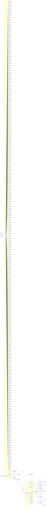

```mermaid
flowchart LR
  subgraph path5 [Path]
    5["Path<br>[1109, 1159, 0]"]
    8["Segment<br>[1109, 1159, 0]"]
    220[Solid2d]
  end
  subgraph path6 [Path]
    6["Path<br>[1664, 1701, 0]"]
    9["Segment<br>[1324, 1362, 0]"]
    10["Segment<br>[1324, 1362, 0]"]
    11["Segment<br>[1324, 1362, 0]"]
    12["Segment<br>[1324, 1362, 0]"]
    13["Segment<br>[1324, 1362, 0]"]
    14["Segment<br>[1324, 1362, 0]"]
    15["Segment<br>[1324, 1362, 0]"]
    16["Segment<br>[1324, 1362, 0]"]
    17["Segment<br>[1324, 1362, 0]"]
    18["Segment<br>[1324, 1362, 0]"]
    19["Segment<br>[1324, 1362, 0]"]
    20["Segment<br>[1324, 1362, 0]"]
    21["Segment<br>[1324, 1362, 0]"]
    22["Segment<br>[1324, 1362, 0]"]
    23["Segment<br>[1324, 1362, 0]"]
    24["Segment<br>[1324, 1362, 0]"]
    25["Segment<br>[1324, 1362, 0]"]
    26["Segment<br>[1324, 1362, 0]"]
    27["Segment<br>[1324, 1362, 0]"]
    28["Segment<br>[1324, 1362, 0]"]
    29["Segment<br>[1324, 1362, 0]"]
    30["Segment<br>[1324, 1362, 0]"]
    31["Segment<br>[1324, 1362, 0]"]
    32["Segment<br>[1324, 1362, 0]"]
    33["Segment<br>[1324, 1362, 0]"]
    34["Segment<br>[1324, 1362, 0]"]
    35["Segment<br>[1324, 1362, 0]"]
    36["Segment<br>[1324, 1362, 0]"]
    37["Segment<br>[1324, 1362, 0]"]
    38["Segment<br>[1324, 1362, 0]"]
    39["Segment<br>[1324, 1362, 0]"]
    40["Segment<br>[1324, 1362, 0]"]
    41["Segment<br>[1324, 1362, 0]"]
    42["Segment<br>[1324, 1362, 0]"]
    43["Segment<br>[1324, 1362, 0]"]
    44["Segment<br>[1324, 1362, 0]"]
    45["Segment<br>[1324, 1362, 0]"]
    46["Segment<br>[1324, 1362, 0]"]
    47["Segment<br>[1324, 1362, 0]"]
    48["Segment<br>[1324, 1362, 0]"]
    49["Segment<br>[1324, 1362, 0]"]
    50["Segment<br>[1324, 1362, 0]"]
    51["Segment<br>[1324, 1362, 0]"]
    52["Segment<br>[1324, 1362, 0]"]
    53["Segment<br>[1324, 1362, 0]"]
    54["Segment<br>[1324, 1362, 0]"]
    55["Segment<br>[1324, 1362, 0]"]
    56["Segment<br>[1324, 1362, 0]"]
    57["Segment<br>[1324, 1362, 0]"]
    58["Segment<br>[1324, 1362, 0]"]
    59["Segment<br>[1324, 1362, 0]"]
    60["Segment<br>[1324, 1362, 0]"]
    61["Segment<br>[1324, 1362, 0]"]
    62["Segment<br>[1324, 1362, 0]"]
    63["Segment<br>[1324, 1362, 0]"]
    64["Segment<br>[1324, 1362, 0]"]
    65["Segment<br>[1324, 1362, 0]"]
    66["Segment<br>[1324, 1362, 0]"]
    67["Segment<br>[1324, 1362, 0]"]
    68["Segment<br>[1324, 1362, 0]"]
    69["Segment<br>[1324, 1362, 0]"]
    70["Segment<br>[1324, 1362, 0]"]
    71["Segment<br>[1324, 1362, 0]"]
    72["Segment<br>[1324, 1362, 0]"]
    73["Segment<br>[1324, 1362, 0]"]
    74["Segment<br>[1324, 1362, 0]"]
    75["Segment<br>[1324, 1362, 0]"]
    76["Segment<br>[1324, 1362, 0]"]
    77["Segment<br>[1324, 1362, 0]"]
    78["Segment<br>[1324, 1362, 0]"]
    79["Segment<br>[1324, 1362, 0]"]
    80["Segment<br>[1324, 1362, 0]"]
    81["Segment<br>[1324, 1362, 0]"]
    82["Segment<br>[1324, 1362, 0]"]
    83["Segment<br>[1324, 1362, 0]"]
    84["Segment<br>[1324, 1362, 0]"]
    85["Segment<br>[1324, 1362, 0]"]
    86["Segment<br>[1324, 1362, 0]"]
    87["Segment<br>[1324, 1362, 0]"]
    88["Segment<br>[1324, 1362, 0]"]
    89["Segment<br>[1324, 1362, 0]"]
    90["Segment<br>[1324, 1362, 0]"]
    91["Segment<br>[1324, 1362, 0]"]
    92["Segment<br>[1324, 1362, 0]"]
    93["Segment<br>[1324, 1362, 0]"]
    94["Segment<br>[1324, 1362, 0]"]
    95["Segment<br>[1324, 1362, 0]"]
    96["Segment<br>[1324, 1362, 0]"]
    97["Segment<br>[1324, 1362, 0]"]
    98["Segment<br>[1324, 1362, 0]"]
    99["Segment<br>[1324, 1362, 0]"]
    100["Segment<br>[1324, 1362, 0]"]
    101["Segment<br>[1324, 1362, 0]"]
    102["Segment<br>[1324, 1362, 0]"]
    103["Segment<br>[1324, 1362, 0]"]
    104["Segment<br>[1324, 1362, 0]"]
    105["Segment<br>[1324, 1362, 0]"]
    106["Segment<br>[1324, 1362, 0]"]
    107["Segment<br>[1324, 1362, 0]"]
    108["Segment<br>[1324, 1362, 0]"]
    109["Segment<br>[1324, 1362, 0]"]
    110["Segment<br>[1580, 1610, 0]"]
    111["Segment<br>[1580, 1610, 0]"]
    112["Segment<br>[1580, 1610, 0]"]
    113["Segment<br>[1580, 1610, 0]"]
    114["Segment<br>[1580, 1610, 0]"]
    115["Segment<br>[1580, 1610, 0]"]
    116["Segment<br>[1580, 1610, 0]"]
    117["Segment<br>[1580, 1610, 0]"]
    118["Segment<br>[1580, 1610, 0]"]
    119["Segment<br>[1580, 1610, 0]"]
    120["Segment<br>[1580, 1610, 0]"]
    121["Segment<br>[1580, 1610, 0]"]
    122["Segment<br>[1580, 1610, 0]"]
    123["Segment<br>[1580, 1610, 0]"]
    124["Segment<br>[1580, 1610, 0]"]
    125["Segment<br>[1580, 1610, 0]"]
    126["Segment<br>[1580, 1610, 0]"]
    127["Segment<br>[1580, 1610, 0]"]
    128["Segment<br>[1580, 1610, 0]"]
    129["Segment<br>[1580, 1610, 0]"]
    130["Segment<br>[1580, 1610, 0]"]
    131["Segment<br>[1580, 1610, 0]"]
    132["Segment<br>[1580, 1610, 0]"]
    133["Segment<br>[1580, 1610, 0]"]
    134["Segment<br>[1580, 1610, 0]"]
    135["Segment<br>[1580, 1610, 0]"]
    136["Segment<br>[1580, 1610, 0]"]
    137["Segment<br>[1580, 1610, 0]"]
    138["Segment<br>[1580, 1610, 0]"]
    139["Segment<br>[1580, 1610, 0]"]
    140["Segment<br>[1580, 1610, 0]"]
    141["Segment<br>[1580, 1610, 0]"]
    142["Segment<br>[1580, 1610, 0]"]
    143["Segment<br>[1580, 1610, 0]"]
    144["Segment<br>[1580, 1610, 0]"]
    145["Segment<br>[1580, 1610, 0]"]
    146["Segment<br>[1580, 1610, 0]"]
    147["Segment<br>[1580, 1610, 0]"]
    148["Segment<br>[1580, 1610, 0]"]
    149["Segment<br>[1580, 1610, 0]"]
    150["Segment<br>[1580, 1610, 0]"]
    151["Segment<br>[1580, 1610, 0]"]
    152["Segment<br>[1580, 1610, 0]"]
    153["Segment<br>[1580, 1610, 0]"]
    154["Segment<br>[1580, 1610, 0]"]
    155["Segment<br>[1580, 1610, 0]"]
    156["Segment<br>[1580, 1610, 0]"]
    157["Segment<br>[1580, 1610, 0]"]
    158["Segment<br>[1580, 1610, 0]"]
    159["Segment<br>[1580, 1610, 0]"]
    160["Segment<br>[1580, 1610, 0]"]
    161["Segment<br>[1580, 1610, 0]"]
    162["Segment<br>[1580, 1610, 0]"]
    163["Segment<br>[1580, 1610, 0]"]
    164["Segment<br>[1580, 1610, 0]"]
    165["Segment<br>[1580, 1610, 0]"]
    166["Segment<br>[1580, 1610, 0]"]
    167["Segment<br>[1580, 1610, 0]"]
    168["Segment<br>[1580, 1610, 0]"]
    169["Segment<br>[1580, 1610, 0]"]
    170["Segment<br>[1580, 1610, 0]"]
    171["Segment<br>[1580, 1610, 0]"]
    172["Segment<br>[1580, 1610, 0]"]
    173["Segment<br>[1580, 1610, 0]"]
    174["Segment<br>[1580, 1610, 0]"]
    175["Segment<br>[1580, 1610, 0]"]
    176["Segment<br>[1580, 1610, 0]"]
    177["Segment<br>[1580, 1610, 0]"]
    178["Segment<br>[1580, 1610, 0]"]
    179["Segment<br>[1580, 1610, 0]"]
    180["Segment<br>[1580, 1610, 0]"]
    181["Segment<br>[1580, 1610, 0]"]
    182["Segment<br>[1580, 1610, 0]"]
    183["Segment<br>[1580, 1610, 0]"]
    184["Segment<br>[1580, 1610, 0]"]
    185["Segment<br>[1580, 1610, 0]"]
    186["Segment<br>[1580, 1610, 0]"]
    187["Segment<br>[1580, 1610, 0]"]
    188["Segment<br>[1580, 1610, 0]"]
    189["Segment<br>[1580, 1610, 0]"]
    190["Segment<br>[1580, 1610, 0]"]
    191["Segment<br>[1580, 1610, 0]"]
    192["Segment<br>[1580, 1610, 0]"]
    193["Segment<br>[1580, 1610, 0]"]
    194["Segment<br>[1580, 1610, 0]"]
    195["Segment<br>[1580, 1610, 0]"]
    196["Segment<br>[1580, 1610, 0]"]
    197["Segment<br>[1580, 1610, 0]"]
    198["Segment<br>[1580, 1610, 0]"]
    199["Segment<br>[1580, 1610, 0]"]
    200["Segment<br>[1580, 1610, 0]"]
    201["Segment<br>[1580, 1610, 0]"]
    202["Segment<br>[1580, 1610, 0]"]
    203["Segment<br>[1580, 1610, 0]"]
    204["Segment<br>[1580, 1610, 0]"]
    205["Segment<br>[1580, 1610, 0]"]
    206["Segment<br>[1580, 1610, 0]"]
    207["Segment<br>[1580, 1610, 0]"]
    208["Segment<br>[1580, 1610, 0]"]
    209["Segment<br>[1580, 1610, 0]"]
    210["Segment<br>[1580, 1610, 0]"]
    211["Segment<br>[1767, 1865, 0]"]
    212["Segment<br>[1925, 1932, 0]"]
    219[Solid2d]
  end
  subgraph path7 [Path]
    7["Path<br>[2413, 2492, 0]"]
    213["Segment<br>[2498, 2525, 0]"]
    214["Segment<br>[2531, 2559, 0]"]
    215["Segment<br>[2565, 2593, 0]"]
    216["Segment<br>[2599, 2722, 0]"]
    217["Segment<br>[2728, 2840, 0]"]
    218["Segment<br>[2846, 2853, 0]"]
    221[Solid2d]
  end
  1["Plane<br>[168, 185, 0]"]
  2["Plane<br>[1086, 1103, 0]"]
  3["Plane<br>[1641, 1658, 0]"]
  4["StartSketchOnFace<br>[2376, 2407, 0]"]
  222["Sweep Extrusion<br>[1165, 1193, 0]"]
  223["Sweep Extrusion<br>[1938, 1966, 0]"]
  224["Sweep Extrusion<br>[2859, 2888, 0]"]
  225[Wall]
  226[Wall]
  227[Wall]
  228[Wall]
  229[Wall]
  230["Cap Start"]
  231["Cap End"]
  232["SweepEdge Opposite"]
  233["SweepEdge Adjacent"]
  234["SweepEdge Opposite"]
  235["SweepEdge Adjacent"]
  236["SweepEdge Opposite"]
  237["SweepEdge Adjacent"]
  238["SweepEdge Opposite"]
  239["SweepEdge Adjacent"]
  240["SweepEdge Opposite"]
  241["SweepEdge Adjacent"]
  2 --- 5
  3 --- 6
  231 x--> 4
  5 --- 8
  5 --- 220
  5 ---- 222
  6 --- 9
  6 --- 10
  6 --- 11
  6 --- 12
  6 --- 13
  6 --- 14
  6 --- 15
  6 --- 16
  6 --- 17
  6 --- 18
  6 --- 19
  6 --- 20
  6 --- 21
  6 --- 22
  6 --- 23
  6 --- 24
  6 --- 25
  6 --- 26
  6 --- 27
  6 --- 28
  6 --- 29
  6 --- 30
  6 --- 31
  6 --- 32
  6 --- 33
  6 --- 34
  6 --- 35
  6 --- 36
  6 --- 37
  6 --- 38
  6 --- 39
  6 --- 40
  6 --- 41
  6 --- 42
  6 --- 43
  6 --- 44
  6 --- 45
  6 --- 46
  6 --- 47
  6 --- 48
  6 --- 49
  6 --- 50
  6 --- 51
  6 --- 52
  6 --- 53
  6 --- 54
  6 --- 55
  6 --- 56
  6 --- 57
  6 --- 58
  6 --- 59
  6 --- 60
  6 --- 61
  6 --- 62
  6 --- 63
  6 --- 64
  6 --- 65
  6 --- 66
  6 --- 67
  6 --- 68
  6 --- 69
  6 --- 70
  6 --- 71
  6 --- 72
  6 --- 73
  6 --- 74
  6 --- 75
  6 --- 76
  6 --- 77
  6 --- 78
  6 --- 79
  6 --- 80
  6 --- 81
  6 --- 82
  6 --- 83
  6 --- 84
  6 --- 85
  6 --- 86
  6 --- 87
  6 --- 88
  6 --- 89
  6 --- 90
  6 --- 91
  6 --- 92
  6 --- 93
  6 --- 94
  6 --- 95
  6 --- 96
  6 --- 97
  6 --- 98
  6 --- 99
  6 --- 100
  6 --- 101
  6 --- 102
  6 --- 103
  6 --- 104
  6 --- 105
  6 --- 106
  6 --- 107
  6 --- 108
  6 --- 109
  6 --- 110
  6 --- 111
  6 --- 112
  6 --- 113
  6 --- 114
  6 --- 115
  6 --- 116
  6 --- 117
  6 --- 118
  6 --- 119
  6 --- 120
  6 --- 121
  6 --- 122
  6 --- 123
  6 --- 124
  6 --- 125
  6 --- 126
  6 --- 127
  6 --- 128
  6 --- 129
  6 --- 130
  6 --- 131
  6 --- 132
  6 --- 133
  6 --- 134
  6 --- 135
  6 --- 136
  6 --- 137
  6 --- 138
  6 --- 139
  6 --- 140
  6 --- 141
  6 --- 142
  6 --- 143
  6 --- 144
  6 --- 145
  6 --- 146
  6 --- 147
  6 --- 148
  6 --- 149
  6 --- 150
  6 --- 151
  6 --- 152
  6 --- 153
  6 --- 154
  6 --- 155
  6 --- 156
  6 --- 157
  6 --- 158
  6 --- 159
  6 --- 160
  6 --- 161
  6 --- 162
  6 --- 163
  6 --- 164
  6 --- 165
  6 --- 166
  6 --- 167
  6 --- 168
  6 --- 169
  6 --- 170
  6 --- 171
  6 --- 172
  6 --- 173
  6 --- 174
  6 --- 175
  6 --- 176
  6 --- 177
  6 --- 178
  6 --- 179
  6 --- 180
  6 --- 181
  6 --- 182
  6 --- 183
  6 --- 184
  6 --- 185
  6 --- 186
  6 --- 187
  6 --- 188
  6 --- 189
  6 --- 190
  6 --- 191
  6 --- 192
  6 --- 193
  6 --- 194
  6 --- 195
  6 --- 196
  6 --- 197
  6 --- 198
  6 --- 199
  6 --- 200
  6 --- 201
  6 --- 202
  6 --- 203
  6 --- 204
  6 --- 205
  6 --- 206
  6 --- 207
  6 --- 208
  6 --- 209
  6 --- 210
  6 --- 211
  6 --- 212
  6 --- 219
  6 ---- 223
  7 --- 213
  7 --- 214
  7 --- 215
  7 --- 216
  7 --- 217
  7 --- 218
  7 --- 221
  7 ---- 224
  231 --- 7
  8 --- 225
  8 x--> 230
  8 --- 232
  8 --- 233
  213 --- 228
  213 x--> 231
  213 --- 238
  213 --- 239
  214 --- 227
  214 x--> 231
  214 --- 236
  214 --- 237
  215 --- 226
  215 x--> 231
  215 --- 234
  215 --- 235
  217 --- 229
  217 x--> 231
  217 --- 240
  217 --- 241
  222 --- 225
  222 --- 230
  222 --- 231
  222 --- 232
  222 --- 233
  224 --- 226
  224 --- 227
  224 --- 228
  224 --- 229
  224 --- 234
  224 --- 235
  224 --- 236
  224 --- 237
  224 --- 238
  224 --- 239
  224 --- 240
  224 --- 241
  232 <--x 225
  233 <--x 225
  234 <--x 226
  235 <--x 226
  237 <--x 226
  236 <--x 227
  237 <--x 227
  239 <--x 227
  238 <--x 228
  239 <--x 228
  241 <--x 228
  235 <--x 229
  240 <--x 229
  241 <--x 229
  234 <--x 230
  236 <--x 230
  238 <--x 230
  240 <--x 230
  232 <--x 231
```
