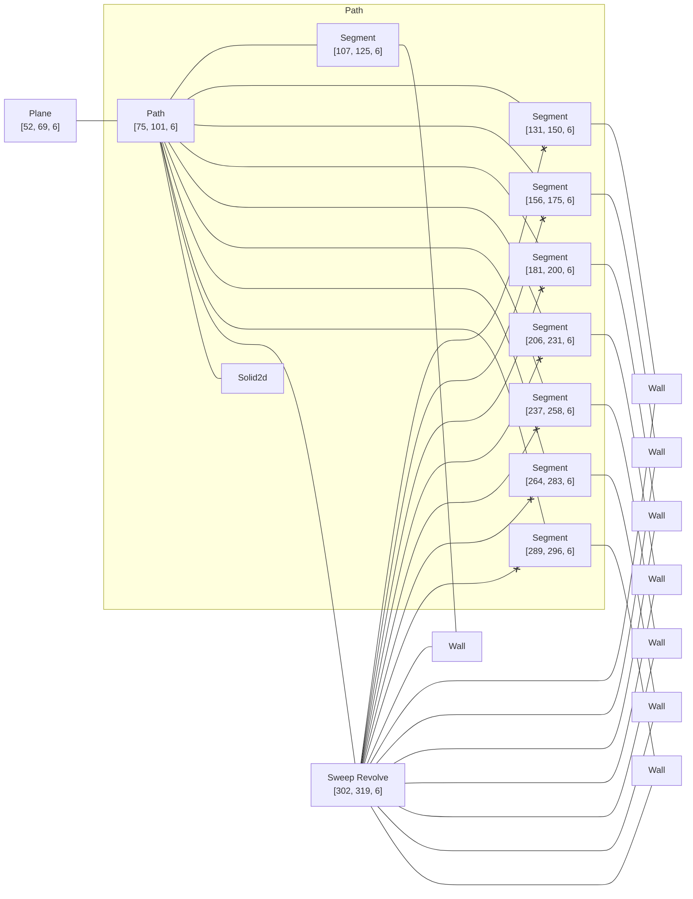

```mermaid
flowchart LR
  subgraph path2 [Path]
    2["Path<br>[75, 101, 6]"]
    3["Segment<br>[107, 125, 6]"]
    4["Segment<br>[131, 150, 6]"]
    5["Segment<br>[156, 175, 6]"]
    6["Segment<br>[181, 200, 6]"]
    7["Segment<br>[206, 231, 6]"]
    8["Segment<br>[237, 258, 6]"]
    9["Segment<br>[264, 283, 6]"]
    10["Segment<br>[289, 296, 6]"]
    11[Solid2d]
  end
  1["Plane<br>[52, 69, 6]"]
  12["Sweep Revolve<br>[302, 319, 6]"]
  13[Wall]
  14[Wall]
  15[Wall]
  16[Wall]
  17[Wall]
  18[Wall]
  19[Wall]
  20[Wall]
  1 --- 2
  2 --- 3
  2 --- 4
  2 --- 5
  2 --- 6
  2 --- 7
  2 --- 8
  2 --- 9
  2 --- 10
  2 ---- 12
  2 --- 11
  3 --- 13
  4 --- 14
  5 --- 15
  6 --- 16
  7 --- 17
  8 --- 18
  9 --- 19
  10 --- 20
  12 --- 13
  12 --- 14
  12 --- 15
  12 --- 16
  12 --- 17
  12 --- 18
  12 --- 19
  12 --- 20
  12 <--x 4
  12 <--x 5
  12 <--x 6
  12 <--x 7
  12 <--x 8
  12 <--x 9
  12 <--x 10
```
