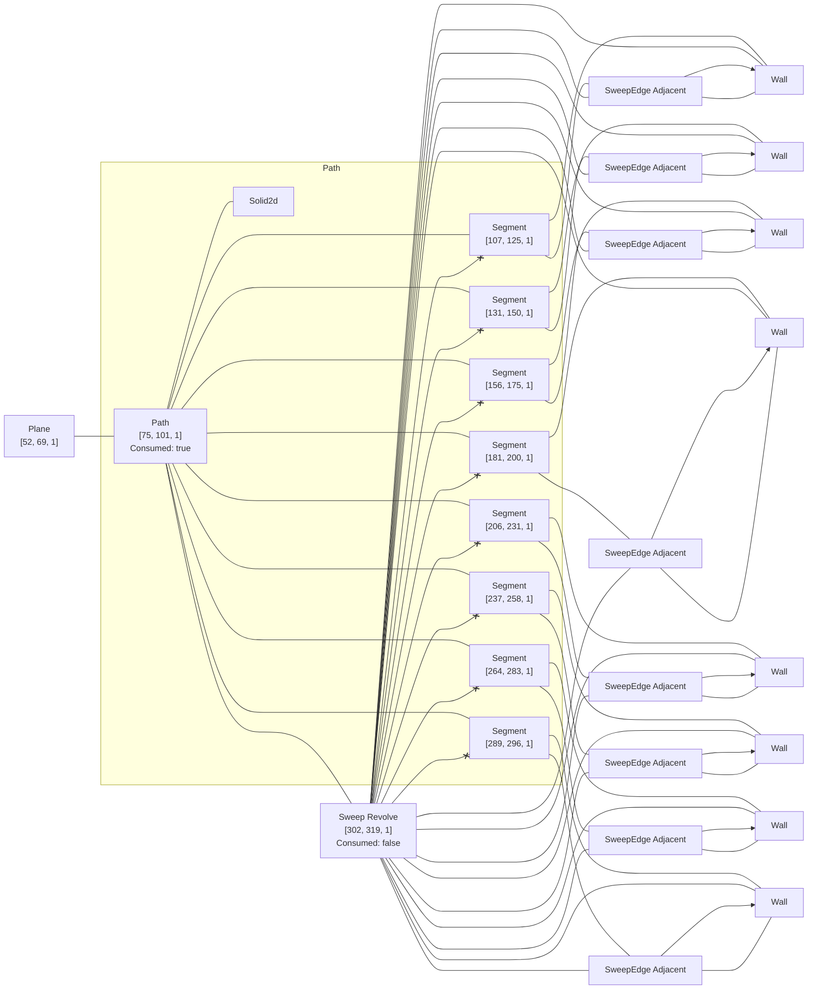

```mermaid
flowchart LR
  subgraph path1 [Path]
    1["Path<br>[75, 101, 1]<br>Consumed: true"]
      %% [ProgramBodyItem { index: 0 }, VariableDeclarationDeclaration, VariableDeclarationInit, PipeBodyItem { index: 1 }]
    3["Segment<br>[107, 125, 1]"]
      %% [ProgramBodyItem { index: 0 }, VariableDeclarationDeclaration, VariableDeclarationInit, PipeBodyItem { index: 2 }]
    4["Segment<br>[131, 150, 1]"]
      %% [ProgramBodyItem { index: 0 }, VariableDeclarationDeclaration, VariableDeclarationInit, PipeBodyItem { index: 3 }]
    5["Segment<br>[156, 175, 1]"]
      %% [ProgramBodyItem { index: 0 }, VariableDeclarationDeclaration, VariableDeclarationInit, PipeBodyItem { index: 4 }]
    6["Segment<br>[181, 200, 1]"]
      %% [ProgramBodyItem { index: 0 }, VariableDeclarationDeclaration, VariableDeclarationInit, PipeBodyItem { index: 5 }]
    7["Segment<br>[206, 231, 1]"]
      %% [ProgramBodyItem { index: 0 }, VariableDeclarationDeclaration, VariableDeclarationInit, PipeBodyItem { index: 6 }]
    8["Segment<br>[237, 258, 1]"]
      %% [ProgramBodyItem { index: 0 }, VariableDeclarationDeclaration, VariableDeclarationInit, PipeBodyItem { index: 7 }]
    9["Segment<br>[264, 283, 1]"]
      %% [ProgramBodyItem { index: 0 }, VariableDeclarationDeclaration, VariableDeclarationInit, PipeBodyItem { index: 8 }]
    10["Segment<br>[289, 296, 1]"]
      %% [ProgramBodyItem { index: 0 }, VariableDeclarationDeclaration, VariableDeclarationInit, PipeBodyItem { index: 9 }]
    11[Solid2d]
  end
  2["Plane<br>[52, 69, 1]"]
    %% [ProgramBodyItem { index: 0 }, VariableDeclarationDeclaration, VariableDeclarationInit, PipeBodyItem { index: 0 }]
  12["Sweep Revolve<br>[302, 319, 1]<br>Consumed: false"]
    %% [ProgramBodyItem { index: 0 }, VariableDeclarationDeclaration, VariableDeclarationInit, PipeBodyItem { index: 10 }]
  13["SweepEdge Adjacent"]
  14["SweepEdge Adjacent"]
  15["SweepEdge Adjacent"]
  16["SweepEdge Adjacent"]
  17["SweepEdge Adjacent"]
  18["SweepEdge Adjacent"]
  19["SweepEdge Adjacent"]
  20["SweepEdge Adjacent"]
  21[Wall]
    %% face_code_ref=Missing NodePath
  22[Wall]
    %% face_code_ref=Missing NodePath
  23[Wall]
    %% face_code_ref=Missing NodePath
  24[Wall]
    %% face_code_ref=Missing NodePath
  25[Wall]
    %% face_code_ref=Missing NodePath
  26[Wall]
    %% face_code_ref=Missing NodePath
  27[Wall]
    %% face_code_ref=Missing NodePath
  28[Wall]
    %% face_code_ref=Missing NodePath
  2 --- 1
  1 --- 3
  1 --- 4
  1 --- 5
  1 --- 6
  1 --- 7
  1 --- 8
  1 --- 9
  1 --- 10
  1 --- 11
  1 ---- 12
  12 <--x 3
  3 --- 13
  3 --- 21
  12 <--x 4
  4 --- 14
  4 --- 22
  12 <--x 5
  5 --- 15
  5 --- 23
  12 <--x 6
  6 --- 16
  6 --- 24
  12 <--x 7
  7 --- 17
  7 --- 25
  12 <--x 8
  8 --- 18
  8 --- 26
  12 <--x 9
  9 --- 19
  9 --- 27
  12 <--x 10
  10 --- 20
  10 --- 28
  12 --- 13
  12 --- 14
  12 --- 15
  12 --- 16
  12 --- 17
  12 --- 18
  12 --- 19
  12 --- 20
  12 --- 21
  12 --- 22
  12 --- 23
  12 --- 24
  12 --- 25
  12 --- 26
  12 --- 27
  12 --- 28
  21 --- 13
  13 x--> 21
  22 --- 14
  14 x--> 22
  23 --- 15
  15 x--> 23
  24 --- 16
  16 x--> 24
  25 --- 17
  17 x--> 25
  26 --- 18
  18 x--> 26
  27 --- 19
  19 x--> 27
  20 x--> 28
  28 --- 20
```
