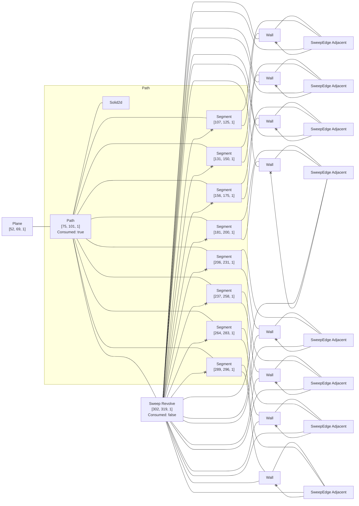

```mermaid
flowchart LR
  subgraph path10 [Path]
    10["Path<br>[75, 101, 1]<br>Consumed: true"]
      %% [ProgramBodyItem { index: 0 }, VariableDeclarationDeclaration, VariableDeclarationInit, PipeBodyItem { index: 1 }]
    11["Segment<br>[107, 125, 1]"]
      %% [ProgramBodyItem { index: 0 }, VariableDeclarationDeclaration, VariableDeclarationInit, PipeBodyItem { index: 2 }]
    12["Segment<br>[131, 150, 1]"]
      %% [ProgramBodyItem { index: 0 }, VariableDeclarationDeclaration, VariableDeclarationInit, PipeBodyItem { index: 3 }]
    13["Segment<br>[156, 175, 1]"]
      %% [ProgramBodyItem { index: 0 }, VariableDeclarationDeclaration, VariableDeclarationInit, PipeBodyItem { index: 4 }]
    14["Segment<br>[181, 200, 1]"]
      %% [ProgramBodyItem { index: 0 }, VariableDeclarationDeclaration, VariableDeclarationInit, PipeBodyItem { index: 5 }]
    15["Segment<br>[206, 231, 1]"]
      %% [ProgramBodyItem { index: 0 }, VariableDeclarationDeclaration, VariableDeclarationInit, PipeBodyItem { index: 6 }]
    16["Segment<br>[237, 258, 1]"]
      %% [ProgramBodyItem { index: 0 }, VariableDeclarationDeclaration, VariableDeclarationInit, PipeBodyItem { index: 7 }]
    17["Segment<br>[264, 283, 1]"]
      %% [ProgramBodyItem { index: 0 }, VariableDeclarationDeclaration, VariableDeclarationInit, PipeBodyItem { index: 8 }]
    18["Segment<br>[289, 296, 1]"]
      %% [ProgramBodyItem { index: 0 }, VariableDeclarationDeclaration, VariableDeclarationInit, PipeBodyItem { index: 9 }]
    20[Solid2d]
  end
  1[Wall]
    %% face_code_ref=Missing NodePath
  2[Wall]
    %% face_code_ref=Missing NodePath
  3[Wall]
    %% face_code_ref=Missing NodePath
  4[Wall]
    %% face_code_ref=Missing NodePath
  5[Wall]
    %% face_code_ref=Missing NodePath
  6[Wall]
    %% face_code_ref=Missing NodePath
  7[Wall]
    %% face_code_ref=Missing NodePath
  8[Wall]
    %% face_code_ref=Missing NodePath
  9["Plane<br>[52, 69, 1]"]
    %% [ProgramBodyItem { index: 0 }, VariableDeclarationDeclaration, VariableDeclarationInit, PipeBodyItem { index: 0 }]
  19["Sweep Revolve<br>[302, 319, 1]<br>Consumed: false"]
    %% [ProgramBodyItem { index: 0 }, VariableDeclarationDeclaration, VariableDeclarationInit, PipeBodyItem { index: 10 }]
  21["SweepEdge Adjacent"]
  22["SweepEdge Adjacent"]
  23["SweepEdge Adjacent"]
  24["SweepEdge Adjacent"]
  25["SweepEdge Adjacent"]
  26["SweepEdge Adjacent"]
  27["SweepEdge Adjacent"]
  28["SweepEdge Adjacent"]
  11 --- 1
  19 --- 1
  1 --- 21
  21 <--x 1
  12 --- 2
  19 --- 2
  2 --- 22
  22 <--x 2
  13 --- 3
  19 --- 3
  3 --- 23
  23 <--x 3
  14 --- 4
  19 --- 4
  4 --- 24
  24 <--x 4
  15 --- 5
  19 --- 5
  5 --- 25
  25 <--x 5
  16 --- 6
  19 --- 6
  6 --- 26
  26 <--x 6
  17 --- 7
  19 --- 7
  7 --- 27
  27 <--x 7
  18 --- 8
  19 --- 8
  8 --- 28
  28 <--x 8
  9 --- 10
  10 --- 11
  10 --- 12
  10 --- 13
  10 --- 14
  10 --- 15
  10 --- 16
  10 --- 17
  10 --- 18
  10 ---- 19
  10 --- 20
  19 <--x 11
  11 --- 21
  19 <--x 12
  12 --- 22
  19 <--x 13
  13 --- 23
  19 <--x 14
  14 --- 24
  19 <--x 15
  15 --- 25
  19 <--x 16
  16 --- 26
  19 <--x 17
  17 --- 27
  19 <--x 18
  18 --- 28
  19 --- 21
  19 --- 22
  19 --- 23
  19 --- 24
  19 --- 25
  19 --- 26
  19 --- 27
  19 --- 28
```
