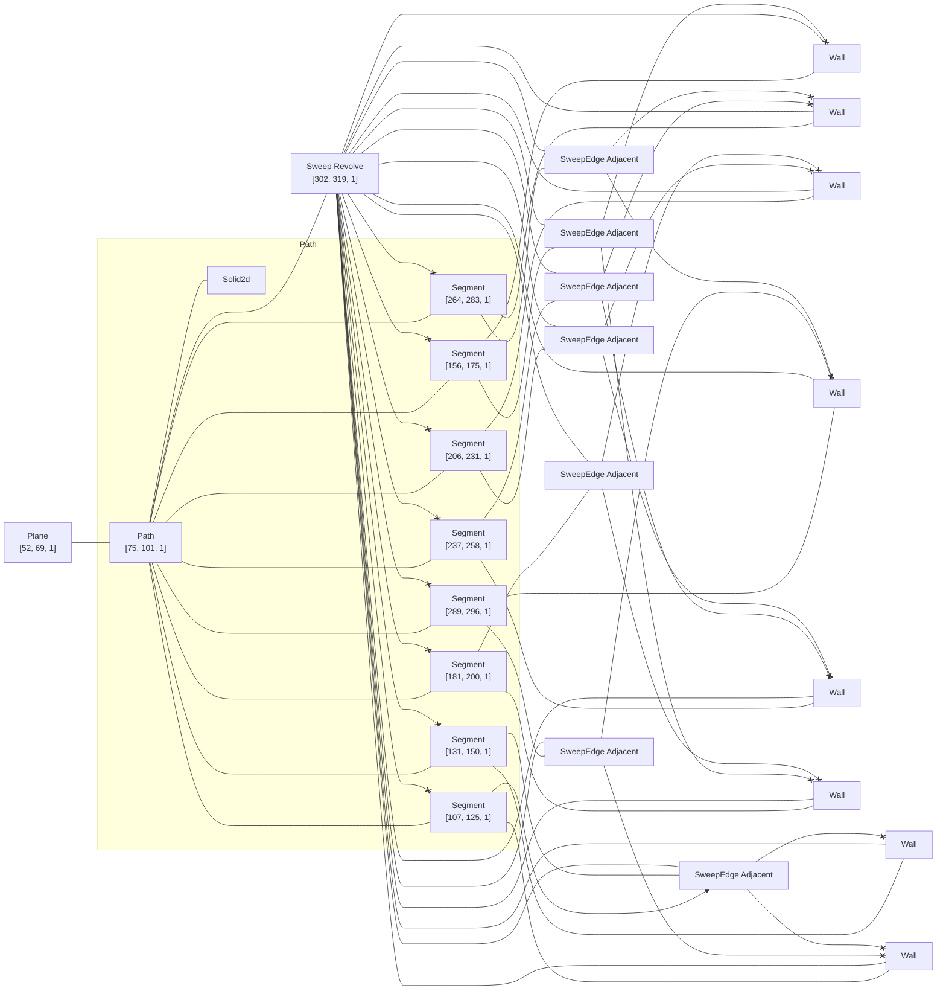

```mermaid
flowchart LR
  subgraph path2 [Path]
    2["Path<br>[75, 101, 1]"]
    3["Segment<br>[107, 125, 1]"]
    4["Segment<br>[131, 150, 1]"]
    5["Segment<br>[156, 175, 1]"]
    6["Segment<br>[181, 200, 1]"]
    7["Segment<br>[206, 231, 1]"]
    8["Segment<br>[237, 258, 1]"]
    9["Segment<br>[264, 283, 1]"]
    10["Segment<br>[289, 296, 1]"]
    11[Solid2d]
  end
  1["Plane<br>[52, 69, 1]"]
  12["Sweep Revolve<br>[302, 319, 1]"]
  13[Wall]
  14[Wall]
  15[Wall]
  16[Wall]
  17[Wall]
  18[Wall]
  19[Wall]
  20[Wall]
  21["SweepEdge Adjacent"]
  22["SweepEdge Adjacent"]
  23["SweepEdge Adjacent"]
  24["SweepEdge Adjacent"]
  25["SweepEdge Adjacent"]
  26["SweepEdge Adjacent"]
  27["SweepEdge Adjacent"]
  1 --- 2
  2 --- 3
  2 --- 4
  2 --- 5
  2 --- 6
  2 --- 7
  2 --- 8
  2 --- 9
  2 --- 10
  2 --- 11
  2 ---- 12
  12 <--x 3
  3 --- 16
  3 x--> 26
  12 <--x 4
  4 --- 15
  4 --- 26
  12 <--x 5
  5 --- 13
  5 --- 24
  12 <--x 6
  6 --- 20
  6 --- 25
  12 <--x 7
  7 --- 17
  7 --- 22
  12 <--x 8
  8 --- 19
  8 --- 21
  12 <--x 9
  9 --- 14
  9 --- 27
  12 <--x 10
  10 --- 18
  10 --- 23
  12 --- 13
  12 --- 14
  12 --- 15
  12 --- 16
  12 --- 17
  12 --- 18
  12 --- 19
  12 --- 20
  12 --- 21
  12 --- 22
  12 --- 23
  12 --- 24
  12 --- 25
  12 --- 26
  12 --- 27
  24 <--x 13
  21 <--x 14
  27 <--x 14
  26 <--x 15
  23 <--x 16
  26 <--x 16
  22 <--x 17
  25 <--x 17
  23 <--x 18
  27 <--x 18
  21 <--x 19
  22 <--x 19
  24 <--x 20
  25 <--x 20
```
