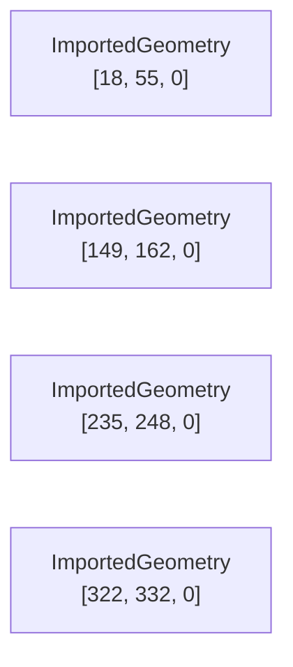

```mermaid
flowchart LR
  1["ImportedGeometry<br>[18, 55, 0]"]
    %% [ProgramBodyItem { index: 0 }]
  2["ImportedGeometry<br>[149, 162, 0]"]
    %% [ProgramBodyItem { index: 3 }, VariableDeclarationDeclaration, VariableDeclarationInit, PipeBodyItem { index: 0 }]
  3["ImportedGeometry<br>[235, 248, 0]"]
    %% [ProgramBodyItem { index: 5 }, VariableDeclarationDeclaration, VariableDeclarationInit, PipeBodyItem { index: 0 }]
  4["ImportedGeometry<br>[322, 332, 0]"]
    %% [ProgramBodyItem { index: 7 }, VariableDeclarationDeclaration, VariableDeclarationInit, PipeBodyItem { index: 0 }]
```
