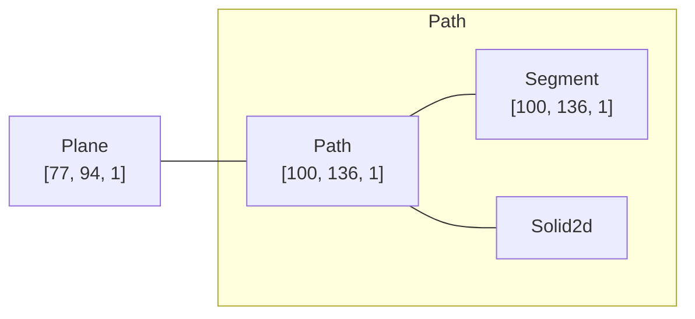

```mermaid
flowchart LR
  subgraph path2 [Path]
    2["Path<br>[100, 136, 1]"]
      %% Missing NodePath
    3["Segment<br>[100, 136, 1]"]
      %% Missing NodePath
    4[Solid2d]
  end
  1["Plane<br>[77, 94, 1]"]
    %% Missing NodePath
  1 --- 2
  2 --- 3
  2 --- 4
```
