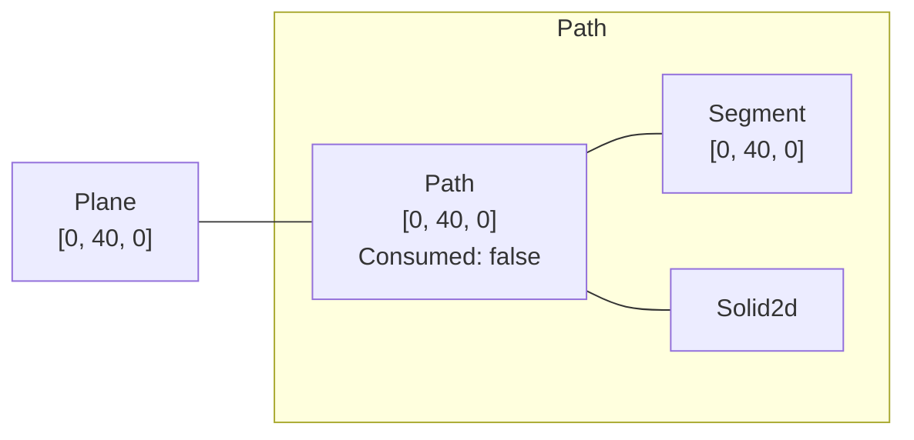

```mermaid
flowchart LR
  subgraph path2 [Path]
    2["Path<br>[0, 40, 0]<br>Consumed: false"]
      %% [ProgramBodyItem { index: 0 }]
    3["Segment<br>[0, 40, 0]"]
      %% [ProgramBodyItem { index: 0 }]
    4[Solid2d]
  end
  1["Plane<br>[0, 40, 0]"]
    %% [ProgramBodyItem { index: 0 }]
  1 --- 2
  2 --- 3
  2 --- 4
```
