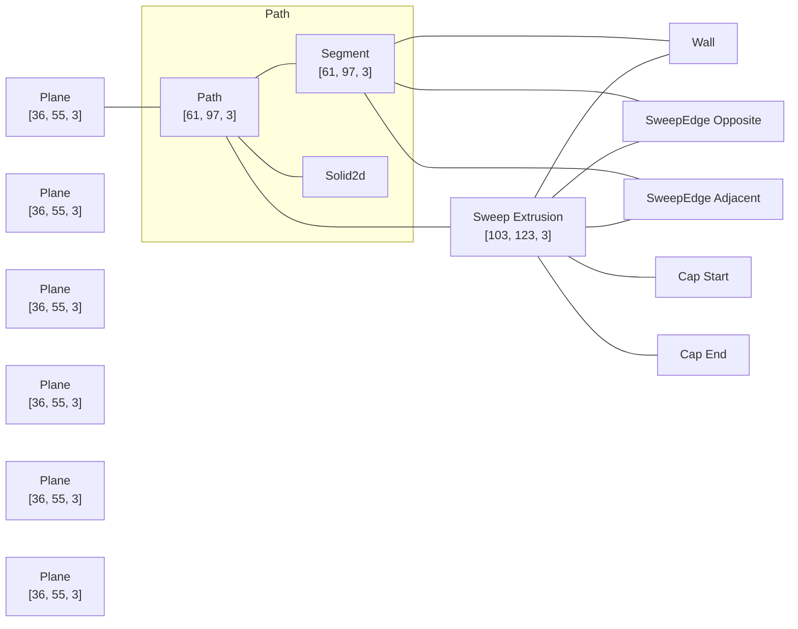

```mermaid
flowchart LR
  subgraph path7 [Path]
    7["Path<br>[61, 97, 3]"]
    8["Segment<br>[61, 97, 3]"]
    9[Solid2d]
  end
  1["Plane<br>[36, 55, 3]"]
  2["Plane<br>[36, 55, 3]"]
  3["Plane<br>[36, 55, 3]"]
  4["Plane<br>[36, 55, 3]"]
  5["Plane<br>[36, 55, 3]"]
  6["Plane<br>[36, 55, 3]"]
  10["Sweep Extrusion<br>[103, 123, 3]"]
  11[Wall]
  12["Cap Start"]
  13["Cap End"]
  14["SweepEdge Opposite"]
  15["SweepEdge Adjacent"]
  1 --- 7
  7 --- 8
  7 ---- 10
  7 --- 9
  8 --- 11
  8 --- 14
  8 --- 15
  10 --- 11
  10 --- 12
  10 --- 13
  10 --- 14
  10 --- 15
```
