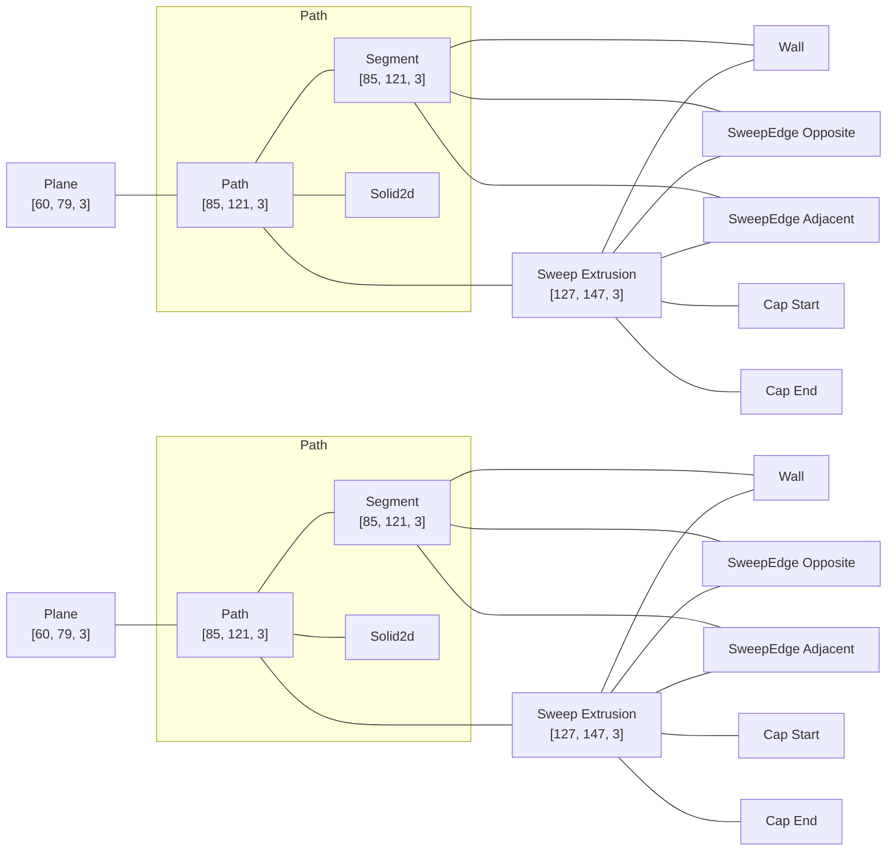

```mermaid
flowchart LR
  subgraph path2 [Path]
    2["Path<br>[85, 121, 3]"]
    3["Segment<br>[85, 121, 3]"]
    4[Solid2d]
  end
  subgraph path12 [Path]
    12["Path<br>[85, 121, 3]"]
    13["Segment<br>[85, 121, 3]"]
    14[Solid2d]
  end
  1["Plane<br>[60, 79, 3]"]
  5["Sweep Extrusion<br>[127, 147, 3]"]
  6[Wall]
  7["Cap Start"]
  8["Cap End"]
  9["SweepEdge Opposite"]
  10["SweepEdge Adjacent"]
  11["Plane<br>[60, 79, 3]"]
  15["Sweep Extrusion<br>[127, 147, 3]"]
  16[Wall]
  17["Cap Start"]
  18["Cap End"]
  19["SweepEdge Opposite"]
  20["SweepEdge Adjacent"]
  1 --- 2
  2 --- 3
  2 ---- 5
  2 --- 4
  3 --- 6
  3 --- 9
  3 --- 10
  5 --- 6
  5 --- 7
  5 --- 8
  5 --- 9
  5 --- 10
  11 --- 12
  12 --- 13
  12 ---- 15
  12 --- 14
  13 --- 16
  13 --- 19
  13 --- 20
  15 --- 16
  15 --- 17
  15 --- 18
  15 --- 19
  15 --- 20
```
