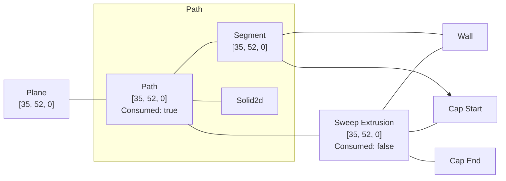

```mermaid
flowchart LR
  subgraph path2 [Path]
    2["Path<br>[35, 52, 0]<br>Consumed: true"]
      %% [ProgramBodyItem { index: 0 }]
    3["Segment<br>[35, 52, 0]"]
      %% [ProgramBodyItem { index: 0 }]
    4[Solid2d]
  end
  1["Plane<br>[35, 52, 0]"]
    %% [ProgramBodyItem { index: 0 }]
  5["Sweep Extrusion<br>[35, 52, 0]<br>Consumed: false"]
    %% [ProgramBodyItem { index: 0 }]
  6[Wall]
    %% face_code_ref=Missing NodePath
  7["Cap Start"]
    %% face_code_ref=Missing NodePath
  8["Cap End"]
    %% face_code_ref=Missing NodePath
  1 --- 2
  2 --- 3
  2 --- 4
  2 ---- 5
  3 --- 6
  3 x--> 7
  5 --- 6
  5 --- 7
  5 --- 8
```
