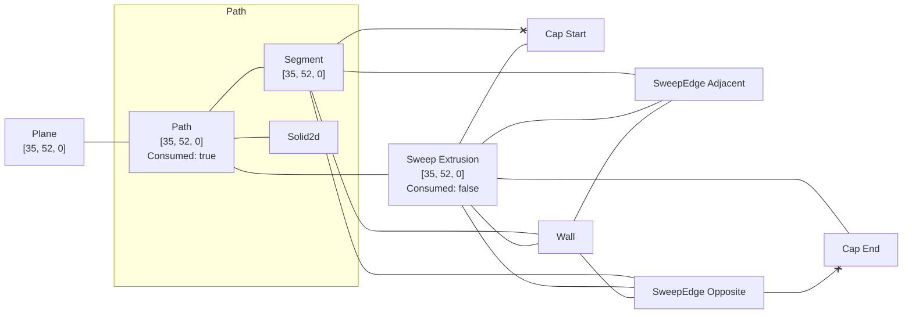

```mermaid
flowchart LR
  subgraph path3 [Path]
    3["Path<br>[35, 52, 0]<br>Consumed: true"]
      %% [ProgramBodyItem { index: 0 }]
    5["Segment<br>[35, 52, 0]"]
      %% [ProgramBodyItem { index: 0 }]
    6[Solid2d]
  end
  4["Plane<br>[35, 52, 0]"]
    %% [ProgramBodyItem { index: 0 }]
  7["Sweep Extrusion<br>[35, 52, 0]<br>Consumed: false"]
    %% [ProgramBodyItem { index: 0 }]
  10[Wall]
    %% face_code_ref=Missing NodePath
  2["Cap Start"]
    %% face_code_ref=Missing NodePath
  1["Cap End"]
    %% face_code_ref=Missing NodePath
  9["SweepEdge Opposite"]
  8["SweepEdge Adjacent"]
  7 --- 1
  9 <--x 1
  5 <--x 2
  7 --- 2
  4 --- 3
  3 --- 5
  3 --- 6
  3 ---- 7
  5 --- 8
  5 --- 9
  5 --- 10
  7 --- 8
  7 --- 9
  7 --- 10
  10 --- 8
  10 --- 9
```
