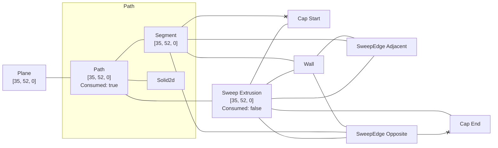

```mermaid
flowchart LR
  subgraph path4 [Path]
    4["Path<br>[35, 52, 0]<br>Consumed: true"]
      %% [ProgramBodyItem { index: 0 }]
    6["Segment<br>[35, 52, 0]"]
      %% [ProgramBodyItem { index: 0 }]
    8[Solid2d]
  end
  1["Cap End"]
    %% face_code_ref=Missing NodePath
  2["Cap Start"]
    %% face_code_ref=Missing NodePath
  3[Wall]
    %% face_code_ref=Missing NodePath
  5["Plane<br>[35, 52, 0]"]
    %% [ProgramBodyItem { index: 0 }]
  7["Sweep Extrusion<br>[35, 52, 0]<br>Consumed: false"]
    %% [ProgramBodyItem { index: 0 }]
  9["SweepEdge Adjacent"]
  10["SweepEdge Opposite"]
  7 --- 1
  10 <--x 1
  6 <--x 2
  7 --- 2
  6 --- 3
  7 --- 3
  3 --- 9
  3 --- 10
  5 --- 4
  4 --- 6
  4 ---- 7
  4 --- 8
  6 --- 9
  6 --- 10
  7 --- 9
  7 --- 10
```
