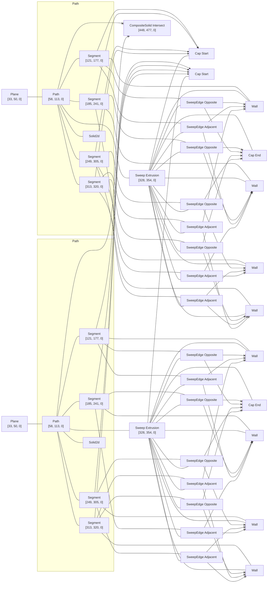

```mermaid
flowchart LR
  subgraph path3 [Path]
    3["Path<br>[58, 113, 0]"]
    5["Segment<br>[121, 177, 0]"]
    8["Segment<br>[185, 241, 0]"]
    10["Segment<br>[249, 305, 0]"]
    11["Segment<br>[313, 320, 0]"]
    13[Solid2d]
  end
  subgraph path4 [Path]
    4["Path<br>[58, 113, 0]"]
    6["Segment<br>[121, 177, 0]"]
    7["Segment<br>[185, 241, 0]"]
    9["Segment<br>[249, 305, 0]"]
    12["Segment<br>[313, 320, 0]"]
    14[Solid2d]
  end
  1["Plane<br>[33, 50, 0]"]
  2["Plane<br>[33, 50, 0]"]
  15["Sweep Extrusion<br>[328, 354, 0]"]
  16["Sweep Extrusion<br>[328, 354, 0]"]
  17["CompositeSolid Intersect<br>[448, 477, 0]"]
  18[Wall]
  19[Wall]
  20[Wall]
  21[Wall]
  22[Wall]
  23[Wall]
  24[Wall]
  25[Wall]
  26["Cap Start"]
  27["Cap Start"]
  28["Cap End"]
  29["Cap End"]
  30["SweepEdge Opposite"]
  31["SweepEdge Opposite"]
  32["SweepEdge Opposite"]
  33["SweepEdge Opposite"]
  34["SweepEdge Opposite"]
  35["SweepEdge Opposite"]
  36["SweepEdge Opposite"]
  37["SweepEdge Opposite"]
  38["SweepEdge Adjacent"]
  39["SweepEdge Adjacent"]
  40["SweepEdge Adjacent"]
  41["SweepEdge Adjacent"]
  42["SweepEdge Adjacent"]
  43["SweepEdge Adjacent"]
  44["SweepEdge Adjacent"]
  45["SweepEdge Adjacent"]
  1 --- 3
  2 --- 4
  3 --- 5
  3 --- 8
  3 --- 10
  3 --- 11
  3 --- 13
  3 ---- 16
  3 <--x 17
  4 --- 6
  4 --- 7
  4 --- 9
  4 --- 12
  4 --- 14
  4 ---- 15
  4 <--x 17
  5 --- 24
  5 x--> 26
  5 --- 35
  5 --- 42
  6 --- 21
  6 x--> 27
  6 --- 31
  6 --- 38
  7 --- 19
  7 x--> 27
  7 --- 30
  7 --- 41
  8 --- 25
  8 x--> 26
  8 --- 34
  8 --- 44
  9 --- 18
  9 x--> 27
  9 --- 33
  9 --- 40
  10 --- 23
  10 x--> 26
  10 --- 37
  10 --- 43
  11 --- 22
  11 x--> 26
  11 --- 36
  11 --- 45
  12 --- 20
  12 x--> 27
  12 --- 32
  12 --- 39
  15 --- 18
  15 --- 19
  15 --- 20
  15 --- 21
  15 --- 27
  15 --- 29
  15 --- 30
  15 --- 31
  15 --- 32
  15 --- 33
  15 --- 38
  15 --- 39
  15 --- 40
  15 --- 41
  16 --- 22
  16 --- 23
  16 --- 24
  16 --- 25
  16 --- 26
  16 --- 28
  16 --- 34
  16 --- 35
  16 --- 36
  16 --- 37
  16 --- 42
  16 --- 43
  16 --- 44
  16 --- 45
  33 <--x 18
  40 <--x 18
  41 <--x 18
  30 <--x 19
  38 <--x 19
  41 <--x 19
  32 <--x 20
  39 <--x 20
  40 <--x 20
  31 <--x 21
  38 <--x 21
  39 <--x 21
  36 <--x 22
  43 <--x 22
  45 <--x 22
  37 <--x 23
  43 <--x 23
  44 <--x 23
  35 <--x 24
  42 <--x 24
  45 <--x 24
  34 <--x 25
  42 <--x 25
  44 <--x 25
  34 <--x 28
  35 <--x 28
  36 <--x 28
  37 <--x 28
  30 <--x 29
  31 <--x 29
  32 <--x 29
  33 <--x 29
```
