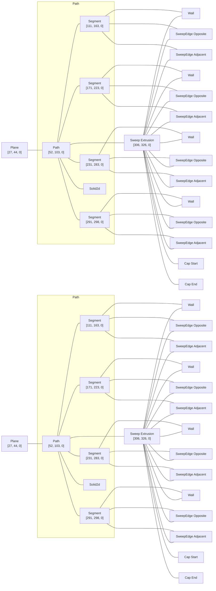

```mermaid
flowchart LR
  subgraph path2 [Path]
    2["Path<br>[52, 103, 0]"]
    3["Segment<br>[111, 163, 0]"]
    4["Segment<br>[171, 223, 0]"]
    5["Segment<br>[231, 283, 0]"]
    6["Segment<br>[291, 298, 0]"]
    7[Solid2d]
  end
  subgraph path24 [Path]
    24["Path<br>[52, 103, 0]"]
    25["Segment<br>[111, 163, 0]"]
    26["Segment<br>[171, 223, 0]"]
    27["Segment<br>[231, 283, 0]"]
    28["Segment<br>[291, 298, 0]"]
    29[Solid2d]
  end
  1["Plane<br>[27, 44, 0]"]
  8["Sweep Extrusion<br>[306, 326, 0]"]
  9[Wall]
  10[Wall]
  11[Wall]
  12[Wall]
  13["Cap Start"]
  14["Cap End"]
  15["SweepEdge Opposite"]
  16["SweepEdge Adjacent"]
  17["SweepEdge Opposite"]
  18["SweepEdge Adjacent"]
  19["SweepEdge Opposite"]
  20["SweepEdge Adjacent"]
  21["SweepEdge Opposite"]
  22["SweepEdge Adjacent"]
  23["Plane<br>[27, 44, 0]"]
  30["Sweep Extrusion<br>[306, 326, 0]"]
  31[Wall]
  32[Wall]
  33[Wall]
  34[Wall]
  35["Cap Start"]
  36["Cap End"]
  37["SweepEdge Opposite"]
  38["SweepEdge Adjacent"]
  39["SweepEdge Opposite"]
  40["SweepEdge Adjacent"]
  41["SweepEdge Opposite"]
  42["SweepEdge Adjacent"]
  43["SweepEdge Opposite"]
  44["SweepEdge Adjacent"]
  1 --- 2
  2 --- 3
  2 --- 4
  2 --- 5
  2 --- 6
  2 ---- 8
  2 --- 7
  3 --- 9
  3 --- 15
  3 --- 16
  4 --- 10
  4 --- 17
  4 --- 18
  5 --- 11
  5 --- 19
  5 --- 20
  6 --- 12
  6 --- 21
  6 --- 22
  8 --- 9
  8 --- 10
  8 --- 11
  8 --- 12
  8 --- 13
  8 --- 14
  8 --- 15
  8 --- 16
  8 --- 17
  8 --- 18
  8 --- 19
  8 --- 20
  8 --- 21
  8 --- 22
  23 --- 24
  24 --- 25
  24 --- 26
  24 --- 27
  24 --- 28
  24 ---- 30
  24 --- 29
  25 --- 31
  25 --- 37
  25 --- 38
  26 --- 32
  26 --- 39
  26 --- 40
  27 --- 33
  27 --- 41
  27 --- 42
  28 --- 34
  28 --- 43
  28 --- 44
  30 --- 31
  30 --- 32
  30 --- 33
  30 --- 34
  30 --- 35
  30 --- 36
  30 --- 37
  30 --- 38
  30 --- 39
  30 --- 40
  30 --- 41
  30 --- 42
  30 --- 43
  30 --- 44
```
