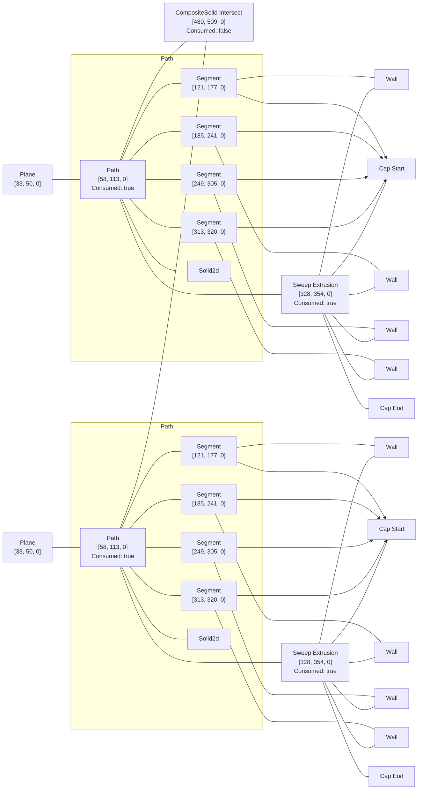

```mermaid
flowchart LR
  subgraph path2 [Path]
    2["Path<br>[58, 113, 0]<br>Consumed: true"]
      %% [ProgramBodyItem { index: 0 }, VariableDeclarationDeclaration, VariableDeclarationInit, FunctionExpressionBody, FunctionExpressionBodyItem { index: 0 }, ReturnStatementArg, PipeBodyItem { index: 1 }]
    3["Segment<br>[121, 177, 0]"]
      %% [ProgramBodyItem { index: 0 }, VariableDeclarationDeclaration, VariableDeclarationInit, FunctionExpressionBody, FunctionExpressionBodyItem { index: 0 }, ReturnStatementArg, PipeBodyItem { index: 2 }]
    4["Segment<br>[185, 241, 0]"]
      %% [ProgramBodyItem { index: 0 }, VariableDeclarationDeclaration, VariableDeclarationInit, FunctionExpressionBody, FunctionExpressionBodyItem { index: 0 }, ReturnStatementArg, PipeBodyItem { index: 3 }]
    5["Segment<br>[249, 305, 0]"]
      %% [ProgramBodyItem { index: 0 }, VariableDeclarationDeclaration, VariableDeclarationInit, FunctionExpressionBody, FunctionExpressionBodyItem { index: 0 }, ReturnStatementArg, PipeBodyItem { index: 4 }]
    6["Segment<br>[313, 320, 0]"]
      %% [ProgramBodyItem { index: 0 }, VariableDeclarationDeclaration, VariableDeclarationInit, FunctionExpressionBody, FunctionExpressionBodyItem { index: 0 }, ReturnStatementArg, PipeBodyItem { index: 5 }]
    7[Solid2d]
  end
  subgraph path16 [Path]
    16["Path<br>[58, 113, 0]<br>Consumed: true"]
      %% [ProgramBodyItem { index: 0 }, VariableDeclarationDeclaration, VariableDeclarationInit, FunctionExpressionBody, FunctionExpressionBodyItem { index: 0 }, ReturnStatementArg, PipeBodyItem { index: 1 }]
    17["Segment<br>[121, 177, 0]"]
      %% [ProgramBodyItem { index: 0 }, VariableDeclarationDeclaration, VariableDeclarationInit, FunctionExpressionBody, FunctionExpressionBodyItem { index: 0 }, ReturnStatementArg, PipeBodyItem { index: 2 }]
    18["Segment<br>[185, 241, 0]"]
      %% [ProgramBodyItem { index: 0 }, VariableDeclarationDeclaration, VariableDeclarationInit, FunctionExpressionBody, FunctionExpressionBodyItem { index: 0 }, ReturnStatementArg, PipeBodyItem { index: 3 }]
    19["Segment<br>[249, 305, 0]"]
      %% [ProgramBodyItem { index: 0 }, VariableDeclarationDeclaration, VariableDeclarationInit, FunctionExpressionBody, FunctionExpressionBodyItem { index: 0 }, ReturnStatementArg, PipeBodyItem { index: 4 }]
    20["Segment<br>[313, 320, 0]"]
      %% [ProgramBodyItem { index: 0 }, VariableDeclarationDeclaration, VariableDeclarationInit, FunctionExpressionBody, FunctionExpressionBodyItem { index: 0 }, ReturnStatementArg, PipeBodyItem { index: 5 }]
    21[Solid2d]
  end
  1["Plane<br>[33, 50, 0]"]
    %% [ProgramBodyItem { index: 0 }, VariableDeclarationDeclaration, VariableDeclarationInit, FunctionExpressionBody, FunctionExpressionBodyItem { index: 0 }, ReturnStatementArg, PipeBodyItem { index: 0 }]
  8["Sweep Extrusion<br>[328, 354, 0]<br>Consumed: true"]
    %% [ProgramBodyItem { index: 0 }, VariableDeclarationDeclaration, VariableDeclarationInit, FunctionExpressionBody, FunctionExpressionBodyItem { index: 0 }, ReturnStatementArg, PipeBodyItem { index: 6 }]
  9[Wall]
    %% face_code_ref=Missing NodePath
  10[Wall]
    %% face_code_ref=Missing NodePath
  11[Wall]
    %% face_code_ref=Missing NodePath
  12[Wall]
    %% face_code_ref=Missing NodePath
  13["Cap Start"]
    %% face_code_ref=Missing NodePath
  14["Cap End"]
    %% face_code_ref=Missing NodePath
  15["Plane<br>[33, 50, 0]"]
    %% [ProgramBodyItem { index: 0 }, VariableDeclarationDeclaration, VariableDeclarationInit, FunctionExpressionBody, FunctionExpressionBodyItem { index: 0 }, ReturnStatementArg, PipeBodyItem { index: 0 }]
  22["Sweep Extrusion<br>[328, 354, 0]<br>Consumed: true"]
    %% [ProgramBodyItem { index: 0 }, VariableDeclarationDeclaration, VariableDeclarationInit, FunctionExpressionBody, FunctionExpressionBodyItem { index: 0 }, ReturnStatementArg, PipeBodyItem { index: 6 }]
  23[Wall]
    %% face_code_ref=Missing NodePath
  24[Wall]
    %% face_code_ref=Missing NodePath
  25[Wall]
    %% face_code_ref=Missing NodePath
  26[Wall]
    %% face_code_ref=Missing NodePath
  27["Cap Start"]
    %% face_code_ref=Missing NodePath
  28["Cap End"]
    %% face_code_ref=Missing NodePath
  29["CompositeSolid Intersect<br>[480, 509, 0]<br>Consumed: false"]
    %% [ProgramBodyItem { index: 3 }, VariableDeclarationDeclaration, VariableDeclarationInit]
  1 --- 2
  2 --- 3
  2 --- 4
  2 --- 5
  2 --- 6
  2 --- 7
  2 ---- 8
  2 --- 29
  3 --- 9
  3 x--> 13
  4 --- 10
  4 x--> 13
  5 --- 11
  5 x--> 13
  6 --- 12
  6 x--> 13
  8 --- 9
  8 --- 10
  8 --- 11
  8 --- 12
  8 --- 13
  8 --- 14
  15 --- 16
  16 --- 17
  16 --- 18
  16 --- 19
  16 --- 20
  16 --- 21
  16 ---- 22
  16 --- 29
  17 --- 23
  17 x--> 27
  18 --- 24
  18 x--> 27
  19 --- 25
  19 x--> 27
  20 --- 26
  20 x--> 27
  22 --- 23
  22 --- 24
  22 --- 25
  22 --- 26
  22 --- 27
  22 --- 28
```
