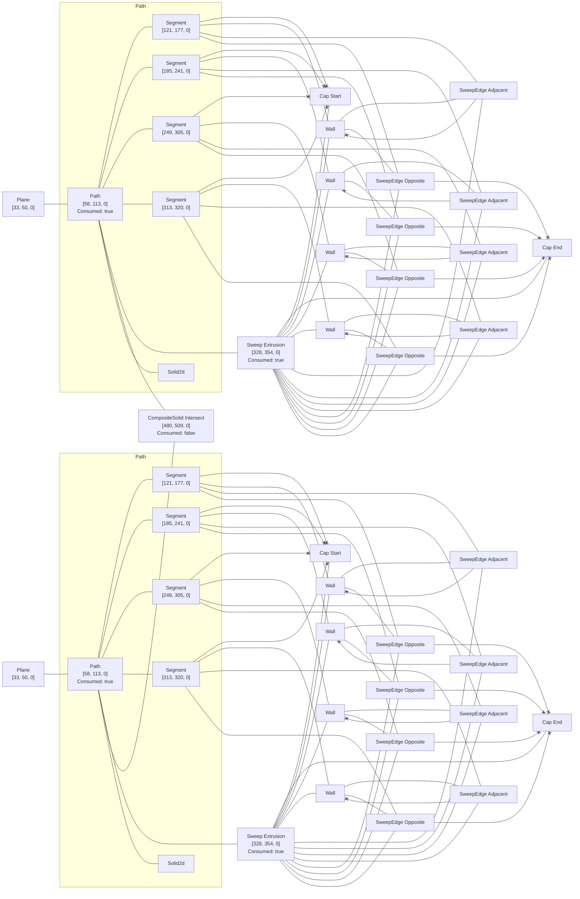

```mermaid
flowchart LR
  subgraph path15 [Path]
    15["Path<br>[58, 113, 0]<br>Consumed: true"]
      %% [ProgramBodyItem { index: 0 }, VariableDeclarationDeclaration, VariableDeclarationInit, FunctionExpressionBody, FunctionExpressionBodyItem { index: 0 }, ReturnStatementArg, PipeBodyItem { index: 1 }]
    17["Segment<br>[121, 177, 0]"]
      %% [ProgramBodyItem { index: 0 }, VariableDeclarationDeclaration, VariableDeclarationInit, FunctionExpressionBody, FunctionExpressionBodyItem { index: 0 }, ReturnStatementArg, PipeBodyItem { index: 2 }]
    19["Segment<br>[185, 241, 0]"]
      %% [ProgramBodyItem { index: 0 }, VariableDeclarationDeclaration, VariableDeclarationInit, FunctionExpressionBody, FunctionExpressionBodyItem { index: 0 }, ReturnStatementArg, PipeBodyItem { index: 3 }]
    21["Segment<br>[249, 305, 0]"]
      %% [ProgramBodyItem { index: 0 }, VariableDeclarationDeclaration, VariableDeclarationInit, FunctionExpressionBody, FunctionExpressionBodyItem { index: 0 }, ReturnStatementArg, PipeBodyItem { index: 4 }]
    23["Segment<br>[313, 320, 0]"]
      %% [ProgramBodyItem { index: 0 }, VariableDeclarationDeclaration, VariableDeclarationInit, FunctionExpressionBody, FunctionExpressionBodyItem { index: 0 }, ReturnStatementArg, PipeBodyItem { index: 5 }]
    28[Solid2d]
  end
  subgraph path16 [Path]
    16["Path<br>[58, 113, 0]<br>Consumed: true"]
      %% [ProgramBodyItem { index: 0 }, VariableDeclarationDeclaration, VariableDeclarationInit, FunctionExpressionBody, FunctionExpressionBodyItem { index: 0 }, ReturnStatementArg, PipeBodyItem { index: 1 }]
    18["Segment<br>[121, 177, 0]"]
      %% [ProgramBodyItem { index: 0 }, VariableDeclarationDeclaration, VariableDeclarationInit, FunctionExpressionBody, FunctionExpressionBodyItem { index: 0 }, ReturnStatementArg, PipeBodyItem { index: 2 }]
    20["Segment<br>[185, 241, 0]"]
      %% [ProgramBodyItem { index: 0 }, VariableDeclarationDeclaration, VariableDeclarationInit, FunctionExpressionBody, FunctionExpressionBodyItem { index: 0 }, ReturnStatementArg, PipeBodyItem { index: 3 }]
    22["Segment<br>[249, 305, 0]"]
      %% [ProgramBodyItem { index: 0 }, VariableDeclarationDeclaration, VariableDeclarationInit, FunctionExpressionBody, FunctionExpressionBodyItem { index: 0 }, ReturnStatementArg, PipeBodyItem { index: 4 }]
    24["Segment<br>[313, 320, 0]"]
      %% [ProgramBodyItem { index: 0 }, VariableDeclarationDeclaration, VariableDeclarationInit, FunctionExpressionBody, FunctionExpressionBodyItem { index: 0 }, ReturnStatementArg, PipeBodyItem { index: 5 }]
    29[Solid2d]
  end
  1["Cap End"]
    %% face_code_ref=Missing NodePath
  2["Cap End"]
    %% face_code_ref=Missing NodePath
  3["Cap Start"]
    %% face_code_ref=Missing NodePath
  4["Cap Start"]
    %% face_code_ref=Missing NodePath
  5[Wall]
    %% face_code_ref=Missing NodePath
  6[Wall]
    %% face_code_ref=Missing NodePath
  7[Wall]
    %% face_code_ref=Missing NodePath
  8[Wall]
    %% face_code_ref=Missing NodePath
  9[Wall]
    %% face_code_ref=Missing NodePath
  10[Wall]
    %% face_code_ref=Missing NodePath
  11[Wall]
    %% face_code_ref=Missing NodePath
  12[Wall]
    %% face_code_ref=Missing NodePath
  13["Plane<br>[33, 50, 0]"]
    %% [ProgramBodyItem { index: 0 }, VariableDeclarationDeclaration, VariableDeclarationInit, FunctionExpressionBody, FunctionExpressionBodyItem { index: 0 }, ReturnStatementArg, PipeBodyItem { index: 0 }]
  14["Plane<br>[33, 50, 0]"]
    %% [ProgramBodyItem { index: 0 }, VariableDeclarationDeclaration, VariableDeclarationInit, FunctionExpressionBody, FunctionExpressionBodyItem { index: 0 }, ReturnStatementArg, PipeBodyItem { index: 0 }]
  25["Sweep Extrusion<br>[328, 354, 0]<br>Consumed: true"]
    %% [ProgramBodyItem { index: 0 }, VariableDeclarationDeclaration, VariableDeclarationInit, FunctionExpressionBody, FunctionExpressionBodyItem { index: 0 }, ReturnStatementArg, PipeBodyItem { index: 6 }]
  26["Sweep Extrusion<br>[328, 354, 0]<br>Consumed: true"]
    %% [ProgramBodyItem { index: 0 }, VariableDeclarationDeclaration, VariableDeclarationInit, FunctionExpressionBody, FunctionExpressionBodyItem { index: 0 }, ReturnStatementArg, PipeBodyItem { index: 6 }]
  27["CompositeSolid Intersect<br>[480, 509, 0]<br>Consumed: false"]
    %% [ProgramBodyItem { index: 3 }, VariableDeclarationDeclaration, VariableDeclarationInit]
  30["SweepEdge Adjacent"]
  31["SweepEdge Adjacent"]
  32["SweepEdge Adjacent"]
  33["SweepEdge Adjacent"]
  34["SweepEdge Adjacent"]
  35["SweepEdge Adjacent"]
  36["SweepEdge Adjacent"]
  37["SweepEdge Adjacent"]
  38["SweepEdge Opposite"]
  39["SweepEdge Opposite"]
  40["SweepEdge Opposite"]
  41["SweepEdge Opposite"]
  42["SweepEdge Opposite"]
  43["SweepEdge Opposite"]
  44["SweepEdge Opposite"]
  45["SweepEdge Opposite"]
  25 --- 1
  38 <--x 1
  40 <--x 1
  42 <--x 1
  44 <--x 1
  26 --- 2
  39 <--x 2
  41 <--x 2
  43 <--x 2
  45 <--x 2
  17 <--x 3
  19 <--x 3
  21 <--x 3
  23 <--x 3
  25 --- 3
  18 <--x 4
  20 <--x 4
  22 <--x 4
  24 <--x 4
  26 --- 4
  17 --- 5
  25 --- 5
  5 --- 30
  30 <--x 5
  5 --- 38
  18 --- 6
  26 --- 6
  6 --- 31
  31 <--x 6
  6 --- 39
  19 --- 7
  25 --- 7
  7 --- 32
  32 <--x 7
  7 --- 40
  20 --- 8
  26 --- 8
  8 --- 33
  33 <--x 8
  8 --- 41
  21 --- 9
  25 --- 9
  9 --- 34
  34 <--x 9
  9 --- 42
  22 --- 10
  26 --- 10
  10 --- 35
  35 <--x 10
  10 --- 43
  23 --- 11
  25 --- 11
  11 --- 36
  36 <--x 11
  11 --- 44
  24 --- 12
  26 --- 12
  12 --- 37
  37 <--x 12
  12 --- 45
  13 --- 15
  14 --- 16
  15 --- 17
  15 --- 19
  15 --- 21
  15 --- 23
  15 ---- 25
  15 --- 27
  15 --- 28
  16 --- 18
  16 --- 20
  16 --- 22
  16 --- 24
  16 ---- 26
  16 --- 27
  16 --- 29
  17 --- 30
  17 --- 38
  18 --- 31
  18 --- 39
  19 --- 32
  19 --- 40
  20 --- 33
  20 --- 41
  21 --- 34
  21 --- 42
  22 --- 35
  22 --- 43
  23 --- 36
  23 --- 44
  24 --- 37
  24 --- 45
  25 --- 30
  25 --- 32
  25 --- 34
  25 --- 36
  25 --- 38
  25 --- 40
  25 --- 42
  25 --- 44
  26 --- 31
  26 --- 33
  26 --- 35
  26 --- 37
  26 --- 39
  26 --- 41
  26 --- 43
  26 --- 45
```
