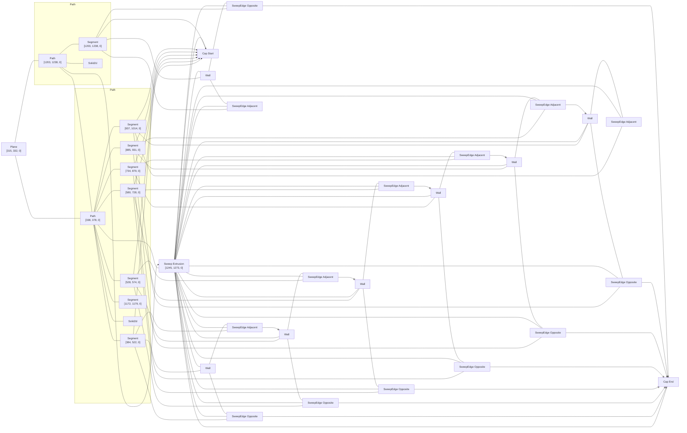

```mermaid
flowchart LR
  subgraph path2 [Path]
    2["Path<br>[338, 378, 0]"]
      %% [ProgramBodyItem { index: 10 }, VariableDeclarationDeclaration, VariableDeclarationInit, PipeBodyItem { index: 1 }]
    3["Segment<br>[384, 522, 0]"]
      %% [ProgramBodyItem { index: 10 }, VariableDeclarationDeclaration, VariableDeclarationInit, PipeBodyItem { index: 2 }]
    4["Segment<br>[528, 574, 0]"]
      %% [ProgramBodyItem { index: 10 }, VariableDeclarationDeclaration, VariableDeclarationInit, PipeBodyItem { index: 3 }]
    5["Segment<br>[580, 728, 0]"]
      %% [ProgramBodyItem { index: 10 }, VariableDeclarationDeclaration, VariableDeclarationInit, PipeBodyItem { index: 4 }]
    6["Segment<br>[734, 879, 0]"]
      %% [ProgramBodyItem { index: 10 }, VariableDeclarationDeclaration, VariableDeclarationInit, PipeBodyItem { index: 5 }]
    7["Segment<br>[885, 931, 0]"]
      %% [ProgramBodyItem { index: 10 }, VariableDeclarationDeclaration, VariableDeclarationInit, PipeBodyItem { index: 6 }]
    8["Segment<br>[937, 1014, 0]"]
      %% [ProgramBodyItem { index: 10 }, VariableDeclarationDeclaration, VariableDeclarationInit, PipeBodyItem { index: 7 }]
    9["Segment<br>[1172, 1179, 0]"]
      %% [ProgramBodyItem { index: 10 }, VariableDeclarationDeclaration, VariableDeclarationInit, PipeBodyItem { index: 9 }]
    10[Solid2d]
  end
  subgraph path11 [Path]
    11["Path<br>[1203, 1238, 0]"]
      %% [ProgramBodyItem { index: 10 }, VariableDeclarationDeclaration, VariableDeclarationInit, PipeBodyItem { index: 10 }, CallKwArg { index: 0 }]
    12["Segment<br>[1203, 1238, 0]"]
      %% [ProgramBodyItem { index: 10 }, VariableDeclarationDeclaration, VariableDeclarationInit, PipeBodyItem { index: 10 }, CallKwArg { index: 0 }]
    13[Solid2d]
  end
  1["Plane<br>[315, 332, 0]"]
    %% [ProgramBodyItem { index: 10 }, VariableDeclarationDeclaration, VariableDeclarationInit, PipeBodyItem { index: 0 }]
  14["Sweep Extrusion<br>[1245, 1273, 0]"]
    %% [ProgramBodyItem { index: 10 }, VariableDeclarationDeclaration, VariableDeclarationInit, PipeBodyItem { index: 11 }]
  15[Wall]
    %% face_code_ref=Missing NodePath
  16[Wall]
    %% face_code_ref=Missing NodePath
  17[Wall]
    %% face_code_ref=Missing NodePath
  18[Wall]
    %% face_code_ref=Missing NodePath
  19[Wall]
    %% face_code_ref=Missing NodePath
  20[Wall]
    %% face_code_ref=Missing NodePath
  21[Wall]
    %% face_code_ref=Missing NodePath
  22["Cap Start"]
    %% face_code_ref=Missing NodePath
  23["Cap End"]
    %% face_code_ref=Missing NodePath
  24["SweepEdge Opposite"]
  25["SweepEdge Adjacent"]
  26["SweepEdge Opposite"]
  27["SweepEdge Adjacent"]
  28["SweepEdge Opposite"]
  29["SweepEdge Adjacent"]
  30["SweepEdge Opposite"]
  31["SweepEdge Adjacent"]
  32["SweepEdge Opposite"]
  33["SweepEdge Adjacent"]
  34["SweepEdge Opposite"]
  35["SweepEdge Adjacent"]
  36["SweepEdge Opposite"]
  37["SweepEdge Adjacent"]
  1 --- 2
  1 --- 11
  2 --- 3
  2 --- 4
  2 --- 5
  2 --- 6
  2 --- 7
  2 --- 8
  2 --- 9
  2 --- 10
  11 --- 2
  2 ---- 14
  3 --- 15
  3 x--> 22
  3 --- 24
  3 --- 25
  4 --- 16
  4 x--> 22
  4 --- 26
  4 --- 27
  5 --- 17
  5 x--> 22
  5 --- 28
  5 --- 29
  6 --- 18
  6 x--> 22
  6 --- 30
  6 --- 31
  7 --- 19
  7 x--> 22
  7 --- 32
  7 --- 33
  8 --- 20
  8 x--> 22
  8 --- 34
  8 --- 35
  11 --- 12
  11 --- 13
  11 x---> 14
  12 --- 21
  12 x--> 22
  12 --- 36
  12 --- 37
  14 --- 15
  14 --- 16
  14 --- 17
  14 --- 18
  14 --- 19
  14 --- 20
  14 --- 21
  14 --- 22
  14 --- 23
  14 --- 24
  14 --- 25
  14 --- 26
  14 --- 27
  14 --- 28
  14 --- 29
  14 --- 30
  14 --- 31
  14 --- 32
  14 --- 33
  14 --- 34
  14 --- 35
  14 --- 36
  14 --- 37
  15 --- 24
  15 --- 25
  25 <--x 16
  16 --- 26
  16 --- 27
  27 <--x 17
  17 --- 28
  17 --- 29
  29 <--x 18
  18 --- 30
  18 --- 31
  31 <--x 19
  19 --- 32
  19 --- 33
  33 <--x 20
  20 --- 34
  20 --- 35
  21 --- 36
  21 --- 37
  24 <--x 23
  26 <--x 23
  28 <--x 23
  30 <--x 23
  32 <--x 23
  34 <--x 23
  36 <--x 23
```
