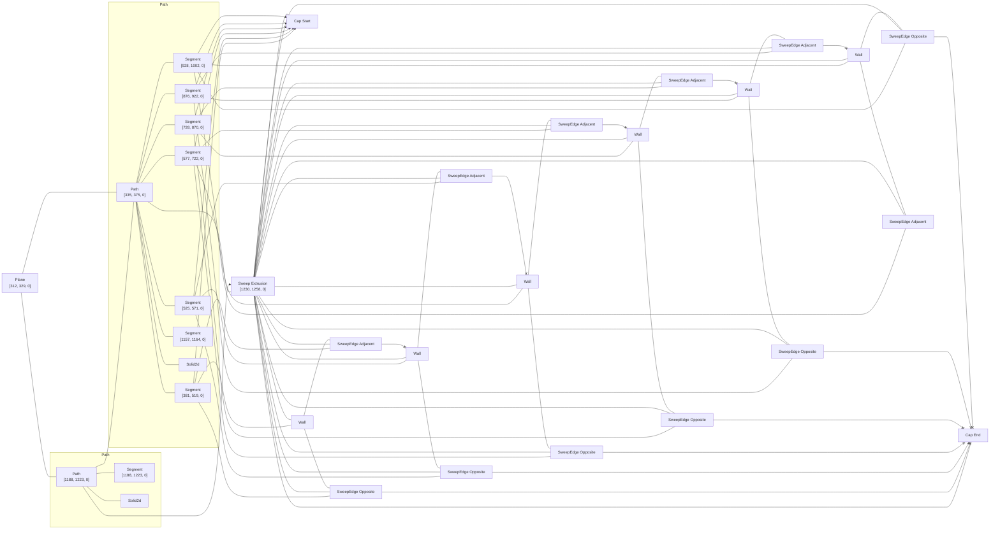

```mermaid
flowchart LR
  subgraph path2 [Path]
    2["Path<br>[335, 375, 0]"]
      %% [ProgramBodyItem { index: 10 }, VariableDeclarationDeclaration, VariableDeclarationInit, PipeBodyItem { index: 1 }]
    3["Segment<br>[381, 519, 0]"]
      %% [ProgramBodyItem { index: 10 }, VariableDeclarationDeclaration, VariableDeclarationInit, PipeBodyItem { index: 2 }]
    4["Segment<br>[525, 571, 0]"]
      %% [ProgramBodyItem { index: 10 }, VariableDeclarationDeclaration, VariableDeclarationInit, PipeBodyItem { index: 3 }]
    5["Segment<br>[577, 722, 0]"]
      %% [ProgramBodyItem { index: 10 }, VariableDeclarationDeclaration, VariableDeclarationInit, PipeBodyItem { index: 4 }]
    6["Segment<br>[728, 870, 0]"]
      %% [ProgramBodyItem { index: 10 }, VariableDeclarationDeclaration, VariableDeclarationInit, PipeBodyItem { index: 5 }]
    7["Segment<br>[876, 922, 0]"]
      %% [ProgramBodyItem { index: 10 }, VariableDeclarationDeclaration, VariableDeclarationInit, PipeBodyItem { index: 6 }]
    8["Segment<br>[928, 1002, 0]"]
      %% [ProgramBodyItem { index: 10 }, VariableDeclarationDeclaration, VariableDeclarationInit, PipeBodyItem { index: 7 }]
    9["Segment<br>[1157, 1164, 0]"]
      %% [ProgramBodyItem { index: 10 }, VariableDeclarationDeclaration, VariableDeclarationInit, PipeBodyItem { index: 9 }]
    10[Solid2d]
  end
  subgraph path11 [Path]
    11["Path<br>[1188, 1223, 0]"]
      %% [ProgramBodyItem { index: 10 }, VariableDeclarationDeclaration, VariableDeclarationInit, PipeBodyItem { index: 10 }, CallKwArg { index: 0 }]
    12["Segment<br>[1188, 1223, 0]"]
      %% [ProgramBodyItem { index: 10 }, VariableDeclarationDeclaration, VariableDeclarationInit, PipeBodyItem { index: 10 }, CallKwArg { index: 0 }]
    13[Solid2d]
  end
  1["Plane<br>[312, 329, 0]"]
    %% [ProgramBodyItem { index: 10 }, VariableDeclarationDeclaration, VariableDeclarationInit, PipeBodyItem { index: 0 }]
  14["Sweep Extrusion<br>[1230, 1258, 0]"]
    %% [ProgramBodyItem { index: 10 }, VariableDeclarationDeclaration, VariableDeclarationInit, PipeBodyItem { index: 11 }]
  15[Wall]
    %% face_code_ref=Missing NodePath
  16[Wall]
    %% face_code_ref=Missing NodePath
  17[Wall]
    %% face_code_ref=Missing NodePath
  18[Wall]
    %% face_code_ref=Missing NodePath
  19[Wall]
    %% face_code_ref=Missing NodePath
  20[Wall]
    %% face_code_ref=Missing NodePath
  21["Cap Start"]
    %% face_code_ref=Missing NodePath
  22["Cap End"]
    %% face_code_ref=Missing NodePath
  23["SweepEdge Opposite"]
  24["SweepEdge Adjacent"]
  25["SweepEdge Opposite"]
  26["SweepEdge Adjacent"]
  27["SweepEdge Opposite"]
  28["SweepEdge Adjacent"]
  29["SweepEdge Opposite"]
  30["SweepEdge Adjacent"]
  31["SweepEdge Opposite"]
  32["SweepEdge Adjacent"]
  33["SweepEdge Opposite"]
  34["SweepEdge Adjacent"]
  1 --- 2
  1 --- 11
  2 --- 3
  2 --- 4
  2 --- 5
  2 --- 6
  2 --- 7
  2 --- 8
  2 --- 9
  2 --- 10
  11 --- 2
  2 ---- 14
  3 --- 15
  3 x--> 21
  3 --- 23
  3 --- 24
  4 --- 16
  4 x--> 21
  4 --- 25
  4 --- 26
  5 --- 17
  5 x--> 21
  5 --- 27
  5 --- 28
  6 --- 18
  6 x--> 21
  6 --- 29
  6 --- 30
  7 --- 19
  7 x--> 21
  7 --- 31
  7 --- 32
  8 --- 20
  8 x--> 21
  8 --- 33
  8 --- 34
  11 --- 12
  11 --- 13
  11 x---> 14
  14 --- 15
  14 --- 16
  14 --- 17
  14 --- 18
  14 --- 19
  14 --- 20
  14 --- 21
  14 --- 22
  14 --- 23
  14 --- 24
  14 --- 25
  14 --- 26
  14 --- 27
  14 --- 28
  14 --- 29
  14 --- 30
  14 --- 31
  14 --- 32
  14 --- 33
  14 --- 34
  15 --- 23
  15 --- 24
  24 <--x 16
  16 --- 25
  16 --- 26
  26 <--x 17
  17 --- 27
  17 --- 28
  28 <--x 18
  18 --- 29
  18 --- 30
  30 <--x 19
  19 --- 31
  19 --- 32
  32 <--x 20
  20 --- 33
  20 --- 34
  23 <--x 22
  25 <--x 22
  27 <--x 22
  29 <--x 22
  31 <--x 22
  33 <--x 22
```
