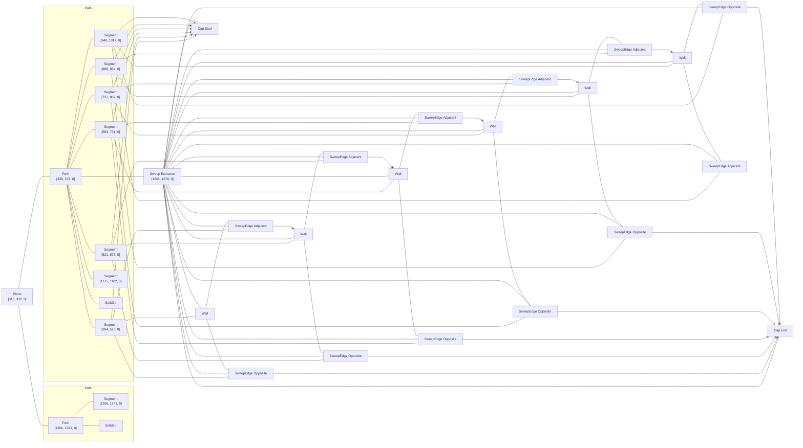

```mermaid
flowchart LR
  subgraph path2 [Path]
    2["Path<br>[338, 378, 0]"]
      %% [ProgramBodyItem { index: 10 }, VariableDeclarationDeclaration, VariableDeclarationInit, PipeBodyItem { index: 1 }]
    4["Segment<br>[384, 525, 0]"]
      %% [ProgramBodyItem { index: 10 }, VariableDeclarationDeclaration, VariableDeclarationInit, PipeBodyItem { index: 2 }]
    5["Segment<br>[531, 577, 0]"]
      %% [ProgramBodyItem { index: 10 }, VariableDeclarationDeclaration, VariableDeclarationInit, PipeBodyItem { index: 3 }]
    6["Segment<br>[583, 731, 0]"]
      %% [ProgramBodyItem { index: 10 }, VariableDeclarationDeclaration, VariableDeclarationInit, PipeBodyItem { index: 4 }]
    7["Segment<br>[737, 882, 0]"]
      %% [ProgramBodyItem { index: 10 }, VariableDeclarationDeclaration, VariableDeclarationInit, PipeBodyItem { index: 5 }]
    8["Segment<br>[888, 934, 0]"]
      %% [ProgramBodyItem { index: 10 }, VariableDeclarationDeclaration, VariableDeclarationInit, PipeBodyItem { index: 6 }]
    9["Segment<br>[940, 1017, 0]"]
      %% [ProgramBodyItem { index: 10 }, VariableDeclarationDeclaration, VariableDeclarationInit, PipeBodyItem { index: 7 }]
    10["Segment<br>[1175, 1182, 0]"]
      %% [ProgramBodyItem { index: 10 }, VariableDeclarationDeclaration, VariableDeclarationInit, PipeBodyItem { index: 9 }]
    13[Solid2d]
  end
  subgraph path3 [Path]
    3["Path<br>[1206, 1241, 0]"]
      %% [ProgramBodyItem { index: 10 }, VariableDeclarationDeclaration, VariableDeclarationInit, PipeBodyItem { index: 10 }, CallKwArg { index: 0 }]
    11["Segment<br>[1206, 1241, 0]"]
      %% [ProgramBodyItem { index: 10 }, VariableDeclarationDeclaration, VariableDeclarationInit, PipeBodyItem { index: 10 }, CallKwArg { index: 0 }]
    12[Solid2d]
  end
  1["Plane<br>[315, 332, 0]"]
    %% [ProgramBodyItem { index: 10 }, VariableDeclarationDeclaration, VariableDeclarationInit, PipeBodyItem { index: 0 }]
  14["Sweep Extrusion<br>[1248, 1276, 0]"]
    %% [ProgramBodyItem { index: 10 }, VariableDeclarationDeclaration, VariableDeclarationInit, PipeBodyItem { index: 11 }]
  15[Wall]
  16[Wall]
  17[Wall]
  18[Wall]
  19[Wall]
  20[Wall]
  21["Cap Start"]
  22["Cap End"]
  23["SweepEdge Opposite"]
  24["SweepEdge Opposite"]
  25["SweepEdge Opposite"]
  26["SweepEdge Opposite"]
  27["SweepEdge Opposite"]
  28["SweepEdge Opposite"]
  29["SweepEdge Adjacent"]
  30["SweepEdge Adjacent"]
  31["SweepEdge Adjacent"]
  32["SweepEdge Adjacent"]
  33["SweepEdge Adjacent"]
  34["SweepEdge Adjacent"]
  1 --- 2
  1 --- 3
  2 --- 4
  2 --- 5
  2 --- 6
  2 --- 7
  2 --- 8
  2 --- 9
  2 --- 10
  2 --- 13
  2 ---- 14
  3 --- 11
  3 --- 12
  4 --- 20
  4 x--> 21
  4 --- 23
  4 --- 29
  5 --- 18
  5 x--> 21
  5 --- 24
  5 --- 30
  6 --- 17
  6 x--> 21
  6 --- 25
  6 --- 31
  7 --- 19
  7 x--> 21
  7 --- 26
  7 --- 32
  8 --- 16
  8 x--> 21
  8 --- 27
  8 --- 33
  9 --- 15
  9 x--> 21
  9 --- 28
  9 --- 34
  14 --- 15
  14 --- 16
  14 --- 17
  14 --- 18
  14 --- 19
  14 --- 20
  14 --- 21
  14 --- 22
  14 --- 23
  14 --- 24
  14 --- 25
  14 --- 26
  14 --- 27
  14 --- 28
  14 --- 29
  14 --- 30
  14 --- 31
  14 --- 32
  14 --- 33
  14 --- 34
  15 --- 28
  33 <--x 15
  15 --- 34
  16 --- 27
  32 <--x 16
  16 --- 33
  17 --- 25
  30 <--x 17
  17 --- 31
  18 --- 24
  29 <--x 18
  18 --- 30
  19 --- 26
  31 <--x 19
  19 --- 32
  20 --- 23
  20 --- 29
  23 <--x 22
  24 <--x 22
  25 <--x 22
  26 <--x 22
  27 <--x 22
  28 <--x 22
```
