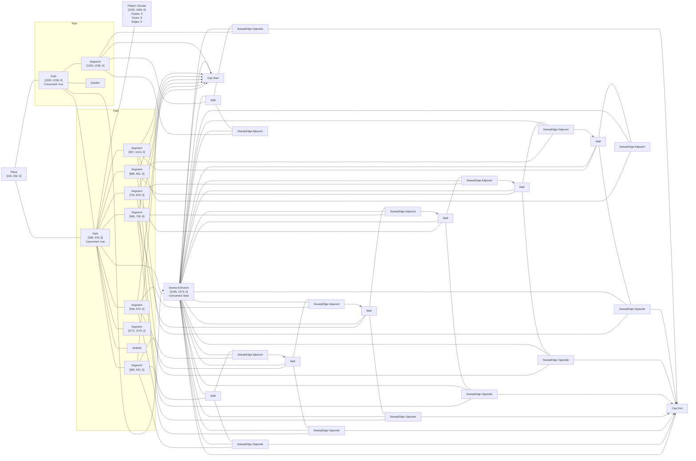

```mermaid
flowchart LR
  subgraph path2 [Path]
    2["Path<br>[338, 378, 0]<br>Consumed: true"]
      %% [ProgramBodyItem { index: 10 }, VariableDeclarationDeclaration, VariableDeclarationInit, PipeBodyItem { index: 1 }]
    3["Segment<br>[384, 522, 0]"]
      %% [ProgramBodyItem { index: 10 }, VariableDeclarationDeclaration, VariableDeclarationInit, PipeBodyItem { index: 2 }]
    4["Segment<br>[528, 574, 0]"]
      %% [ProgramBodyItem { index: 10 }, VariableDeclarationDeclaration, VariableDeclarationInit, PipeBodyItem { index: 3 }]
    5["Segment<br>[580, 728, 0]"]
      %% [ProgramBodyItem { index: 10 }, VariableDeclarationDeclaration, VariableDeclarationInit, PipeBodyItem { index: 4 }]
    6["Segment<br>[734, 879, 0]"]
      %% [ProgramBodyItem { index: 10 }, VariableDeclarationDeclaration, VariableDeclarationInit, PipeBodyItem { index: 5 }]
    7["Segment<br>[885, 931, 0]"]
      %% [ProgramBodyItem { index: 10 }, VariableDeclarationDeclaration, VariableDeclarationInit, PipeBodyItem { index: 6 }]
    8["Segment<br>[937, 1014, 0]"]
      %% [ProgramBodyItem { index: 10 }, VariableDeclarationDeclaration, VariableDeclarationInit, PipeBodyItem { index: 7 }]
    10["Segment<br>[1172, 1179, 0]"]
      %% [ProgramBodyItem { index: 10 }, VariableDeclarationDeclaration, VariableDeclarationInit, PipeBodyItem { index: 9 }]
    11[Solid2d]
  end
  subgraph path12 [Path]
    12["Path<br>[1203, 1238, 0]<br>Consumed: true"]
      %% [ProgramBodyItem { index: 10 }, VariableDeclarationDeclaration, VariableDeclarationInit, PipeBodyItem { index: 10 }, CallKwArg { index: 0 }]
    13["Segment<br>[1203, 1238, 0]"]
      %% [ProgramBodyItem { index: 10 }, VariableDeclarationDeclaration, VariableDeclarationInit, PipeBodyItem { index: 10 }, CallKwArg { index: 0 }]
    14[Solid2d]
  end
  1["Plane<br>[315, 332, 0]"]
    %% [ProgramBodyItem { index: 10 }, VariableDeclarationDeclaration, VariableDeclarationInit, PipeBodyItem { index: 0 }]
  9["Pattern Circular<br>[1020, 1166, 0]<br>Copies: 0<br>Faces: 0<br>Edges: 0"]
    %% [ProgramBodyItem { index: 10 }, VariableDeclarationDeclaration, VariableDeclarationInit, PipeBodyItem { index: 8 }]
  15["Sweep Extrusion<br>[1245, 1273, 0]<br>Consumed: false"]
    %% [ProgramBodyItem { index: 10 }, VariableDeclarationDeclaration, VariableDeclarationInit, PipeBodyItem { index: 11 }]
  16[Wall]
    %% face_code_ref=Missing NodePath
  17[Wall]
    %% face_code_ref=Missing NodePath
  18[Wall]
    %% face_code_ref=Missing NodePath
  19[Wall]
    %% face_code_ref=Missing NodePath
  20[Wall]
    %% face_code_ref=Missing NodePath
  21[Wall]
    %% face_code_ref=Missing NodePath
  22[Wall]
    %% face_code_ref=Missing NodePath
  23["Cap Start"]
    %% face_code_ref=Missing NodePath
  24["Cap End"]
    %% face_code_ref=Missing NodePath
  25["SweepEdge Opposite"]
  26["SweepEdge Adjacent"]
  27["SweepEdge Opposite"]
  28["SweepEdge Adjacent"]
  29["SweepEdge Opposite"]
  30["SweepEdge Adjacent"]
  31["SweepEdge Opposite"]
  32["SweepEdge Adjacent"]
  33["SweepEdge Opposite"]
  34["SweepEdge Adjacent"]
  35["SweepEdge Opposite"]
  36["SweepEdge Adjacent"]
  37["SweepEdge Opposite"]
  38["SweepEdge Adjacent"]
  1 --- 2
  1 --- 12
  2 --- 3
  2 --- 4
  2 --- 5
  2 --- 6
  2 --- 7
  2 --- 8
  2 --- 9
  2 --- 10
  2 --- 11
  12 --- 2
  2 ---- 15
  3 --- 16
  3 x--> 23
  3 --- 25
  3 --- 26
  4 --- 17
  4 x--> 23
  4 --- 27
  4 --- 28
  5 --- 18
  5 x--> 23
  5 --- 29
  5 --- 30
  6 --- 19
  6 x--> 23
  6 --- 31
  6 --- 32
  7 --- 20
  7 x--> 23
  7 --- 33
  7 --- 34
  8 --- 21
  8 x--> 23
  8 --- 35
  8 --- 36
  12 --- 13
  12 --- 14
  12 x---> 15
  13 --- 22
  13 x--> 23
  13 --- 37
  13 --- 38
  15 --- 16
  15 --- 17
  15 --- 18
  15 --- 19
  15 --- 20
  15 --- 21
  15 --- 22
  15 --- 23
  15 --- 24
  15 --- 25
  15 --- 26
  15 --- 27
  15 --- 28
  15 --- 29
  15 --- 30
  15 --- 31
  15 --- 32
  15 --- 33
  15 --- 34
  15 --- 35
  15 --- 36
  15 --- 37
  15 --- 38
  16 --- 25
  16 --- 26
  26 <--x 17
  17 --- 27
  17 --- 28
  28 <--x 18
  18 --- 29
  18 --- 30
  30 <--x 19
  19 --- 31
  19 --- 32
  32 <--x 20
  20 --- 33
  20 --- 34
  34 <--x 21
  21 --- 35
  21 --- 36
  22 --- 37
  22 --- 38
  25 <--x 24
  27 <--x 24
  29 <--x 24
  31 <--x 24
  33 <--x 24
  35 <--x 24
  37 <--x 24
```
