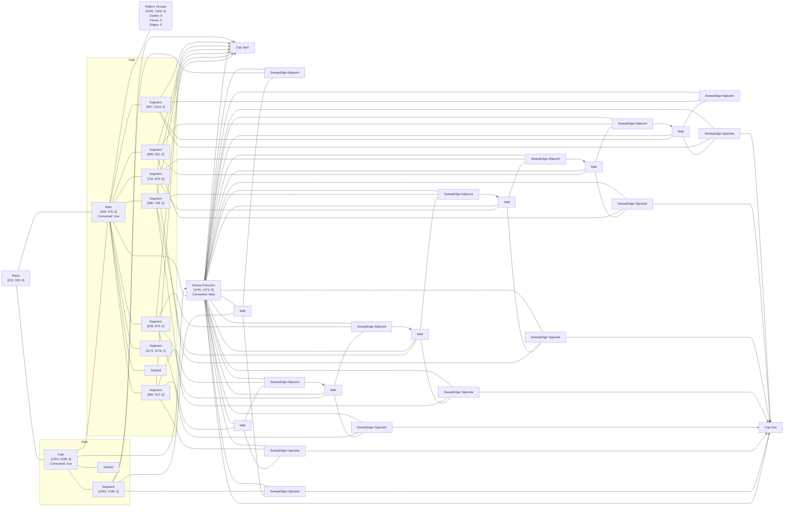

```mermaid
flowchart LR
  subgraph path11 [Path]
    11["Path<br>[338, 378, 0]<br>Consumed: true"]
      %% [ProgramBodyItem { index: 10 }, VariableDeclarationDeclaration, VariableDeclarationInit, PipeBodyItem { index: 1 }]
    12["Segment<br>[384, 522, 0]"]
      %% [ProgramBodyItem { index: 10 }, VariableDeclarationDeclaration, VariableDeclarationInit, PipeBodyItem { index: 2 }]
    13["Segment<br>[528, 574, 0]"]
      %% [ProgramBodyItem { index: 10 }, VariableDeclarationDeclaration, VariableDeclarationInit, PipeBodyItem { index: 3 }]
    14["Segment<br>[580, 728, 0]"]
      %% [ProgramBodyItem { index: 10 }, VariableDeclarationDeclaration, VariableDeclarationInit, PipeBodyItem { index: 4 }]
    15["Segment<br>[734, 879, 0]"]
      %% [ProgramBodyItem { index: 10 }, VariableDeclarationDeclaration, VariableDeclarationInit, PipeBodyItem { index: 5 }]
    16["Segment<br>[885, 931, 0]"]
      %% [ProgramBodyItem { index: 10 }, VariableDeclarationDeclaration, VariableDeclarationInit, PipeBodyItem { index: 6 }]
    17["Segment<br>[937, 1014, 0]"]
      %% [ProgramBodyItem { index: 10 }, VariableDeclarationDeclaration, VariableDeclarationInit, PipeBodyItem { index: 7 }]
    19["Segment<br>[1172, 1179, 0]"]
      %% [ProgramBodyItem { index: 10 }, VariableDeclarationDeclaration, VariableDeclarationInit, PipeBodyItem { index: 9 }]
    24[Solid2d]
  end
  subgraph path20 [Path]
    20["Path<br>[1203, 1238, 0]<br>Consumed: true"]
      %% [ProgramBodyItem { index: 10 }, VariableDeclarationDeclaration, VariableDeclarationInit, PipeBodyItem { index: 10 }, CallKwArg { index: 0 }]
    21["Segment<br>[1203, 1238, 0]"]
      %% [ProgramBodyItem { index: 10 }, VariableDeclarationDeclaration, VariableDeclarationInit, PipeBodyItem { index: 10 }, CallKwArg { index: 0 }]
    23[Solid2d]
  end
  1["Cap End"]
    %% face_code_ref=Missing NodePath
  2["Cap Start"]
    %% face_code_ref=Missing NodePath
  3[Wall]
    %% face_code_ref=Missing NodePath
  4[Wall]
    %% face_code_ref=Missing NodePath
  5[Wall]
    %% face_code_ref=Missing NodePath
  6[Wall]
    %% face_code_ref=Missing NodePath
  7[Wall]
    %% face_code_ref=Missing NodePath
  8[Wall]
    %% face_code_ref=Missing NodePath
  9[Wall]
    %% face_code_ref=Missing NodePath
  10["Plane<br>[315, 332, 0]"]
    %% [ProgramBodyItem { index: 10 }, VariableDeclarationDeclaration, VariableDeclarationInit, PipeBodyItem { index: 0 }]
  18["Pattern Circular<br>[1020, 1166, 0]<br>Copies: 0<br>Faces: 0<br>Edges: 0"]
    %% [ProgramBodyItem { index: 10 }, VariableDeclarationDeclaration, VariableDeclarationInit, PipeBodyItem { index: 8 }]
  22["Sweep Extrusion<br>[1245, 1273, 0]<br>Consumed: false"]
    %% [ProgramBodyItem { index: 10 }, VariableDeclarationDeclaration, VariableDeclarationInit, PipeBodyItem { index: 11 }]
  25["SweepEdge Adjacent"]
  26["SweepEdge Adjacent"]
  27["SweepEdge Adjacent"]
  28["SweepEdge Adjacent"]
  29["SweepEdge Adjacent"]
  30["SweepEdge Adjacent"]
  31["SweepEdge Adjacent"]
  32["SweepEdge Opposite"]
  33["SweepEdge Opposite"]
  34["SweepEdge Opposite"]
  35["SweepEdge Opposite"]
  36["SweepEdge Opposite"]
  37["SweepEdge Opposite"]
  38["SweepEdge Opposite"]
  22 --- 1
  32 <--x 1
  33 <--x 1
  34 <--x 1
  35 <--x 1
  36 <--x 1
  37 <--x 1
  38 <--x 1
  12 <--x 2
  13 <--x 2
  14 <--x 2
  15 <--x 2
  16 <--x 2
  17 <--x 2
  21 <--x 2
  22 --- 2
  21 --- 3
  22 --- 3
  3 --- 25
  3 --- 32
  12 --- 4
  22 --- 4
  4 --- 26
  4 --- 33
  13 --- 5
  22 --- 5
  26 <--x 5
  5 --- 27
  5 --- 34
  14 --- 6
  22 --- 6
  27 <--x 6
  6 --- 28
  6 --- 35
  15 --- 7
  22 --- 7
  28 <--x 7
  7 --- 29
  7 --- 36
  16 --- 8
  22 --- 8
  29 <--x 8
  8 --- 30
  8 --- 37
  17 --- 9
  22 --- 9
  30 <--x 9
  9 --- 31
  9 --- 38
  10 --- 11
  10 --- 20
  11 --- 12
  11 --- 13
  11 --- 14
  11 --- 15
  11 --- 16
  11 --- 17
  11 --- 18
  11 --- 19
  20 --- 11
  11 ---- 22
  11 --- 24
  12 --- 26
  12 --- 33
  13 --- 27
  13 --- 34
  14 --- 28
  14 --- 35
  15 --- 29
  15 --- 36
  16 --- 30
  16 --- 37
  17 --- 31
  17 --- 38
  20 --- 21
  20 x---> 22
  20 --- 23
  21 --- 25
  21 --- 32
  22 --- 25
  22 --- 26
  22 --- 27
  22 --- 28
  22 --- 29
  22 --- 30
  22 --- 31
  22 --- 32
  22 --- 33
  22 --- 34
  22 --- 35
  22 --- 36
  22 --- 37
  22 --- 38
```
