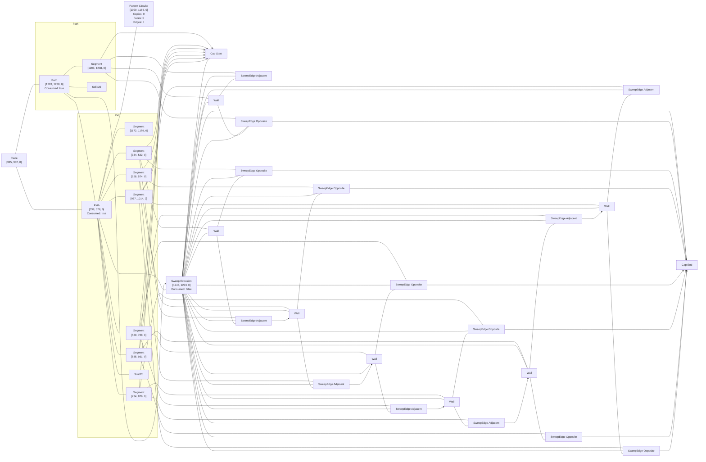

```mermaid
flowchart LR
  subgraph path4 [Path]
    4["Path<br>[338, 378, 0]<br>Consumed: true"]
      %% [ProgramBodyItem { index: 10 }, VariableDeclarationDeclaration, VariableDeclarationInit, PipeBodyItem { index: 1 }]
    9["Segment<br>[384, 522, 0]"]
      %% [ProgramBodyItem { index: 10 }, VariableDeclarationDeclaration, VariableDeclarationInit, PipeBodyItem { index: 2 }]
    10["Segment<br>[528, 574, 0]"]
      %% [ProgramBodyItem { index: 10 }, VariableDeclarationDeclaration, VariableDeclarationInit, PipeBodyItem { index: 3 }]
    11["Segment<br>[580, 728, 0]"]
      %% [ProgramBodyItem { index: 10 }, VariableDeclarationDeclaration, VariableDeclarationInit, PipeBodyItem { index: 4 }]
    12["Segment<br>[734, 879, 0]"]
      %% [ProgramBodyItem { index: 10 }, VariableDeclarationDeclaration, VariableDeclarationInit, PipeBodyItem { index: 5 }]
    13["Segment<br>[885, 931, 0]"]
      %% [ProgramBodyItem { index: 10 }, VariableDeclarationDeclaration, VariableDeclarationInit, PipeBodyItem { index: 6 }]
    14["Segment<br>[937, 1014, 0]"]
      %% [ProgramBodyItem { index: 10 }, VariableDeclarationDeclaration, VariableDeclarationInit, PipeBodyItem { index: 7 }]
    7["Segment<br>[1172, 1179, 0]"]
      %% [ProgramBodyItem { index: 10 }, VariableDeclarationDeclaration, VariableDeclarationInit, PipeBodyItem { index: 9 }]
    16[Solid2d]
  end
  subgraph path3 [Path]
    3["Path<br>[1203, 1238, 0]<br>Consumed: true"]
      %% [ProgramBodyItem { index: 10 }, VariableDeclarationDeclaration, VariableDeclarationInit, PipeBodyItem { index: 10 }, CallKwArg { index: 0 }]
    8["Segment<br>[1203, 1238, 0]"]
      %% [ProgramBodyItem { index: 10 }, VariableDeclarationDeclaration, VariableDeclarationInit, PipeBodyItem { index: 10 }, CallKwArg { index: 0 }]
    15[Solid2d]
  end
  6["Plane<br>[315, 332, 0]"]
    %% [ProgramBodyItem { index: 10 }, VariableDeclarationDeclaration, VariableDeclarationInit, PipeBodyItem { index: 0 }]
  5["Pattern Circular<br>[1020, 1166, 0]<br>Copies: 0<br>Faces: 0<br>Edges: 0"]
    %% [ProgramBodyItem { index: 10 }, VariableDeclarationDeclaration, VariableDeclarationInit, PipeBodyItem { index: 8 }]
  17["Sweep Extrusion<br>[1245, 1273, 0]<br>Consumed: false"]
    %% [ProgramBodyItem { index: 10 }, VariableDeclarationDeclaration, VariableDeclarationInit, PipeBodyItem { index: 11 }]
  33[Wall]
    %% face_code_ref=Missing NodePath
  34[Wall]
    %% face_code_ref=Missing NodePath
  35[Wall]
    %% face_code_ref=Missing NodePath
  36[Wall]
    %% face_code_ref=Missing NodePath
  37[Wall]
    %% face_code_ref=Missing NodePath
  38[Wall]
    %% face_code_ref=Missing NodePath
  32[Wall]
    %% face_code_ref=Missing NodePath
  2["Cap Start"]
    %% face_code_ref=Missing NodePath
  1["Cap End"]
    %% face_code_ref=Missing NodePath
  26["SweepEdge Opposite"]
  19["SweepEdge Adjacent"]
  27["SweepEdge Opposite"]
  20["SweepEdge Adjacent"]
  28["SweepEdge Opposite"]
  21["SweepEdge Adjacent"]
  29["SweepEdge Opposite"]
  22["SweepEdge Adjacent"]
  30["SweepEdge Opposite"]
  23["SweepEdge Adjacent"]
  31["SweepEdge Opposite"]
  24["SweepEdge Adjacent"]
  25["SweepEdge Opposite"]
  18["SweepEdge Adjacent"]
  17 --- 1
  25 <--x 1
  26 <--x 1
  27 <--x 1
  28 <--x 1
  29 <--x 1
  30 <--x 1
  31 <--x 1
  8 <--x 2
  9 <--x 2
  10 <--x 2
  11 <--x 2
  12 <--x 2
  13 <--x 2
  14 <--x 2
  17 --- 2
  3 --- 4
  6 --- 3
  3 --- 8
  3 --- 15
  3 x---> 17
  4 --- 5
  6 --- 4
  4 --- 7
  4 --- 9
  4 --- 10
  4 --- 11
  4 --- 12
  4 --- 13
  4 --- 14
  4 --- 16
  4 ---- 17
  8 --- 18
  8 --- 25
  8 --- 32
  9 --- 19
  9 --- 26
  9 --- 33
  10 --- 20
  10 --- 27
  10 --- 34
  11 --- 21
  11 --- 28
  11 --- 35
  12 --- 22
  12 --- 29
  12 --- 36
  13 --- 23
  13 --- 30
  13 --- 37
  14 --- 24
  14 --- 31
  14 --- 38
  17 --- 18
  17 --- 19
  17 --- 20
  17 --- 21
  17 --- 22
  17 --- 23
  17 --- 24
  17 --- 25
  17 --- 26
  17 --- 27
  17 --- 28
  17 --- 29
  17 --- 30
  17 --- 31
  17 --- 32
  17 --- 33
  17 --- 34
  17 --- 35
  17 --- 36
  17 --- 37
  17 --- 38
  32 --- 18
  33 --- 19
  19 x--> 34
  34 --- 20
  20 x--> 35
  35 --- 21
  21 x--> 36
  36 --- 22
  22 x--> 37
  37 --- 23
  23 x--> 38
  38 --- 24
  32 --- 25
  33 --- 26
  34 --- 27
  35 --- 28
  36 --- 29
  37 --- 30
  38 --- 31
```
