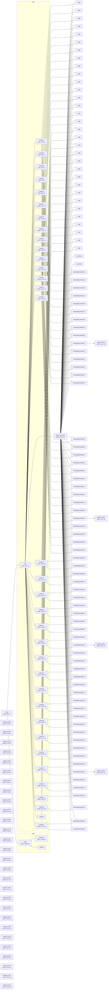

```mermaid
flowchart LR
  subgraph path2 [Path]
    2["Path<br>[326, 423, 0]"]
    3["Segment<br>[431, 536, 0]"]
    4["Segment<br>[544, 653, 0]"]
    5["Segment<br>[661, 693, 0]"]
    6["Segment<br>[701, 810, 0]"]
    7["Segment<br>[818, 865, 0]"]
    8["Segment<br>[1438, 1547, 0]"]
    9["Segment<br>[1555, 1587, 0]"]
    10["Segment<br>[1595, 1704, 0]"]
    11["Segment<br>[1712, 1815, 0]"]
    12["Segment<br>[1856, 1966, 0]"]
    13["Segment<br>[1974, 2006, 0]"]
    14["Segment<br>[2014, 2124, 0]"]
    15["Segment<br>[2132, 2179, 0]"]
    16["Segment<br>[2813, 2923, 0]"]
    17["Segment<br>[2931, 2963, 0]"]
    18["Segment<br>[2971, 3081, 0]"]
    19["Segment<br>[3122, 3224, 0]"]
    20["Segment<br>[3232, 3342, 0]"]
    21["Segment<br>[3350, 3383, 0]"]
    22["Segment<br>[3391, 3501, 0]"]
    23["Segment<br>[3509, 3558, 0]"]
    24["Segment<br>[4154, 4264, 0]"]
    25["Segment<br>[4272, 4305, 0]"]
    26["Segment<br>[4313, 4423, 0]"]
    27["Segment<br>[4431, 4535, 0]"]
    28["Segment<br>[4576, 4686, 0]"]
    29["Segment<br>[4694, 4727, 0]"]
    30["Segment<br>[4735, 4845, 0]"]
    31["Segment<br>[4853, 4902, 0]"]
    32["Segment<br>[5482, 5592, 0]"]
    33["Segment<br>[5600, 5633, 0]"]
    34["Segment<br>[5641, 5751, 0]"]
    35["Segment<br>[5759, 5766, 0]"]
    36[Solid2d]
  end
  subgraph path37 [Path]
    37["Path<br>[5817, 5994, 0]"]
    38["Segment<br>[5817, 5994, 0]"]
    39[Solid2d]
  end
  1["Plane<br>[298, 318, 0]"]
  40["Sweep Extrusion<br>[6006, 6034, 0]"]
  41[Wall]
  42[Wall]
  43[Wall]
  44[Wall]
  45[Wall]
  46[Wall]
  47[Wall]
  48[Wall]
  49[Wall]
  50[Wall]
  51[Wall]
  52[Wall]
  53[Wall]
  54[Wall]
  55[Wall]
  56[Wall]
  57[Wall]
  58[Wall]
  59[Wall]
  60[Wall]
  61[Wall]
  62[Wall]
  63[Wall]
  64[Wall]
  65[Wall]
  66[Wall]
  67[Wall]
  68[Wall]
  69[Wall]
  70[Wall]
  71[Wall]
  72[Wall]
  73["Cap Start"]
  74["Cap End"]
  75["SweepEdge Opposite"]
  76["SweepEdge Adjacent"]
  77["SweepEdge Opposite"]
  78["SweepEdge Adjacent"]
  79["SweepEdge Opposite"]
  80["SweepEdge Adjacent"]
  81["SweepEdge Opposite"]
  82["SweepEdge Adjacent"]
  83["SweepEdge Opposite"]
  84["SweepEdge Adjacent"]
  85["SweepEdge Opposite"]
  86["SweepEdge Adjacent"]
  87["SweepEdge Opposite"]
  88["SweepEdge Adjacent"]
  89["SweepEdge Opposite"]
  90["SweepEdge Adjacent"]
  91["SweepEdge Opposite"]
  92["SweepEdge Adjacent"]
  93["SweepEdge Opposite"]
  94["SweepEdge Adjacent"]
  95["SweepEdge Opposite"]
  96["SweepEdge Adjacent"]
  97["SweepEdge Opposite"]
  98["SweepEdge Adjacent"]
  99["SweepEdge Opposite"]
  100["SweepEdge Adjacent"]
  101["SweepEdge Opposite"]
  102["SweepEdge Adjacent"]
  103["SweepEdge Opposite"]
  104["SweepEdge Adjacent"]
  105["SweepEdge Opposite"]
  106["SweepEdge Adjacent"]
  107["SweepEdge Opposite"]
  108["SweepEdge Adjacent"]
  109["SweepEdge Opposite"]
  110["SweepEdge Adjacent"]
  111["SweepEdge Opposite"]
  112["SweepEdge Adjacent"]
  113["SweepEdge Opposite"]
  114["SweepEdge Adjacent"]
  115["SweepEdge Opposite"]
  116["SweepEdge Adjacent"]
  117["SweepEdge Opposite"]
  118["SweepEdge Adjacent"]
  119["SweepEdge Opposite"]
  120["SweepEdge Adjacent"]
  121["SweepEdge Opposite"]
  122["SweepEdge Adjacent"]
  123["SweepEdge Opposite"]
  124["SweepEdge Adjacent"]
  125["SweepEdge Opposite"]
  126["SweepEdge Adjacent"]
  127["SweepEdge Opposite"]
  128["SweepEdge Adjacent"]
  129["SweepEdge Opposite"]
  130["SweepEdge Adjacent"]
  131["SweepEdge Opposite"]
  132["SweepEdge Adjacent"]
  133["SweepEdge Opposite"]
  134["SweepEdge Adjacent"]
  135["SweepEdge Opposite"]
  136["SweepEdge Adjacent"]
  137["SweepEdge Opposite"]
  138["SweepEdge Adjacent"]
  139["EdgeCut Fillet<br>[6042, 6746, 0]"]
  140["EdgeCut Fillet<br>[6042, 6746, 0]"]
  141["EdgeCut Fillet<br>[6042, 6746, 0]"]
  142["EdgeCut Fillet<br>[6042, 6746, 0]"]
  143["EdgeCut Fillet<br>[6042, 6746, 0]"]
  144["EdgeCut Fillet<br>[6042, 6746, 0]"]
  145["EdgeCut Fillet<br>[6042, 6746, 0]"]
  146["EdgeCut Fillet<br>[6042, 6746, 0]"]
  147["EdgeCut Fillet<br>[6042, 6746, 0]"]
  148["EdgeCut Fillet<br>[6042, 6746, 0]"]
  149["EdgeCut Fillet<br>[6042, 6746, 0]"]
  150["EdgeCut Fillet<br>[6042, 6746, 0]"]
  151["EdgeCut Fillet<br>[6042, 6746, 0]"]
  152["EdgeCut Fillet<br>[6042, 6746, 0]"]
  153["EdgeCut Fillet<br>[6042, 6746, 0]"]
  154["EdgeCut Fillet<br>[6042, 6746, 0]"]
  155["EdgeCut Fillet<br>[6754, 7457, 0]"]
  156["EdgeCut Fillet<br>[6754, 7457, 0]"]
  157["EdgeCut Fillet<br>[6754, 7457, 0]"]
  158["EdgeCut Fillet<br>[6754, 7457, 0]"]
  159["EdgeCut Fillet<br>[6754, 7457, 0]"]
  160["EdgeCut Fillet<br>[6754, 7457, 0]"]
  161["EdgeCut Fillet<br>[6754, 7457, 0]"]
  162["EdgeCut Fillet<br>[6754, 7457, 0]"]
  163["EdgeCut Fillet<br>[6754, 7457, 0]"]
  164["EdgeCut Fillet<br>[6754, 7457, 0]"]
  165["EdgeCut Fillet<br>[6754, 7457, 0]"]
  166["EdgeCut Fillet<br>[6754, 7457, 0]"]
  167["EdgeCut Fillet<br>[6754, 7457, 0]"]
  168["EdgeCut Fillet<br>[6754, 7457, 0]"]
  169["EdgeCut Fillet<br>[6754, 7457, 0]"]
  170["EdgeCut Fillet<br>[6754, 7457, 0]"]
  1 --- 2
  1 --- 37
  2 --- 3
  2 --- 4
  2 --- 5
  2 --- 6
  2 --- 7
  2 --- 8
  2 --- 9
  2 --- 10
  2 --- 11
  2 --- 12
  2 --- 13
  2 --- 14
  2 --- 15
  2 --- 16
  2 --- 17
  2 --- 18
  2 --- 19
  2 --- 20
  2 --- 21
  2 --- 22
  2 --- 23
  2 --- 24
  2 --- 25
  2 --- 26
  2 --- 27
  2 --- 28
  2 --- 29
  2 --- 30
  2 --- 31
  2 --- 32
  2 --- 33
  2 --- 34
  2 --- 35
  2 ---- 40
  2 --- 36
  3 --- 41
  3 --- 75
  3 --- 76
  4 --- 42
  4 --- 77
  4 --- 78
  5 --- 43
  5 --- 79
  5 --- 80
  6 --- 44
  6 --- 81
  6 --- 82
  7 --- 45
  7 --- 83
  7 --- 84
  8 --- 46
  8 --- 85
  8 --- 86
  9 --- 47
  9 --- 87
  9 --- 88
  10 --- 48
  10 --- 89
  10 --- 90
  11 --- 49
  11 --- 91
  11 --- 92
  12 --- 50
  12 --- 93
  12 --- 94
  13 --- 51
  13 --- 95
  13 --- 96
  14 --- 52
  14 --- 97
  14 --- 98
  15 --- 53
  15 --- 99
  15 --- 100
  16 --- 54
  16 --- 101
  16 --- 102
  17 --- 55
  17 --- 103
  17 --- 104
  18 --- 56
  18 --- 105
  18 --- 106
  19 --- 57
  19 --- 107
  19 --- 108
  20 --- 58
  20 --- 109
  20 --- 110
  21 --- 59
  21 --- 111
  21 --- 112
  22 --- 60
  22 --- 113
  22 --- 114
  23 --- 61
  23 --- 115
  23 --- 116
  24 --- 62
  24 --- 117
  24 --- 118
  25 --- 63
  25 --- 119
  25 --- 120
  26 --- 64
  26 --- 121
  26 --- 122
  27 --- 65
  27 --- 123
  27 --- 124
  28 --- 66
  28 --- 125
  28 --- 126
  29 --- 67
  29 --- 127
  29 --- 128
  30 --- 68
  30 --- 129
  30 --- 130
  31 --- 69
  31 --- 131
  31 --- 132
  32 --- 70
  32 --- 133
  32 --- 134
  33 --- 71
  33 --- 135
  33 --- 136
  34 --- 72
  34 --- 137
  34 --- 138
  37 --- 38
  37 --- 39
  40 --- 41
  40 --- 42
  40 --- 43
  40 --- 44
  40 --- 45
  40 --- 46
  40 --- 47
  40 --- 48
  40 --- 49
  40 --- 50
  40 --- 51
  40 --- 52
  40 --- 53
  40 --- 54
  40 --- 55
  40 --- 56
  40 --- 57
  40 --- 58
  40 --- 59
  40 --- 60
  40 --- 61
  40 --- 62
  40 --- 63
  40 --- 64
  40 --- 65
  40 --- 66
  40 --- 67
  40 --- 68
  40 --- 69
  40 --- 70
  40 --- 71
  40 --- 72
  40 --- 73
  40 --- 74
  40 --- 75
  40 --- 76
  40 --- 77
  40 --- 78
  40 --- 79
  40 --- 80
  40 --- 81
  40 --- 82
  40 --- 83
  40 --- 84
  40 --- 85
  40 --- 86
  40 --- 87
  40 --- 88
  40 --- 89
  40 --- 90
  40 --- 91
  40 --- 92
  40 --- 93
  40 --- 94
  40 --- 95
  40 --- 96
  40 --- 97
  40 --- 98
  40 --- 99
  40 --- 100
  40 --- 101
  40 --- 102
  40 --- 103
  40 --- 104
  40 --- 105
  40 --- 106
  40 --- 107
  40 --- 108
  40 --- 109
  40 --- 110
  40 --- 111
  40 --- 112
  40 --- 113
  40 --- 114
  40 --- 115
  40 --- 116
  40 --- 117
  40 --- 118
  40 --- 119
  40 --- 120
  40 --- 121
  40 --- 122
  40 --- 123
  40 --- 124
  40 --- 125
  40 --- 126
  40 --- 127
  40 --- 128
  40 --- 129
  40 --- 130
  40 --- 131
  40 --- 132
  40 --- 133
  40 --- 134
  40 --- 135
  40 --- 136
  40 --- 137
  40 --- 138
  84 <--x 155
  100 <--x 159
  116 <--x 163
  132 <--x 167
```
