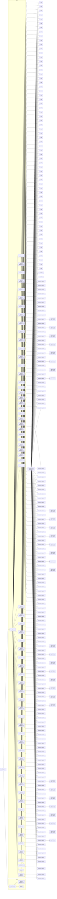

```mermaid
flowchart LR
  subgraph path2 [Path]
    2["Path<br>[349, 446, 0]"]
    3["Segment<br>[454, 518, 0]"]
    4["Segment<br>[526, 594, 0]"]
    5["Segment<br>[602, 634, 0]"]
    6["Segment<br>[642, 710, 0]"]
    7["Segment<br>[718, 765, 0]"]
    8["Segment<br>[773, 821, 0]"]
    9["Segment<br>[829, 878, 0]"]
    10["Segment<br>[886, 984, 0]"]
    11["Segment<br>[992, 1040, 0]"]
    12["Segment<br>[1048, 1137, 0]"]
    13["Segment<br>[1145, 1194, 0]"]
    14["Segment<br>[1202, 1251, 0]"]
    15["Segment<br>[1259, 1292, 0]"]
    16["Segment<br>[1300, 1368, 0]"]
    17["Segment<br>[1376, 1408, 0]"]
    18["Segment<br>[1416, 1484, 0]"]
    19["Segment<br>[1492, 1554, 0]"]
    20["Segment<br>[1595, 1664, 0]"]
    21["Segment<br>[1672, 1704, 0]"]
    22["Segment<br>[1712, 1781, 0]"]
    23["Segment<br>[1789, 1836, 0]"]
    24["Segment<br>[1844, 1894, 0]"]
    25["Segment<br>[1902, 1952, 0]"]
    26["Segment<br>[1970, 2080, 0]"]
    27["Segment<br>[2098, 2147, 0]"]
    28["Segment<br>[2161, 2256, 0]"]
    29["Segment<br>[2270, 2320, 0]"]
    30["Segment<br>[2334, 2383, 0]"]
    31["Segment<br>[2391, 2424, 0]"]
    32["Segment<br>[2432, 2501, 0]"]
    33["Segment<br>[2509, 2541, 0]"]
    34["Segment<br>[2549, 2618, 0]"]
    35["Segment<br>[2659, 2720, 0]"]
    36["Segment<br>[2728, 2797, 0]"]
    37["Segment<br>[2805, 2838, 0]"]
    38["Segment<br>[2846, 2915, 0]"]
    39["Segment<br>[2923, 2972, 0]"]
    40["Segment<br>[2980, 3030, 0]"]
    41["Segment<br>[3038, 3087, 0]"]
    42["Segment<br>[3095, 3204, 0]"]
    43["Segment<br>[3212, 3262, 0]"]
    44["Segment<br>[3270, 3366, 0]"]
    45["Segment<br>[3374, 3423, 0]"]
    46["Segment<br>[3431, 3480, 0]"]
    47["Segment<br>[3488, 3522, 0]"]
    48["Segment<br>[3530, 3599, 0]"]
    49["Segment<br>[3607, 3640, 0]"]
    50["Segment<br>[3648, 3717, 0]"]
    51["Segment<br>[3725, 3788, 0]"]
    52["Segment<br>[3829, 3898, 0]"]
    53["Segment<br>[3906, 3939, 0]"]
    54["Segment<br>[3947, 4016, 0]"]
    55["Segment<br>[4024, 4073, 0]"]
    56["Segment<br>[4081, 4130, 0]"]
    57["Segment<br>[4138, 4187, 0]"]
    58["Segment<br>[4195, 4295, 0]"]
    59["Segment<br>[4303, 4353, 0]"]
    60["Segment<br>[4361, 4450, 0]"]
    61["Segment<br>[4458, 4507, 0]"]
    62["Segment<br>[4515, 4565, 0]"]
    63["Segment<br>[4573, 4607, 0]"]
    64["Segment<br>[4615, 4684, 0]"]
    65["Segment<br>[4692, 4725, 0]"]
    66["Segment<br>[4733, 4802, 0]"]
    67["Segment<br>[4810, 4817, 0]"]
    68[Solid2d]
  end
  subgraph path69 [Path]
    69["Path<br>[4868, 5046, 0]"]
    70["Segment<br>[4868, 5046, 0]"]
    71[Solid2d]
  end
  1["Plane<br>[323, 341, 0]"]
  72["Sweep Extrusion<br>[5058, 5086, 0]"]
  73[Wall]
  74[Wall]
  75[Wall]
  76[Wall]
  77[Wall]
  78[Wall]
  79[Wall]
  80[Wall]
  81[Wall]
  82[Wall]
  83[Wall]
  84[Wall]
  85[Wall]
  86[Wall]
  87[Wall]
  88[Wall]
  89[Wall]
  90[Wall]
  91[Wall]
  92[Wall]
  93[Wall]
  94[Wall]
  95[Wall]
  96[Wall]
  97[Wall]
  98[Wall]
  99[Wall]
  100[Wall]
  101[Wall]
  102[Wall]
  103[Wall]
  104[Wall]
  105[Wall]
  106[Wall]
  107[Wall]
  108[Wall]
  109[Wall]
  110[Wall]
  111[Wall]
  112[Wall]
  113[Wall]
  114[Wall]
  115[Wall]
  116[Wall]
  117[Wall]
  118[Wall]
  119[Wall]
  120[Wall]
  121[Wall]
  122[Wall]
  123[Wall]
  124[Wall]
  125[Wall]
  126[Wall]
  127[Wall]
  128[Wall]
  129[Wall]
  130[Wall]
  131[Wall]
  132[Wall]
  133[Wall]
  134[Wall]
  135[Wall]
  136[Wall]
  137["Cap Start"]
  138["Cap End"]
  139["SweepEdge Opposite"]
  140["SweepEdge Adjacent"]
  141["SweepEdge Opposite"]
  142["SweepEdge Adjacent"]
  143["SweepEdge Opposite"]
  144["SweepEdge Adjacent"]
  145["SweepEdge Opposite"]
  146["SweepEdge Adjacent"]
  147["SweepEdge Opposite"]
  148["SweepEdge Adjacent"]
  149["SweepEdge Opposite"]
  150["SweepEdge Adjacent"]
  151["SweepEdge Opposite"]
  152["SweepEdge Adjacent"]
  153["SweepEdge Opposite"]
  154["SweepEdge Adjacent"]
  155["SweepEdge Opposite"]
  156["SweepEdge Adjacent"]
  157["SweepEdge Opposite"]
  158["SweepEdge Adjacent"]
  159["SweepEdge Opposite"]
  160["SweepEdge Adjacent"]
  161["SweepEdge Opposite"]
  162["SweepEdge Adjacent"]
  163["SweepEdge Opposite"]
  164["SweepEdge Adjacent"]
  165["SweepEdge Opposite"]
  166["SweepEdge Adjacent"]
  167["SweepEdge Opposite"]
  168["SweepEdge Adjacent"]
  169["SweepEdge Opposite"]
  170["SweepEdge Adjacent"]
  171["SweepEdge Opposite"]
  172["SweepEdge Adjacent"]
  173["SweepEdge Opposite"]
  174["SweepEdge Adjacent"]
  175["SweepEdge Opposite"]
  176["SweepEdge Adjacent"]
  177["SweepEdge Opposite"]
  178["SweepEdge Adjacent"]
  179["SweepEdge Opposite"]
  180["SweepEdge Adjacent"]
  181["SweepEdge Opposite"]
  182["SweepEdge Adjacent"]
  183["SweepEdge Opposite"]
  184["SweepEdge Adjacent"]
  185["SweepEdge Opposite"]
  186["SweepEdge Adjacent"]
  187["SweepEdge Opposite"]
  188["SweepEdge Adjacent"]
  189["SweepEdge Opposite"]
  190["SweepEdge Adjacent"]
  191["SweepEdge Opposite"]
  192["SweepEdge Adjacent"]
  193["SweepEdge Opposite"]
  194["SweepEdge Adjacent"]
  195["SweepEdge Opposite"]
  196["SweepEdge Adjacent"]
  197["SweepEdge Opposite"]
  198["SweepEdge Adjacent"]
  199["SweepEdge Opposite"]
  200["SweepEdge Adjacent"]
  201["SweepEdge Opposite"]
  202["SweepEdge Adjacent"]
  203["SweepEdge Opposite"]
  204["SweepEdge Adjacent"]
  205["SweepEdge Opposite"]
  206["SweepEdge Adjacent"]
  207["SweepEdge Opposite"]
  208["SweepEdge Adjacent"]
  209["SweepEdge Opposite"]
  210["SweepEdge Adjacent"]
  211["SweepEdge Opposite"]
  212["SweepEdge Adjacent"]
  213["SweepEdge Opposite"]
  214["SweepEdge Adjacent"]
  215["SweepEdge Opposite"]
  216["SweepEdge Adjacent"]
  217["SweepEdge Opposite"]
  218["SweepEdge Adjacent"]
  219["SweepEdge Opposite"]
  220["SweepEdge Adjacent"]
  221["SweepEdge Opposite"]
  222["SweepEdge Adjacent"]
  223["SweepEdge Opposite"]
  224["SweepEdge Adjacent"]
  225["SweepEdge Opposite"]
  226["SweepEdge Adjacent"]
  227["SweepEdge Opposite"]
  228["SweepEdge Adjacent"]
  229["SweepEdge Opposite"]
  230["SweepEdge Adjacent"]
  231["SweepEdge Opposite"]
  232["SweepEdge Adjacent"]
  233["SweepEdge Opposite"]
  234["SweepEdge Adjacent"]
  235["SweepEdge Opposite"]
  236["SweepEdge Adjacent"]
  237["SweepEdge Opposite"]
  238["SweepEdge Adjacent"]
  239["SweepEdge Opposite"]
  240["SweepEdge Adjacent"]
  241["SweepEdge Opposite"]
  242["SweepEdge Adjacent"]
  243["SweepEdge Opposite"]
  244["SweepEdge Adjacent"]
  245["SweepEdge Opposite"]
  246["SweepEdge Adjacent"]
  247["SweepEdge Opposite"]
  248["SweepEdge Adjacent"]
  249["SweepEdge Opposite"]
  250["SweepEdge Adjacent"]
  251["SweepEdge Opposite"]
  252["SweepEdge Adjacent"]
  253["SweepEdge Opposite"]
  254["SweepEdge Adjacent"]
  255["SweepEdge Opposite"]
  256["SweepEdge Adjacent"]
  257["SweepEdge Opposite"]
  258["SweepEdge Adjacent"]
  259["SweepEdge Opposite"]
  260["SweepEdge Adjacent"]
  261["SweepEdge Opposite"]
  262["SweepEdge Adjacent"]
  263["SweepEdge Opposite"]
  264["SweepEdge Adjacent"]
  265["SweepEdge Opposite"]
  266["SweepEdge Adjacent"]
  267["EdgeCut Fillet<br>[5094, 5799, 0]"]
  268["EdgeCut Fillet<br>[5094, 5799, 0]"]
  269["EdgeCut Fillet<br>[5094, 5799, 0]"]
  270["EdgeCut Fillet<br>[5094, 5799, 0]"]
  271["EdgeCut Fillet<br>[5094, 5799, 0]"]
  272["EdgeCut Fillet<br>[5094, 5799, 0]"]
  273["EdgeCut Fillet<br>[5094, 5799, 0]"]
  274["EdgeCut Fillet<br>[5094, 5799, 0]"]
  275["EdgeCut Fillet<br>[5094, 5799, 0]"]
  276["EdgeCut Fillet<br>[5094, 5799, 0]"]
  277["EdgeCut Fillet<br>[5094, 5799, 0]"]
  278["EdgeCut Fillet<br>[5094, 5799, 0]"]
  279["EdgeCut Fillet<br>[5094, 5799, 0]"]
  280["EdgeCut Fillet<br>[5094, 5799, 0]"]
  281["EdgeCut Fillet<br>[5094, 5799, 0]"]
  282["EdgeCut Fillet<br>[5094, 5799, 0]"]
  283["EdgeCut Fillet<br>[5807, 6511, 0]"]
  284["EdgeCut Fillet<br>[5807, 6511, 0]"]
  285["EdgeCut Fillet<br>[5807, 6511, 0]"]
  286["EdgeCut Fillet<br>[5807, 6511, 0]"]
  287["EdgeCut Fillet<br>[5807, 6511, 0]"]
  288["EdgeCut Fillet<br>[5807, 6511, 0]"]
  289["EdgeCut Fillet<br>[5807, 6511, 0]"]
  290["EdgeCut Fillet<br>[5807, 6511, 0]"]
  291["EdgeCut Fillet<br>[5807, 6511, 0]"]
  292["EdgeCut Fillet<br>[5807, 6511, 0]"]
  293["EdgeCut Fillet<br>[5807, 6511, 0]"]
  294["EdgeCut Fillet<br>[5807, 6511, 0]"]
  295["EdgeCut Fillet<br>[5807, 6511, 0]"]
  296["EdgeCut Fillet<br>[5807, 6511, 0]"]
  297["EdgeCut Fillet<br>[5807, 6511, 0]"]
  298["EdgeCut Fillet<br>[5807, 6511, 0]"]
  1 --- 2
  1 --- 69
  2 --- 3
  2 --- 4
  2 --- 5
  2 --- 6
  2 --- 7
  2 --- 8
  2 --- 9
  2 --- 10
  2 --- 11
  2 --- 12
  2 --- 13
  2 --- 14
  2 --- 15
  2 --- 16
  2 --- 17
  2 --- 18
  2 --- 19
  2 --- 20
  2 --- 21
  2 --- 22
  2 --- 23
  2 --- 24
  2 --- 25
  2 --- 26
  2 --- 27
  2 --- 28
  2 --- 29
  2 --- 30
  2 --- 31
  2 --- 32
  2 --- 33
  2 --- 34
  2 --- 35
  2 --- 36
  2 --- 37
  2 --- 38
  2 --- 39
  2 --- 40
  2 --- 41
  2 --- 42
  2 --- 43
  2 --- 44
  2 --- 45
  2 --- 46
  2 --- 47
  2 --- 48
  2 --- 49
  2 --- 50
  2 --- 51
  2 --- 52
  2 --- 53
  2 --- 54
  2 --- 55
  2 --- 56
  2 --- 57
  2 --- 58
  2 --- 59
  2 --- 60
  2 --- 61
  2 --- 62
  2 --- 63
  2 --- 64
  2 --- 65
  2 --- 66
  2 --- 67
  2 ---- 72
  2 --- 68
  3 --- 136
  3 --- 265
  3 --- 266
  4 --- 135
  4 --- 263
  4 --- 264
  5 --- 134
  5 --- 261
  5 --- 262
  6 --- 133
  6 --- 259
  6 --- 260
  7 --- 132
  7 --- 257
  7 --- 258
  8 --- 131
  8 --- 255
  8 --- 256
  9 --- 130
  9 --- 253
  9 --- 254
  10 --- 129
  10 --- 251
  10 --- 252
  11 --- 128
  11 --- 249
  11 --- 250
  12 --- 127
  12 --- 247
  12 --- 248
  13 --- 126
  13 --- 245
  13 --- 246
  14 --- 125
  14 --- 243
  14 --- 244
  15 --- 124
  15 --- 241
  15 --- 242
  16 --- 123
  16 --- 239
  16 --- 240
  17 --- 122
  17 --- 237
  17 --- 238
  18 --- 121
  18 --- 235
  18 --- 236
  19 --- 120
  19 --- 233
  19 --- 234
  20 --- 119
  20 --- 231
  20 --- 232
  21 --- 118
  21 --- 229
  21 --- 230
  22 --- 117
  22 --- 227
  22 --- 228
  23 --- 116
  23 --- 225
  23 --- 226
  24 --- 115
  24 --- 223
  24 --- 224
  25 --- 114
  25 --- 221
  25 --- 222
  26 --- 113
  26 --- 219
  26 --- 220
  27 --- 112
  27 --- 217
  27 --- 218
  28 --- 111
  28 --- 215
  28 --- 216
  29 --- 110
  29 --- 213
  29 --- 214
  30 --- 109
  30 --- 211
  30 --- 212
  31 --- 108
  31 --- 209
  31 --- 210
  32 --- 107
  32 --- 207
  32 --- 208
  33 --- 106
  33 --- 205
  33 --- 206
  34 --- 105
  34 --- 203
  34 --- 204
  35 --- 104
  35 --- 201
  35 --- 202
  36 --- 103
  36 --- 199
  36 --- 200
  37 --- 102
  37 --- 197
  37 --- 198
  38 --- 101
  38 --- 195
  38 --- 196
  39 --- 100
  39 --- 193
  39 --- 194
  40 --- 99
  40 --- 191
  40 --- 192
  41 --- 98
  41 --- 189
  41 --- 190
  42 --- 97
  42 --- 187
  42 --- 188
  43 --- 96
  43 --- 185
  43 --- 186
  44 --- 95
  44 --- 183
  44 --- 184
  45 --- 94
  45 --- 181
  45 --- 182
  46 --- 93
  46 --- 179
  46 --- 180
  47 --- 92
  47 --- 177
  47 --- 178
  48 --- 91
  48 --- 175
  48 --- 176
  49 --- 90
  49 --- 173
  49 --- 174
  50 --- 89
  50 --- 171
  50 --- 172
  51 --- 88
  51 --- 169
  51 --- 170
  52 --- 87
  52 --- 167
  52 --- 168
  53 --- 86
  53 --- 165
  53 --- 166
  54 --- 85
  54 --- 163
  54 --- 164
  55 --- 84
  55 --- 161
  55 --- 162
  56 --- 83
  56 --- 159
  56 --- 160
  57 --- 82
  57 --- 157
  57 --- 158
  58 --- 81
  58 --- 155
  58 --- 156
  59 --- 80
  59 --- 153
  59 --- 154
  60 --- 79
  60 --- 151
  60 --- 152
  61 --- 78
  61 --- 149
  61 --- 150
  62 --- 77
  62 --- 147
  62 --- 148
  63 --- 76
  63 --- 145
  63 --- 146
  64 --- 75
  64 --- 143
  64 --- 144
  65 --- 74
  65 --- 141
  65 --- 142
  66 --- 73
  66 --- 139
  66 --- 140
  69 --- 70
  69 --- 71
  72 --- 73
  72 --- 74
  72 --- 75
  72 --- 76
  72 --- 77
  72 --- 78
  72 --- 79
  72 --- 80
  72 --- 81
  72 --- 82
  72 --- 83
  72 --- 84
  72 --- 85
  72 --- 86
  72 --- 87
  72 --- 88
  72 --- 89
  72 --- 90
  72 --- 91
  72 --- 92
  72 --- 93
  72 --- 94
  72 --- 95
  72 --- 96
  72 --- 97
  72 --- 98
  72 --- 99
  72 --- 100
  72 --- 101
  72 --- 102
  72 --- 103
  72 --- 104
  72 --- 105
  72 --- 106
  72 --- 107
  72 --- 108
  72 --- 109
  72 --- 110
  72 --- 111
  72 --- 112
  72 --- 113
  72 --- 114
  72 --- 115
  72 --- 116
  72 --- 117
  72 --- 118
  72 --- 119
  72 --- 120
  72 --- 121
  72 --- 122
  72 --- 123
  72 --- 124
  72 --- 125
  72 --- 126
  72 --- 127
  72 --- 128
  72 --- 129
  72 --- 130
  72 --- 131
  72 --- 132
  72 --- 133
  72 --- 134
  72 --- 135
  72 --- 136
  72 --- 137
  72 --- 138
  72 --- 139
  72 --- 140
  72 --- 141
  72 --- 142
  72 --- 143
  72 --- 144
  72 --- 145
  72 --- 146
  72 --- 147
  72 --- 148
  72 --- 149
  72 --- 150
  72 --- 151
  72 --- 152
  72 --- 153
  72 --- 154
  72 --- 155
  72 --- 156
  72 --- 157
  72 --- 158
  72 --- 159
  72 --- 160
  72 --- 161
  72 --- 162
  72 --- 163
  72 --- 164
  72 --- 165
  72 --- 166
  72 --- 167
  72 --- 168
  72 --- 169
  72 --- 170
  72 --- 171
  72 --- 172
  72 --- 173
  72 --- 174
  72 --- 175
  72 --- 176
  72 --- 177
  72 --- 178
  72 --- 179
  72 --- 180
  72 --- 181
  72 --- 182
  72 --- 183
  72 --- 184
  72 --- 185
  72 --- 186
  72 --- 187
  72 --- 188
  72 --- 189
  72 --- 190
  72 --- 191
  72 --- 192
  72 --- 193
  72 --- 194
  72 --- 195
  72 --- 196
  72 --- 197
  72 --- 198
  72 --- 199
  72 --- 200
  72 --- 201
  72 --- 202
  72 --- 203
  72 --- 204
  72 --- 205
  72 --- 206
  72 --- 207
  72 --- 208
  72 --- 209
  72 --- 210
  72 --- 211
  72 --- 212
  72 --- 213
  72 --- 214
  72 --- 215
  72 --- 216
  72 --- 217
  72 --- 218
  72 --- 219
  72 --- 220
  72 --- 221
  72 --- 222
  72 --- 223
  72 --- 224
  72 --- 225
  72 --- 226
  72 --- 227
  72 --- 228
  72 --- 229
  72 --- 230
  72 --- 231
  72 --- 232
  72 --- 233
  72 --- 234
  72 --- 235
  72 --- 236
  72 --- 237
  72 --- 238
  72 --- 239
  72 --- 240
  72 --- 241
  72 --- 242
  72 --- 243
  72 --- 244
  72 --- 245
  72 --- 246
  72 --- 247
  72 --- 248
  72 --- 249
  72 --- 250
  72 --- 251
  72 --- 252
  72 --- 253
  72 --- 254
  72 --- 255
  72 --- 256
  72 --- 257
  72 --- 258
  72 --- 259
  72 --- 260
  72 --- 261
  72 --- 262
  72 --- 263
  72 --- 264
  72 --- 265
  72 --- 266
  254 <--x 267
  252 <--x 268
  250 <--x 269
  248 <--x 270
  222 <--x 271
  220 <--x 272
  218 <--x 273
  216 <--x 274
  190 <--x 275
  188 <--x 276
  186 <--x 277
  184 <--x 278
  158 <--x 279
  156 <--x 280
  154 <--x 281
  152 <--x 282
  258 <--x 283
  256 <--x 284
  246 <--x 285
  244 <--x 286
  226 <--x 287
  224 <--x 288
  214 <--x 289
  212 <--x 290
  194 <--x 291
  192 <--x 292
  182 <--x 293
  180 <--x 294
  162 <--x 295
  160 <--x 296
  150 <--x 297
  148 <--x 298
```
