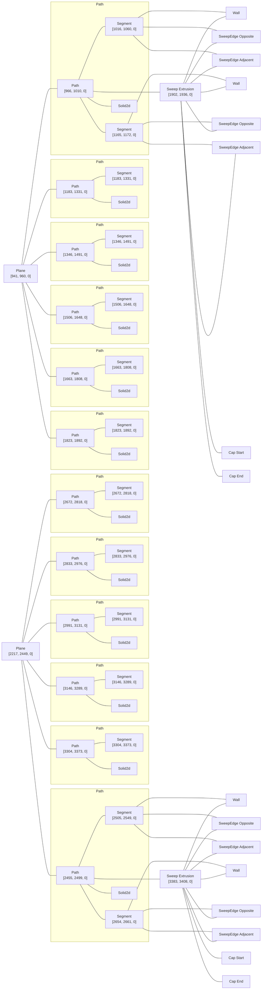

```mermaid
flowchart LR
  subgraph path2 [Path]
    2["Path<br>[966, 1010, 0]"]
    3["Segment<br>[1016, 1060, 0]"]
    4["Segment<br>[1165, 1172, 0]"]
    5[Solid2d]
  end
  subgraph path6 [Path]
    6["Path<br>[1183, 1331, 0]"]
    7["Segment<br>[1183, 1331, 0]"]
    8[Solid2d]
  end
  subgraph path9 [Path]
    9["Path<br>[1346, 1491, 0]"]
    10["Segment<br>[1346, 1491, 0]"]
    11[Solid2d]
  end
  subgraph path12 [Path]
    12["Path<br>[1506, 1648, 0]"]
    13["Segment<br>[1506, 1648, 0]"]
    14[Solid2d]
  end
  subgraph path15 [Path]
    15["Path<br>[1663, 1808, 0]"]
    16["Segment<br>[1663, 1808, 0]"]
    17[Solid2d]
  end
  subgraph path18 [Path]
    18["Path<br>[1823, 1892, 0]"]
    19["Segment<br>[1823, 1892, 0]"]
    20[Solid2d]
  end
  subgraph path31 [Path]
    31["Path<br>[2455, 2499, 0]"]
    32["Segment<br>[2505, 2549, 0]"]
    33["Segment<br>[2654, 2661, 0]"]
    34[Solid2d]
  end
  subgraph path35 [Path]
    35["Path<br>[2672, 2818, 0]"]
    36["Segment<br>[2672, 2818, 0]"]
    37[Solid2d]
  end
  subgraph path38 [Path]
    38["Path<br>[2833, 2976, 0]"]
    39["Segment<br>[2833, 2976, 0]"]
    40[Solid2d]
  end
  subgraph path41 [Path]
    41["Path<br>[2991, 3131, 0]"]
    42["Segment<br>[2991, 3131, 0]"]
    43[Solid2d]
  end
  subgraph path44 [Path]
    44["Path<br>[3146, 3289, 0]"]
    45["Segment<br>[3146, 3289, 0]"]
    46[Solid2d]
  end
  subgraph path47 [Path]
    47["Path<br>[3304, 3373, 0]"]
    48["Segment<br>[3304, 3373, 0]"]
    49[Solid2d]
  end
  1["Plane<br>[941, 960, 0]"]
  21["Sweep Extrusion<br>[1902, 1936, 0]"]
  22[Wall]
  23[Wall]
  24["Cap Start"]
  25["Cap End"]
  26["SweepEdge Opposite"]
  27["SweepEdge Adjacent"]
  28["SweepEdge Opposite"]
  29["SweepEdge Adjacent"]
  30["Plane<br>[2217, 2449, 0]"]
  50["Sweep Extrusion<br>[3383, 3408, 0]"]
  51[Wall]
  52[Wall]
  53["Cap Start"]
  54["Cap End"]
  55["SweepEdge Opposite"]
  56["SweepEdge Adjacent"]
  57["SweepEdge Opposite"]
  58["SweepEdge Adjacent"]
  1 --- 2
  1 --- 6
  1 --- 9
  1 --- 12
  1 --- 15
  1 --- 18
  2 --- 3
  2 --- 4
  2 ---- 21
  2 --- 5
  3 --- 22
  3 --- 26
  3 --- 27
  4 --- 23
  4 --- 28
  4 --- 29
  6 --- 7
  6 --- 8
  9 --- 10
  9 --- 11
  12 --- 13
  12 --- 14
  15 --- 16
  15 --- 17
  18 --- 19
  18 --- 20
  21 --- 22
  21 --- 23
  21 --- 24
  21 --- 25
  21 --- 26
  21 --- 27
  21 --- 28
  21 --- 29
  30 --- 31
  30 --- 35
  30 --- 38
  30 --- 41
  30 --- 44
  30 --- 47
  31 --- 32
  31 --- 33
  31 ---- 50
  31 --- 34
  32 --- 51
  32 --- 55
  32 --- 56
  33 --- 52
  33 --- 57
  33 --- 58
  35 --- 36
  35 --- 37
  38 --- 39
  38 --- 40
  41 --- 42
  41 --- 43
  44 --- 45
  44 --- 46
  47 --- 48
  47 --- 49
  50 --- 51
  50 --- 52
  50 --- 53
  50 --- 54
  50 --- 55
  50 --- 56
  50 --- 57
  50 --- 58
```
