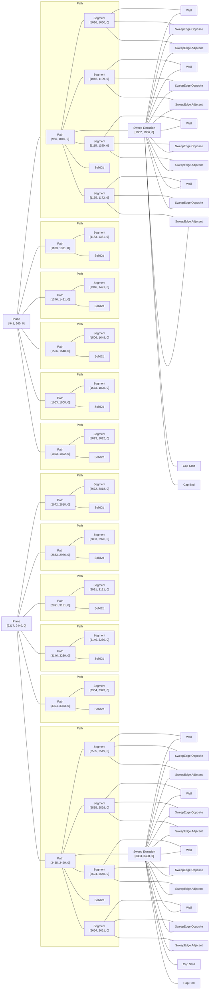

```mermaid
flowchart LR
  subgraph path2 [Path]
    2["Path<br>[966, 1010, 0]"]
    3["Segment<br>[1016, 1060, 0]"]
    4["Segment<br>[1066, 1109, 0]"]
    5["Segment<br>[1115, 1159, 0]"]
    6["Segment<br>[1165, 1172, 0]"]
    7[Solid2d]
  end
  subgraph path8 [Path]
    8["Path<br>[1183, 1331, 0]"]
    9["Segment<br>[1183, 1331, 0]"]
    10[Solid2d]
  end
  subgraph path11 [Path]
    11["Path<br>[1346, 1491, 0]"]
    12["Segment<br>[1346, 1491, 0]"]
    13[Solid2d]
  end
  subgraph path14 [Path]
    14["Path<br>[1506, 1648, 0]"]
    15["Segment<br>[1506, 1648, 0]"]
    16[Solid2d]
  end
  subgraph path17 [Path]
    17["Path<br>[1663, 1808, 0]"]
    18["Segment<br>[1663, 1808, 0]"]
    19[Solid2d]
  end
  subgraph path20 [Path]
    20["Path<br>[1823, 1892, 0]"]
    21["Segment<br>[1823, 1892, 0]"]
    22[Solid2d]
  end
  subgraph path39 [Path]
    39["Path<br>[2455, 2499, 0]"]
    40["Segment<br>[2505, 2549, 0]"]
    41["Segment<br>[2555, 2598, 0]"]
    42["Segment<br>[2604, 2648, 0]"]
    43["Segment<br>[2654, 2661, 0]"]
    44[Solid2d]
  end
  subgraph path45 [Path]
    45["Path<br>[2672, 2818, 0]"]
    46["Segment<br>[2672, 2818, 0]"]
    47[Solid2d]
  end
  subgraph path48 [Path]
    48["Path<br>[2833, 2976, 0]"]
    49["Segment<br>[2833, 2976, 0]"]
    50[Solid2d]
  end
  subgraph path51 [Path]
    51["Path<br>[2991, 3131, 0]"]
    52["Segment<br>[2991, 3131, 0]"]
    53[Solid2d]
  end
  subgraph path54 [Path]
    54["Path<br>[3146, 3289, 0]"]
    55["Segment<br>[3146, 3289, 0]"]
    56[Solid2d]
  end
  subgraph path57 [Path]
    57["Path<br>[3304, 3373, 0]"]
    58["Segment<br>[3304, 3373, 0]"]
    59[Solid2d]
  end
  1["Plane<br>[941, 960, 0]"]
  23["Sweep Extrusion<br>[1902, 1936, 0]"]
  24[Wall]
  25[Wall]
  26[Wall]
  27[Wall]
  28["Cap Start"]
  29["Cap End"]
  30["SweepEdge Opposite"]
  31["SweepEdge Adjacent"]
  32["SweepEdge Opposite"]
  33["SweepEdge Adjacent"]
  34["SweepEdge Opposite"]
  35["SweepEdge Adjacent"]
  36["SweepEdge Opposite"]
  37["SweepEdge Adjacent"]
  38["Plane<br>[2217, 2449, 0]"]
  60["Sweep Extrusion<br>[3383, 3408, 0]"]
  61[Wall]
  62[Wall]
  63[Wall]
  64[Wall]
  65["Cap Start"]
  66["Cap End"]
  67["SweepEdge Opposite"]
  68["SweepEdge Adjacent"]
  69["SweepEdge Opposite"]
  70["SweepEdge Adjacent"]
  71["SweepEdge Opposite"]
  72["SweepEdge Adjacent"]
  73["SweepEdge Opposite"]
  74["SweepEdge Adjacent"]
  1 --- 2
  1 --- 8
  1 --- 11
  1 --- 14
  1 --- 17
  1 --- 20
  2 --- 3
  2 --- 4
  2 --- 5
  2 --- 6
  2 ---- 23
  2 --- 7
  3 --- 24
  3 --- 30
  3 --- 31
  4 --- 25
  4 --- 32
  4 --- 33
  5 --- 26
  5 --- 34
  5 --- 35
  6 --- 27
  6 --- 36
  6 --- 37
  8 --- 9
  8 --- 10
  11 --- 12
  11 --- 13
  14 --- 15
  14 --- 16
  17 --- 18
  17 --- 19
  20 --- 21
  20 --- 22
  23 --- 24
  23 --- 25
  23 --- 26
  23 --- 27
  23 --- 28
  23 --- 29
  23 --- 30
  23 --- 31
  23 --- 32
  23 --- 33
  23 --- 34
  23 --- 35
  23 --- 36
  23 --- 37
  38 --- 39
  38 --- 45
  38 --- 48
  38 --- 51
  38 --- 54
  38 --- 57
  39 --- 40
  39 --- 41
  39 --- 42
  39 --- 43
  39 ---- 60
  39 --- 44
  40 --- 61
  40 --- 67
  40 --- 68
  41 --- 62
  41 --- 69
  41 --- 70
  42 --- 63
  42 --- 71
  42 --- 72
  43 --- 64
  43 --- 73
  43 --- 74
  45 --- 46
  45 --- 47
  48 --- 49
  48 --- 50
  51 --- 52
  51 --- 53
  54 --- 55
  54 --- 56
  57 --- 58
  57 --- 59
  60 --- 61
  60 --- 62
  60 --- 63
  60 --- 64
  60 --- 65
  60 --- 66
  60 --- 67
  60 --- 68
  60 --- 69
  60 --- 70
  60 --- 71
  60 --- 72
  60 --- 73
  60 --- 74
```
