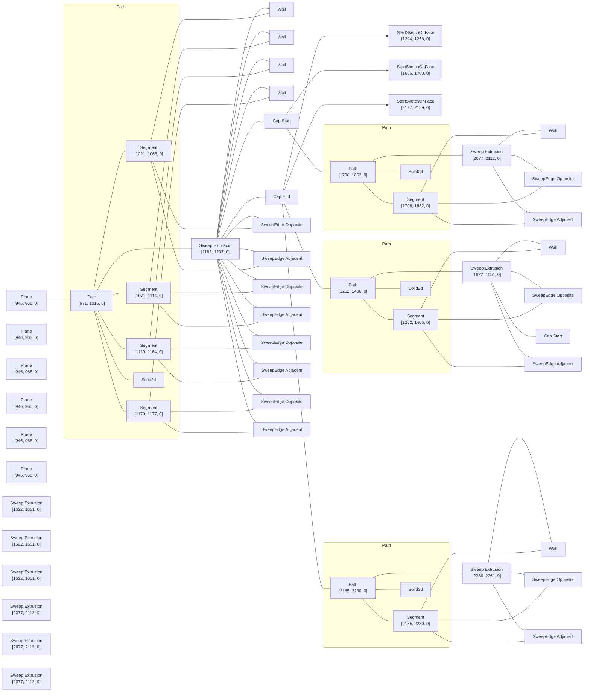

```mermaid
flowchart LR
  subgraph path7 [Path]
    7["Path<br>[971, 1015, 0]"]
    8["Segment<br>[1021, 1065, 0]"]
    9["Segment<br>[1071, 1114, 0]"]
    10["Segment<br>[1120, 1164, 0]"]
    11["Segment<br>[1170, 1177, 0]"]
    12[Solid2d]
  end
  subgraph path28 [Path]
    28["Path<br>[1262, 1406, 0]"]
    29["Segment<br>[1262, 1406, 0]"]
    30[Solid2d]
  end
  subgraph path39 [Path]
    39["Path<br>[1706, 1862, 0]"]
    40["Segment<br>[1706, 1862, 0]"]
    41[Solid2d]
  end
  subgraph path49 [Path]
    49["Path<br>[2165, 2230, 0]"]
    50["Segment<br>[2165, 2230, 0]"]
    51[Solid2d]
  end
  1["Plane<br>[946, 965, 0]"]
  2["Plane<br>[946, 965, 0]"]
  3["Plane<br>[946, 965, 0]"]
  4["Plane<br>[946, 965, 0]"]
  5["Plane<br>[946, 965, 0]"]
  6["Plane<br>[946, 965, 0]"]
  13["Sweep Extrusion<br>[1183, 1207, 0]"]
  14[Wall]
  15[Wall]
  16[Wall]
  17[Wall]
  18["Cap Start"]
  19["Cap End"]
  20["SweepEdge Opposite"]
  21["SweepEdge Adjacent"]
  22["SweepEdge Opposite"]
  23["SweepEdge Adjacent"]
  24["SweepEdge Opposite"]
  25["SweepEdge Adjacent"]
  26["SweepEdge Opposite"]
  27["SweepEdge Adjacent"]
  31["Sweep Extrusion<br>[1622, 1651, 0]"]
  32[Wall]
  33["Cap Start"]
  34["SweepEdge Opposite"]
  35["SweepEdge Adjacent"]
  36["Sweep Extrusion<br>[1622, 1651, 0]"]
  37["Sweep Extrusion<br>[1622, 1651, 0]"]
  38["Sweep Extrusion<br>[1622, 1651, 0]"]
  42["Sweep Extrusion<br>[2077, 2112, 0]"]
  43[Wall]
  44["SweepEdge Opposite"]
  45["SweepEdge Adjacent"]
  46["Sweep Extrusion<br>[2077, 2112, 0]"]
  47["Sweep Extrusion<br>[2077, 2112, 0]"]
  48["Sweep Extrusion<br>[2077, 2112, 0]"]
  52["Sweep Extrusion<br>[2236, 2261, 0]"]
  53[Wall]
  54["SweepEdge Opposite"]
  55["SweepEdge Adjacent"]
  56["StartSketchOnFace<br>[1224, 1256, 0]"]
  57["StartSketchOnFace<br>[1666, 1700, 0]"]
  58["StartSketchOnFace<br>[2127, 2159, 0]"]
  1 --- 7
  7 --- 8
  7 --- 9
  7 --- 10
  7 --- 11
  7 ---- 13
  7 --- 12
  8 --- 14
  8 --- 20
  8 --- 21
  9 --- 15
  9 --- 22
  9 --- 23
  10 --- 16
  10 --- 24
  10 --- 25
  11 --- 17
  11 --- 26
  11 --- 27
  13 --- 14
  13 --- 15
  13 --- 16
  13 --- 17
  13 --- 18
  13 --- 19
  13 --- 20
  13 --- 21
  13 --- 22
  13 --- 23
  13 --- 24
  13 --- 25
  13 --- 26
  13 --- 27
  18 --- 39
  19 --- 28
  19 --- 49
  28 --- 29
  28 ---- 31
  28 --- 30
  29 --- 32
  29 --- 34
  29 --- 35
  31 --- 32
  31 --- 33
  31 --- 34
  31 --- 35
  39 --- 40
  39 ---- 42
  39 --- 41
  40 --- 43
  40 --- 44
  40 --- 45
  42 --- 43
  42 --- 44
  42 --- 45
  49 --- 50
  49 ---- 52
  49 --- 51
  50 --- 53
  50 --- 54
  50 --- 55
  52 --- 53
  52 --- 54
  52 --- 55
  19 <--x 56
  18 <--x 57
  19 <--x 58
```
