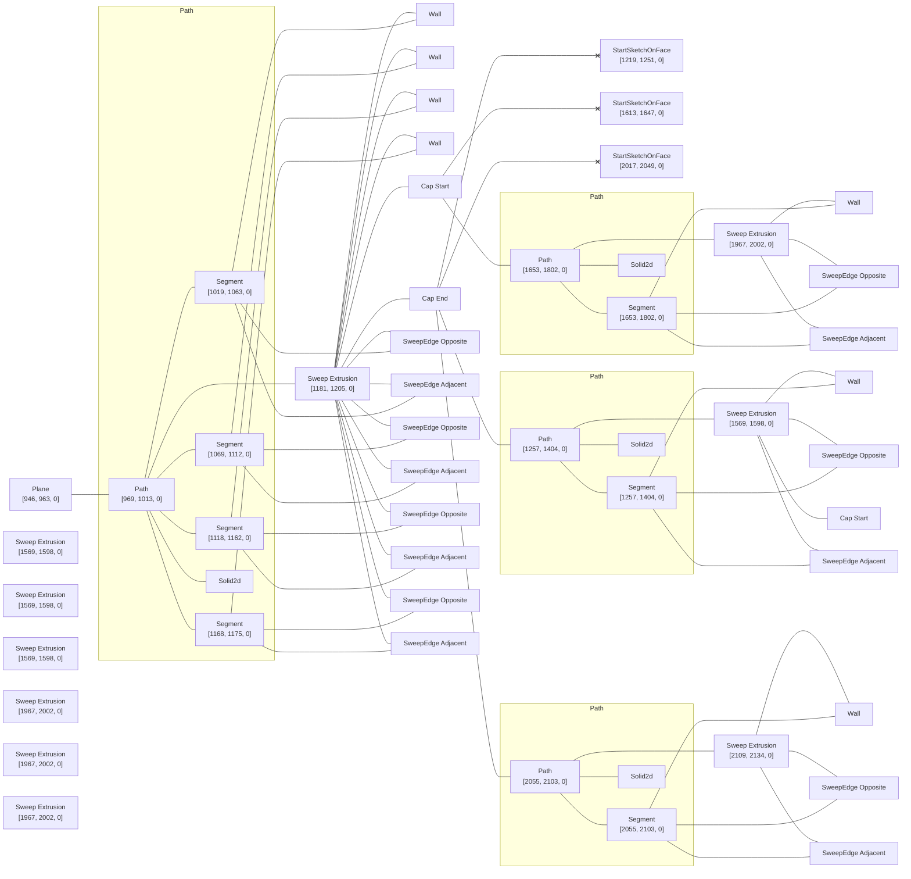

```mermaid
flowchart LR
  subgraph path2 [Path]
    2["Path<br>[969, 1013, 0]"]
    3["Segment<br>[1019, 1063, 0]"]
    4["Segment<br>[1069, 1112, 0]"]
    5["Segment<br>[1118, 1162, 0]"]
    6["Segment<br>[1168, 1175, 0]"]
    7[Solid2d]
  end
  subgraph path23 [Path]
    23["Path<br>[1257, 1404, 0]"]
    24["Segment<br>[1257, 1404, 0]"]
    25[Solid2d]
  end
  subgraph path34 [Path]
    34["Path<br>[1653, 1802, 0]"]
    35["Segment<br>[1653, 1802, 0]"]
    36[Solid2d]
  end
  subgraph path44 [Path]
    44["Path<br>[2055, 2103, 0]"]
    45["Segment<br>[2055, 2103, 0]"]
    46[Solid2d]
  end
  1["Plane<br>[946, 963, 0]"]
  8["Sweep Extrusion<br>[1181, 1205, 0]"]
  9[Wall]
  10[Wall]
  11[Wall]
  12[Wall]
  13["Cap Start"]
  14["Cap End"]
  15["SweepEdge Opposite"]
  16["SweepEdge Adjacent"]
  17["SweepEdge Opposite"]
  18["SweepEdge Adjacent"]
  19["SweepEdge Opposite"]
  20["SweepEdge Adjacent"]
  21["SweepEdge Opposite"]
  22["SweepEdge Adjacent"]
  26["Sweep Extrusion<br>[1569, 1598, 0]"]
  27[Wall]
  28["Cap Start"]
  29["SweepEdge Opposite"]
  30["SweepEdge Adjacent"]
  31["Sweep Extrusion<br>[1569, 1598, 0]"]
  32["Sweep Extrusion<br>[1569, 1598, 0]"]
  33["Sweep Extrusion<br>[1569, 1598, 0]"]
  37["Sweep Extrusion<br>[1967, 2002, 0]"]
  38[Wall]
  39["SweepEdge Opposite"]
  40["SweepEdge Adjacent"]
  41["Sweep Extrusion<br>[1967, 2002, 0]"]
  42["Sweep Extrusion<br>[1967, 2002, 0]"]
  43["Sweep Extrusion<br>[1967, 2002, 0]"]
  47["Sweep Extrusion<br>[2109, 2134, 0]"]
  48[Wall]
  49["SweepEdge Opposite"]
  50["SweepEdge Adjacent"]
  51["StartSketchOnFace<br>[1219, 1251, 0]"]
  52["StartSketchOnFace<br>[1613, 1647, 0]"]
  53["StartSketchOnFace<br>[2017, 2049, 0]"]
  1 --- 2
  2 --- 3
  2 --- 4
  2 --- 5
  2 --- 6
  2 ---- 8
  2 --- 7
  3 --- 9
  3 --- 15
  3 --- 16
  4 --- 10
  4 --- 17
  4 --- 18
  5 --- 11
  5 --- 19
  5 --- 20
  6 --- 12
  6 --- 21
  6 --- 22
  8 --- 9
  8 --- 10
  8 --- 11
  8 --- 12
  8 --- 13
  8 --- 14
  8 --- 15
  8 --- 16
  8 --- 17
  8 --- 18
  8 --- 19
  8 --- 20
  8 --- 21
  8 --- 22
  13 --- 34
  14 --- 23
  14 --- 44
  23 --- 24
  23 ---- 26
  23 --- 25
  24 --- 27
  24 --- 29
  24 --- 30
  26 --- 27
  26 --- 28
  26 --- 29
  26 --- 30
  34 --- 35
  34 ---- 37
  34 --- 36
  35 --- 38
  35 --- 39
  35 --- 40
  37 --- 38
  37 --- 39
  37 --- 40
  44 --- 45
  44 ---- 47
  44 --- 46
  45 --- 48
  45 --- 49
  45 --- 50
  47 --- 48
  47 --- 49
  47 --- 50
  14 <--x 51
  13 <--x 52
  14 <--x 53
```
