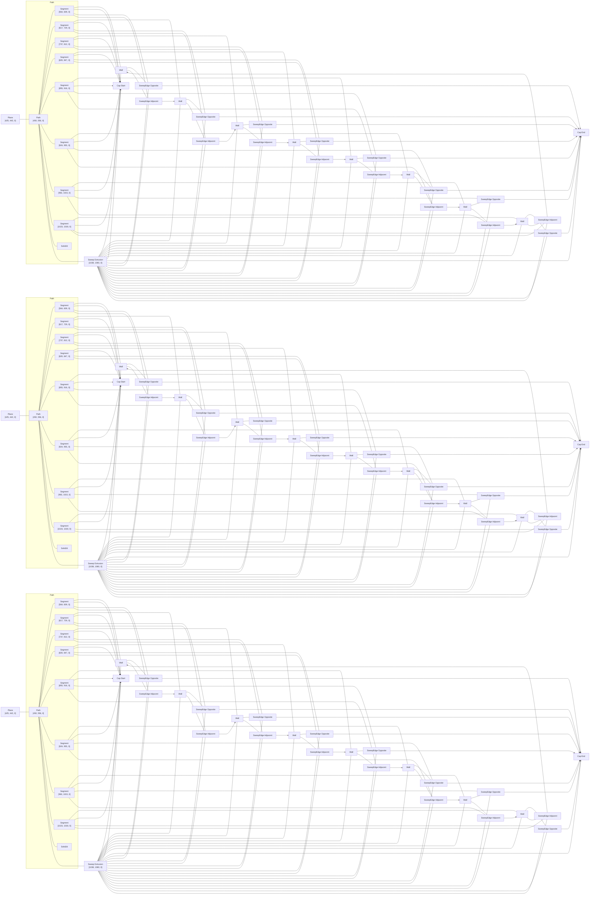

```mermaid
flowchart LR
  subgraph path2 [Path]
    2["Path<br>[450, 556, 0]"]
      %% [ProgramBodyItem { index: 8 }, VariableDeclarationDeclaration, VariableDeclarationInit, FunctionExpressionBody, FunctionExpressionBodyItem { index: 0 }, VariableDeclarationDeclaration, VariableDeclarationInit, PipeBodyItem { index: 1 }]
    3["Segment<br>[564, 609, 0]"]
      %% [ProgramBodyItem { index: 8 }, VariableDeclarationDeclaration, VariableDeclarationInit, FunctionExpressionBody, FunctionExpressionBodyItem { index: 0 }, VariableDeclarationDeclaration, VariableDeclarationInit, PipeBodyItem { index: 2 }]
    4["Segment<br>[617, 729, 0]"]
      %% [ProgramBodyItem { index: 8 }, VariableDeclarationDeclaration, VariableDeclarationInit, FunctionExpressionBody, FunctionExpressionBodyItem { index: 0 }, VariableDeclarationDeclaration, VariableDeclarationInit, PipeBodyItem { index: 3 }]
    5["Segment<br>[737, 812, 0]"]
      %% [ProgramBodyItem { index: 8 }, VariableDeclarationDeclaration, VariableDeclarationInit, FunctionExpressionBody, FunctionExpressionBodyItem { index: 0 }, VariableDeclarationDeclaration, VariableDeclarationInit, PipeBodyItem { index: 4 }]
    6["Segment<br>[820, 847, 0]"]
      %% [ProgramBodyItem { index: 8 }, VariableDeclarationDeclaration, VariableDeclarationInit, FunctionExpressionBody, FunctionExpressionBodyItem { index: 0 }, VariableDeclarationDeclaration, VariableDeclarationInit, PipeBodyItem { index: 5 }]
    7["Segment<br>[855, 916, 0]"]
      %% [ProgramBodyItem { index: 8 }, VariableDeclarationDeclaration, VariableDeclarationInit, FunctionExpressionBody, FunctionExpressionBodyItem { index: 0 }, VariableDeclarationDeclaration, VariableDeclarationInit, PipeBodyItem { index: 6 }]
    8["Segment<br>[924, 955, 0]"]
      %% [ProgramBodyItem { index: 8 }, VariableDeclarationDeclaration, VariableDeclarationInit, FunctionExpressionBody, FunctionExpressionBodyItem { index: 0 }, VariableDeclarationDeclaration, VariableDeclarationInit, PipeBodyItem { index: 7 }]
    9["Segment<br>[963, 1015, 0]"]
      %% [ProgramBodyItem { index: 8 }, VariableDeclarationDeclaration, VariableDeclarationInit, FunctionExpressionBody, FunctionExpressionBodyItem { index: 0 }, VariableDeclarationDeclaration, VariableDeclarationInit, PipeBodyItem { index: 8 }]
    10["Segment<br>[1023, 1030, 0]"]
      %% [ProgramBodyItem { index: 8 }, VariableDeclarationDeclaration, VariableDeclarationInit, FunctionExpressionBody, FunctionExpressionBodyItem { index: 0 }, VariableDeclarationDeclaration, VariableDeclarationInit, PipeBodyItem { index: 9 }]
    11[Solid2d]
  end
  subgraph path40 [Path]
    40["Path<br>[450, 556, 0]"]
      %% [ProgramBodyItem { index: 8 }, VariableDeclarationDeclaration, VariableDeclarationInit, FunctionExpressionBody, FunctionExpressionBodyItem { index: 0 }, VariableDeclarationDeclaration, VariableDeclarationInit, PipeBodyItem { index: 1 }]
    41["Segment<br>[564, 609, 0]"]
      %% [ProgramBodyItem { index: 8 }, VariableDeclarationDeclaration, VariableDeclarationInit, FunctionExpressionBody, FunctionExpressionBodyItem { index: 0 }, VariableDeclarationDeclaration, VariableDeclarationInit, PipeBodyItem { index: 2 }]
    42["Segment<br>[617, 729, 0]"]
      %% [ProgramBodyItem { index: 8 }, VariableDeclarationDeclaration, VariableDeclarationInit, FunctionExpressionBody, FunctionExpressionBodyItem { index: 0 }, VariableDeclarationDeclaration, VariableDeclarationInit, PipeBodyItem { index: 3 }]
    43["Segment<br>[737, 812, 0]"]
      %% [ProgramBodyItem { index: 8 }, VariableDeclarationDeclaration, VariableDeclarationInit, FunctionExpressionBody, FunctionExpressionBodyItem { index: 0 }, VariableDeclarationDeclaration, VariableDeclarationInit, PipeBodyItem { index: 4 }]
    44["Segment<br>[820, 847, 0]"]
      %% [ProgramBodyItem { index: 8 }, VariableDeclarationDeclaration, VariableDeclarationInit, FunctionExpressionBody, FunctionExpressionBodyItem { index: 0 }, VariableDeclarationDeclaration, VariableDeclarationInit, PipeBodyItem { index: 5 }]
    45["Segment<br>[855, 916, 0]"]
      %% [ProgramBodyItem { index: 8 }, VariableDeclarationDeclaration, VariableDeclarationInit, FunctionExpressionBody, FunctionExpressionBodyItem { index: 0 }, VariableDeclarationDeclaration, VariableDeclarationInit, PipeBodyItem { index: 6 }]
    46["Segment<br>[924, 955, 0]"]
      %% [ProgramBodyItem { index: 8 }, VariableDeclarationDeclaration, VariableDeclarationInit, FunctionExpressionBody, FunctionExpressionBodyItem { index: 0 }, VariableDeclarationDeclaration, VariableDeclarationInit, PipeBodyItem { index: 7 }]
    47["Segment<br>[963, 1015, 0]"]
      %% [ProgramBodyItem { index: 8 }, VariableDeclarationDeclaration, VariableDeclarationInit, FunctionExpressionBody, FunctionExpressionBodyItem { index: 0 }, VariableDeclarationDeclaration, VariableDeclarationInit, PipeBodyItem { index: 8 }]
    48["Segment<br>[1023, 1030, 0]"]
      %% [ProgramBodyItem { index: 8 }, VariableDeclarationDeclaration, VariableDeclarationInit, FunctionExpressionBody, FunctionExpressionBodyItem { index: 0 }, VariableDeclarationDeclaration, VariableDeclarationInit, PipeBodyItem { index: 9 }]
    49[Solid2d]
  end
  subgraph path78 [Path]
    78["Path<br>[450, 556, 0]"]
      %% [ProgramBodyItem { index: 8 }, VariableDeclarationDeclaration, VariableDeclarationInit, FunctionExpressionBody, FunctionExpressionBodyItem { index: 0 }, VariableDeclarationDeclaration, VariableDeclarationInit, PipeBodyItem { index: 1 }]
    79["Segment<br>[564, 609, 0]"]
      %% [ProgramBodyItem { index: 8 }, VariableDeclarationDeclaration, VariableDeclarationInit, FunctionExpressionBody, FunctionExpressionBodyItem { index: 0 }, VariableDeclarationDeclaration, VariableDeclarationInit, PipeBodyItem { index: 2 }]
    80["Segment<br>[617, 729, 0]"]
      %% [ProgramBodyItem { index: 8 }, VariableDeclarationDeclaration, VariableDeclarationInit, FunctionExpressionBody, FunctionExpressionBodyItem { index: 0 }, VariableDeclarationDeclaration, VariableDeclarationInit, PipeBodyItem { index: 3 }]
    81["Segment<br>[737, 812, 0]"]
      %% [ProgramBodyItem { index: 8 }, VariableDeclarationDeclaration, VariableDeclarationInit, FunctionExpressionBody, FunctionExpressionBodyItem { index: 0 }, VariableDeclarationDeclaration, VariableDeclarationInit, PipeBodyItem { index: 4 }]
    82["Segment<br>[820, 847, 0]"]
      %% [ProgramBodyItem { index: 8 }, VariableDeclarationDeclaration, VariableDeclarationInit, FunctionExpressionBody, FunctionExpressionBodyItem { index: 0 }, VariableDeclarationDeclaration, VariableDeclarationInit, PipeBodyItem { index: 5 }]
    83["Segment<br>[855, 916, 0]"]
      %% [ProgramBodyItem { index: 8 }, VariableDeclarationDeclaration, VariableDeclarationInit, FunctionExpressionBody, FunctionExpressionBodyItem { index: 0 }, VariableDeclarationDeclaration, VariableDeclarationInit, PipeBodyItem { index: 6 }]
    84["Segment<br>[924, 955, 0]"]
      %% [ProgramBodyItem { index: 8 }, VariableDeclarationDeclaration, VariableDeclarationInit, FunctionExpressionBody, FunctionExpressionBodyItem { index: 0 }, VariableDeclarationDeclaration, VariableDeclarationInit, PipeBodyItem { index: 7 }]
    85["Segment<br>[963, 1015, 0]"]
      %% [ProgramBodyItem { index: 8 }, VariableDeclarationDeclaration, VariableDeclarationInit, FunctionExpressionBody, FunctionExpressionBodyItem { index: 0 }, VariableDeclarationDeclaration, VariableDeclarationInit, PipeBodyItem { index: 8 }]
    86["Segment<br>[1023, 1030, 0]"]
      %% [ProgramBodyItem { index: 8 }, VariableDeclarationDeclaration, VariableDeclarationInit, FunctionExpressionBody, FunctionExpressionBodyItem { index: 0 }, VariableDeclarationDeclaration, VariableDeclarationInit, PipeBodyItem { index: 9 }]
    87[Solid2d]
  end
  1["Plane<br>[425, 442, 0]"]
    %% [ProgramBodyItem { index: 8 }, VariableDeclarationDeclaration, VariableDeclarationInit, FunctionExpressionBody, FunctionExpressionBodyItem { index: 0 }, VariableDeclarationDeclaration, VariableDeclarationInit, PipeBodyItem { index: 0 }]
  12["Sweep Extrusion<br>[1038, 1060, 0]"]
    %% [ProgramBodyItem { index: 8 }, VariableDeclarationDeclaration, VariableDeclarationInit, FunctionExpressionBody, FunctionExpressionBodyItem { index: 0 }, VariableDeclarationDeclaration, VariableDeclarationInit, PipeBodyItem { index: 10 }]
  13[Wall]
    %% face_code_ref=Missing NodePath
  14[Wall]
    %% face_code_ref=Missing NodePath
  15[Wall]
    %% face_code_ref=Missing NodePath
  16[Wall]
    %% face_code_ref=Missing NodePath
  17[Wall]
    %% face_code_ref=Missing NodePath
  18[Wall]
    %% face_code_ref=Missing NodePath
  19[Wall]
    %% face_code_ref=Missing NodePath
  20[Wall]
    %% face_code_ref=Missing NodePath
  21["Cap Start"]
    %% face_code_ref=Missing NodePath
  22["Cap End"]
    %% face_code_ref=Missing NodePath
  23["SweepEdge Opposite"]
  24["SweepEdge Adjacent"]
  25["SweepEdge Opposite"]
  26["SweepEdge Adjacent"]
  27["SweepEdge Opposite"]
  28["SweepEdge Adjacent"]
  29["SweepEdge Opposite"]
  30["SweepEdge Adjacent"]
  31["SweepEdge Opposite"]
  32["SweepEdge Adjacent"]
  33["SweepEdge Opposite"]
  34["SweepEdge Adjacent"]
  35["SweepEdge Opposite"]
  36["SweepEdge Adjacent"]
  37["SweepEdge Opposite"]
  38["SweepEdge Adjacent"]
  39["Plane<br>[425, 442, 0]"]
    %% [ProgramBodyItem { index: 8 }, VariableDeclarationDeclaration, VariableDeclarationInit, FunctionExpressionBody, FunctionExpressionBodyItem { index: 0 }, VariableDeclarationDeclaration, VariableDeclarationInit, PipeBodyItem { index: 0 }]
  50["Sweep Extrusion<br>[1038, 1060, 0]"]
    %% [ProgramBodyItem { index: 8 }, VariableDeclarationDeclaration, VariableDeclarationInit, FunctionExpressionBody, FunctionExpressionBodyItem { index: 0 }, VariableDeclarationDeclaration, VariableDeclarationInit, PipeBodyItem { index: 10 }]
  51[Wall]
    %% face_code_ref=Missing NodePath
  52[Wall]
    %% face_code_ref=Missing NodePath
  53[Wall]
    %% face_code_ref=Missing NodePath
  54[Wall]
    %% face_code_ref=Missing NodePath
  55[Wall]
    %% face_code_ref=Missing NodePath
  56[Wall]
    %% face_code_ref=Missing NodePath
  57[Wall]
    %% face_code_ref=Missing NodePath
  58[Wall]
    %% face_code_ref=Missing NodePath
  59["Cap Start"]
    %% face_code_ref=Missing NodePath
  60["Cap End"]
    %% face_code_ref=Missing NodePath
  61["SweepEdge Opposite"]
  62["SweepEdge Adjacent"]
  63["SweepEdge Opposite"]
  64["SweepEdge Adjacent"]
  65["SweepEdge Opposite"]
  66["SweepEdge Adjacent"]
  67["SweepEdge Opposite"]
  68["SweepEdge Adjacent"]
  69["SweepEdge Opposite"]
  70["SweepEdge Adjacent"]
  71["SweepEdge Opposite"]
  72["SweepEdge Adjacent"]
  73["SweepEdge Opposite"]
  74["SweepEdge Adjacent"]
  75["SweepEdge Opposite"]
  76["SweepEdge Adjacent"]
  77["Plane<br>[425, 442, 0]"]
    %% [ProgramBodyItem { index: 8 }, VariableDeclarationDeclaration, VariableDeclarationInit, FunctionExpressionBody, FunctionExpressionBodyItem { index: 0 }, VariableDeclarationDeclaration, VariableDeclarationInit, PipeBodyItem { index: 0 }]
  88["Sweep Extrusion<br>[1038, 1060, 0]"]
    %% [ProgramBodyItem { index: 8 }, VariableDeclarationDeclaration, VariableDeclarationInit, FunctionExpressionBody, FunctionExpressionBodyItem { index: 0 }, VariableDeclarationDeclaration, VariableDeclarationInit, PipeBodyItem { index: 10 }]
  89[Wall]
    %% face_code_ref=Missing NodePath
  90[Wall]
    %% face_code_ref=Missing NodePath
  91[Wall]
    %% face_code_ref=Missing NodePath
  92[Wall]
    %% face_code_ref=Missing NodePath
  93[Wall]
    %% face_code_ref=Missing NodePath
  94[Wall]
    %% face_code_ref=Missing NodePath
  95[Wall]
    %% face_code_ref=Missing NodePath
  96[Wall]
    %% face_code_ref=Missing NodePath
  97["Cap Start"]
    %% face_code_ref=Missing NodePath
  98["Cap End"]
    %% face_code_ref=Missing NodePath
  99["SweepEdge Opposite"]
  100["SweepEdge Adjacent"]
  101["SweepEdge Opposite"]
  102["SweepEdge Adjacent"]
  103["SweepEdge Opposite"]
  104["SweepEdge Adjacent"]
  105["SweepEdge Opposite"]
  106["SweepEdge Adjacent"]
  107["SweepEdge Opposite"]
  108["SweepEdge Adjacent"]
  109["SweepEdge Opposite"]
  110["SweepEdge Adjacent"]
  111["SweepEdge Opposite"]
  112["SweepEdge Adjacent"]
  113["SweepEdge Opposite"]
  114["SweepEdge Adjacent"]
  1 --- 2
  2 --- 3
  2 --- 4
  2 --- 5
  2 --- 6
  2 --- 7
  2 --- 8
  2 --- 9
  2 --- 10
  2 --- 11
  2 ---- 12
  3 --- 13
  3 x--> 21
  3 --- 23
  3 --- 24
  4 --- 14
  4 x--> 21
  4 --- 25
  4 --- 26
  5 --- 15
  5 x--> 21
  5 --- 27
  5 --- 28
  6 --- 16
  6 x--> 21
  6 --- 29
  6 --- 30
  7 --- 17
  7 x--> 21
  7 --- 31
  7 --- 32
  8 --- 18
  8 x--> 21
  8 --- 33
  8 --- 34
  9 --- 19
  9 x--> 21
  9 --- 35
  9 --- 36
  10 --- 20
  10 x--> 21
  10 --- 37
  10 --- 38
  12 --- 13
  12 --- 14
  12 --- 15
  12 --- 16
  12 --- 17
  12 --- 18
  12 --- 19
  12 --- 20
  12 --- 21
  12 --- 22
  12 --- 23
  12 --- 24
  12 --- 25
  12 --- 26
  12 --- 27
  12 --- 28
  12 --- 29
  12 --- 30
  12 --- 31
  12 --- 32
  12 --- 33
  12 --- 34
  12 --- 35
  12 --- 36
  12 --- 37
  12 --- 38
  13 --- 23
  13 --- 24
  38 <--x 13
  24 <--x 14
  14 --- 25
  14 --- 26
  26 <--x 15
  15 --- 27
  15 --- 28
  28 <--x 16
  16 --- 29
  16 --- 30
  30 <--x 17
  17 --- 31
  17 --- 32
  32 <--x 18
  18 --- 33
  18 --- 34
  34 <--x 19
  19 --- 35
  19 --- 36
  36 <--x 20
  20 --- 37
  20 --- 38
  23 <--x 22
  25 <--x 22
  27 <--x 22
  29 <--x 22
  31 <--x 22
  33 <--x 22
  35 <--x 22
  37 <--x 22
  39 --- 40
  40 --- 41
  40 --- 42
  40 --- 43
  40 --- 44
  40 --- 45
  40 --- 46
  40 --- 47
  40 --- 48
  40 --- 49
  40 ---- 50
  41 --- 51
  41 x--> 59
  41 --- 61
  41 --- 62
  42 --- 52
  42 x--> 59
  42 --- 63
  42 --- 64
  43 --- 53
  43 x--> 59
  43 --- 65
  43 --- 66
  44 --- 54
  44 x--> 59
  44 --- 67
  44 --- 68
  45 --- 55
  45 x--> 59
  45 --- 69
  45 --- 70
  46 --- 56
  46 x--> 59
  46 --- 71
  46 --- 72
  47 --- 57
  47 x--> 59
  47 --- 73
  47 --- 74
  48 --- 58
  48 x--> 59
  48 --- 75
  48 --- 76
  50 --- 51
  50 --- 52
  50 --- 53
  50 --- 54
  50 --- 55
  50 --- 56
  50 --- 57
  50 --- 58
  50 --- 59
  50 --- 60
  50 --- 61
  50 --- 62
  50 --- 63
  50 --- 64
  50 --- 65
  50 --- 66
  50 --- 67
  50 --- 68
  50 --- 69
  50 --- 70
  50 --- 71
  50 --- 72
  50 --- 73
  50 --- 74
  50 --- 75
  50 --- 76
  51 --- 61
  51 --- 62
  76 <--x 51
  62 <--x 52
  52 --- 63
  52 --- 64
  64 <--x 53
  53 --- 65
  53 --- 66
  66 <--x 54
  54 --- 67
  54 --- 68
  68 <--x 55
  55 --- 69
  55 --- 70
  70 <--x 56
  56 --- 71
  56 --- 72
  72 <--x 57
  57 --- 73
  57 --- 74
  74 <--x 58
  58 --- 75
  58 --- 76
  61 <--x 60
  63 <--x 60
  65 <--x 60
  67 <--x 60
  69 <--x 60
  71 <--x 60
  73 <--x 60
  75 <--x 60
  77 --- 78
  78 --- 79
  78 --- 80
  78 --- 81
  78 --- 82
  78 --- 83
  78 --- 84
  78 --- 85
  78 --- 86
  78 --- 87
  78 ---- 88
  79 --- 89
  79 x--> 97
  79 --- 99
  79 --- 100
  80 --- 90
  80 x--> 97
  80 --- 101
  80 --- 102
  81 --- 91
  81 x--> 97
  81 --- 103
  81 --- 104
  82 --- 92
  82 x--> 97
  82 --- 105
  82 --- 106
  83 --- 93
  83 x--> 97
  83 --- 107
  83 --- 108
  84 --- 94
  84 x--> 97
  84 --- 109
  84 --- 110
  85 --- 95
  85 x--> 97
  85 --- 111
  85 --- 112
  86 --- 96
  86 x--> 97
  86 --- 113
  86 --- 114
  88 --- 89
  88 --- 90
  88 --- 91
  88 --- 92
  88 --- 93
  88 --- 94
  88 --- 95
  88 --- 96
  88 --- 97
  88 --- 98
  88 --- 99
  88 --- 100
  88 --- 101
  88 --- 102
  88 --- 103
  88 --- 104
  88 --- 105
  88 --- 106
  88 --- 107
  88 --- 108
  88 --- 109
  88 --- 110
  88 --- 111
  88 --- 112
  88 --- 113
  88 --- 114
  89 --- 99
  89 --- 100
  114 <--x 89
  100 <--x 90
  90 --- 101
  90 --- 102
  102 <--x 91
  91 --- 103
  91 --- 104
  104 <--x 92
  92 --- 105
  92 --- 106
  106 <--x 93
  93 --- 107
  93 --- 108
  108 <--x 94
  94 --- 109
  94 --- 110
  110 <--x 95
  95 --- 111
  95 --- 112
  112 <--x 96
  96 --- 113
  96 --- 114
  99 <--x 98
  101 <--x 98
  103 <--x 98
  105 <--x 98
  107 <--x 98
  109 <--x 98
  111 <--x 98
  113 <--x 98
```
