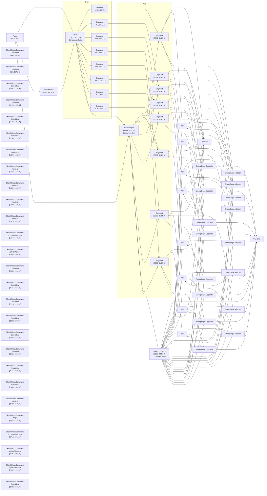

```mermaid
flowchart LR
  subgraph path11 [Path]
    11["Path<br>[361, 3073, 0]<br>Consumed: false"]
      %% [ProgramBodyItem { index: 7 }, VariableDeclarationDeclaration, VariableDeclarationInit]
    14["Segment<br>[418, 479, 0]"]
      %% [ProgramBodyItem { index: 7 }, VariableDeclarationDeclaration, VariableDeclarationInit, SketchBlockBody, SketchBlockBodyItem { index: 0 }, VariableDeclarationDeclaration, VariableDeclarationInit]
    15["Segment<br>[497, 563, 0]"]
      %% [ProgramBodyItem { index: 7 }, VariableDeclarationDeclaration, VariableDeclarationInit, SketchBlockBody, SketchBlockBodyItem { index: 1 }, VariableDeclarationDeclaration, VariableDeclarationInit]
    16["Segment<br>[588, 656, 0]"]
      %% [ProgramBodyItem { index: 7 }, VariableDeclarationDeclaration, VariableDeclarationInit, SketchBlockBody, SketchBlockBodyItem { index: 2 }, VariableDeclarationDeclaration, VariableDeclarationInit]
    17["Segment<br>[803, 868, 0]"]
      %% [ProgramBodyItem { index: 7 }, VariableDeclarationDeclaration, VariableDeclarationInit, SketchBlockBody, SketchBlockBodyItem { index: 4 }, VariableDeclarationDeclaration, VariableDeclarationInit]
    18["Segment<br>[889, 949, 0]"]
      %% [ProgramBodyItem { index: 7 }, VariableDeclarationDeclaration, VariableDeclarationInit, SketchBlockBody, SketchBlockBodyItem { index: 5 }, VariableDeclarationDeclaration, VariableDeclarationInit]
    32["Segment<br>[1691, 1759, 0]"]
      %% [ProgramBodyItem { index: 7 }, VariableDeclarationDeclaration, VariableDeclarationInit, SketchBlockBody, SketchBlockBodyItem { index: 19 }, VariableDeclarationDeclaration, VariableDeclarationInit]
    33["Segment<br>[1787, 1856, 0]"]
      %% [ProgramBodyItem { index: 7 }, VariableDeclarationDeclaration, VariableDeclarationInit, SketchBlockBody, SketchBlockBodyItem { index: 20 }, VariableDeclarationDeclaration, VariableDeclarationInit]
    34["Segment<br>[1875, 1945, 0]"]
      %% [ProgramBodyItem { index: 7 }, VariableDeclarationDeclaration, VariableDeclarationInit, SketchBlockBody, SketchBlockBodyItem { index: 21 }, VariableDeclarationDeclaration, VariableDeclarationInit]
  end
  subgraph path49 [Path]
    49["Path Region<br>[3089, 3142, 0]<br>Consumed: true"]
      %% [ProgramBodyItem { index: 8 }, VariableDeclarationDeclaration, VariableDeclarationInit]
    50["Segment<br>[3089, 3142, 0]"]
      %% [ProgramBodyItem { index: 8 }, VariableDeclarationDeclaration, VariableDeclarationInit]
    51["Segment<br>[3089, 3142, 0]"]
      %% [ProgramBodyItem { index: 8 }, VariableDeclarationDeclaration, VariableDeclarationInit]
    52["Segment<br>[3089, 3142, 0]"]
      %% [ProgramBodyItem { index: 8 }, VariableDeclarationDeclaration, VariableDeclarationInit]
    53["Segment<br>[3089, 3142, 0]"]
      %% [ProgramBodyItem { index: 8 }, VariableDeclarationDeclaration, VariableDeclarationInit]
    54["Segment<br>[3089, 3142, 0]"]
      %% [ProgramBodyItem { index: 8 }, VariableDeclarationDeclaration, VariableDeclarationInit]
    55["Segment<br>[3089, 3142, 0]"]
      %% [ProgramBodyItem { index: 8 }, VariableDeclarationDeclaration, VariableDeclarationInit]
    56["Segment<br>[3089, 3142, 0]"]
      %% [ProgramBodyItem { index: 8 }, VariableDeclarationDeclaration, VariableDeclarationInit]
    57["Segment<br>[3089, 3142, 0]"]
      %% [ProgramBodyItem { index: 8 }, VariableDeclarationDeclaration, VariableDeclarationInit]
  end
  1["Cap End"]
    %% face_code_ref=Missing NodePath
  2["Cap Start"]
    %% face_code_ref=Missing NodePath
  3[Wall]
    %% face_code_ref=Missing NodePath
  4[Wall]
    %% face_code_ref=Missing NodePath
  5[Wall]
    %% face_code_ref=Missing NodePath
  6[Wall]
    %% face_code_ref=Missing NodePath
  7[Wall]
    %% face_code_ref=Missing NodePath
  8[Wall]
    %% face_code_ref=Missing NodePath
  9[Wall]
    %% face_code_ref=Missing NodePath
  10[Wall]
    %% face_code_ref=Missing NodePath
  12["Plane<br>[361, 3073, 0]"]
    %% [ProgramBodyItem { index: 7 }, VariableDeclarationDeclaration, VariableDeclarationInit]
  13["SketchBlock<br>[361, 3073, 0]"]
    %% [ProgramBodyItem { index: 7 }, VariableDeclarationDeclaration, VariableDeclarationInit]
  19["SketchBlockConstraint Coincident<br>[953, 994, 0]"]
    %% [ProgramBodyItem { index: 7 }, VariableDeclarationDeclaration, VariableDeclarationInit, SketchBlockBody, SketchBlockBodyItem { index: 6 }, ExpressionStatementExpr]
  20["SketchBlockConstraint Coincident<br>[997, 1048, 0]"]
    %% [ProgramBodyItem { index: 7 }, VariableDeclarationDeclaration, VariableDeclarationInit, SketchBlockBody, SketchBlockBodyItem { index: 7 }, ExpressionStatementExpr]
  21["SketchBlockConstraint Coincident<br>[1051, 1120, 0]"]
    %% [ProgramBodyItem { index: 7 }, VariableDeclarationDeclaration, VariableDeclarationInit, SketchBlockBody, SketchBlockBodyItem { index: 8 }, ExpressionStatementExpr]
  22["SketchBlockConstraint Coincident<br>[1123, 1195, 0]"]
    %% [ProgramBodyItem { index: 7 }, VariableDeclarationDeclaration, VariableDeclarationInit, SketchBlockBody, SketchBlockBodyItem { index: 9 }, ExpressionStatementExpr]
  23["SketchBlockConstraint Coincident<br>[1198, 1264, 0]"]
    %% [ProgramBodyItem { index: 7 }, VariableDeclarationDeclaration, VariableDeclarationInit, SketchBlockBody, SketchBlockBodyItem { index: 10 }, ExpressionStatementExpr]
  24["SketchBlockConstraint Horizontal<br>[1268, 1292, 0]"]
    %% [ProgramBodyItem { index: 7 }, VariableDeclarationDeclaration, VariableDeclarationInit, SketchBlockBody, SketchBlockBodyItem { index: 11 }, ExpressionStatementExpr]
  25["SketchBlockConstraint Horizontal<br>[1295, 1322, 0]"]
    %% [ProgramBodyItem { index: 7 }, VariableDeclarationDeclaration, VariableDeclarationInit, SketchBlockBody, SketchBlockBodyItem { index: 12 }, ExpressionStatementExpr]
  26["SketchBlockConstraint Vertical<br>[1325, 1348, 0]"]
    %% [ProgramBodyItem { index: 7 }, VariableDeclarationDeclaration, VariableDeclarationInit, SketchBlockBody, SketchBlockBodyItem { index: 13 }, ExpressionStatementExpr]
  27["SketchBlockConstraint Vertical<br>[1351, 1380, 0]"]
    %% [ProgramBodyItem { index: 7 }, VariableDeclarationDeclaration, VariableDeclarationInit, SketchBlockBody, SketchBlockBodyItem { index: 14 }, ExpressionStatementExpr]
  28["SketchBlockConstraint Vertical<br>[1383, 1420, 0]"]
    %% [ProgramBodyItem { index: 7 }, VariableDeclarationDeclaration, VariableDeclarationInit, SketchBlockBody, SketchBlockBodyItem { index: 15 }, ExpressionStatementExpr]
  29["SketchBlockConstraint Vertical<br>[1423, 1452, 0]"]
    %% [ProgramBodyItem { index: 7 }, VariableDeclarationDeclaration, VariableDeclarationInit, SketchBlockBody, SketchBlockBodyItem { index: 16 }, ExpressionStatementExpr]
  30["SketchBlockConstraint HorizontalDistance<br>[1456, 1540, 0]"]
    %% [ProgramBodyItem { index: 7 }, VariableDeclarationDeclaration, VariableDeclarationInit, SketchBlockBody, SketchBlockBodyItem { index: 17 }, ExpressionStatementExpr]
  31["SketchBlockConstraint VerticalDistance<br>[1543, 1640, 0]"]
    %% [ProgramBodyItem { index: 7 }, VariableDeclarationDeclaration, VariableDeclarationInit, SketchBlockBody, SketchBlockBodyItem { index: 18 }, ExpressionStatementExpr]
  35["SketchBlockConstraint Coincident<br>[2069, 2144, 0]"]
    %% [ProgramBodyItem { index: 7 }, VariableDeclarationDeclaration, VariableDeclarationInit, SketchBlockBody, SketchBlockBodyItem { index: 23 }, ExpressionStatementExpr]
  36["SketchBlockConstraint Coincident<br>[2147, 2223, 0]"]
    %% [ProgramBodyItem { index: 7 }, VariableDeclarationDeclaration, VariableDeclarationInit, SketchBlockBody, SketchBlockBodyItem { index: 24 }, ExpressionStatementExpr]
  37["SketchBlockConstraint Coincident<br>[2226, 2299, 0]"]
    %% [ProgramBodyItem { index: 7 }, VariableDeclarationDeclaration, VariableDeclarationInit, SketchBlockBody, SketchBlockBodyItem { index: 25 }, ExpressionStatementExpr]
  38["SketchBlockConstraint Coincident<br>[2302, 2380, 0]"]
    %% [ProgramBodyItem { index: 7 }, VariableDeclarationDeclaration, VariableDeclarationInit, SketchBlockBody, SketchBlockBodyItem { index: 26 }, ExpressionStatementExpr]
  39["SketchBlockConstraint Coincident<br>[2383, 2451, 0]"]
    %% [ProgramBodyItem { index: 7 }, VariableDeclarationDeclaration, VariableDeclarationInit, SketchBlockBody, SketchBlockBodyItem { index: 27 }, ExpressionStatementExpr]
  40["SketchBlockConstraint Coincident<br>[2454, 2537, 0]"]
    %% [ProgramBodyItem { index: 7 }, VariableDeclarationDeclaration, VariableDeclarationInit, SketchBlockBody, SketchBlockBodyItem { index: 28 }, ExpressionStatementExpr]
  41["SketchBlockConstraint Horizontal<br>[2541, 2566, 0]"]
    %% [ProgramBodyItem { index: 7 }, VariableDeclarationDeclaration, VariableDeclarationInit, SketchBlockBody, SketchBlockBodyItem { index: 29 }, ExpressionStatementExpr]
  42["SketchBlockConstraint Horizontal<br>[2569, 2605, 0]"]
    %% [ProgramBodyItem { index: 7 }, VariableDeclarationDeclaration, VariableDeclarationInit, SketchBlockBody, SketchBlockBodyItem { index: 30 }, ExpressionStatementExpr]
  43["SketchBlockConstraint Vertical<br>[2608, 2640, 0]"]
    %% [ProgramBodyItem { index: 7 }, VariableDeclarationDeclaration, VariableDeclarationInit, SketchBlockBody, SketchBlockBodyItem { index: 31 }, ExpressionStatementExpr]
  44["SketchBlockConstraint Angle<br>[2643, 2715, 0]"]
    %% [ProgramBodyItem { index: 7 }, VariableDeclarationDeclaration, VariableDeclarationInit, SketchBlockBody, SketchBlockBodyItem { index: 32 }, ExpressionStatementExpr]
  45["SketchBlockConstraint HorizontalDistance<br>[2719, 2794, 0]"]
    %% [ProgramBodyItem { index: 7 }, VariableDeclarationDeclaration, VariableDeclarationInit, SketchBlockBody, SketchBlockBodyItem { index: 33 }, ExpressionStatementExpr]
  46["SketchBlockConstraint VerticalDistance<br>[2797, 2904, 0]"]
    %% [ProgramBodyItem { index: 7 }, VariableDeclarationDeclaration, VariableDeclarationInit, SketchBlockBody, SketchBlockBodyItem { index: 34 }, ExpressionStatementExpr]
  47["SketchBlockConstraint VerticalDistance<br>[2907, 2979, 0]"]
    %% [ProgramBodyItem { index: 7 }, VariableDeclarationDeclaration, VariableDeclarationInit, SketchBlockBody, SketchBlockBodyItem { index: 35 }, ExpressionStatementExpr]
  48["SketchBlockConstraint Coincident<br>[2982, 3071, 0]"]
    %% [ProgramBodyItem { index: 7 }, VariableDeclarationDeclaration, VariableDeclarationInit, SketchBlockBody, SketchBlockBodyItem { index: 36 }, ExpressionStatementExpr]
  58["Sweep Extrusion<br>[3180, 3225, 0]<br>Consumed: false"]
    %% [ProgramBodyItem { index: 10 }, VariableDeclarationDeclaration, VariableDeclarationInit]
  59["SweepEdge Adjacent"]
  60["SweepEdge Adjacent"]
  61["SweepEdge Adjacent"]
  62["SweepEdge Adjacent"]
  63["SweepEdge Adjacent"]
  64["SweepEdge Adjacent"]
  65["SweepEdge Adjacent"]
  66["SweepEdge Adjacent"]
  67["SweepEdge Opposite"]
  68["SweepEdge Opposite"]
  69["SweepEdge Opposite"]
  70["SweepEdge Opposite"]
  71["SweepEdge Opposite"]
  72["SweepEdge Opposite"]
  73["SweepEdge Opposite"]
  74["SweepEdge Opposite"]
  58 --- 1
  67 <--x 1
  68 <--x 1
  69 <--x 1
  70 <--x 1
  71 <--x 1
  72 <--x 1
  73 <--x 1
  74 <--x 1
  50 <--x 2
  51 <--x 2
  52 <--x 2
  53 <--x 2
  54 <--x 2
  55 <--x 2
  56 <--x 2
  57 <--x 2
  58 --- 2
  50 --- 3
  58 --- 3
  3 --- 59
  59 <--x 3
  3 --- 67
  51 --- 4
  58 --- 4
  4 --- 60
  60 <--x 4
  4 --- 68
  52 --- 5
  58 --- 5
  5 --- 61
  61 <--x 5
  5 --- 69
  53 --- 6
  58 --- 6
  6 --- 62
  62 <--x 6
  6 --- 70
  54 --- 7
  58 --- 7
  7 --- 63
  63 <--x 7
  7 --- 71
  55 --- 8
  58 --- 8
  8 --- 64
  64 <--x 8
  8 --- 72
  56 --- 9
  58 --- 9
  9 --- 65
  65 <--x 9
  9 --- 73
  57 --- 10
  58 --- 10
  10 --- 66
  66 <--x 10
  10 --- 74
  12 --- 11
  13 --- 11
  11 --- 14
  11 --- 15
  11 --- 16
  11 --- 17
  11 --- 18
  11 --- 32
  11 --- 33
  11 --- 34
  11 <--x 49
  12 <--x 13
  12 <--x 49
  14 <--x 53
  15 <--x 54
  16 <--x 55
  17 <--x 56
  18 <--x 57
  32 <--x 50
  33 <--x 51
  34 <--x 52
  49 <--x 50
  49 <--x 51
  49 <--x 52
  49 <--x 53
  49 <--x 54
  49 <--x 55
  49 <--x 56
  49 <--x 57
  49 ---- 58
  50 --- 59
  50 --- 67
  51 --- 60
  51 --- 68
  52 --- 61
  52 --- 69
  53 --- 62
  53 --- 70
  54 --- 63
  54 --- 71
  55 --- 64
  55 --- 72
  56 --- 65
  56 --- 73
  57 --- 66
  57 --- 74
  58 --- 59
  58 --- 60
  58 --- 61
  58 --- 62
  58 --- 63
  58 --- 64
  58 --- 65
  58 --- 66
  58 --- 67
  58 --- 68
  58 --- 69
  58 --- 70
  58 --- 71
  58 --- 72
  58 --- 73
  58 --- 74
```
