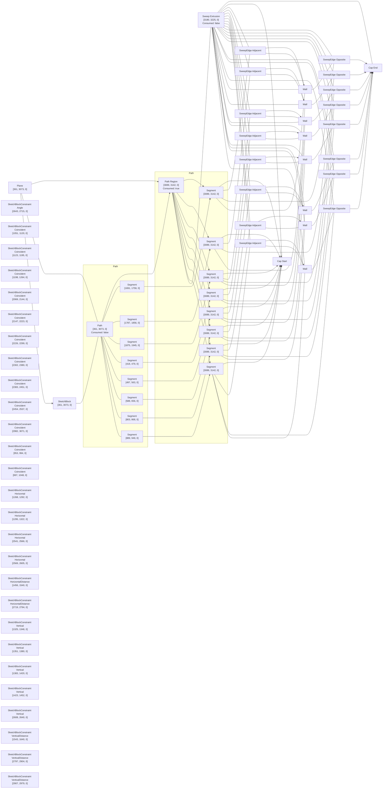

```mermaid
flowchart LR
  subgraph path3 [Path]
    3["Path Region<br>[3089, 3142, 0]<br>Consumed: true"]
      %% [ProgramBodyItem { index: 8 }, VariableDeclarationDeclaration, VariableDeclarationInit]
    9["Segment<br>[3089, 3142, 0]"]
      %% [ProgramBodyItem { index: 8 }, VariableDeclarationDeclaration, VariableDeclarationInit]
    10["Segment<br>[3089, 3142, 0]"]
      %% [ProgramBodyItem { index: 8 }, VariableDeclarationDeclaration, VariableDeclarationInit]
    11["Segment<br>[3089, 3142, 0]"]
      %% [ProgramBodyItem { index: 8 }, VariableDeclarationDeclaration, VariableDeclarationInit]
    12["Segment<br>[3089, 3142, 0]"]
      %% [ProgramBodyItem { index: 8 }, VariableDeclarationDeclaration, VariableDeclarationInit]
    13["Segment<br>[3089, 3142, 0]"]
      %% [ProgramBodyItem { index: 8 }, VariableDeclarationDeclaration, VariableDeclarationInit]
    14["Segment<br>[3089, 3142, 0]"]
      %% [ProgramBodyItem { index: 8 }, VariableDeclarationDeclaration, VariableDeclarationInit]
    15["Segment<br>[3089, 3142, 0]"]
      %% [ProgramBodyItem { index: 8 }, VariableDeclarationDeclaration, VariableDeclarationInit]
    16["Segment<br>[3089, 3142, 0]"]
      %% [ProgramBodyItem { index: 8 }, VariableDeclarationDeclaration, VariableDeclarationInit]
  end
  subgraph path4 [Path]
    4["Path<br>[361, 3073, 0]<br>Consumed: false"]
      %% [ProgramBodyItem { index: 7 }, VariableDeclarationDeclaration, VariableDeclarationInit]
    6["Segment<br>[1691, 1759, 0]"]
      %% [ProgramBodyItem { index: 7 }, VariableDeclarationDeclaration, VariableDeclarationInit, SketchBlockBody, SketchBlockBodyItem { index: 19 }, VariableDeclarationDeclaration, VariableDeclarationInit]
    7["Segment<br>[1787, 1856, 0]"]
      %% [ProgramBodyItem { index: 7 }, VariableDeclarationDeclaration, VariableDeclarationInit, SketchBlockBody, SketchBlockBodyItem { index: 20 }, VariableDeclarationDeclaration, VariableDeclarationInit]
    8["Segment<br>[1875, 1945, 0]"]
      %% [ProgramBodyItem { index: 7 }, VariableDeclarationDeclaration, VariableDeclarationInit, SketchBlockBody, SketchBlockBodyItem { index: 21 }, VariableDeclarationDeclaration, VariableDeclarationInit]
    17["Segment<br>[418, 479, 0]"]
      %% [ProgramBodyItem { index: 7 }, VariableDeclarationDeclaration, VariableDeclarationInit, SketchBlockBody, SketchBlockBodyItem { index: 0 }, VariableDeclarationDeclaration, VariableDeclarationInit]
    18["Segment<br>[497, 563, 0]"]
      %% [ProgramBodyItem { index: 7 }, VariableDeclarationDeclaration, VariableDeclarationInit, SketchBlockBody, SketchBlockBodyItem { index: 1 }, VariableDeclarationDeclaration, VariableDeclarationInit]
    19["Segment<br>[588, 656, 0]"]
      %% [ProgramBodyItem { index: 7 }, VariableDeclarationDeclaration, VariableDeclarationInit, SketchBlockBody, SketchBlockBodyItem { index: 2 }, VariableDeclarationDeclaration, VariableDeclarationInit]
    20["Segment<br>[803, 868, 0]"]
      %% [ProgramBodyItem { index: 7 }, VariableDeclarationDeclaration, VariableDeclarationInit, SketchBlockBody, SketchBlockBodyItem { index: 4 }, VariableDeclarationDeclaration, VariableDeclarationInit]
    21["Segment<br>[889, 949, 0]"]
      %% [ProgramBodyItem { index: 7 }, VariableDeclarationDeclaration, VariableDeclarationInit, SketchBlockBody, SketchBlockBodyItem { index: 5 }, VariableDeclarationDeclaration, VariableDeclarationInit]
  end
  1["Cap End"]
    %% face_code_ref=Missing NodePath
  2["Cap Start"]
    %% face_code_ref=Missing NodePath
  5["Plane<br>[361, 3073, 0]"]
    %% [ProgramBodyItem { index: 7 }, VariableDeclarationDeclaration, VariableDeclarationInit]
  22["SketchBlock<br>[361, 3073, 0]"]
    %% [ProgramBodyItem { index: 7 }, VariableDeclarationDeclaration, VariableDeclarationInit]
  23["SketchBlockConstraint Angle<br>[2643, 2715, 0]"]
    %% [ProgramBodyItem { index: 7 }, VariableDeclarationDeclaration, VariableDeclarationInit, SketchBlockBody, SketchBlockBodyItem { index: 32 }, ExpressionStatementExpr]
  24["SketchBlockConstraint Coincident<br>[1051, 1120, 0]"]
    %% [ProgramBodyItem { index: 7 }, VariableDeclarationDeclaration, VariableDeclarationInit, SketchBlockBody, SketchBlockBodyItem { index: 8 }, ExpressionStatementExpr]
  25["SketchBlockConstraint Coincident<br>[1123, 1195, 0]"]
    %% [ProgramBodyItem { index: 7 }, VariableDeclarationDeclaration, VariableDeclarationInit, SketchBlockBody, SketchBlockBodyItem { index: 9 }, ExpressionStatementExpr]
  26["SketchBlockConstraint Coincident<br>[1198, 1264, 0]"]
    %% [ProgramBodyItem { index: 7 }, VariableDeclarationDeclaration, VariableDeclarationInit, SketchBlockBody, SketchBlockBodyItem { index: 10 }, ExpressionStatementExpr]
  27["SketchBlockConstraint Coincident<br>[2069, 2144, 0]"]
    %% [ProgramBodyItem { index: 7 }, VariableDeclarationDeclaration, VariableDeclarationInit, SketchBlockBody, SketchBlockBodyItem { index: 23 }, ExpressionStatementExpr]
  28["SketchBlockConstraint Coincident<br>[2147, 2223, 0]"]
    %% [ProgramBodyItem { index: 7 }, VariableDeclarationDeclaration, VariableDeclarationInit, SketchBlockBody, SketchBlockBodyItem { index: 24 }, ExpressionStatementExpr]
  29["SketchBlockConstraint Coincident<br>[2226, 2299, 0]"]
    %% [ProgramBodyItem { index: 7 }, VariableDeclarationDeclaration, VariableDeclarationInit, SketchBlockBody, SketchBlockBodyItem { index: 25 }, ExpressionStatementExpr]
  30["SketchBlockConstraint Coincident<br>[2302, 2380, 0]"]
    %% [ProgramBodyItem { index: 7 }, VariableDeclarationDeclaration, VariableDeclarationInit, SketchBlockBody, SketchBlockBodyItem { index: 26 }, ExpressionStatementExpr]
  31["SketchBlockConstraint Coincident<br>[2383, 2451, 0]"]
    %% [ProgramBodyItem { index: 7 }, VariableDeclarationDeclaration, VariableDeclarationInit, SketchBlockBody, SketchBlockBodyItem { index: 27 }, ExpressionStatementExpr]
  32["SketchBlockConstraint Coincident<br>[2454, 2537, 0]"]
    %% [ProgramBodyItem { index: 7 }, VariableDeclarationDeclaration, VariableDeclarationInit, SketchBlockBody, SketchBlockBodyItem { index: 28 }, ExpressionStatementExpr]
  33["SketchBlockConstraint Coincident<br>[2982, 3071, 0]"]
    %% [ProgramBodyItem { index: 7 }, VariableDeclarationDeclaration, VariableDeclarationInit, SketchBlockBody, SketchBlockBodyItem { index: 36 }, ExpressionStatementExpr]
  34["SketchBlockConstraint Coincident<br>[953, 994, 0]"]
    %% [ProgramBodyItem { index: 7 }, VariableDeclarationDeclaration, VariableDeclarationInit, SketchBlockBody, SketchBlockBodyItem { index: 6 }, ExpressionStatementExpr]
  35["SketchBlockConstraint Coincident<br>[997, 1048, 0]"]
    %% [ProgramBodyItem { index: 7 }, VariableDeclarationDeclaration, VariableDeclarationInit, SketchBlockBody, SketchBlockBodyItem { index: 7 }, ExpressionStatementExpr]
  36["SketchBlockConstraint Horizontal<br>[1268, 1292, 0]"]
    %% [ProgramBodyItem { index: 7 }, VariableDeclarationDeclaration, VariableDeclarationInit, SketchBlockBody, SketchBlockBodyItem { index: 11 }, ExpressionStatementExpr]
  37["SketchBlockConstraint Horizontal<br>[1295, 1322, 0]"]
    %% [ProgramBodyItem { index: 7 }, VariableDeclarationDeclaration, VariableDeclarationInit, SketchBlockBody, SketchBlockBodyItem { index: 12 }, ExpressionStatementExpr]
  38["SketchBlockConstraint Horizontal<br>[2541, 2566, 0]"]
    %% [ProgramBodyItem { index: 7 }, VariableDeclarationDeclaration, VariableDeclarationInit, SketchBlockBody, SketchBlockBodyItem { index: 29 }, ExpressionStatementExpr]
  39["SketchBlockConstraint Horizontal<br>[2569, 2605, 0]"]
    %% [ProgramBodyItem { index: 7 }, VariableDeclarationDeclaration, VariableDeclarationInit, SketchBlockBody, SketchBlockBodyItem { index: 30 }, ExpressionStatementExpr]
  40["SketchBlockConstraint HorizontalDistance<br>[1456, 1540, 0]"]
    %% [ProgramBodyItem { index: 7 }, VariableDeclarationDeclaration, VariableDeclarationInit, SketchBlockBody, SketchBlockBodyItem { index: 17 }, ExpressionStatementExpr]
  41["SketchBlockConstraint HorizontalDistance<br>[2719, 2794, 0]"]
    %% [ProgramBodyItem { index: 7 }, VariableDeclarationDeclaration, VariableDeclarationInit, SketchBlockBody, SketchBlockBodyItem { index: 33 }, ExpressionStatementExpr]
  42["SketchBlockConstraint Vertical<br>[1325, 1348, 0]"]
    %% [ProgramBodyItem { index: 7 }, VariableDeclarationDeclaration, VariableDeclarationInit, SketchBlockBody, SketchBlockBodyItem { index: 13 }, ExpressionStatementExpr]
  43["SketchBlockConstraint Vertical<br>[1351, 1380, 0]"]
    %% [ProgramBodyItem { index: 7 }, VariableDeclarationDeclaration, VariableDeclarationInit, SketchBlockBody, SketchBlockBodyItem { index: 14 }, ExpressionStatementExpr]
  44["SketchBlockConstraint Vertical<br>[1383, 1420, 0]"]
    %% [ProgramBodyItem { index: 7 }, VariableDeclarationDeclaration, VariableDeclarationInit, SketchBlockBody, SketchBlockBodyItem { index: 15 }, ExpressionStatementExpr]
  45["SketchBlockConstraint Vertical<br>[1423, 1452, 0]"]
    %% [ProgramBodyItem { index: 7 }, VariableDeclarationDeclaration, VariableDeclarationInit, SketchBlockBody, SketchBlockBodyItem { index: 16 }, ExpressionStatementExpr]
  46["SketchBlockConstraint Vertical<br>[2608, 2640, 0]"]
    %% [ProgramBodyItem { index: 7 }, VariableDeclarationDeclaration, VariableDeclarationInit, SketchBlockBody, SketchBlockBodyItem { index: 31 }, ExpressionStatementExpr]
  47["SketchBlockConstraint VerticalDistance<br>[1543, 1640, 0]"]
    %% [ProgramBodyItem { index: 7 }, VariableDeclarationDeclaration, VariableDeclarationInit, SketchBlockBody, SketchBlockBodyItem { index: 18 }, ExpressionStatementExpr]
  48["SketchBlockConstraint VerticalDistance<br>[2797, 2904, 0]"]
    %% [ProgramBodyItem { index: 7 }, VariableDeclarationDeclaration, VariableDeclarationInit, SketchBlockBody, SketchBlockBodyItem { index: 34 }, ExpressionStatementExpr]
  49["SketchBlockConstraint VerticalDistance<br>[2907, 2979, 0]"]
    %% [ProgramBodyItem { index: 7 }, VariableDeclarationDeclaration, VariableDeclarationInit, SketchBlockBody, SketchBlockBodyItem { index: 35 }, ExpressionStatementExpr]
  50["Sweep Extrusion<br>[3180, 3225, 0]<br>Consumed: false"]
    %% [ProgramBodyItem { index: 10 }, VariableDeclarationDeclaration, VariableDeclarationInit]
  51["SweepEdge Adjacent"]
  52["SweepEdge Adjacent"]
  53["SweepEdge Adjacent"]
  54["SweepEdge Adjacent"]
  55["SweepEdge Adjacent"]
  56["SweepEdge Adjacent"]
  57["SweepEdge Adjacent"]
  58["SweepEdge Adjacent"]
  59["SweepEdge Opposite"]
  60["SweepEdge Opposite"]
  61["SweepEdge Opposite"]
  62["SweepEdge Opposite"]
  63["SweepEdge Opposite"]
  64["SweepEdge Opposite"]
  65["SweepEdge Opposite"]
  66["SweepEdge Opposite"]
  67[Wall]
    %% face_code_ref=Missing NodePath
  68[Wall]
    %% face_code_ref=Missing NodePath
  69[Wall]
    %% face_code_ref=Missing NodePath
  70[Wall]
    %% face_code_ref=Missing NodePath
  71[Wall]
    %% face_code_ref=Missing NodePath
  72[Wall]
    %% face_code_ref=Missing NodePath
  73[Wall]
    %% face_code_ref=Missing NodePath
  74[Wall]
    %% face_code_ref=Missing NodePath
  50 --- 1
  59 <--x 1
  60 <--x 1
  61 <--x 1
  62 <--x 1
  63 <--x 1
  64 <--x 1
  65 <--x 1
  66 <--x 1
  9 <--x 2
  10 <--x 2
  11 <--x 2
  12 <--x 2
  13 <--x 2
  14 <--x 2
  15 <--x 2
  16 <--x 2
  50 --- 2
  4 x--> 3
  5 x--> 3
  3 <--x 9
  3 <--x 10
  3 <--x 11
  3 <--x 12
  3 <--x 13
  3 <--x 14
  3 <--x 15
  3 <--x 16
  3 ---- 50
  5 --- 4
  4 --- 6
  4 --- 7
  4 --- 8
  4 --- 17
  4 --- 18
  4 --- 19
  4 --- 20
  4 --- 21
  22 --- 4
  5 <--x 22
  6 <--x 9
  7 <--x 10
  8 <--x 11
  9 --- 51
  9 --- 59
  9 --- 67
  10 --- 52
  10 --- 60
  10 --- 68
  11 --- 53
  11 --- 61
  11 --- 69
  17 x--> 12
  12 --- 54
  12 --- 62
  12 --- 70
  18 x--> 13
  13 --- 55
  13 --- 63
  13 --- 71
  19 x--> 14
  14 --- 56
  14 --- 64
  14 --- 72
  20 x--> 15
  15 --- 57
  15 --- 65
  15 --- 73
  21 x--> 16
  16 --- 58
  16 --- 66
  16 --- 74
  50 --- 51
  50 --- 52
  50 --- 53
  50 --- 54
  50 --- 55
  50 --- 56
  50 --- 57
  50 --- 58
  50 --- 59
  50 --- 60
  50 --- 61
  50 --- 62
  50 --- 63
  50 --- 64
  50 --- 65
  50 --- 66
  50 --- 67
  50 --- 68
  50 --- 69
  50 --- 70
  50 --- 71
  50 --- 72
  50 --- 73
  50 --- 74
  67 --- 51
  51 x--> 67
  68 --- 52
  52 x--> 68
  69 --- 53
  53 x--> 69
  70 --- 54
  54 x--> 70
  71 --- 55
  55 x--> 71
  72 --- 56
  56 x--> 72
  73 --- 57
  57 x--> 73
  58 x--> 74
  74 --- 58
  67 --- 59
  68 --- 60
  69 --- 61
  70 --- 62
  71 --- 63
  72 --- 64
  73 --- 65
  74 --- 66
```
